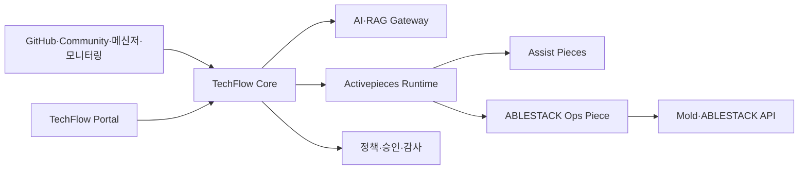

# ABLESTACK TechFlow

ABLESTACK TechFlow는 **ABLESTACK 기술지원과 인프라 운영을 연결하는 AI 기반 시각적 자동화 플랫폼**입니다.

Activepieces를 워크플로우 실행 엔진으로 사용하고, ABLESTACK 전용 연동, 기술지원 지식, AI 정책, 승인·권한·감사 및 안전한 운영 자동화를 제품 기능으로 개발합니다.

> 현재 상태: 제품 기반, 사내 실증 실행 환경, 외부 HTTPS·서명 Webhook Ingress, 상태 백업·격리 복구, 관측성·이미지 잠금, GitHub Push·PR Merge Chat 자동화 구축 완료

## 프로젝트 목표

TechFlow는 처음부터 범용 업무 자동화 제품을 만들지 않습니다. ABLESTACK 제품과 실제 사내 기술지원 업무에서 가치를 검증한 후 단계적으로 범용 플랫폼으로 확장합니다.

```text
ABLESTACK Assist
    ↓
조회·진단 Ops
    ↓
승인 기반 작업 자동화
    ↓
정책 기반 AIOps
    ↓
고객용 ABLESTACK 제품
    ↓
Domain Pack 기반 범용 TechFlow Platform
```

전체 단계와 종료 기준은 [TechFlow 제품화 및 범용 확장 계획](docs/plans/techflow-product-roadmap.md)을 참고하십시오.

## 핵심 기능

### TechFlow Assist

ABLESTACK 기술지원 담당자의 판단과 응답을 지원합니다.

- GitHub PR·Issue·릴리스 정보와 내부 업무 연계
- Community 질문 수집과 AI 답변 초안
- 사내·고객 메신저 기술 질문 응답
- 공식 문서, Known Issue 및 장애 사례 검색
- 근거·확신도 표시와 담당자 승인
- 미해결 질문의 기술지원 티켓 이관

### TechFlow Ops

ABLESTACK 환경의 조회, 진단과 실제 운영 작업을 자동화합니다.

- Zone·Cluster·Host·VM·Storage·Network 조회
- Alert·Event 분석과 장애 타임라인 구성
- 진단정보와 기술지원 번들 자동 수집
- 승인 기반 VM·서비스 운영 작업
- 검증된 Runbook 실행
- 제한된 장애 유형의 정책 기반 AIOps

Assist와 Ops는 별도 제품이 아니라 하나의 TechFlow 플랫폼을 구성하는 두 기능 축입니다. Assist에서 축적한 질문과 장애 사례는 Ops의 진단 지식이 되고, Ops의 환경 상태와 조치 결과는 Assist 답변의 근거가 됩니다.

## 제품 구조



| 구성요소 | 책임 |
|---|---|
| TechFlow Portal·Control API | 사용자, 고객, 정책, 승인, 템플릿과 실행 관리 |
| AI·RAG Gateway | 지식 검색, 답변·진단, 모델·비용·품질 관리 |
| Activepieces Runtime | 시각적 플로우 설계, Webhook, 스케줄, 실행과 재시도 |
| TechFlow Custom Pieces | GitHub, Community, 메신저 및 ABLESTACK 연동 |
| Mold·ABLESTACK API | 실제 가상자원의 권한, 상태와 작업 수행 |

Activepieces는 실행 엔진으로 사용하며 TechFlow의 제품 정책과 ABLESTACK 핵심 업무 규칙은 별도 계층에 둡니다. 초기에는 Activepieces 전체 소스를 포크하지 않고 고정된 배포 이미지와 Custom Piece를 중심으로 확장합니다.

책임·상태·멱등성·실패 경계와 실행 명령 규칙은 [ADR-0001: TechFlow와 Activepieces 책임 경계](docs/adr/0001-techflow-activepieces-responsibility-boundary.md)를 구현 기준으로 사용합니다.

Secret 저장·주입·교체·폐기와 사고 대응은 [ADR-0002: TechFlow 비밀정보 수명주기](docs/adr/0002-techflow-secret-lifecycle.md)를 구현 기준으로 사용합니다.

PostgreSQL·Redis 백업, 격리 복구, RPO·RTO와 Secret 복구 분리는 [ADR-0003: TechFlow 상태 백업과 복구 기준](docs/adr/0003-techflow-state-backup-recovery.md)을 구현 기준으로 사용합니다.

## 단계별 로드맵

| 단계 | 목표 |
|---|---|
| 0. 제품 기반 확정 | 아키텍처, Community 실행 기반, 보안과 배포 기준 확정 |
| 1. 사내 Assist 실증 | GitHub, Community, 사내 메신저 자동화 실사용 |
| 2. ABLESTACK Assist MVP | 고객 기술지원에 적용 가능한 AI Assist |
| 3. Ops Observe | 읽기 전용 자원 조회, 이벤트 분석과 진단 자동화 |
| 4. Ops Act | 승인 기반의 제한된 자원 작업 자동화 |
| 5. ABLESTACK Beta·GA | 설치·업그레이드·백업·지원 가능한 고객 제품 |
| 6. 정책 기반 AIOps | 검증된 장애 유형의 탐지·진단·조치·검증 |
| 7. 범용 플랫폼 확장 | Domain Pack과 Integration SDK 기반 범용 제품 |

단계는 일정만으로 전환하지 않습니다. 실행 성공률, AI 답변 품질, 권한·감사, 복구 가능성과 고객 배포 품질을 충족해야 다음 단계로 진행합니다.

## 첫 번째 사내 실증

1. GitHub PR Merge Webhook을 이용한 알림·문서·릴리스 업무 연계
2. Community 질문의 수집·지식 검색·AI 답변 초안·담당자 승인
3. 사내 메신저 기술 질문의 근거 기반 응답과 담당자 이관

초기 AI 답변은 자동으로 외부에 게시하지 않으며, 담당자 승인과 수정 이력을 품질 평가 데이터로 사용합니다.

## 배포 방향

- 사내 실증: 단일 Ubuntu 서버와 Docker Compose
- 고객 Beta: 고객별 전용 인스턴스
- 확장 구성: App·Worker 분리와 Kubernetes·Helm
- 폐쇄망 고객: 오프라인 설치·업그레이드 패키지 검토

현재 테스트 서버는 기능 실증 목적으로만 사용합니다.

Activepieces Compose 기준선은 테스트 서버에 배포되어 Health, Worker Polling, 데이터 영속성과 서버 재부팅 복구 검증을 통과했습니다. `techflow.ablecloud.io`에는 호스트 한정 HTTPS 전환과 엄격한 Origin TLS, HMAC 서명·Timestamp·중복 방지를 적용한 Webhook Ingress가 구성되었습니다. PostgreSQL·Redis는 매일 백업되며 운영 Volume을 변경하지 않는 격리 복구와 40초 RTO 실증을 통과했습니다. 재현 가능한 절차는 [Activepieces Compose 배포 Runbook](docs/runbooks/activepieces-compose-deployment.md), [HTTPS·Webhook Ingress 운영 Runbook](docs/runbooks/https-webhook-ingress.md)과 [상태 백업·복구 Runbook](docs/runbooks/state-backup-recovery.md)에서 관리합니다.

현재 여섯 Compose 서비스는 `image-lock.json`의 검토된 버전과 불변 이미지 식별자로 고정됩니다. 외부 이미지는 Tag+Registry Digest, 자체 Event Gateway는 M1 테스트 서버에서 승인한 로컬 Image ID를 사용하며, 배포 전 상태 백업과 무빌드 배포·롤백을 강제합니다. 동일 잠금 반복 배포, 직전 Runtime Lock 롤백, 목표 릴리스 복귀와 영속 Volume 보존 드릴을 통과했습니다. 운영 절차는 [이미지 버전 업그레이드·롤백 Runbook](docs/runbooks/image-version-upgrade-rollback.md)을 따릅니다.

## 문서

- [제품화 및 범용 확장 계획](docs/plans/techflow-product-roadmap.md)
- [ADR-0001: TechFlow와 Activepieces 책임 경계](docs/adr/0001-techflow-activepieces-responsibility-boundary.md)
- [책임 경계 ADR 보고서 PDF](output/pdf/techflow-responsibility-boundary-report.pdf)
- [책임 경계 ADR 프레젠테이션 PDF](output/pdf/techflow-responsibility-boundary-presentation.pdf)
- [Activepieces 기능·라이선스 의사결정](docs/decisions/activepieces-license-feature-matrix.md)
- [Activepieces 라이선스 검토 보고서 PDF](output/pdf/activepieces-license-review-report.pdf)
- [Activepieces 라이선스 검토 프레젠테이션 PDF](output/pdf/activepieces-license-review-presentation.pdf)
- [GitHub Issue 기반 작업 관리](docs/governance/github-issue-management.md)
- [Activepieces 테스트 서버](docs/environments/activepieces-test-server.md)
- [Activepieces Compose 배포 Runbook](docs/runbooks/activepieces-compose-deployment.md)
- [Activepieces Compose 배포 검증 보고서](docs/reports/issue-13-activepieces-compose-deployment-validation.md)
- [Activepieces Compose 배포 보고서 PDF](output/pdf/activepieces-compose-deployment-report.pdf)
- [Activepieces Compose 배포 프레젠테이션 PDF](output/pdf/activepieces-compose-deployment-presentation.pdf)
- [HTTPS·Webhook Ingress 운영 Runbook](docs/runbooks/https-webhook-ingress.md)
- [HTTPS·Webhook Ingress 완료 보고서](docs/reports/issue-14-https-webhook-validation.md)
- [HTTPS·Webhook Ingress 보고서 PDF](output/pdf/https-webhook-ingress-report.pdf)
- [HTTPS·Webhook Ingress 프레젠테이션 PDF](output/pdf/https-webhook-ingress-presentation.pdf)
- [HTTPS·Webhook Ingress 프레젠테이션 PPTX](output/presentation/https-webhook-ingress.pptx)
- [ADR-0002: TechFlow 비밀정보 수명주기](docs/adr/0002-techflow-secret-lifecycle.md)
- [Secret 수명주기 Runbook](docs/runbooks/secret-lifecycle.md)
- [Issue #15 비밀정보 관리 완료 보고서](docs/reports/issue-15-secret-management-validation.md)
- [Secret 관리 보고서 PDF](output/pdf/techflow-secret-management-report.pdf)
- [Secret 관리 프레젠테이션 PDF](output/pdf/techflow-secret-management-presentation.pdf)
- [Secret 관리 프레젠테이션 PPTX](output/presentation/techflow-secret-management.pptx)
- [ADR-0003: TechFlow 상태 백업과 복구 기준](docs/adr/0003-techflow-state-backup-recovery.md)
- [상태 백업·복구 Runbook](docs/runbooks/state-backup-recovery.md)
- [Issue #16 백업·복구 완료 보고서](docs/reports/issue-16-backup-recovery-validation.md)
- [백업·복구 보고서 PDF](output/pdf/techflow-backup-recovery-report.pdf)
- [백업·복구 프레젠테이션 PDF](output/pdf/techflow-backup-recovery-presentation.pdf)
- [백업·복구 프레젠테이션 PPTX](output/presentation/techflow-backup-recovery.pptx)

- [Issue #19 GitHub 조직 Webhook·Synology Chat 자동화 설계](docs/plans/issue-19-github-chat-webhook-design.md)
- [GitHub 조직 Webhook·Synology Chat 운영 Runbook](docs/runbooks/github-chat-webhook.md)
- [Issue #19 구현·배포·검증 완료 보고서](docs/reports/issue-19-github-chat-webhook-validation.md)
- [GitHub Chat 자동화 보고서 PDF](output/pdf/github-chat-webhook-report.pdf)
- [GitHub Chat 자동화 프레젠테이션 PDF](output/pdf/github-chat-webhook-presentation.pdf)
- [GitHub Chat 자동화 프레젠테이션 PPTX](output/presentation/github-chat-webhook.pptx)

## 보안 원칙

- 비밀번호, API 키, 토큰, 개인키와 암호화 키를 저장소에 커밋하지 않습니다.
- 조회 자격 증명과 자원 변경 자격 증명을 분리합니다.
- 공개 답변과 자원 변경은 품질이 검증될 때까지 담당자 승인을 요구합니다.
- Webhook 서명, 이벤트 중복 방지, 멱등성 키와 실행 전후 감사를 적용합니다.
- 고객별 데이터·지식·네트워크 및 비밀정보를 분리합니다.
- AI가 권한과 실제 인프라 상태를 최종 결정하지 않도록 합니다.

## Activepieces 사용 원칙

Activepieces Community Edition을 기본 실행 엔진으로 사용합니다. Enterprise로 분류된 네이티브 기능의 조건은 참고정보로 유지하되, Builder, SSO, RBAC, Audit, API, Secret 관리와 Worker 격리 등 TechFlow에 필요한 상위 기능은 제품 요구사항에 따라 자체 구현합니다. 고객 공개·판매·배포 여부는 제품 책임자가 별도로 결정하며 개발 범위와 완료 조건에 포함하지 않습니다.

- [Activepieces 라이선스](https://github.com/activepieces/activepieces/blob/main/LICENSE)
- [Activepieces 공식 문서](https://www.activepieces.com/docs/overview/welcome)

## 관측성과 장애 추적

TechFlow 테스트 서버에는 1분 주기의 경량 Observer가 배포되어 6개 Compose 서비스, 내부·외부 Health, PostgreSQL, Redis, 상태 백업과 허용된 로그 집계값을 확인합니다. 최신 상태는 JSON, 메트릭은 Prometheus Text Format, 경보는 발생·해제 전이로 관리합니다. 원문 로그, Flow Payload, 사용자 식별자와 Secret은 관측 자산에 복제하지 않습니다.

Docker 로그는 6개 서비스 모두 `local` driver와 서비스별 `10m × 3` 한도를 적용했습니다. `event-gateway` 중단 훈련에서 Critical 감지, 원인 식별, systemd 로컬 알림과 복구 후 경보 해제를 확인했습니다.

- [ADR-0004: TechFlow 관측성과 최소 경보 기준](docs/adr/0004-techflow-observability.md)
- [TechFlow 관측성 운영 Runbook](docs/runbooks/observability.md)
- [Issue #17 로그·메트릭·상태 점검 완료 보고서](docs/reports/issue-17-observability-validation.md)
- [관측성 완료 보고서 PDF](output/pdf/techflow-observability-report.pdf)
- [관측성 프레젠테이션 PDF](output/pdf/techflow-observability-presentation.pdf)
- [관측성 프레젠테이션 PPTX](output/presentation/techflow-observability.pptx)
- [ADR-0005: TechFlow 컨테이너 이미지 버전 고정 기준](docs/adr/0005-techflow-image-version-lock.md)
- [이미지 버전 업그레이드·롤백 Runbook](docs/runbooks/image-version-upgrade-rollback.md)
- [Issue #18 이미지 버전·Digest 고정 완료 보고서](docs/reports/issue-18-image-digest-validation.md)
- [이미지 버전·Digest 고정 보고서 PDF](output/pdf/techflow-image-version-lock-report.pdf)
- [이미지 버전·Digest 고정 프레젠테이션 PDF](output/pdf/techflow-image-version-lock-presentation.pdf)
- [이미지 버전·Digest 고정 프레젠테이션 PPTX](output/presentation/techflow-image-version-lock.pptx)
