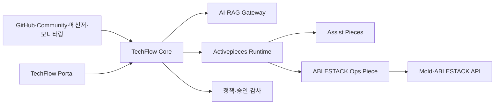

# ABLESTACK TechFlow

ABLESTACK TechFlow는 **ABLESTACK 기술지원과 인프라 운영을 연결하는 AI 기반 시각적 자동화 플랫폼**입니다.

Activepieces를 워크플로우 실행 엔진으로 사용하고, ABLESTACK 전용 연동, 기술지원 지식, AI 정책, 승인·권한·감사 및 안전한 운영 자동화를 제품 기능으로 개발합니다.

> 현재 상태: 제품 계획 및 사내 실증 환경 준비 단계

## 프로젝트 목표

TechFlow는 처음부터 범용 업무 자동화 제품을 만들지 않습니다. ABLESTACK 제품과 실제 사내 기술지원 업무에서 가치를 검증한 후 단계적으로 범용 플랫폼으로 확장합니다.

```text
ABLESTACK Assist
    ↓
조회·진단 Ops
    ↓
승인 기반 작업 자동화
    ↓
정책 기반 AIOps
    ↓
고객용 ABLESTACK 제품
    ↓
Domain Pack 기반 범용 TechFlow Platform
```

전체 단계와 종료 기준은 [TechFlow 제품화 및 범용 확장 계획](docs/plans/techflow-product-roadmap.md)을 참고하십시오.

## 핵심 기능

### TechFlow Assist

ABLESTACK 기술지원 담당자의 판단과 응답을 지원합니다.

- GitHub PR·Issue·릴리스 정보와 내부 업무 연계
- Community 질문 수집과 AI 답변 초안
- 사내·고객 메신저 기술 질문 응답
- 공식 문서, Known Issue 및 장애 사례 검색
- 근거·확신도 표시와 담당자 승인
- 미해결 질문의 기술지원 티켓 이관

### TechFlow Ops

ABLESTACK 환경의 조회, 진단과 실제 운영 작업을 자동화합니다.

- Zone·Cluster·Host·VM·Storage·Network 조회
- Alert·Event 분석과 장애 타임라인 구성
- 진단정보와 기술지원 번들 자동 수집
- 승인 기반 VM·서비스 운영 작업
- 검증된 Runbook 실행
- 제한된 장애 유형의 정책 기반 AIOps

Assist와 Ops는 별도 제품이 아니라 하나의 TechFlow 플랫폼을 구성하는 두 기능 축입니다. Assist에서 축적한 질문과 장애 사례는 Ops의 진단 지식이 되고, Ops의 환경 상태와 조치 결과는 Assist 답변의 근거가 됩니다.

## 제품 구조



| 구성요소 | 책임 |
|---|---|
| TechFlow Portal·Control API | 사용자, 고객, 정책, 승인, 템플릿과 실행 관리 |
| AI·RAG Gateway | 지식 검색, 답변·진단, 모델·비용·품질 관리 |
| Activepieces Runtime | 시각적 플로우 설계, Webhook, 스케줄, 실행과 재시도 |
| TechFlow Custom Pieces | GitHub, Community, 메신저 및 ABLESTACK 연동 |
| Mold·ABLESTACK API | 실제 가상자원의 권한, 상태와 작업 수행 |

Activepieces는 실행 엔진으로 사용하며 TechFlow의 제품 정책과 ABLESTACK 핵심 업무 규칙은 별도 계층에 둡니다. 초기에는 Activepieces 전체 소스를 포크하지 않고 고정된 배포 이미지와 Custom Piece를 중심으로 확장합니다.

## 단계별 로드맵

| 단계 | 목표 |
|---|---|
| 0. 제품 기반 확정 | 아키텍처, Activepieces 라이선스, 보안과 배포 기준 확정 |
| 1. 사내 Assist 실증 | GitHub, Community, 사내 메신저 자동화 실사용 |
| 2. ABLESTACK Assist MVP | 고객 기술지원에 적용 가능한 AI Assist |
| 3. Ops Observe | 읽기 전용 자원 조회, 이벤트 분석과 진단 자동화 |
| 4. Ops Act | 승인 기반의 제한된 자원 작업 자동화 |
| 5. ABLESTACK Beta·GA | 설치·업그레이드·백업·지원 가능한 고객 제품 |
| 6. 정책 기반 AIOps | 검증된 장애 유형의 탐지·진단·조치·검증 |
| 7. 범용 플랫폼 확장 | Domain Pack과 Integration SDK 기반 범용 제품 |

단계는 일정만으로 전환하지 않습니다. 실행 성공률, AI 답변 품질, 권한·감사, 복구 가능성과 고객 배포 품질을 충족해야 다음 단계로 진행합니다.

## 첫 번째 사내 실증

1. GitHub PR Merge Webhook을 이용한 알림·문서·릴리스 업무 연계
2. Community 질문의 수집·지식 검색·AI 답변 초안·담당자 승인
3. 사내 메신저 기술 질문의 근거 기반 응답과 담당자 이관

초기 AI 답변은 자동으로 외부에 게시하지 않으며, 담당자 승인과 수정 이력을 품질 평가 데이터로 사용합니다.

## 배포 방향

- 사내 실증: 단일 Ubuntu 서버와 Docker Compose
- 고객 Beta: 고객별 전용 인스턴스
- 확장 구성: App·Worker 분리와 Kubernetes·Helm
- 폐쇄망 고객: 오프라인 설치·업그레이드 패키지 검토

현재 테스트 서버는 기능 실증 목적으로만 사용합니다.

## 문서

- [제품화 및 범용 확장 계획](docs/plans/techflow-product-roadmap.md)
- [Activepieces 테스트 서버](docs/environments/activepieces-test-server.md)

## 보안 원칙

- 비밀번호, API 키, 토큰, 개인키와 암호화 키를 저장소에 커밋하지 않습니다.
- 조회 자격 증명과 자원 변경 자격 증명을 분리합니다.
- 공개 답변과 자원 변경은 품질이 검증될 때까지 담당자 승인을 요구합니다.
- Webhook 서명, 이벤트 중복 방지, 멱등성 키와 실행 전후 감사를 적용합니다.
- 고객별 데이터·지식·네트워크 및 비밀정보를 분리합니다.
- AI가 권한과 실제 인프라 상태를 최종 결정하지 않도록 합니다.

## Activepieces 사용 원칙

Activepieces Community Edition의 일반 코드는 MIT 라이선스이지만 Enterprise 디렉터리와 Embedding·관리 기능 일부는 별도 상용 조건이 적용됩니다. 사내 실증은 Community Edition으로 시작하고 고객용 임베딩, SSO, RBAC 및 Audit 기능은 제품화 전에 라이선스 조건을 확정합니다.

- [Activepieces 라이선스](https://github.com/activepieces/activepieces/blob/main/LICENSE)
- [Activepieces 공식 문서](https://www.activepieces.com/docs/overview/welcome)
