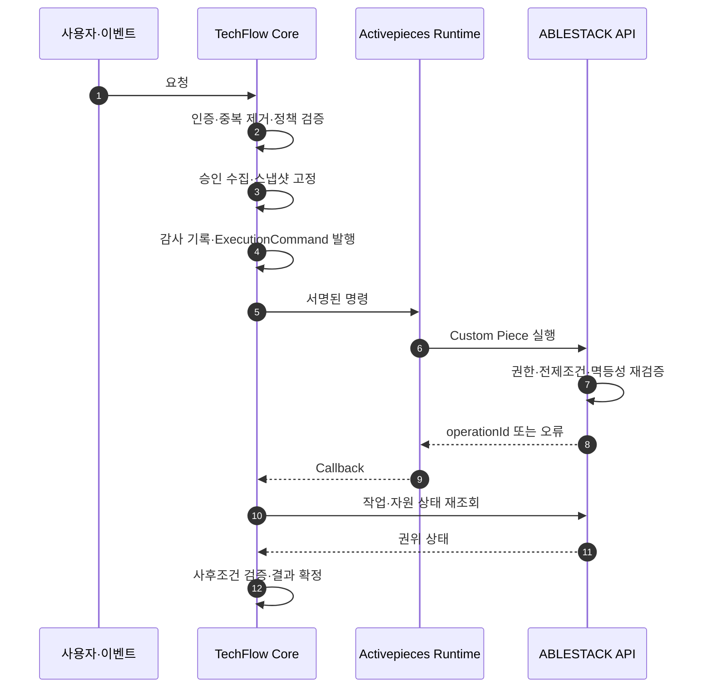

# ADR-0001: TechFlow와 Activepieces 책임 경계

> 상태: **Accepted**
>
> 결정일: 2026-07-30
>
> 관련 이슈: [#12 TechFlow와 Activepieces 책임 경계 ADR 작성](https://github.com/ablecloud-team/ablestack-techflow/issues/12)
>
> 구조화된 원본: [techflow-activepieces-responsibility-boundary.json](../decisions/techflow-activepieces-responsibility-boundary.json)

## 1. 결정

TechFlow의 제품 권한과 자동화 실행을 다음 세 계층으로 분리한다.

| 계층 | 최종 책임 |
|---|---|
| **TechFlow Core** | 사용자·테넌트, 제품 RBAC, 정책, 승인, 제품 요청 멱등성, 명령 수명주기, 감사, AI/RAG와 제품 API |
| **Activepieces Runtime** | 시각적 플로우, Trigger, Queue, Worker, 실행 이력, 제한된 재시도와 Custom Piece 실행 |
| **ABLESTACK/Mold API** | 가상자원 권한 재검증, 작업 전제조건, 인프라 작업 멱등성, 비동기 작업과 실제 자원 최종 상태 |

Activepieces의 `FlowRun=SUCCEEDED`는 명령 전달 또는 플로우 실행의 성공일 뿐 실제 인프라 작업의 성공을 의미하지 않는다. TechFlow Core는 Callback을 힌트로만 사용하고 ABLESTACK API의 작업·자원 상태를 재조회한 뒤 결과를 확정한다.

## 2. 배경

TechFlow는 Activepieces를 시각적 자동화 실행 엔진으로 사용하면서 GitHub·Community·메신저 기반 Assist와 ABLESTACK Ops를 하나의 제품으로 제공한다. 이때 권한·정책·승인과 실제 자원 상태를 Flow에 맡기면 다음 문제가 발생한다.

- Flow 변경이 곧 제품 권한 변경이 된다.
- Worker 재시도와 사용자의 재요청이 실제 자원 작업을 중복 실행할 수 있다.
- Activepieces 실행 상태와 ABLESTACK 자원 상태가 충돌할 때 권위 데이터를 판별할 수 없다.
- Timeout·Callback 유실·부분 실패에서 성공 여부를 추정하게 된다.
- 고객·테넌트 정책과 감사 데이터가 실행 엔진에 종속된다.

따라서 제품 제어면, 실행면, 인프라 권위면을 분리하고 각 경계의 입력·출력·실패 규칙을 구현 계약으로 고정한다.

## 3. 책임과 금지사항

### 3.1 TechFlow Core

TechFlow Core는 제품 요청의 원장이다.

- 요청자, 조직, 테넌트와 제품 역할을 확인한다.
- 입력, 대상, 위험 수준과 정책을 평가한다.
- 필요한 승인을 수집하고 승인 대상을 불변 스냅샷으로 고정한다.
- 요청 단위 중복 제거와 `AutomationRequest` 수명주기를 관리한다.
- 감사 이벤트를 영속화한 후 `ExecutionCommand`를 발행한다.
- Callback을 멱등 처리하고 ABLESTACK API 상태를 Reconcile한다.

TechFlow Core는 다음을 해서는 안 된다.

- Activepieces 실행 성공을 실제 자원 성공으로 확정
- ABLESTACK API를 우회한 가상자원 직접 변경
- 대상·파라미터·정책·자원 버전이 바뀐 요청을 기존 승인으로 실행

### 3.2 Activepieces Runtime

Activepieces Runtime은 승인된 명령의 실행 전달 계층이다.

- 고정된 `FlowVersion`으로 Trigger와 Step을 실행한다.
- Queue·Worker와 실행 이력을 관리한다.
- 허용된 일시 오류에만 제한 재시도를 적용한다.
- TechFlow Custom Piece로 명령을 ABLESTACK API에 전달한다.
- 실행 상태와 Callback을 TechFlow Core에 제공한다.

Activepieces Runtime은 다음을 해서는 안 된다.

- 사용자 권한, 정책, 승인 또는 테넌트 경계를 결정
- 제품 감사 원장 또는 자원 상태 원장 역할
- Timeout·5xx 이후 상태 조회 없는 Blind Retry
- 장기 자격증명과 고객 비밀정보를 Flow 입력·로그에 저장

### 3.3 ABLESTACK/Mold API

ABLESTACK API는 인프라 작업과 자원 상태의 권위면이다.

- 대상 자원과 작업 권한을 최종 재검증한다.
- 현재 상태, 자원 버전과 작업 전제조건을 검증한다.
- 인프라 작업 단위 멱등성 키와 명령 지문을 처리한다.
- 비동기 작업과 실제 자원 상태를 관리한다.
- 도메인 유효성에 따라 작업을 수행하거나 거부한다.

ABLESTACK API는 같은 멱등성 키로 다른 대상·작업을 수용해서는 안 되며, 테넌트·요청자·감사 상관관계가 없는 변경 요청을 거부해야 한다.

## 4. 두 단계 멱등성

TechFlow는 서로 다른 두 계층에서 멱등성을 보장한다.

| 계층 | 키와 대상 | 목적 |
|---|---|---|
| TechFlow Core | 이벤트 ID, 요청 지문, `requestId` | 중복 Webhook과 사용자 재요청이 새 승인·새 명령을 만들지 않도록 방지 |
| ABLESTACK API | `commandId`, `idempotencyKey`, 명령 지문 | Timeout·전송 재시도에도 실제 인프라 작업이 한 번만 생성되도록 보장 |

`idempotencyKey`는 동일 테넌트·작업·대상·파라미터에만 재사용할 수 있다. 같은 키와 다른 명령 지문이 들어오면 충돌로 거부한다.

## 5. 실행 명령 계약

TechFlow Core가 발행하는 `ExecutionCommand`에는 최소한 다음 필드가 필요하다.

```text
commandId, requestId, operationType
tenantId, actorId
targetResourceType, targetResourceId
idempotencyKey
policyDecisionId
approvalId, approvalVersion
expectedResourceVersion
auditId, correlationId
issuedAt, expiresAt
```

구현 규칙은 다음과 같다.

1. 승인 대상, 파라미터, 정책 버전 또는 기대 자원 버전이 바뀌면 기존 승인을 무효화한다.
2. 명령에는 테넌트 범위와 만료시간을 포함한다.
3. Activepieces는 명령을 확장하거나 승인 범위를 변경하지 않는다.
4. ABLESTACK API는 명령 서명·권한·전제조건·멱등성을 다시 검증한다.
5. 변경 작업은 감사 이벤트 저장에 성공한 이후에만 발행한다.

## 6. 실행 수명주기



TechFlow Core의 `AutomationRequest`는 다음 상태를 사용한다.

```text
RECEIVED -> VALIDATED -> APPROVAL_PENDING -> APPROVED
         -> DISPATCHED -> VERIFYING
         -> SUCCEEDED | FAILED | UNKNOWN | COMPENSATION_REQUIRED
         -> REJECTED | CANCELLED
```

`UNKNOWN`은 성공이나 실패가 아니다. Reconciler가 ABLESTACK API의 권위 상태를 조회해 수렴시켜야 한다.

## 7. 실패 경계

| 장애 | 책임 계층 | 필수 동작 | 금지 동작 |
|---|---|---|---|
| 중복 Webhook·재요청 | TechFlow Core | 요청 키와 지문으로 중복 제거 | 새 승인·작업 자동 생성 |
| Core·감사 저장소 장애 | TechFlow Core | 변경 요청 Fail Closed | Activepieces의 API 우회 |
| App·Queue·Worker 장애 | Activepieces | 명령 만료 전 복구·재개 | 새 정책·승인 판단 |
| API Timeout·응답 유실 | Core·ABLESTACK API | 작업·자원 상태 조회 | Blind Retry |
| Callback 유실·중복·역전 | TechFlow Core | 멱등 처리·Reconcile | 도착 순서로 최종 상태 덮어쓰기 |
| 부분 성공·사후조건 불일치 | Core·ABLESTACK API | `COMPENSATION_REQUIRED`와 별도 승인 | 범용 Flow 롤백 |
| Secret 발급 실패 | TechFlow Core | Fail Closed·민감값 없는 오류 | 장기 자격증명 대체 |

## 8. 재시도 분류

| 분류 | 예 | 규칙 |
|---|---|---|
| `SAFE_RETRY` | 연결 전 실패, 429, 명시적 일시 오류 | 같은 명령과 멱등성 키로 제한된 지수 백오프 |
| `VERIFY_BEFORE_RETRY` | Timeout, 연결 종료, 5xx, Callback 유실 | 권위 상태에서 미실행이 확인된 경우에만 재시도 |
| `NO_RETRY` | 권한·정책 거부, 승인 만료, 전제조건·입력 오류 | 실패 확정 또는 새 요청·재승인 |

## 9. 보안과 데이터

- 사용자 토큰은 Activepieces에 전달하지 않는다.
- 명령 범위의 단기 서비스 자격증명을 사용한다.
- 조회 자격증명과 변경 자격증명을 분리한다.
- Webhook과 Callback은 서명, 재전송 방지 시간창과 이벤트 ID를 검증한다.
- 비밀번호, API 키, 원문 토큰, 개인정보와 내부 로그 원문을 Flow 입력·로그·Issue·보고서에 기록하지 않는다.
- 로그에는 `correlationId`, `requestId`, `commandId`, `auditId`만 남기고 민감값을 마스킹한다.

## 10. 테스트와 운영 요구사항

구현 작업은 다음 검증을 완료해야 한다.

1. `ExecutionCommand` 필수 필드, 서명, 만료와 테넌트 범위 계약 테스트
2. Webhook·요청·명령·인프라 멱등성 반복 테스트
3. 승인 후 대상·파라미터·정책·자원 버전 변경 차단 테스트
4. Worker 종료, Queue 지연, API Timeout, Callback 유실·중복·역전 실패 주입
5. 테넌트 격리, 권한 축소, Secret 장애와 서명 위조 보안 테스트
6. 요청자·승인자·정책·대상·사전·사후 상태 감사 재구성
7. Core·Activepieces 재시작 후 미완료 요청 Reconcile

운영 시에는 성공률만 보지 않는다. 권위 상태 수렴률, 중복 방지율, `UNKNOWN` 체류시간, 감사 완결성과 보상 필요 작업 수를 핵심 지표로 관리한다.

## 11. 구현 규칙

이 ADR은 다음 구현 규칙으로 참조한다.

- Flow에 사용자 역할, 승인자 목록, 테넌트 정책과 ABLESTACK 권한 규칙을 하드코딩하지 않는다.
- Activepieces DB를 제품 요청·승인·감사·자원 상태 원장으로 사용하지 않는다.
- `FlowRun=SUCCEEDED`만으로 사용자에게 작업 성공을 표시하지 않는다.
- 모든 변경 Custom Piece는 `ExecutionCommand`와 `idempotencyKey`를 필수로 받는다.
- Timeout과 불명확한 오류는 `VERIFYING`으로 전환한다.
- 조회 Piece와 변경 Piece를 분리한다.
- AI 출력은 권고·초안·진단 근거로만 사용한다.

## 12. 결과와 후속 영향

### 긍정적 결과

- 실행 엔진 교체나 업그레이드가 제품 권한 모델을 바꾸지 않는다.
- 중복 이벤트와 재시도로 인한 자원 중복 작업을 계층별로 차단할 수 있다.
- Timeout과 부분 실패에서 성공 여부를 추정하지 않고 권위 상태로 수렴한다.
- 고객·테넌트 정책과 감사가 TechFlow 제품 자산으로 유지된다.

### 비용

- TechFlow Core에 요청 원장, 승인, 감사, Reconciler와 명령 발행 기능이 필요하다.
- ABLESTACK API에 명령 지문·멱등성 저장과 작업 조회 계약이 필요하다.
- Custom Piece는 단순 API 호출보다 엄격한 계약과 오류 분류를 구현해야 한다.

이 비용은 안전한 Ops 자동화와 향후 AIOps 확장을 위한 필수 제품 기반으로 수용한다.
