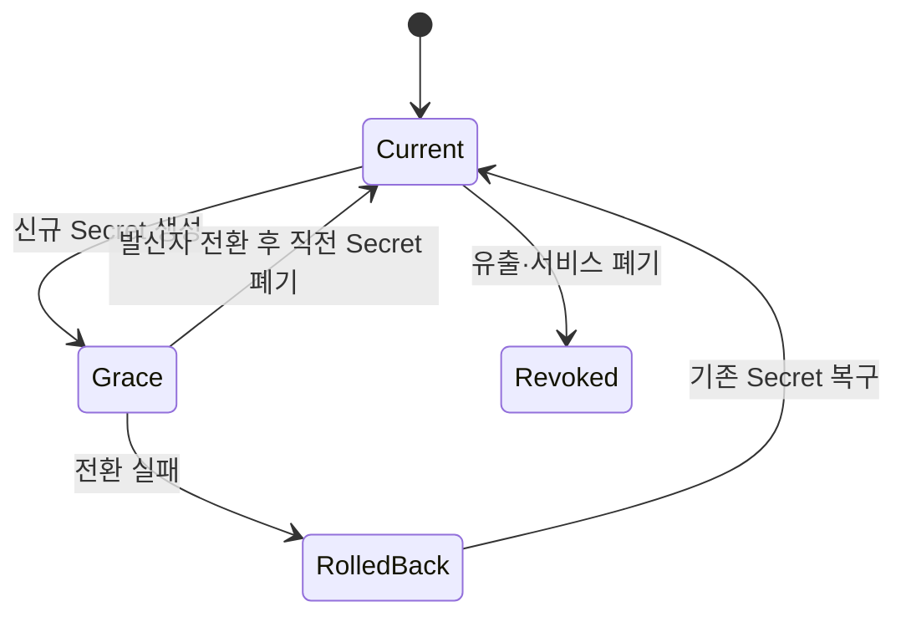

# ADR-0002: TechFlow 비밀정보 저장·주입·교체·폐기

- 상태: 승인
- 결정일: 2026-07-31
- 적용 이슈: [#15 비밀정보 관리 방식 결정](https://github.com/ablecloud-team/ablestack-techflow/issues/15)
- 선행 결정: [ADR-0001](0001-techflow-activepieces-responsibility-boundary.md)

## 1. 결정

TechFlow는 Secret을 Git, GitHub Issue, Flow 정의, 실행 입력, 일반 로그와 보고 산출물에 저장하지 않는다. Secret은 실행 환경의 보호된 저장소에서 런타임에만 주입하며 Activepieces는 제품 전체 Secret의 권위 원장이 아니다.

사내 단일 서버 실증에서는 다음 파일 기반 저장소를 사용한다.

| 항목 | 결정 |
|---|---|
| Secret 저장소 | `/etc/ablestack-techflow/secrets/activepieces.env` |
| 소유권·권한 | `root:ablecloud`, `0640`; 상위 디렉터리 `0750` |
| 런타임 연결 | 배포 디렉터리 `.env`는 보호된 파일을 가리키는 심볼릭 링크 |
| 변경 경로 | `scripts/secretctl.sh`와 원자적 파일 갱신 |
| 감사 기록 | `/var/log/ablestack-techflow/secret-audit.jsonl`, 값 없는 변경 이벤트 |
| 일반 백업 | Secret 파일 제외 |
| 로그·저장소 검사 | 실제 런타임 값과 완전 일치하는 노출 여부 검사 |

이 파일 저장소는 단일 서버 실증의 운영 기준이며 멀티테넌트·고객 Beta의 최종 Secret Broker가 아니다. 고객 제품에서는 TechFlow Secret Provider 인터페이스 뒤에 Vault, KMS 또는 배포 플랫폼의 Secret 저장소를 연결하고 읽기 접근 감사, 고객별 분리와 중앙 폐기를 제공해야 한다.

## 2. 책임

| 주체 | 책임 |
|---|---|
| 제품 책임자 | Secret 유형, 보존·교체 정책과 고객 제공 방식을 승인 |
| TechFlow 운영자 | 생성·주입·교체·폐기, 접근 권한과 사고 대응 수행 |
| TechFlow Core | 향후 Secret 참조 ID, 정책, 승인과 감사 소유 |
| Activepieces | 연결정보를 암호화해 Flow 실행에 사용; 제품 Secret 원장 아님 |
| Event Gateway | 현재·직전 Webhook Secret 검증과 Grace Period 제공 |
| ABLESTACK·외부 제공자 | API Token과 자격증명의 최종 발급·폐기 권위 |

## 3. Secret 분류

| 분류 | 예 | 교체 방식 |
|---|---|---|
| S1 장기 암호화 Root | `AP_ENCRYPTION_KEY` | 데이터 복호화 영향 때문에 임의 교체 금지; 백업·마이그레이션 계획 필요 |
| S2 플랫폼 세션 | `AP_JWT_SECRET`, `AP_API_KEY` | 유지보수 창에서 교체, App·Worker 재시작, 세션·Token 무효화 확인 |
| S3 상태 저장소 | PostgreSQL·Redis 자격증명 | 서버 측 자격증명과 런타임 값을 조정한 뒤 의존 서비스 순차 재시작 |
| S4 Webhook·Integration | TechFlow Webhook Secret | 현재·직전 값 Grace Period, 발신자 전환, 직전 값 폐기 |
| S5 외부 API Token | GitHub·AI·Community·메신저 | 제공자에서 신규 발급, 런타임 전환, 검증 후 기존 Token 폐기 |
| S6 사용자 Connection | Activepieces Connection | Activepieces 암호화 저장소 사용, Flow JSON·로그·Issue로 내보내지 않음 |

## 4. Webhook Secret 상태 전이

Grace Period에서는 현재 값과 직전 값만 허용한다. 세 번째 값을 추가하지 않으며 직전 값이 남아 있으면 다음 교체를 거부한다. 폐기 후 직전 값은 즉시 `401`이어야 한다.

## 5. 주입과 로깅

- 컨테이너에는 Compose `env_file`로 필요한 Secret만 주입한다.
- Secret은 명령행 인자로 전달하지 않는다.
- HMAC 검증 도구는 Secret을 표준입력으로 전달한다.
- 감사 로그에는 시각, 행위자, 동작, 논리 대상과 결과만 기록한다.
- 요청 Body, 서명, Token, 비밀번호와 Secret 원문을 로그에 남기지 않는다.
- 자동 검사는 실제 Secret 값을 읽되 일치한 변수 이름과 객체만 보고하고 값은 출력하지 않는다.

## 6. 백업과 복구

일반 구성·데이터 백업에서 `.env`와 Secret 저장소를 제외한다. Secret 복구본은 별도 보호 경로, 별도 접근 권한과 별도 보존 정책을 사용해야 한다. Issue #16에서 외부 복구 위치, 암호화, 보존과 복원 훈련을 확정한다.

Issue #14의 기존 사전 배포 Archive 한 개에는 `.env`가 포함되어 있으나 `/opt/ablestack-techflow/backups`의 `root:root 0700`, 파일 `0600`으로 격리되어 있다. 신규 Issue #15 백업은 `.env`를 제외한다. 기존 Archive의 분리·암호화·폐기는 Issue #16의 복구 훈련에서 수행한다.

## 7. 사고 대응

1. 의심된 Secret의 유형과 영향 서비스를 식별한다.
2. 발신·발급 시스템에서 신규 자격증명을 발급하거나 현재 값을 교체한다.
3. Grace Period가 허용되는 경우 신규 값으로 전환하고 검증한다.
4. 유출된 값을 폐기하고 세션·Token·연결을 무효화한다.
5. 저장소, Flow, 실행 기록과 로그를 값 비노출 방식으로 검사한다.
6. 영향 서비스와 자원 상태를 확인하고 필요 시 권위 시스템에서 재조회한다.
7. 실제 값 없이 사고 시각, 영향, 조치와 후속 작업을 기록한다.

유출된 값은 Grace Period에 두지 않고 즉시 폐기한다.

## 8. 대안과 판단

| 대안 | 판단 |
|---|---|
| 배포 디렉터리 `.env 0600` 유지 | 간단하지만 일반 백업·복사에 섞일 위험 때문에 채택하지 않음 |
| Docker Compose Secret만 사용 | 파일 Mount는 가능하지만 Activepieces 환경변수 계약과 중앙 수명주기를 해결하지 못함 |
| 즉시 Vault 도입 | 단일 서버 실증에 과도하며 제품 Provider 인터페이스가 먼저 필요 |
| 보호된 파일 저장소 + 향후 Broker | 현재 실증과 제품 확장을 모두 만족하므로 채택 |

## 9. 구현 완료 기준

- 보호된 저장소와 런타임 링크의 소유권·권한이 검증된다.
- 현재·직전 Webhook Secret의 Grace Period와 폐기가 실제 HTTPS 경로에서 검증된다.
- 교체가 Event Gateway에만 영향을 주고 데이터 저장소를 재시작하지 않는다.
- 변경 감사에 Secret 원문이 포함되지 않는다.
- 저장소와 컨테이너 로그의 실제 Secret 노출이 0건이다.
- 서비스 재시작·호스트 재부팅 뒤 동일 기준이 유지된다.
- Runbook, 구조화 증적, 보고서와 재현 가능한 검증 도구가 저장소에 병합된다.
