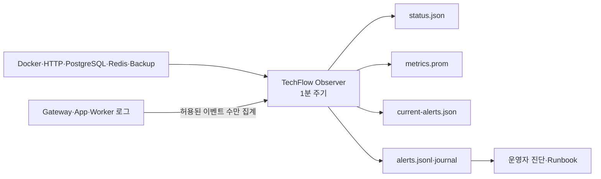

# ADR-0004: TechFlow 관측성과 최소 경보 기준

- 상태: 승인
- 결정일: 2026-07-31
- 적용 이슈: [#17 로그·메트릭·상태 점검 구성](https://github.com/ablecloud-team/ablestack-techflow/issues/17)
- 선행 결정: [ADR-0001](0001-techflow-activepieces-responsibility-boundary.md), [ADR-0003](0003-techflow-state-backup-recovery.md)

## 1. 결정

TechFlow M0 관측성은 Ubuntu 호스트에서 1분마다 실행되는 경량 수집기로 구성한다. 수집기는 Docker Compose, HTTP Health, PostgreSQL, Redis, 상태 백업과 허용된 로그 집계값을 하나의 상태 스냅샷과 Prometheus Text Format 메트릭으로 변환한다.

원문 로그, Flow 입력·출력, 요청 본문, 사용자 식별자와 Secret은 관측 파일에 복제하지 않는다. 경보에는 고정된 키·심각도·컴포넌트·운영 요약만 기록하며 발생과 해제 전이만 JSONL 및 systemd journal에 남긴다.

## 2. 책임 경계

| 구성요소 | 책임 |
|---|---|
| Activepieces | Flow 실행 상태와 App·Worker Health 제공 |
| Event Gateway | 구조화된 Webhook 수락·거부·전달 실패 이벤트 제공 |
| TechFlow Observer | 상태 조회, 안전한 집계, 경보 판정과 전이 기록 |
| systemd | 1분 주기 실행, 실패 상태 유지, 로컬 경보 journal 기록 |
| 운영자 | Runbook에 따른 원인 확인, 복구, 외부 알림 채널 연계 |
| TechFlow Core 후속 단계 | 멀티테넌트 정책, 중앙 메트릭 저장, 외부 알림 라우팅 |

Observer는 가상자원이나 Flow 상태를 변경하지 않는다. 장애 훈련 스크립트만 명시적으로 선택한 `event-gateway` 컨테이너를 잠시 중단하고 동일 컨테이너를 다시 시작한다.

## 3. 저장 자산과 권한

| 자산 | 목적 | 권한 |
|---|---|---|
| `/var/lib/ablestack-techflow/observability/status.json` | 최신 상태 스냅샷 | `root:root 0640` |
| `/var/lib/ablestack-techflow/observability/metrics.prom` | Prometheus Text Format | `root:root 0640` |
| `/var/lib/ablestack-techflow/observability/current-alerts.json` | 현재 활성 경보 | `root:root 0640` |
| `/var/log/ablestack-techflow/observability/alerts.jsonl` | 경보 발생·해제 전이 | `root:root 0640` |
| `/var/log/ablestack-techflow/observability/drills/*.json` | 값 없는 훈련 증적 | `root:root 0640` |

디렉터리는 `0750`으로 제한한다. 각 파일은 임시 파일 생성, `fsync`, 원자적 교체 순서로 갱신한다.

## 4. 메트릭 기준

- 호스트: 루트 파일시스템 사용률, 사용 가능 메모리 비율, Uptime
- 서비스: 6개 Compose 서비스의 실행·Health·재시작 횟수
- 엔드포인트: 내부 App, 내부 Gateway, 외부 HTTPS Health의 상태와 응답 시간
- PostgreSQL: 연결 가능 여부, DB 크기, 연결 수·최대 연결 수
- Flow: 15분·24시간 상태별 실행 수와 24시간 평균·p95 실행 시간
- Redis: 연결·차단 클라이언트, 메모리, 거부 연결, 초당 명령, RDB·AOF 상태
- 백업: Timer 상태, 직전 결과, 최신 Archive 나이·크기
- 로그: Gateway의 허용된 `level/message/reason` 조합 수와 App·Worker 오류 행 수

Flow ID, 실패 Step, 입력·출력과 원문 로그는 수집하지 않는다. Label은 고정된 서비스·엔드포인트·상태 열거값만 허용해 고카디널리티와 정보 노출을 방지한다.

## 5. 경보 정책

| 조건 | 심각도 |
|---|---|
| 서비스 누락·중지·Unhealthy | Critical |
| 내부 App·Gateway Health 실패 | Critical |
| 외부 HTTPS Health 실패 | Warning |
| 루트 디스크 85% 이상 / 95% 이상 | Warning / Critical |
| 사용 가능 메모리 15% 미만 / 5% 미만 | Warning / Critical |
| PostgreSQL·Redis 조회 실패 | Critical |
| PostgreSQL 연결률 80% 이상 | Warning |
| Redis 거부 연결 / Persistence 실패 | Warning / Critical |
| 백업 Timer 비활성·직전 실패·26시간 초과 | Critical |
| 15분 Flow 실패 1건 이상 / 5건 이상 | Warning / Critical |
| 15분 Webhook 거부 10건 이상 | Warning |
| 서비스 재시작 3회 이상 | Warning |

Critical이 있으면 수집기는 `2`를 반환한다. systemd는 실패 Unit을 기록하고 `techflow-alert` 식별자로 활성 경보 수를 journal에 남긴다. M0의 최소 알림 채널은 로컬 상태 파일·JSONL·journal이다. Slack·메일·Pager 연계는 수신 채널과 운영 책임자가 확정된 뒤 동일 경보 전이를 소비하도록 확장한다.

## 6. 로그 보존과 용량 제어

6개 Compose 서비스는 Docker `local` logging driver를 사용하며 서비스별 `10m`, 최대 3개 파일로 제한한다. 이 설정은 로그 무제한 증가를 막는 호스트 보호 기준이다. 장기 검색·감사 보존을 의미하지 않으며 고객 환경에서는 중앙 로그 저장소, 법적 보존 기간과 개인정보 정책을 별도로 결정해야 한다.

## 7. 성공 판정

다음 조건을 모두 만족해야 Issue #17 구현이 성공이다.

1. 1분 Timer가 활성화되고 정상 상태에서 Critical·Warning이 0건이다.
2. 6개 서비스와 내부·외부 Health, PostgreSQL, Redis, 백업 상태가 수집된다.
3. Prometheus 형식 파일이 생성되고 경보 전이가 JSONL과 journal에 기록된다.
4. `event-gateway` 중단 시 Critical과 원인이 감지되고 복구 후 같은 경보가 해제된다.
5. 장애 훈련 후 6개 서비스 및 외부 HTTPS Health가 정상이다.
6. 관측 자산 Secret Scan에서 누출이 0건이다.
7. Docker 로그 보존 한도가 6개 서비스에 적용된다.

## 8. 제한과 후속 확장

- 단일 호스트 파일이므로 호스트 전체 장애 시 관측 자산도 함께 접근 불가할 수 있다.
- 메트릭 장기 보존, 대시보드와 외부 알림 라우팅은 포함하지 않는다.
- App·Worker의 오류 행 수는 문자열 기반 보조 신호이며 구조화 로그 계약이 아니다.
- 현재 Flow 실행 이력이 없어 상태별 실행 수와 지연 분포는 빈 시계열로 확인되었다.
- 고객 공개 여부는 제품 책임자의 별도 결정이며 구현 완료 조건을 제한하지 않는다.

M1 이후에는 Prometheus/OpenTelemetry 호환 수집, 중앙 저장, Alertmanager 또는 메시징 연계를 추가하되 본 ADR의 데이터 최소화와 책임 경계를 유지한다.
