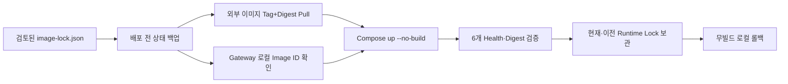

# ADR-0005: TechFlow 컨테이너 이미지 버전 고정 기준

- 상태: 승인
- 결정일: 2026-07-31
- 적용 이슈: [#18 Activepieces 버전과 이미지 Digest 고정](https://github.com/ablecloud-team/ablestack-techflow/issues/18)
- 선행 결정: [ADR-0003](0003-techflow-state-backup-recovery.md), [ADR-0004](0004-techflow-observability.md)

## 1. 결정

TechFlow M0 Compose 릴리스는 `image-lock.json`을 단일 이미지 기준으로 사용한다. 외부 레지스트리 이미지는 사람이 식별할 수 있는 버전 Tag와 변경 불가능한 Registry Digest를 함께 기록하고, 실제 배포는 잠금 파일에서 생성한 임시 환경 파일로만 수행한다.

자체 Event Gateway는 M0 테스트 서버에서 한 번 빌드한 릴리스 이미지를 로컬 Image ID로 고정한다. 배포와 롤백은 모두 `--no-build`를 사용하며 기대 Image ID가 없거나 다르면 시작 전에 중단한다. 고객 배포 단계에서는 Event Gateway도 승인된 Registry에 게시하고 Tag+Digest로 고정해야 한다.

## 2. 잠금 범위

| 서비스 | 버전 식별 | 변경 불가 기준 |
|---|---|---|
| Activepieces App·Worker | `0.86.3` | GHCR Registry Digest |
| PostgreSQL/pgvector | `0.8.0-pg14` | Registry Digest |
| Redis | `7.0.7` | Registry Digest |
| Caddy | `2.8.4-alpine` | Registry Digest |
| Event Gateway | `0.1.0` | 테스트 서버 로컬 Image ID |
| Gateway Base | Python `3.12.11-alpine3.22` | Registry Digest |

잠금 대상 플랫폼은 `linux/amd64`다. 플랫폼 변경은 같은 Tag라도 별도 릴리스 잠금과 검증이 필요하다.

## 3. 책임 경계

| 주체 | 책임 |
|---|---|
| 제품 개발자 | 버전 선택, 변경 내용·보안 영향 검토, 잠금 파일 갱신 |
| 릴리스 담당자 | Gateway 1회 빌드 또는 Registry 게시, Digest 확인, 산출물 승인 |
| 운영자 | 사전 백업, 잠금 배포, Health·관측성 확인, 필요 시 롤백 |
| TechFlow 스크립트 | 잠금 형식 검증, 이미지 일치 확인, 런타임 잠금 보관 |
| Activepieces | Flow 실행 엔진 제공. TechFlow 릴리스 승인과 롤백 정책은 소유하지 않음 |

## 4. 업그레이드 승인 조건

업그레이드는 다음 조건을 모두 충족해야 한다.

1. 새 버전 Tag와 Registry Digest 또는 Gateway Image ID가 검토된 잠금 파일에 기록된다.
2. 릴리스 노트, DB·캐시 호환성, 환경 변수 변경, 알려진 보안 영향이 검토된다.
3. 배포 전에 PostgreSQL·Redis 상태 백업이 성공한다.
4. 6개 서비스 Health, Worker polling, 내부·외부 Health, Observer가 정상이다.
5. 같은 잠금 파일로 반복 배포했을 때 6개 Runtime Image ID가 동일하다.
6. 직전 Runtime Lock을 사용한 무빌드 롤백이 로컬 이미지로 성공한다.
7. 롤백 후 다시 목표 릴리스로 전환하고 영속 Volume 이름이 유지된다.

## 5. 롤백과 승인 무효화

배포 전 Runtime Lock은 `runtime-lock.previous.json`, 성공한 목표 상태는 `runtime-lock.current.json`으로 보관한다. 최근 승인 릴리스 잠금은 최대 10개를 이력에 유지한다. 롤백은 Registry에 접속하지 않고 서버에 이미 존재하는 이미지로만 수행한다.

다음 경우 릴리스 승인을 무효화하고 신규 잠금을 발행한다.

- 동일 Tag의 Registry Digest가 변경되었거나 공급망 신뢰를 확인할 수 없는 경우
- 이미지 취약점, 서명 또는 출처 검증에서 차단 등급 문제가 발견된 경우
- DB Schema나 캐시 포맷 변경으로 이전 버전이 현재 데이터와 호환되지 않는 경우
- Gateway 소스·Base Image·빌드 환경이 바뀐 경우
- Health·반복 배포·롤백·Secret Scan 중 하나라도 실패한 경우

데이터 포맷이 역호환되지 않으면 컨테이너 롤백만 수행하지 않는다. 서비스를 중지하고 ADR-0003의 검증된 상태 백업으로 복구한 뒤 애플리케이션을 전환한다.

## 6. 자체 Gateway 빌드 재현성 판단

고정 Base Digest, `SOURCE_DATE_EPOCH=0`, BuildKit provenance 비활성화를 적용해 두 번의 no-cache 빌드를 비교했으나 COPY 계층과 최종 Image ID가 달랐다. 따라서 M0에서는 “소스로부터 바이트 단위 재현 가능한 빌드”를 완료 조건으로 주장하지 않는다.

대신 릴리스 이미지를 한 번 빌드하고 그 Image ID를 승인한 뒤 배포·롤백 과정에서 절대 다시 빌드하지 않는다. 제품화 단계에서는 Registry Digest, SBOM, 이미지 서명, provenance/attestation과 취약점 검사를 릴리스 Gate로 추가한다.

## 7. 보안과 기록 원칙

- 잠금 파일과 런타임 잠금에는 이미지 식별자, Health 상태와 생성 시각만 기록한다.
- `.env`, 비밀번호, Token, API Key, Cookie, Flow Payload와 원문 로그는 기록하지 않는다.
- 임시 릴리스 환경 파일은 `0640`으로 생성하고 명령 종료 시 삭제한다.
- 런타임 잠금과 드릴 증적은 `root` 소유 `0640`, 디렉터리는 `0750`으로 제한한다.
- GitHub Issue에는 비밀정보나 원문 운영 로그 대신 비식별 검증 결과만 남긴다.

## 8. 성공 판정

Issue #18 구현은 다음 조건으로 성공 판정한다.

1. 여섯 서비스의 버전과 불변 이미지 식별자가 잠금 파일에 존재한다.
2. Compose 기본값과 Gateway Base Image가 잠금 파일과 일치한다.
3. 동일 잠금 반복 배포의 Runtime Image ID가 6/6 동일하다.
4. 직전 Runtime Lock 롤백과 목표 릴리스 복귀가 모두 성공한다.
5. 세 영속 Volume 이름이 드릴 전후 동일하다.
6. 최종 6/6 Health, 외부 HTTPS 200, Observer 경보 0건이다.
7. 릴리스 자산 Secret Scan 유출이 0건이다.

고객 공개 여부와 최종 제품화 범위는 제품 책임자의 별도 결정이며 이 구현의 완료 조건을 제한하지 않는다.
