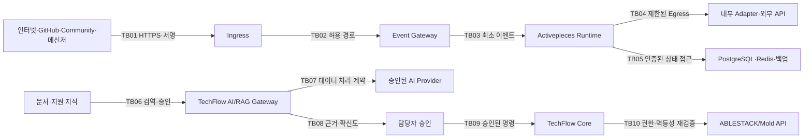

# ADR-0006: TechFlow 보안 위협 모델

- 상태: 승인
- 결정일: 2026-08-01
- 적용 이슈: [#39 TechFlow 보안 위협 모델 및 데이터 분류·보존 정책 확정](https://github.com/ablecloud-team/ablestack-techflow/issues/39)
- 선행 결정: [ADR-0001](0001-techflow-activepieces-responsibility-boundary.md), [ADR-0002](0002-techflow-secret-lifecycle.md), [ADR-0004](0004-techflow-observability.md), [ADR-0005](0005-techflow-image-version-lock.md)
- 구조화 정책: [techflow-security-data-policy.json](../decisions/techflow-security-data-policy.json)

## 1. 결정

TechFlow는 인터넷 이벤트, 실행 엔진, 데이터 저장소, AI/RAG와 향후 ABLESTACK 자원 변경 경계를 서로 다른 신뢰 영역으로 취급한다. 각 경계는 입력 검증, 최소 권한, 데이터 최소화, 감사 가능한 결과와 Fail Closed를 기본으로 한다.

위협은 `자산-행위자-신뢰 경계-공격 시나리오-통제-검증-잔여 위험`으로 관리한다. AI가 생성한 내용과 검색된 문서는 지시가 아니라 신뢰할 수 없는 데이터이며, AI 출력은 권한·정책·승인 또는 자원 변경 명령이 될 수 없다.

## 2. 보호 자산

| ID | 자산 | 보호 목표 |
|---|---|---|
| A01 | 사용자·운영자 신원과 세션 | 인증 무결성, 최소 권한, 세션 폐기 |
| A02 | Webhook·외부 API Secret | 원문 비노출, 교체·폐기, 사용 범위 제한 |
| A03 | Flow 정의와 Published Version | 승인된 버전만 실행, 변경 추적 |
| A04 | 실행·감사·관측 메타데이터 | 무결성, 상관관계, 최소 수집 |
| A05 | PostgreSQL·Redis 상태와 백업 | 기밀성, 무결성, 복구 가능성 |
| A06 | 지식 문서·Chunk·Embedding | 출처·버전·접근등급·삭제 전파 |
| A07 | AI Prompt·응답·평가 데이터 | 최소 수집, 민감정보 차단, 품질 추적 |
| A08 | ABLESTACK 자원·명령 | 권한 재검증, 멱등성, 사후 상태 확인 |
| A09 | 이미지·Piece·의존성·모델 | 출처, 버전, 공급망 무결성 |

## 3. 신뢰 경계

운영자에서 GitHub·서버·Activepieces 관리면으로 들어가는 경로는 별도 관리 신뢰 경계다. 운영 자격증명은 업무 이벤트와 분리하며 Issue, PR, Flow 입력과 일반 로그에 넣지 않는다.

## 4. 위험 평가

가능성과 영향을 각각 1~5로 평가하고 곱한 값을 고유 위험으로 사용한다.

| 점수 | 등급 | 처리 원칙 |
|---:|---|---|
| 1~4 | Low | 기본 통제와 정기 검토 |
| 5~9 | Medium | 담당자와 검증 방법 지정 |
| 10~15 | High | 구현 전 통제·테스트, 제품 책임자 승인 |
| 16~25 | Critical | 통제 전 배포 금지, 우회 금지 |

잔여 위험이 High 이상이면 Issue를 완료할 수 없다. 통제할 수 없는 위험은 기능 비활성화, 데이터 범위 축소 또는 별도 보안 검토로 전환한다.

## 5. 핵심 위협과 필수 통제

| ID | 위협 | 고유 위험 | 필수 통제 | 잔여 위험 |
|---|---|---:|---|---:|
| T01 | 위조 Webhook·Callback | 20 | HMAC, TLS, 조직·이벤트 Allowlist, 상수시간 비교 | 4 |
| T02 | 재전송·중복 실행 | 16 | Delivery ID·요청 지문, 7일 중복 억제, 계층별 멱등성 | 4 |
| T03 | 입력·템플릿·출력 Injection | 15 | Schema·길이·URL 검증, 출력 인코딩, 허용 필드만 전달 | 6 |
| T04 | SSRF와 과도한 Egress | 20 | Strict Network, 고정 주소 Allowlist, 직접 Webhook 차단 | 5 |
| T05 | Secret·세션 노출 | 20 | 보호 저장소, 런타임 주입, 로그·저장소 검사, 교체 | 5 |
| T06 | 과도한 운영·Connector 권한 | 20 | 조회·변경 자격증명 분리, 최소 Scope, 담당자 승인 | 6 |
| T07 | 이미지·Piece·모델 공급망 변조 | 16 | Digest Lock, 승인 버전, SBOM·서명 Gate의 단계적 도입 | 6 |
| T08 | Flow 변경으로 정책·승인 우회 | 20 | Core가 정책 소유, Flow Version 고정, 변경 리뷰 | 5 |
| T09 | 로그·실행 이력의 원문 유출 | 16 | 원문 미수집, 허용 식별자만 기록, 크기·보존 제한 | 4 |
| T10 | 백업·복구본 유출 또는 오염 | 20 | Secret 분리, 권한, Checksum, 격리 복구, 보존 만료 | 5 |
| T11 | 직접·간접 Prompt Injection | 20 | 문서를 명령이 아닌 데이터로 처리, Tool 호출 금지, 승인 | 6 |
| T12 | 지식 오염·출처 위조 | 16 | Source Allowlist, Hash·버전·소유자, 검역 후 게시 | 5 |
| T13 | 등급·테넌트 간 검색 결과 유출 | 25 | 검색 전 ACL Filter, D2·D3 RAG 차단, 격리 테스트 | 6 |
| T14 | 환각·근거 없는 답변 | 16 | 출처·버전 필수, 근거 없으면 보류, 고정 평가 세트 | 6 |
| T15 | AI의 과도한 자율 실행 | 25 | AI 출력의 명령화 금지, Human Approval, API 재검증 | 5 |
| T16 | Queue·모델 비용·자원 고갈 | 15 | 크기·빈도·동시성·예산 제한, Timeout, Circuit Breaker | 6 |
| T17 | AI Provider의 입력 보존·학습 | 20 | 처리 계약 승인, D2·D3 전송 금지, Provider 추상화 | 5 |
| T18 | 삭제되지 않은 파생·백업 데이터 | 16 | Lineage, 삭제 전파, 최대 7일 SLO, 백업 자연 만료 | 5 |

전체 시나리오·통제·검증 매핑은 구조화 정책 파일에서 관리한다.

## 6. AI/RAG 보안 Gate

Issue #20의 RAG PoC는 다음 Gate를 모두 통과한 뒤 실제 데이터를 수집한다.

1. P1 기본 수집 등급은 `D0 Public`이다.
2. `D1 Internal`은 문서 소유자, 목적, 보존 기간과 접근 범위를 승인한 경우에만 허용한다.
3. `D2 Confidential`과 `D3 Restricted`는 P1 RAG 수집·Embedding·Prompt 전송을 금지한다.
4. 문서는 허용 Source, 소유자, 제품·버전, Hash와 수집 시각을 가진다.
5. 새 문서는 검역 상태에서 정제·악성 지시·개인정보·Secret 검사를 통과한 뒤 색인한다.
6. 검색 권한은 Vector 검색 이후가 아니라 검색 조건에 먼저 적용한다.
7. 검색된 문서의 지시문은 실행하지 않으며 System Policy를 변경할 수 없다.
8. 답변에는 사용한 출처와 문서 버전을 포함한다. 근거가 없거나 충돌하면 답변을 보류한다.
9. AI 출력은 Shell, API, Activepieces Flow 또는 ABLESTACK 작업을 직접 실행하지 않는다.
10. 외부 게시와 자원 변경은 별도 승인·권한·멱등성 계약을 거친다.

## 7. 보안 검증

최소 검증 세트는 다음과 같다.

- 위조·변조 서명, 중복 Delivery와 다른 조직 이벤트
- 비허용 URL·사설 주소·Redirect를 사용한 SSRF
- Flow 입력·로그·백업·보고서의 실제 Secret 일치 검사
- 승인되지 않은 Flow Version과 Connector Scope
- Prompt Injection·악성 Markdown·숨은 지시·출처 위조 문서
- D0/D1/D2/D3 등급별 검색 격리와 삭제 전파
- 출처 없음·출처 충돌·저확신 질문의 답변 보류
- 모델 Timeout·429·5xx·비용 한도와 Queue 적체
- AI 출력이 승인·명령·Tool 호출로 승격되지 않는지 확인
- 백업 만료 뒤 삭제된 데이터가 복구 경로로 재등장하지 않는지 확인

## 8. 사고 처리

1. 외부 입력·지식 수집·AI 전송·자원 실행 중 영향 경계를 즉시 중단한다.
2. Secret 의심 시 ADR-0002에 따라 신규 발급·교체·폐기한다.
3. 원본 데이터와 운영 Volume은 보존하되 공개 Issue에는 최소 증적만 남긴다.
4. 오염된 지식은 Quarantine하고 Source·Chunk·Embedding·Cache Lineage로 삭제한다.
5. 불명확한 자원 작업은 `UNKNOWN` 또는 `COMPENSATION_REQUIRED`로 전환한다.
6. 위협 ID, 시간, 영향, 통제 실패, 조치와 재발 방지만 기록한다.

## 9. 구현 원칙

- 위협 통제는 Flow 설명문이 아니라 Gateway, Core, Adapter, API와 배포 정책에서 강제한다.
- Prompt만으로 데이터 유출·권한·Tool 실행을 통제하지 않는다.
- 탐지되지 않은 입력을 안전하다고 가정하지 않고 최소 데이터와 최소 권한으로 피해 범위를 제한한다.
- 고객 공개·제품화 여부와 관계없이 구현 단계의 보안 통제는 동일하게 적용한다.
- 새로운 Integration·AI Provider·Domain Pack은 이 위협 모델의 자산·경계·시나리오를 갱신한다.

## 10. 참고자료

- [NIST AI Risk Management Framework](https://www.nist.gov/itl/ai-risk-management-framework)
- [NIST AI RMF Generative AI Profile](https://doi.org/10.6028/NIST.AI.600-1)
- [OWASP Top 10 for LLM Applications 2025](https://genai.owasp.org/llm-top-10/)
- [GitHub Webhook 보안 권장사항](https://docs.github.com/en/webhooks/using-webhooks/best-practices-for-using-webhooks)
