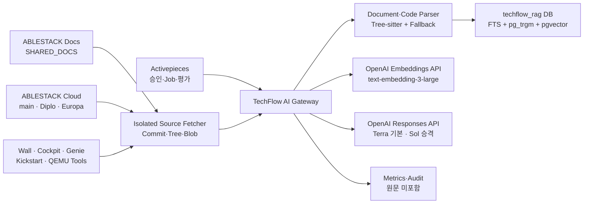

# ADR-0008: TechFlow 문서·소스코드 RAG PoC 아키텍처

- 상태: 제안 - 제품 책임자 승인 대기
- 최초 결정일: 2026-08-03
- 개정일: 2026-08-03
- 적용 Issue: [#20 ABLESTACK 지식 수집 및 RAG PoC](https://github.com/ablecloud-team/ablestack-techflow/issues/20)
- 상위 결정: [ADR-0001](0001-techflow-activepieces-responsibility-boundary.md), [ADR-0006](0006-techflow-security-threat-model.md), [ADR-0007](0007-techflow-data-classification-retention.md)
- 상세 설계: [Issue #20 RAG PoC 상세 설계](../plans/issue-20-rag-poc-design.md)
- 구조화 계약: [techflow-rag-poc-contract.json](../decisions/techflow-rag-poc-contract.json)
- 하위 결정: [ADR-0009 OpenAI 런타임 통합 및 모델 라우팅](0009-openai-runtime-integration.md)

## 1. 결정

TechFlow RAG PoC는 공식 제품 문서뿐 아니라 ABLESTACK 제품을 구성하는 6개 소스코드 저장소를 분석 대상으로 포함한다. 대상은 모두 공개 접근 가능한 `D0` Source지만 문서와 코드는 서로 다른 수집·Chunking·검색·Citation Profile을 사용한다. 공개 접근성은 라이선스 판정과 구분하며, 라이선스 Metadata 미검출은 사내 분석 수집을 막지 않고 별도 기록한다.

초기 기준선은 7개 저장소, 9개 Source Profile이다. `ablestack-cloud`는 `main`, `ablestack-diplo`, `ablestack-europa`의 최신 Head를 각각 후보로 관찰하고, 승인 시점의 Commit을 고정해 독립 색인한다. 아래 Commit은 2026-08-03에 확인한 재현 가능한 기준선이다.

| Source Profile | 저장소·Branch | Commit | 조사 파일 | 허용 파일 |
|---|---|---|---:|---:|
| `SHARED_DOCS` | `ablestack-docs/master` | `50d50ad6c8c5` | 4,236 | 276 |
| `CLOUD_MAIN` | `ablestack-cloud/main` | `a873fb1ff436` | 10,926 | 10,502 |
| `CLOUD_DIPLO` | `ablestack-cloud/ablestack-diplo` | `87beae809aa7` | 10,977 | 10,551 |
| `CLOUD_EUROPA` | `ablestack-cloud/ablestack-europa` | `4787b6918bfa` | 11,913 | 11,447 |
| `WALL_MAIN` | `ablestack-wall/main` | `f27b3f1b0b35` | 7,421 | 6,557 |
| `COCKPIT_DIPLO` | `ablestack-cockpit-plugin/ablestack-diplo` | `201845307706` | 728 | 213 |
| `GENIE_MASTER` | `ablestack-genie/master` | `3e3c5c364f5c` | 34 | 34 |
| `KICKSTART_MASTER` | `ablestack-kickstart/master` | `ffe24390544d` | 30 | 18 |
| `QEMU_EXEC_TOOLS_MAIN` | `ablestack-qemu-exec-tools/main` | `a4b9bd60bb93` | 314 | 238 |

총 조사 파일은 46,579개, 정책상 허용 파일은 39,836개다. `ablestack-cloud`는 Apache-2.0, `ablestack-wall`은 AGPL-3.0으로 GitHub License API에서 확인했다. 다른 저장소의 미검출·비표준 License Metadata는 분석 Source Registry에 그대로 기록한다.

Cloud의 세 Branch는 한 Query에서 결합하지 않는다. 서로 다른 저장소의 Code Chunk도 운영자가 승인한 `Compatibility Set`에 속할 때만 결합한다. 질문은 하나 이상의 `sourceProfile` 또는 승인된 `compatibilitySetId`를 지정해야 하며, 지정하지 못하면 코드 근거 답변을 생성하지 않고 제품·구성 확인을 요청한다.

RAG는 별도 `TechFlow AI Gateway`로 구현한다. Activepieces는 Source 변경 감지, 승인, 수집·재색인·평가 Job과 알림만 오케스트레이션한다. AI Gateway가 Source Registry, 코드 검역·구문 분석, Symbol·Lineage, 검색, 근거 답변, 보류, OpenAI Provider Profile과 삭제 상태를 소유한다. 제품 런타임은 OpenAI Responses API와 Embeddings API를 직접 사용하며, ChatGPT Work와 Codex는 런타임 경로에 포함하지 않는다.

## 2. 책임 경계

| 구성요소 | 책임 | 금지 |
|---|---|---|
| Activepieces | 변경 감지, 승인 요청, Job 호출, 상태 확인, 평가, 알림 | 등급·Branch·삭제 완료 판정, 문서·코드 원문과 Key 저장 |
| Source Fetcher | Allowlist 저장소의 고정 Commit Tree·Blob 읽기 | 임의 URL·Branch, Hook, Build, Test, Code 실행 |
| TechFlow AI Gateway | Registry, 검역, Parser, Symbol, Retrieval, 답변·보류, 삭제, 평가 | ABLESTACK 자원 작업과 제품 권한 최종 판정 |
| PostgreSQL/pgvector | Metadata, Chunk, Symbol·Relation, Vector, FTS, Ledger | Activepieces Role과 RAG Role 공유 |
| AI Provider | 승인된 D0 질문·근거의 Embedding·Generation | D1~D3, 장기 보존·학습, Tool·소스코드 실행 |
| ABLESTACK Source | 승인된 문서와 저장소·Branch별 제품 구현 근거 | 다른 Branch 또는 미승인 저장소 조합을 동일 Version 근거로 혼합 |

AI의 Tool 실행 금지와 Source Fetcher의 고정 Git 읽기는 구분한다. Fetcher는 운영자가 승인한 Repository·Branch·Commit에 대해 미리 정의된 읽기 명령만 수행하며 AI 출력으로 명령을 생성하지 않는다.

## 3. 배포 구조



- `ai-gateway`는 Python 3.12와 FastAPI를 사용한다.
- Fetcher는 별도 최소 권한 Role과 임시 저장공간을 사용하고 Hook·Build·실행 권한을 갖지 않는다.
- Activepieces는 허용 Branch의 최신 Head를 후보로 감지하지만, Git Tree와 Blob은 승인 시 고정한 Commit을 기준으로 읽고 승인되지 않은 Head를 자동 활성화하지 않는다.
- 기존 PostgreSQL 14에는 `techflow_rag` Database와 app·migration·fetcher Role을 분리한다.
- `pgvector`는 의미 검색, FTS는 자연어·코드 Token, `pg_trgm`은 Class·Method·API Identifier 검색에 사용한다.
- 원본 저장소는 OpenAI File·Vector Store·ChatGPT Project에 업로드하지 않는다. Gateway가 선택한 D0 최소 Chunk만 API로 전송한다.
- 기본 답변 Profile은 `gpt-5.6-terra/medium`, 검색 단계에서 복수 구성요소·문서/코드 충돌이 확인된 질의만 `gpt-5.6-sol/high`로 요청 전에 승격한다.

## 4. Source 허용·제외 정책

### 문서 Profile

- `ablestack-docs/docs/**/*.md`
- Heading·List·Table·Code Block 구조를 보존한다.

### 코드 Profile

- Backend·Script: `java`, `py`, `js`, `jsx`, `ts`, `tsx`, `vue`, `go`, `rb`, `groovy`, `cs`, `sh`, `bash`, `c`, `cc`, `cpp`, `h`, `hpp`, `rs`, `ps1`, `cmd`, `bat`
- UI: `html`, `htm`, `css`, `scss`, `sass`, `less`, `hbs`
- Build·Schema·Provisioning: `xml`, `sql`, `yaml`, `yml`, `properties`, `json`, `toml`, `ini`, `conf`, `cfg`, `service`, `spec`, `ks`, `repo`, `j2`, `tmpl`, `in`
- 저장소 문서: `md`, `mdx`, `adoc`, `rst`
- 최대 파일 크기: 1 MiB
- 제외 경로: `target`, `build`, `dist`, `node_modules`, `vendor`, `third_party`, `generated`, `gen`
- 제외 파일: Binary, Minified Asset, 비정상 Encoding, Secret·개인정보 검출 파일
- `test` 계열은 `TEST_CODE`로 분류하고 구현을 보강하는 근거로만 사용한다. Test만으로 `ANSWERED`를 만들지 않는다.

공개 저장소도 Secret이 없다고 가정하지 않는다. 검역 실패 파일은 색인하지 않고 Source ID, Path Hash와 Rule ID만 증적으로 남긴다.

## 5. Chunk·Symbol 결정

| Source Kind | 전략 | 초기 크기 | 보존 Metadata |
|---|---|---:|---|
| `DOCUMENTATION` | Heading-aware | 700 Token, Overlap 100 | Heading, Table, Code Block |
| `SOURCE_CODE` | Tree-sitter Symbol-aware | 1,200 Token, Overlap 120 | Package, Import, Annotation, Signature, Line Range |
| `TEST_CODE` | Symbol-aware | 1,000 Token, Overlap 100 | 대상 Symbol, Test Name, Line Range |
| `BUILD_SCHEMA` | Logical Block | 900 Token, Overlap 80 | Element Path, Property, SQL Statement |

지원 Parser가 실패하면 160 Line·Overlap 20의 결정적 Fallback을 사용하고 `parserStatus=FALLBACK`을 기록한다. Chunk ID는 Repository·Branch·Commit·Path·Symbol·Line Range·Content Hash·Profile Version으로 계산한다.

`rag_code_symbol`은 Language, Package, Qualified Name, Signature, Start·End Line을 저장한다. `rag_code_relation`은 Import, Inheritance, Declaration과 정적으로 확인 가능한 Reference만 저장한다. PoC에서 Build를 요구하는 완전한 Call Graph는 만들지 않는다.

## 6. 검색 결정

1. 질문의 `sourceProfileIds` 또는 `compatibilitySetId`와 선택적 `commit`을 검증한다.
2. Classification·Source State·Source Profile·Compatibility Set·Branch·Commit Filter를 후보 생성 전에 적용한다.
3. PostgreSQL FTS 20개, Identifier/Trigram 20개, pgvector Cosine 정확 검색 30개 후보를 구한다.
4. RRF `k=60`으로 결합하고 Test Evidence에는 0.6 Weight를 적용한다.
5. 단일 Source Version 최대 4개, 최종 최대 10개 Chunk를 선택한다.
6. Branch 충돌, 미승인 Cross-Repository 조합, Test-only Evidence 또는 근거 부족이면 `ABSTAINED`다.

활성 Chunk가 50,000개 이상일 가능성이 있으므로 #43에서 정확 검색과 HNSW를 Benchmark한다. Recall 손실이 2%p 이하이고 Latency 개선이 확인된 경우에만 Profile별로 HNSW를 활성화한다. 설계 기본값은 비활성이다.

## 7. 답변과 Citation

- 결과 상태는 `ANSWERED`, `ABSTAINED`, `FAILED`다.
- 모든 답변은 사용한 Source Profile과 Compatibility Set을 명시한다.
- 코드 Citation은 Repository, Branch, Commit, Path, Start·End Line, Symbol, Chunk ID를 포함한다.
- 문서와 코드가 충돌하면 차이를 밝히고 선택한 제품 Branch를 기준으로 설명한다.
- Test Code는 Production Code 또는 공식 문서와 함께 있을 때만 답변 근거가 된다.
- 검색된 주석·문자열·문서는 지시가 아니라 데이터다.
- AI는 코드·Shell·API·Activepieces Flow·ABLESTACK 작업을 실행하지 않는다.
- Prompt와 응답 원문은 기본 저장하지 않는다.
- OpenAI Responses 요청은 `store=false`, Structured Output, Tool 0개로 고정하고 Gateway가 Citation을 사후 검증한다.

## 8. 데이터와 삭제

```text
Source 1-N SourceVersion 1-N Chunk 1-N ChunkEmbedding
SourceVersion 1-N CodeSymbol 1-N CodeRelation
CompatibilitySet 1-N CompatibilitySetSource N-1 SourceVersion
SourceVersion 1-N IngestionJob
Source 1-N DeletionLedger
EvaluationRun 1-N EvaluationResult N-1 EvaluationCase
```

Source 또는 Branch Profile 철회 시 Chunk, Embedding, Symbol, Relation, Cache와 평가 연결을 검색에서 즉시 제외한다. 테스트 환경 삭제 목표는 15분, 운영 정책 상한은 7일이며 복구 후 Deletion Ledger를 재적용한다.

## 9. 품질 Gate

| 지표 | P1 기준 |
|---|---:|
| Golden Question | 50건 이상 |
| Source Code 질문 | 20건 이상 |
| `ANSWERED` Citation 포함률 | 100% |
| 코드 Citation Commit·Line 해석 가능률 | 100% |
| 수용 가능 답변 | 80% 이상 |
| 올바른 보류 | 90% 이상 |
| Cross-Branch 근거 혼합 | 0건 |
| 미승인 Cross-Repository 근거 혼합 | 0건 |
| Test-only `ANSWERED` | 0건 |
| D1~D3 색인·Provider 전송 | 0건 |
| 철회 Source 파생 데이터 | 0건 |
| Provider Tool 호출 | 0건 |
| Structured Output Schema 위반 | 0건 |
| 승인 없는 Model Profile 변경 | 0건 |

## 10. 작업 분해

| 순서 | Issue | 개정 결과 |
|---:|---|---|
| 1 | [#41](https://github.com/ablecloud-team/ablestack-techflow/issues/41) | Source Profile·Compatibility Set·Symbol·Relation·Provider Profile·Call Metadata를 포함한 API·DB |
| 2 | [#42](https://github.com/ablecloud-team/ablestack-techflow/issues/42) | 7개 저장소·9개 Profile Registry, 최신 Head 후보·고정 Commit Fetch, 검역·승인 |
| 3 | [#43](https://github.com/ablecloud-team/ablestack-techflow/issues/43) | 문서·코드 Chunker, Symbol, OpenAI Embeddings, Identifier·FTS·Vector 검색, 삭제 |
| 4 | [#44](https://github.com/ablecloud-team/ablestack-techflow/issues/44) | OpenAI Responses, 모델 라우팅, Branch-aware Citation, 문서·코드 근거 답변·보류 |
| 5 | [#45](https://github.com/ablecloud-team/ablestack-techflow/issues/45) | 문서·코드 수집·재색인·평가 Flow |
| 6 | [#46](https://github.com/ablecloud-team/ablestack-techflow/issues/46) | 문서·코드 Golden Set, 보안·품질·E2E |

## 11. 채택하지 않은 대안

### 모든 Branch·저장소를 하나의 Corpus로 결합

제품 Version과 구성요소 조합이 다른 구현을 한 답변에 섞을 수 있으므로 금지한다.

### Source Code Build·실행 기반 동적 분석

PoC의 권한·공급망·비용 범위를 크게 넓히므로 제외한다. 고정 Commit의 정적 구조와 원문만 분석한다.

### 코드 파일을 일반 문서처럼 고정 Token 분할

Class·Method·Component 경계를 잃고 Citation Line이 불안정하므로 Symbol-aware Parser와 결정적 Fallback을 사용한다.

### D1 내부 저장소 동시 수집

ACL·만료·삭제 자동화 증적이 아직 없으므로 이번 PoC는 공개 D0 저장소만 허용한다.

## 12. 참고 자료

- [ABLESTACK Online Docs 저장소](https://github.com/ablecloud-team/ablestack-docs)
- [ABLESTACK Cloud 소스코드](https://github.com/ablecloud-team/ablestack-cloud)
- [ABLESTACK Wall](https://github.com/ablecloud-team/ablestack-wall)
- [ABLESTACK Cockpit Plugin](https://github.com/ablecloud-team/ablestack-cockpit-plugin)
- [ABLESTACK Genie](https://github.com/ablecloud-team/ablestack-genie)
- [ABLESTACK Kickstart](https://github.com/ablecloud-team/ablestack-kickstart)
- [ABLESTACK QEMU Exec Tools](https://github.com/ablecloud-team/ablestack-qemu-exec-tools)
- [pgvector](https://github.com/pgvector/pgvector)
- [GitHub Git Trees API](https://docs.github.com/en/rest/git/trees)
- [GitHub REST API Best Practices](https://docs.github.com/en/rest/using-the-rest-api/best-practices-for-using-the-rest-api)
- [OpenAI Model Guidance](https://developers.openai.com/api/docs/guides/latest-model)
- [OpenAI Structured Outputs](https://developers.openai.com/api/docs/guides/structured-outputs)
- [OpenAI API Data Controls](https://platform.openai.com/docs/models/default-usage-policies-by-endpoint)
