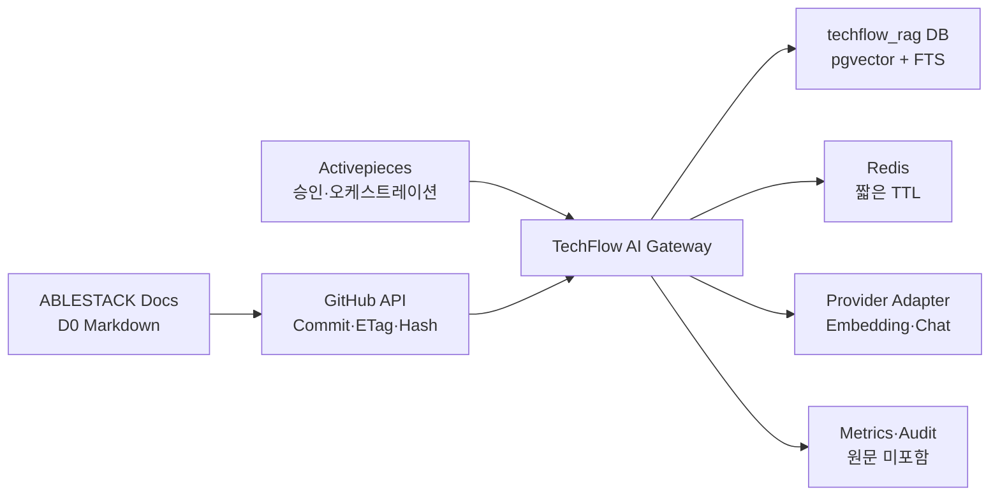

# ADR-0008: TechFlow RAG PoC 아키텍처

- 상태: 제안
- 결정일: 2026-08-03
- 적용 Issue: [#20 ABLESTACK 지식 수집 및 RAG PoC](https://github.com/ablecloud-team/ablestack-techflow/issues/20)
- 상위 결정: [ADR-0001](0001-techflow-activepieces-responsibility-boundary.md), [ADR-0006](0006-techflow-security-threat-model.md), [ADR-0007](0007-techflow-data-classification-retention.md)
- 상세 설계: [Issue #20 RAG PoC 상세 설계](../plans/issue-20-rag-poc-design.md)
- 구조화 계약: [techflow-rag-poc-contract.json](../decisions/techflow-rag-poc-contract.json)

## 1. 결정

TechFlow RAG PoC는 Activepieces 내부 기능이 아니라 별도 `TechFlow AI Gateway` 서비스로 구현한다. Activepieces는 Source 변경 감지, 운영자 승인, 수집·재색인·평가 실행과 알림을 시각적 Flow로 오케스트레이션한다. AI Gateway가 Source Registry, 데이터 등급 Gate, 검역, Chunk·Embedding Lineage, 검색, 근거 기반 답변, 보류, Provider 추상화와 삭제를 소유한다.

ABLESTACK 제품 지식의 최초 Source는 `D0 Public`으로 승인된 `ablecloud-team/ablestack-docs` 저장소의 `docs/**/*.md`만 허용한다. 2026-08-03 조사 시점에 해당 범위는 276개 Markdown 파일이며 기준 Commit은 `50d50ad6c8c548dc58db866ca28b4cbb43cc74d0`이다. 다른 저장소, 내부 Wiki, Community 원문, 사내 메신저 대화, 고객 로그와 D1~D3 데이터는 P1 수집 범위가 아니다.

기존 PostgreSQL 14/pgvector 0.8.0 컨테이너는 재사용하되 Activepieces와 별도 Database·Role을 사용한다. 작은 P1 Corpus에서는 pgvector 정확 검색과 PostgreSQL Full Text Search를 결합한 Hybrid Retrieval을 기본으로 한다. HNSW는 50,000개 이상의 활성 Chunk에서 정확 검색과 비교 Benchmark가 통과한 경우에만 별도 변경으로 도입한다.

## 2. 책임 경계

| 구성요소 | 책임 | 금지 |
|---|---|---|
| Activepieces | 변경 감지, 승인 요청, Job 호출, 상태 확인, 평가 실행, 알림 | 등급·승인·삭제 완료 자체 판정, 문서 원문·Provider Key 저장 |
| TechFlow AI Gateway | Source Registry, 검역, Lineage, Retrieval, 답변·보류, Provider, 삭제, 평가 | ABLESTACK 자원 작업과 일반 제품 권한의 최종 판정 |
| PostgreSQL/pgvector | RAG 메타데이터, Chunk, Vector, FTS, Job·삭제 Ledger | Activepieces Role과 RAG Role 공유 |
| Redis | 짧은 TTL Cache와 Job 제어 | 문서 원문·Prompt·응답 장기 저장 |
| AI Provider | 승인된 D0 질문·검색 근거에 대한 생성 | D1~D3 입력, 장기 보존·학습 설정, Tool 실행 |
| ABLESTACK Docs | 승인된 공개 제품 지식 원천 | 내부 Branch·비공개 저장소의 자동 포함 |

## 3. 배포 구조



- `ai-gateway`는 Python 3.12와 FastAPI를 사용한다.
- Container Image는 공식 Python 이미지를 기반으로 직접 빌드하고 Digest와 의존성을 잠근다.
- 외부 공개 경로를 만들지 않는다. Activepieces와 운영 검증 도구만 내부 API에 접근한다.
- PostgreSQL에는 `techflow_rag` Database와 최소 권한 Role을 별도로 만든다.
- Provider·GitHub Credential은 ADR-0002 보호 저장소에서 런타임에만 주입한다.

## 4. Source와 수집 상태

```text
REGISTERED -> QUARANTINED -> APPROVED -> INDEXING -> ACTIVE
                 |              |           |
                 +-> REJECTED   +-> REVOKED +-> FAILED
ACTIVE -> WITHDRAWN -> DELETION_REQUESTED -> DELETED
```

- `REGISTERED`: URI, Owner, D0 등급, 허용 경로와 Commit을 기록한다.
- `QUARANTINED`: 크기·형식·Secret·개인정보·악성 지시·경로를 검사한다.
- `APPROVED`: 운영자 승인과 승인 시각을 기록한다.
- `ACTIVE`: 승인된 Version의 Chunk·Embedding만 검색 후보가 된다.
- `WITHDRAWN`: 즉시 검색에서 제외하고 최대 7일 안에 파생 데이터를 삭제한다.

## 5. 검색 결정

1. 질문과 제품·버전 Filter를 검증한다.
2. 등급·Source 상태·제품·버전 Filter를 SQL `WHERE` 조건으로 먼저 적용한다.
3. PostgreSQL FTS와 pgvector Cosine 정확 검색에서 각각 후보를 구한다.
4. Reciprocal Rank Fusion으로 병합하고 중복 Chunk를 제거한다.
5. 단일 Source·Section의 과도한 점유를 제한하고 최종 최대 8개 Chunk를 선택한다.
6. 평가로 확정한 최소 관련도보다 낮거나 출처가 충돌하면 생성하지 않고 `ABSTAINED`를 반환한다.

초기 Chunk 기준은 본문 약 700 Token, 중첩 100 Token이다. 제목 계층, 목록, 표와 코드 블록 경계를 우선 보존하며 코드 블록은 가능한 한 분할하지 않는다. 이 값은 Golden Set 평가 결과로 변경할 수 있지만 변경 시 `chunkProfileVersion`을 올리고 전체 재색인한다.

## 6. 답변 결정

- 결과 상태는 `ANSWERED`, `ABSTAINED`, `FAILED`만 사용한다.
- `ANSWERED`에는 Source ID, Version, URI, 제목, Section, Chunk ID가 있는 Citation이 하나 이상 필요하다.
- 검색 문서 안의 지시는 실행하지 않으며 System Policy를 변경할 수 없다.
- 근거 부족, 출처 충돌, 지원하지 않는 제품·버전은 `ABSTAINED`다.
- AI 출력은 Shell, API, Activepieces Flow와 ABLESTACK 자원 작업을 직접 실행하지 않는다.
- Provider Timeout·429·5xx는 제한된 재시도 후 `FAILED`로 반환하고 실패 분류를 기록한다.
- Raw Prompt와 응답은 기본적으로 저장하지 않는다.

## 7. Provider와 Embedding Profile

- Provider는 OpenAI-compatible Adapter 계약으로 격리한다.
- Chat Model, Embedding Model, Dimension, Endpoint와 정책 Version을 `providerProfile`과 `embeddingProfile`로 기록한다.
- P1에서는 동시에 하나의 활성 Embedding Profile만 허용한다.
- Embedding Model을 바꾸면 새로운 Profile과 Vector 세대를 생성하고 Shadow Index 검증 후 전환한다.
- API Key는 Profile에 저장하지 않고 보호 저장소 참조만 사용한다.
- 구체적인 Provider와 Model 이름은 구현 시작 전에 런타임 운영자가 제공하고 보안 검토한다.

## 8. 데이터와 삭제

핵심 관계는 다음과 같다.

```text
Source 1-N SourceVersion 1-N Chunk 1-N ChunkEmbedding
SourceVersion 1-N IngestionJob
Source 1-N DeletionLedger
EvaluationRun 1-N EvaluationResult N-1 EvaluationCase
```

Source 철회 시 검색 후보에서 즉시 제외하고 Chunk, Embedding, Cache와 평가 연결을 삭제한다. 테스트 환경에서는 한 번의 Job 실행 안에 삭제 완료를 요구하고, 운영 정책 상한은 7일이다. 백업 복구 후에는 외부 Deletion Ledger를 재적용한다.

## 9. 품질 Gate

| 지표 | P1 기준 |
|---|---:|
| Golden Question | 30건 이상 |
| `ANSWERED` Citation 포함률 | 100% |
| 수용 가능 답변 | 80% 이상 |
| 근거 없는 질문의 올바른 보류 | 90% 이상 |
| 정상 Provider 구간 P95 | 10초 이하 |
| D1~D3 색인·Provider 전송 | 0건 |
| 철회 Source 파생 데이터 잔존 | 0건 |
| Raw Prompt·응답 영속 저장 | 0건 |

## 10. 작업 분해

| 순서 | Issue | 결과 |
|---:|---|---|
| 1 | [#41](https://github.com/ablecloud-team/ablestack-techflow/issues/41) | AI Gateway 골격·API·DB |
| 2 | [#42](https://github.com/ablecloud-team/ablestack-techflow/issues/42) | D0 Source Registry·검역·승인 |
| 3 | [#43](https://github.com/ablecloud-team/ablestack-techflow/issues/43) | Chunk·Embedding·Hybrid Retrieval·삭제 |
| 4 | [#44](https://github.com/ablecloud-team/ablestack-techflow/issues/44) | 근거 답변·Provider·보류 |
| 5 | [#45](https://github.com/ablecloud-team/ablestack-techflow/issues/45) | Activepieces Flow 연동 |
| 6 | [#46](https://github.com/ablecloud-team/ablestack-techflow/issues/46) | Golden Set·보안·품질·E2E 검증 |

## 11. 고려했으나 채택하지 않은 대안

### Activepieces 내부 AI 기능에 전체 RAG 구현

제품 정책, Source Lineage, 등급 Gate와 Provider 교체가 Flow 정의에 종속되므로 채택하지 않는다.

### 별도 Vector Database 도입

P1 Corpus 규모에 비해 운영 구성요소와 백업·보안 경계가 증가한다. 기존 pgvector로 품질·성능 한계가 확인될 때 재검토한다.

### P1부터 HNSW 사용

작은 Corpus에서는 정확 검색으로 재현성과 Recall을 우선한다. HNSW는 Benchmark와 Chunk 규모 기준을 통과한 뒤 도입한다.

### D1 내부 문서 동시 수집

ACL·만료·삭제 자동화의 운영 증적이 아직 없으므로 P1에서는 D0만 허용한다.

## 12. 참고 자료

- [ABLESTACK Online Docs 저장소](https://github.com/ablecloud-team/ablestack-docs)
- [ABLESTACK Online Docs](https://docs.ablecloud.io)
- [pgvector 공식 저장소](https://github.com/pgvector/pgvector)
- [FastAPI Container 배포](https://fastapi.tiangolo.com/deployment/docker/)
- [GitHub Repository Contents API](https://docs.github.com/en/rest/repos/contents)
