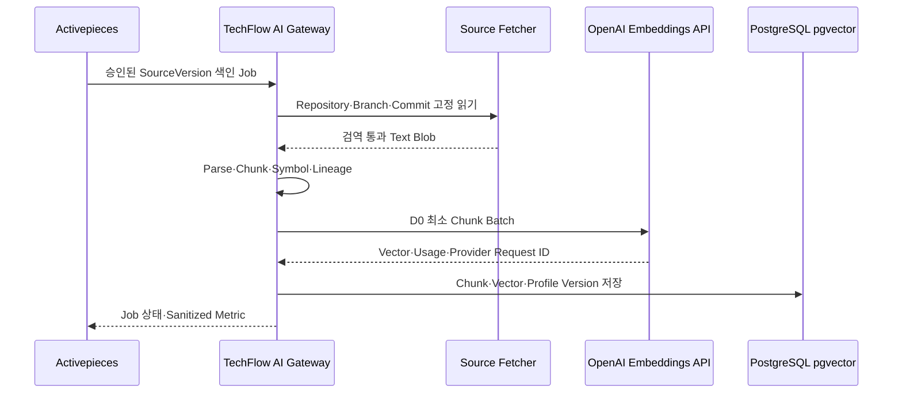
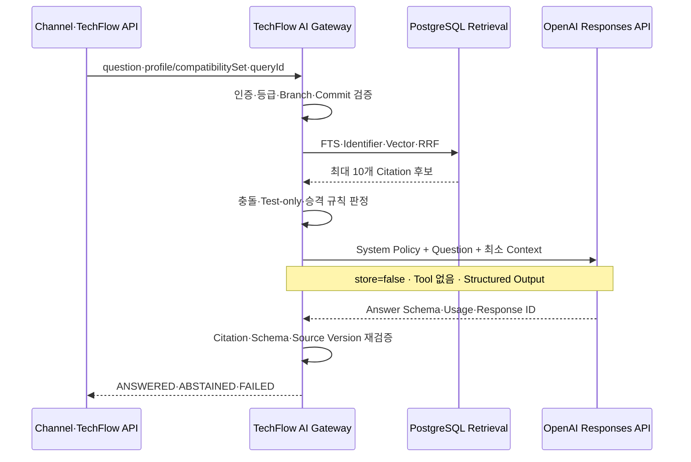

# ADR-0009: TechFlow OpenAI 런타임 통합 및 모델 라우팅

- 상태: 승인 - Issue #43·#44 구현 반영
- 결정일: 2026-08-03
- 적용 Issue: [#20 ABLESTACK 지식 수집 및 RAG PoC](https://github.com/ablecloud-team/ablestack-techflow/issues/20), [#43](https://github.com/ablecloud-team/ablestack-techflow/issues/43), [#44](https://github.com/ablecloud-team/ablestack-techflow/issues/44)
- 선행 결정: [ADR-0008](0008-techflow-rag-poc-architecture.md)
- 구조화 계약: [techflow-rag-poc-contract.json](../decisions/techflow-rag-poc-contract.json)

## 1. 결정

TechFlow의 고객 질의 런타임은 OpenAI 공식 Python SDK를 통해 `Responses API`를 직접 호출한다. ChatGPT Work와 Codex는 제품의 동기식 답변 경로에 포함하지 않는다.

| 방식 | 제품 내 역할 | 결정 |
|---|---|---|
| OpenAI Responses API | TechFlow AI Gateway의 답변 생성 | 채택 |
| OpenAI Embeddings API | 승인된 Chunk와 Query의 Vector 생성 | 채택 |
| OpenAI Batch API | 최초 대량 색인·전체 재색인·평가처럼 24시간 내 완료 가능한 비대화형 작업 | 조건부 채택 |
| ChatGPT Work | 사람이 검토하는 분석·보고·평가 자산 작성 | 선택적 운영 도구, 런타임 의존 없음 |
| Codex | TechFlow 개발·코드 리뷰·오프라인 평가 케이스 작성 | 선택적 개발 도구, 런타임 의존 없음 |
| Agents SDK·Hosted Tool | 다단계 Tool 실행 | P1 제외 |

이 선택은 기술지원 답변의 인증, Source Profile, Compatibility Set, 인용 검증, 비용, 장애와 감사 상태를 TechFlow가 일관되게 소유하기 위한 것이다. ChatGPT Work는 사람이 작업을 위임하고 결과물을 검토하는 제품이며, Codex는 소프트웨어 엔지니어링에 특화되어 있다. 둘 다 고객 요청별 API 계약, 서버 측 비용·지연 통제와 무관하게 독립 실행될 수 있으므로 백엔드 런타임으로 사용하지 않는다.

## 2. 모델 Profile

모델명은 코드에 산재시키지 않고 승인된 Versioned Provider Profile로 관리한다.

| Profile | API·Model | 기본 설정 | 사용 조건 |
|---|---|---|---|
| `OPENAI_RAG_DEFAULT_V1` | Responses API · `gpt-5.6-terra` | `reasoning.effort=medium`, Tool 0개 | 단일 Profile 또는 명확한 Compatibility Set 질의 |
| `OPENAI_RAG_ESCALATION_V1` | Responses API · `gpt-5.6-sol` | `reasoning.effort=high`, Tool 0개 | 검색 단계에서 문서·코드 충돌 또는 복수 구성요소 분석이 확인된 경우 |
| `OPENAI_EMBEDDING_V1` | Embeddings API · `text-embedding-3-large` | Dimension 3,072 기준선 | 한국어·영어·코드 Chunk와 Query |

`gpt-5.6-terra`는 품질과 비용의 균형형을 기본으로 사용한다. `gpt-5.6-sol` 승격은 모델이 스스로 결정하지 않고, 검색 결과의 충돌 플래그·Source Version 수·Compatibility Set 구성요소 수 같은 결정적 규칙으로 요청 전에 한 번만 판정한다. 기본 호출 실패나 낮은 자신감만을 이유로 자동 이중 호출하지 않는다.

PoC는 Embedding 품질을 우선해 `text-embedding-3-large`의 기본 3,072 Dimension으로 시작한다. #43에서 1,536·1,024 Dimension 및 `text-embedding-3-small`을 같은 Golden Set으로 비교하고 Recall 손실, 저장공간과 응답시간이 승인 기준을 만족할 때만 Profile을 교체한다.

Alias는 PoC 후보 선택에 사용할 수 있지만 승인된 Profile에는 실제 요청 Model ID와 Provider가 반환한 Model ID를 함께 기록한다. 사용 가능한 Snapshot ID가 확인되면 운영 전 Snapshot으로 고정하고, 변경은 새 Profile Version과 회귀 평가를 거친다.

## 3. 색인 데이터 흐름

- 원본 저장소를 OpenAI File, Vector Store 또는 ChatGPT Project에 업로드하지 않는다.
- Source 원문, Chunk, Symbol과 Branch·Commit Lineage의 원장은 TechFlow PostgreSQL에 둔다.
- 증분 색인은 Embeddings API 동기 호출을 사용한다.
- 최초 대량 색인·전체 재색인·대량 평가는 운영자가 비대화형 완료 시간을 수용할 때만 Batch API를 사용한다.
- Batch 입력·결과 파일은 D0 최소 Chunk만 포함하고 완료 후 삭제 Job을 추적한다.

## 4. 질의 데이터 흐름

Responses API 요청에는 전체 저장소가 아니라 최종 선택한 최대 10개 Chunk와 다음 Metadata만 전달한다.

- `sourceProfile`, `compatibilitySetId`, Repository, Branch, Commit
- Path, Start·End Line, Symbol, Chunk ID
- 질문, Locale, 답변 정책과 Structured Output Schema

Structured Output은 `state`, `answer`, `citationsUsed`, `abstainReason`을 강제한다. Gateway는 반환 Citation ID가 전달 Context에 존재하는지 다시 검증하고 하나라도 불일치하면 `ABSTAINED`로 바꾼다. Provider가 Source, Shell, Web, File Search, Code Interpreter, MCP 또는 Function을 호출할 수 없도록 `tools`를 비워 둔다.

## 5. 데이터·보안 경계

- API Key는 Secret Store에서 런타임 주입하고 저장소·Activepieces·Prompt·로그에 남기지 않는다.
- 모든 Responses 요청은 `store=false`를 명시한다.
- 제품 책임자의 2026-08-10 결정에 따라 Zero Data Retention은 사용하지 않으며, 적격성·승인·적용 상태를 현재 또는 향후 구현 Gate로 사용하지 않는다.
- `store=false`는 애플리케이션 수준 데이터 최소화 통제로 계속 사용한다. P1의 D0 전송 제한은 Zero Data Retention과 무관한 현재 구현 경계다.
- D1 이상 확대는 Source 승인, 비식별화·최소화, 접근권한, 감사, 보존·삭제 및 사고 대응을 포함한 TechFlow 제품 보안심사로 결정한다.
- Background mode, OpenAI File Search·Vector Store, Code Interpreter, Web Search, MCP와 외부 Tool은 P1에서 금지한다.
- 개인 사용자를 대신하는 요청은 내부 사용자 ID를 단방향 가명화한 안정적인 `safety_identifier`를 전달한다.
- Gateway는 Raw Prompt·Raw Response를 저장하지 않는다. `rag_provider_call`에는 Query·Evaluation ID, Provider Request·Response ID, Model Profile Version, Token Usage, Latency, Status, Error Code만 남긴다.

## 6. 장애·비용 통제

- Connect Timeout 3초, 전체 응답 Timeout 12초를 초기값으로 사용한다.
- 429·5xx·Network Timeout만 지수 Backoff와 Jitter로 최대 3회 시도한다.
- Provider 실패는 근거 답변으로 위장하지 않고 `FAILED`로 반환한다.
- 5분 이동 구간 실패율 50% 이상이고 최소 10건이면 60초 Circuit Open 후 Half-open 1건을 허용한다.
- Query별 입력·출력 Token 상한, Project 일·월 예산과 동시성 제한을 둔다.
- Provider Call의 Prompt·응답 원문은 재시도·비용 분석을 위해서도 저장하지 않는다.
- Prompt Cache는 P1에서 명시적으로 활성화하지 않는다. Golden Set으로 실제 비용·지연 이득과 Data Control 영향을 확인한 뒤 결정한다.

## 7. 구현 배치

| Issue | OpenAI 관련 구현 |
|---|---|
| #41 | Provider Profile, `rag_provider_call`, 설정 검증과 Mock Adapter 계약 |
| #43 | Embeddings API Adapter, Dimension Profile, 동기·Batch 색인 경계 |
| #44 | Responses API, Structured Output, 모델 라우팅, Citation 재검증, Circuit Breaker |
| #45 | Activepieces가 Profile Version과 Batch Job 상태만 오케스트레이션 |
| #46 | Terra·Sol·Embedding 후보 비교, 비용·P95·보안·회귀 평가 |

## 8. 승인 필요 항목

1. 제품 런타임을 Responses API와 Embeddings API로 확정
2. 기본 `gpt-5.6-terra/medium`, 규칙 기반 `gpt-5.6-sol/high` 승격 승인
3. `text-embedding-3-large/3072`를 PoC 기준선으로 승인
4. OpenAI File Search·Vector Store와 Agent Tool을 P1에서 사용하지 않는 경계 승인
5. Zero Data Retention을 사용하지 않고 향후 Gate에서도 제외하며, 데이터 등급 확대는 TechFlow 제품 보안심사로 결정
6. ChatGPT Work와 Codex는 운영·개발 보조 도구이며 제품 런타임이 아니라는 역할 구분 승인

## 9. 참고 자료

- [OpenAI Model Guidance](https://developers.openai.com/api/docs/guides/latest-model)
- [GPT-5.6 Terra](https://developers.openai.com/api/docs/models/gpt-5.6-terra)
- [GPT-5.6 Sol](https://developers.openai.com/api/docs/models/gpt-5.6-sol)
- [Structured Outputs](https://developers.openai.com/api/docs/guides/structured-outputs)
- [Vector Embeddings](https://developers.openai.com/api/docs/guides/embeddings)
- [text-embedding-3-large](https://developers.openai.com/api/docs/models/text-embedding-3-large)
- [Batch API](https://developers.openai.com/api/docs/guides/batch)
- [OpenAI API Data Controls](https://platform.openai.com/docs/models/default-usage-policies-by-endpoint)
- [ChatGPT Work](https://chatgpt.com/work/)
