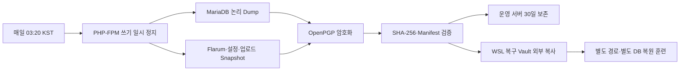

# ADR-0010: Community 백업·관측·보안 운영 기준

- 상태: 승인 요청
- 결정일: 2026-08-19
- 적용 이슈: [#74 Flarum 백업·모니터링·보안 운영 강화](https://github.com/ablecloud-team/ablestack-techflow/issues/74)
- 선행 결정: [ADR-0002](0002-techflow-secret-lifecycle.md), [ADR-0003](0003-techflow-state-backup-recovery.md), [ADR-0004](0004-techflow-observability.md)

## 결정

Community의 복구 단위는 Flarum DB, 애플리케이션, 설정, 확장 기능과 업로드 전체다. 매일 03:20 KST에 PHP-FPM 쓰기를 잠시 멈추고 DB Dump와 애플리케이션 Snapshot을 같은 정지 구간에서 만든다. 평문은 같은 작업 안에서 OpenPGP 공개키로 암호화한 뒤 제거하며 운영 서버에는 공개키만 둔다.

| 항목 | 결정 |
|---|---|
| 백업 주기 | 매일 03:20 KST, 최대 10분 무작위 지연 |
| 운영 보존 | 30일 |
| 일관성 | PHP-FPM 정지 구간에서 DB와 파일을 함께 Snapshot |
| 암호화 | OpenPGP RSA-3072 공개키 암호화 |
| 개인키 | WSL 복구 Vault에만 보관, `root:root 0600` |
| 운영 백업 | `/var/backups/techflow-flarum/managed`, `root:root 0700/0600` |
| 외부 복사 | 암호화 Archive만 WSL 복구 Vault로 Pull |
| 복원 안전 | 운영 경로는 기본 거부, 별도 App Root·DB에서만 자동 훈련 |
| 관측 | 5분 주기 JSON·Prometheus Text Format·Journal |
| 경보 | 상태 전이 기반 Chat 알림, 같은 상태 1시간 억제 |

## 성공 판정

백업은 두 암호화 파일의 크기와 SHA-256이 Manifest와 일치하고 OpenPGP Packet이 정상일 때만 성공이다. 복원은 DB 32개 Table, 애플리케이션 파일, Flarum CLI와 격리 HTTP가 정상이고 사용자·토론·게시물·첨부 건수가 원본과 일치할 때만 성공이다.

M0 운영 목표는 정기 백업 RPO 24시간+10분 이내, 단일 서버 복원 RTO 30분 이내다. 2026-08-19 운영 Snapshot의 실측 RTO는 9초이며 핵심 데이터 차이는 0건이었다. 현재 데이터 규모에 대한 실측이며 고객 환경 보장값은 아니다.

## 관측과 장애 처리

- Nginx, PHP-FPM, MariaDB 상태와 Community·AI 연동 HTTP를 5분마다 점검한다.
- 디스크·inode는 70% Warning, 85% Critical로 분류하고 업로드 총량과 백업 나이를 기록한다.
- Backup Lock이 잡혀 있으면 Monitor는 경보를 만들지 않고 건너뛴다. Backup은 Monitor가 끝날 때까지 최대 120초 기다린다.
- 현재 상태 Fingerprint가 같으면 1시간 동안 Chat 중복 전송을 억제한다. 상태가 바뀌면 장애와 복구를 각각 알린다.
- 로그에는 상태·수치·고정 경보 Key만 남기며 질문, 첨부 원문, Password, Token, API Key를 기록하지 않는다.

## 보안 결정

- `config.php`는 `root:www-data 0640`, 운영 설정과 Chat Webhook은 `root:root 0600`이다.
- 인증 관련 경로는 IP당 분당 12회, Burst 12회 이후 HTTP 429로 제한한다.
- X-Frame-Options, Permissions-Policy, HSTS를 Nginx가, X-Content-Type-Options와 Referrer-Policy를 Flarum이 제공한다.
- TLS 1.0은 외부 Endpoint에서 차단하고 TLS 1.2 이상을 허용한다.
- Symfony Mailer CVE-2026-45068은 SendmailTransport 경로의 문제다. Flarum 1.x 의존성에서 즉시 안전 버전으로 올릴 수 없으므로 운영 `mail_driver=smtp`를 5분마다 강제 확인한다. SMTP가 아니면 Critical이다. 상위 Flarum 호환성이 확보되면 안전 버전으로 교체한다.

## 롤백

운영 데이터는 자동 롤백 대상이 아니다. 관측 Timer는 비활성화할 수 있고, Nginx는 적용 시 생성한 `/var/backups/techflow-flarum/security-*`의 사이트 설정으로 되돌린 뒤 `nginx -t`와 HTTP 200을 확인한다. 암호화 백업과 감사 상태는 보존 정책에 따라 유지한다.
