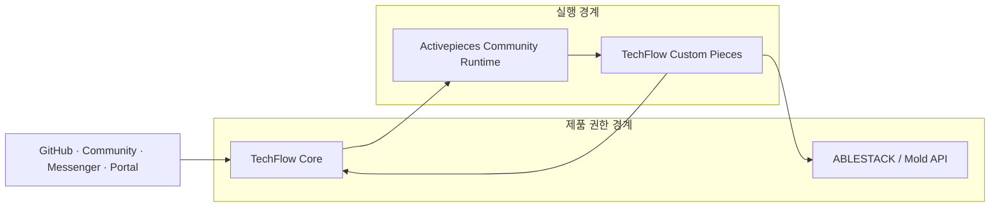

# Activepieces Community·Enterprise 기능 및 라이선스 의사결정

> GitHub Issue: #11
>
> 검토 기준: Activepieces `0.86.3` (`8bfbb2fd962eeded92d38359605a89fd14b2ec00`)
>
> 기준일: 2026-07-30
>
> 상태: **승인(Community 기반, 자체 구현 범위 제한 없음)**

## 1. 결론

ABLESTACK TechFlow는 **Activepieces Community Edition을 기본 실행 엔진으로 사용한다.** Activepieces는 시각적 플로우 설계와 실행을 담당하며, TechFlow Core가 고객·테넌트·인증·권한·정책·승인·감사·템플릿·제품 API·AI/RAG를 소유한다. ABLESTACK/Mold API는 실제 가상자원 작업의 권한·최종 상태·멱등성을 소유한다.

Activepieces에서 Enterprise로 분류한 기능이라도 TechFlow 제품에 필요하면 자체 구현한다. 라이선스 분류는 Activepieces 네이티브 기능을 직접 사용할 때의 참고정보이며, **동등하거나 더 적합한 기능의 자체 구현을 제한하지 않는다.** 고객 공개·판매·배포 여부는 제품 책임자가 별도로 결정하며 개발 우선순위, 아키텍처와 완료 조건에 포함하지 않는다.

| 적용 시나리오 | 구현 판단 | 공개 관련 참고사항 |
|---|---|---|
| 사내 Assist PoC | **승인** | Community 0.86.3을 기본 엔진으로 사용 |
| 고객 전용 인스턴스 | **구현 가능** | 실제 고객 공개·배포 방식은 제품 책임자 결정 |
| 고객용 구성·관리 UI | **자체 구현 가능** | Activepieces 네이티브 UI 사용 조건은 공개 결정 시 참고 |
| TechFlow Builder | **자체 구현 가능** | 네이티브 Embed SDK 조건은 공개 결정 시 참고 |
| 다중 고객 플랫폼 | **자체 구현 가능** | 공개·판매·서비스 형태는 제품 책임자 결정 |
| 사설망·오프라인 배포 기능 | **자체 구현 가능** | 실제 고객 제공 조건은 공개 결정 시 참고 |

이 문서의 고객 공개·상용화 관련 내용은 제품 책임자의 최종 판단을 위한 참고사항이며 법률 자문이 아니다. 해당 참고사항은 TechFlow 기능의 설계·자체 구현·개발 우선순위를 제한하지 않는다.

## 2. 분석 기준과 재현성

- Release: `0.86.3`, 2026-07-17
- Tag commit: `8bfbb2fd962eeded92d38359605a89fd14b2ec00`
- Root `LICENSE` SHA-256: `C66760CFE1D2361A78BC9662EC8FAB43274A386BAB3BF25D07E7257A0843470D`
- Enterprise `LICENSE` SHA-256: `D3E92F0C2988288CECD7699BB7CA35BA63F3E94B91EE0C1647C6FD328FBFB712`
- 판단 원본: [activepieces-license-review.json](activepieces-license-review.json)
- 보고서 PDF: [activepieces-license-review-report.pdf](../../output/pdf/activepieces-license-review-report.pdf)
- 프레젠테이션 PDF: [activepieces-license-review-presentation.pdf](../../output/pdf/activepieces-license-review-presentation.pdf)
- 편집용 프레젠테이션: [activepieces-license-review.pptx](../../output/presentation/activepieces-license-review.pptx)

향후 Activepieces 버전을 변경할 때에는 태그·커밋·두 라이선스 해시를 갱신하고 원본 JSON에서 문서와 PDF를 재생성한다.

## 3. 라이선스 경계

Activepieces 저장소는 하나의 단일 MIT 라이선스 프로젝트가 아니라 경계가 명시된 혼합 라이선스 구조다.

| 영역 | 범위 | 조건 | TechFlow 판단 |
|---|---|---|---|
| MIT 영역 | `packages/ee/**`, `packages/server/api/src/app/ee/**` 밖의 Activepieces 자체 코드 | MIT 저작권·허가 고지 유지 | 상용 사용·수정·배포 가능 |
| Enterprise 영역 | `packages/ee/**`, `packages/server/api/src/app/ee/**` | 개발·테스트 가능, 운영은 유효한 Enterprise 계약과 좌석 필요 | 무계약 운영·재배포 금지 |
| 제3자 구성요소 | 라이브러리, Piece 의존성, 컨테이너 OS·도구 | 각 원 저작권자의 라이선스 | 최종 이미지 기준 SBOM·NOTICE 필요 |

`0.86.3` 소스의 `app.ts`는 Community에서 `platformProjectModule`과 `communityPiecesModule`을 등록하지만, API Key·Audit·SSO·Git Sync·Platform Webhook·Project Role·SCIM·Secret Manager·Embed 등의 모듈은 Enterprise 또는 Cloud 분기에서 등록한다. 라이선스 서비스의 무라이선스 기본값도 이 기능들을 비활성화한다.

공식 컨테이너 빌드는 Enterprise 소스도 빌드 입력에 포함한다. Community 실행이 공식 지원되더라도 그 결합 이미지의 외부 재배포 조건은 별도 확인 대상이다. 이 내용은 향후 고객 공개를 결정할 때 참고하며, TechFlow의 자체 기능 구현과 내부 실증을 제한하는 조건으로 사용하지 않는다.

## 4. 기능 매트릭스

### 4.1 Community 기반으로 승인

| 기능 | 단계 | 판단 | TechFlow 사용 방식 |
|---|---:|---|---|
| 시각적 플로우 빌더 | P1 | 승인 | 사내 운영자용 별도 관리 UI |
| Webhook·Schedule·실행·재시도 | P1 | 승인 | Event Gateway가 서명·중복 방지 |
| 기본·커뮤니티 Piece | P1 | SBOM 조건부 승인 | 검증된 Piece만 배포 |
| Custom Piece SDK | P1-P4 | 승인 | TechFlow·ABLESTACK 연동 기본 경로 |
| Community 프로젝트 운영 | P1 | 승인 | 사내 단일 운영 팀, 최소 관리자 |

### 4.2 TechFlow에서 자체 구현할 수 있는 상위 기능

| 기능 | 중요도 | Activepieces 네이티브 분류 | TechFlow 구현 방향 |
|---|---|---|---|
| 플랫폼 API·외부 관리 API | 높음 | Platform/Enterprise | TechFlow 소유 API와 인증 체계 |
| Builder·Portal 통합 | 선택 | Paid | TechFlow Portal과 자체 구성 UI |
| SAML SSO·SCIM | 제품 요구 | Paid/Enterprise | TechFlow IAM과 프로비저닝 |
| RBAC·Custom Role·Project Role | 필수 | Paid/Enterprise | TechFlow RBAC + ABLESTACK API 권한 |
| Audit Log | 필수 | Paid | TechFlow append-only 감사 원장 |
| Event Streaming·Platform Webhook | 높음 | Paid | Event Gateway + Custom Piece callback |
| Global Connection·Secret Manager | 필수 | Enterprise | TechFlow Secret Broker와 단기 자격증명 |
| Piece 허용·차단·Set | 높음 | Enterprise | Piece allowlist + egress 정책 |
| Custom Appearance·Branding | 선택 | Paid/상표 조건 | TechFlow 자체 UI와 디자인 시스템 |
| Template·Environment·Git Sync | 높음 | Enterprise | GitOps Flow 번들·TechFlow 카탈로그 |
| Analytics | 선택 | Enterprise | OpenTelemetry·Prometheus·TechFlow KPI |
| Agent·AI Provider·Chat 관리 | 높음 | Enterprise | TechFlow AI Gateway |
| Worker Group·전용 Worker | 격리 요구 | Enterprise | 자체 Worker Pool 또는 인스턴스 분리 |
| 상용 지원·보증·면책 | 공개 참고 | 상용 계약 | 제품 책임자가 공개·상용화 결정 시 판단 |

전체 행 단위 근거와 판단은 [JSON 원본](activepieces-license-review.json)의 `featureMatrix`에 유지한다.

## 5. 제품 아키텍처 결정

| 구성요소 | 소유 책임 |
|---|---|
| TechFlow Core | 고객·테넌트·IAM·RBAC·정책·승인·감사·템플릿·제품 API·AI/RAG |
| Activepieces Community Runtime | 플로우 빌더·Webhook·Queue·Worker·재시도·Custom Piece 실행 |
| ABLESTACK/Mold API | 실제 가상자원 권한·최종 상태·멱등성·인프라 작업 |

특히 사내 PoC에서 TechFlow와 Activepieces의 통합은 **Activepieces Platform API Key에 의존하지 않는다.** 입력은 서명된 Webhook, 출력은 Custom Piece callback 또는 TechFlow가 소유한 API를 사용한다.

## 6. 구현 원칙

| 원칙 | 적용 기준 |
|---|---|
| Community 기반 | Activepieces Community Edition을 시각적 설계·실행 엔진의 기본으로 사용 |
| 상위 기능 자체 구현 | SSO·RBAC·Audit·Builder·API·Secret·Worker 격리 등을 제품 요구에 따라 구현 |
| 권한 경계 유지 | 제품 정책과 고객 기능은 TechFlow가, 실제 자원 작업은 ABLESTACK API가 소유 |
| 공개 판단 분리 | 고객 공개·판매·배포 여부는 제품 책임자가 결정하며 개발 완료 조건으로 사용하지 않음 |

## 7. 제3자 라이선스와 공급망

`0.86.3`의 `packages/**/package.json`만으로는 완전한 라이선스 목록을 만들 수 없다. 다수의 Piece 패키지에 `license` 필드가 없고, 실제 배포물에는 운영체제·Node 의존성·브라우저·도구가 추가될 수 있다.

다음 항목은 실제 고객 공개·배포를 결정할 때 참고할 공급망 정보다. 현재와 향후 기능 구현의 선행 게이트로 사용하지 않는다.

1. 정확한 이미지 digest를 고정한다.
2. 이미지·애플리케이션 SBOM을 SPDX 또는 CycloneDX로 생성한다.
3. 라이선스 탐지 결과와 수동 예외 검토를 보관한다.
4. MIT 고지와 모든 제3자 NOTICE를 설치 패키지에 포함한다.
5. copyleft·source-available·unknown 항목을 공개 판단 자료로 정리한다.
6. 버전 변경 때마다 결과를 다시 생성하고 차이를 검토한다.

## 8. 고객 공개 결정 시 참고할 확인 질문

1. 공식 컨테이너 이미지에는 Enterprise 코드가 결합되어 있는가, Community 용도로 고객에게 재배포할 수 있는가?
2. 고객 인프라에 설치하는 전용 Community 인스턴스를 ABLESTACK 설치 미디어에 포함할 수 있는가?
3. 고객이 Activepieces UI에 직접 접근하면 서비스 제공·재판매·최종 사용자 좌석 조건이 어떻게 적용되는가?
4. Embedding·OEM 계약의 좌석 산정 기준은 고객 수, 사용자 수, 개발자 수 중 무엇인가?
5. API Key 기능만 별도로 계약할 수 있는가?
6. Activepieces 명칭·로고·Powered by 표시의 사용·제거 조건은 무엇인가?
7. 오프라인·폐쇄망에서 Enterprise 활성화와 갱신은 어떻게 처리하는가?
8. 공식 이미지·수정 이미지·설치 패키지의 재배포 권리와 의무는 무엇인가?
9. TechFlow에는 리셀러·OEM·파트너 중 어떤 계약이 적합한가?
10. 수정 패치와 파생 코드의 소유권·배포 권리는 어떻게 정해지는가?
11. 지원 SLA, 취약점 통지, SBOM 제공, 지식재산 면책 범위는 무엇인가?

## 9. 이슈 #11 완료 기준

- [x] Community·Enterprise·제3자 라이선스 경계 확인
- [x] 기능별 사용 가능 범위와 대체 설계 작성
- [x] 사내 PoC와 제품 기능의 구현 가능 범위 판단
- [x] TechFlow와 Activepieces의 권한 경계 확정
- [x] Community 기반 및 상위 기능 자체 구현 원칙 정의
- [x] 고객 공개 결정 시 참고할 질문 작성
- [x] 재생성 가능한 JSON 원본, 보고서 PDF, 프레젠테이션 PPTX·PDF 구성

고객 공개·판매·배포 여부와 그 시점의 계약·법무·공급망 확인은 제품 책임자가 별도로 결정한다. 이 항목들은 향후 개발 작업의 고려사항이나 완료 게이트로 사용하지 않는다.

## 10. 공식 근거

- [Activepieces 0.86.3 root LICENSE](https://github.com/activepieces/activepieces/blob/0.86.3/LICENSE)
- [Activepieces 0.86.3 Enterprise LICENSE](https://github.com/activepieces/activepieces/blob/0.86.3/packages/ee/LICENSE)
- [Activepieces 0.86.3 release](https://github.com/activepieces/activepieces/releases/tag/0.86.3)
- [Community self-hosting](https://www.activepieces.com/docs/install/overview)
- [Architecture overview](https://www.activepieces.com/docs/install/architecture/overview)
- [Configure embedding](https://www.activepieces.com/docs/embedding/configure-embedding)
- [Audit logs](https://www.activepieces.com/docs/admin-guide/security/audit-logs/overview)
- [Single Sign-On](https://www.activepieces.com/docs/admin-guide/guides/sso)
- [Permissions](https://www.activepieces.com/docs/admin-guide/guides/permissions)
- [Event streaming](https://www.activepieces.com/docs/admin-guide/guides/event-streaming)
- [API overview](https://www.activepieces.com/docs/endpoints/overview)
- [Subscription Terms](https://www.activepieces.com/terms)
