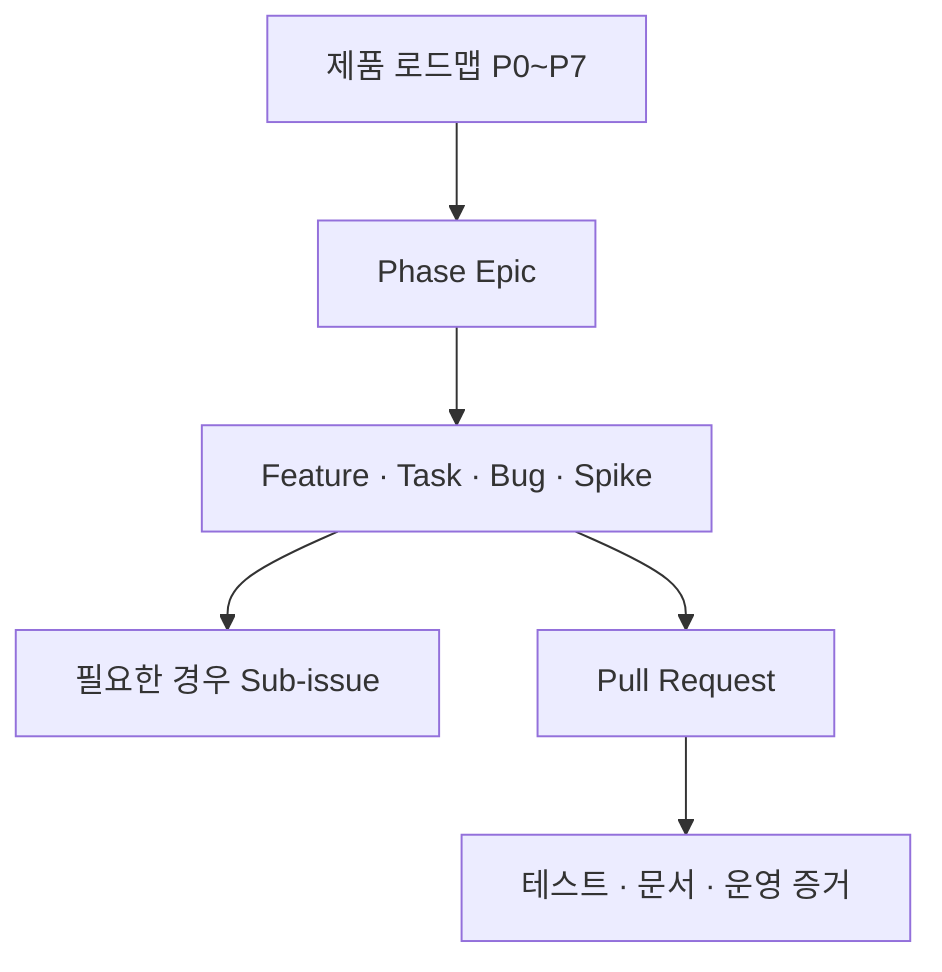

# GitHub Issue 기반 작업 관리

> 적용 저장소: `ablecloud-team/ablestack-techflow`
>
> 운영 Project: [ABLESTACK TechFlow](https://github.com/orgs/ablecloud-team/projects/23)

## 1. 운영 목적

TechFlow의 제품 계획, 조사, 개발, 운영과 문서 작업은 GitHub Issue를 단일 작업 원장으로 사용한다. 채팅이나 회의에서 결정한 작업도 실행 전에 Issue로 전환하며, Pull Request는 반드시 관련 Issue와 연결한다.

공개 저장소에는 비밀번호, 토큰, API 키, 개인정보, 고객 식별정보와 내부 로그 원문을 기록하지 않는다. 공개가 위험한 취약점은 저장소의 비공개 Security Advisory로 신고한다.

## 2. 작업 계층

- 로드맵 단계마다 하나의 `[EPIC]` Issue를 유지한다.
- 구현 가능한 결과는 Feature, 범위가 명확한 실행 항목은 Task로 작성한다.
- 불확실성을 해소하는 조사는 `kind:spike`, 결정을 남기는 작업은 `kind:decision`을 사용한다.
- Epic 진행률은 연결된 하위 Issue의 완료율로 판단한다.
- 한 Issue는 한 명이 한 Iteration 안에서 검증 가능한 크기를 권장한다. 크면 하위 Issue로 분리한다.

## 3. Project 필드

| 필드 | 값 | 사용 기준 |
|---|---|---|
| Status | Inbox, Planned, In Progress, Blocked, Review Requested, Review Complete, Done | 수집, 계획, 실행, 차단, 리뷰 요청, 리뷰 완료, 종료 |
| Priority | P0, P1, P2 | 즉시 해결, 다음 우선순위, 일반 백로그 |
| Size | XS, S, M, L, XL | 작업량 추정. XL은 Epic 또는 반드시 분할할 작업 |
| Phase | P0 Foundation ~ P7 General Platform | 제품 로드맵 단계 |
| Risk | R0 Read-only ~ R3 Resource Change | 권한과 실행 영향 기준 |
| Iteration | 2주 단위 | 착수하기로 합의한 작업만 배정 |

Status 값은 API 자동화와 검색 안정성을 위해 영문으로 유지한다. 일상 운영에서는 각각 `접수`, `계획`, `진행`, `차단`, `리뷰 요청`, `리뷰 완료`, `완료`로 해석한다.

위험 수준은 다음과 같이 적용한다.

- `R0 Read-only`: 문서, 설계, 읽기 전용 조회와 진단
- `R1 Internal Assist`: 사내 질문·답변과 내부 업무 자동화
- `R2 External or Limited Act`: 외부 게시, 고객 데이터 또는 제한된 운영 작업
- `R3 Resource Change`: 가상자원이나 서비스 상태를 변경하는 작업

R2는 보안 또는 운영 리뷰가 필요하며 R3는 승인, 사전조건, 멱등성, 감사, 사후 검증과 롤백 계획이 준비되기 전 구현 완료로 처리하지 않는다.

## 4. 라벨 체계

라벨은 필드와 중복되는 상태·우선순위 표현보다 검색과 전문 리뷰 요청에 사용한다.

| 그룹 | 라벨 |
|---|---|
| 영역 | `area:core`, `area:assist`, `area:ops`, `area:ai-rag`, `area:integration`, `area:activepieces`, `area:deploy`, `area:security`, `area:docs`, `area:product` |
| 작업 성격 | `kind:epic`, `kind:spike`, `kind:decision`, `kind:incident` |
| 필요한 조치 | `needs:triage`, `needs:design`, `needs:security-review`, `needs:ops-review`, `needs:docs` |

한 Issue에는 최소 하나의 `area:*` 라벨을 지정한다. `needs:*` 라벨은 요구한 검토나 문서 작업이 끝나면 제거한다.

## 5. 접수와 계획 흐름

1. Issue Form으로 등록하면 Project의 `Inbox`로 자동 수집된다.
2. Triage에서 중복 여부, 목표, 완료 기준, 보안 영향과 상위 Epic을 확인한다.
3. `Priority`, `Size`, `Phase`, `Risk`를 지정하고 실행하기로 합의하면 `Planned`로 변경한다.
4. 착수 시 담당자와 Iteration을 지정하고 `In Progress`로 변경한다.
5. 의존성이나 외부 결정으로 진행할 수 없으면 `Blocked`로 바꾸고 차단 원인 Issue를 연결한다.
6. PR을 연결하면 `In Progress`, 리뷰 승인을 받으면 `Review Complete`, 병합되거나 Issue가 닫히면 `Done`으로 자동 전환된다.

Project에는 Triage, Current Iteration, Roadmap, Assist, Ops, High Risk, Release, Recently Done 보기를 유지한다.

## 6. Definition of Ready

다음 조건을 충족해야 Iteration에 포함할 수 있다.

- 목표와 사용자 또는 운영 가치가 명확하다.
- 범위와 제외 범위가 합의됐다.
- 검증 가능한 완료 기준이 있다.
- 상위 Epic, 선행 작업과 외부 의존성이 연결됐다.
- Priority, Size, Phase와 Risk가 지정됐다.
- R2·R3 작업은 필요한 승인자와 통제 방법이 식별됐다.

## 7. Definition of Done

다음 조건을 모두 충족해야 Issue를 닫는다.

- 완료 기준을 충족하는 구현 또는 문서가 병합됐다.
- 변경 위험에 맞는 자동·수동·통합 테스트 증거가 있다.
- 오류, 재시도, 중복 실행과 복구 경로를 검토했다.
- 보안·개인정보·AI 품질 영향을 검토했다.
- 필요한 README, ADR, Runbook과 사용자 문서를 갱신했다.
- 후속 작업과 알려진 제한은 별도 Issue로 연결했다.

## 8. 브랜치와 Pull Request

- 브랜치는 `feature/<issue>-<slug>`, `fix/<issue>-<slug>`, `docs/<issue>-<slug>` 형식을 권장한다.
- upstream 기반 저장소에서는 최신 local 기본 브랜치를 `upstream`과 동기화한 뒤 작업 브랜치를 만든다.
- 작업 브랜치는 `origin`에만 push하고 `upstream` 기본 브랜치로 PR을 연다.
- PR 제목과 본문은 한글로 작성하며 `Closes #<issue>`로 작업 Issue를 연결한다.
- 한 PR이 여러 Issue를 닫을 때는 각 Issue의 완료 기준과 검증 증거가 분리되어야 한다.

## 9. 운영 주기

- Triage: 주 2회 또는 Inbox 10건 도달 시
- Iteration 계획: 2주마다 Priority와 수용량 확정
- 진행 점검: 주 1회 Blocked, High Risk, Review Requested 확인
- Phase 점검: Milestone 종료 시 Epic 완료 기준과 KPI 검토
- 회고: 완료·실패 플로우, AI 품질, 보안·운영 사건을 후속 Issue와 Runbook에 반영

Milestone은 릴리스 또는 검증 게이트로 사용한다. 현재 `M0 Foundation`과 `M1 Internal Assist PoC`를 운영하며, 후속 Milestone은 해당 Phase의 시작 조건이 충족될 때 생성한다.

## 10. 자동화 원칙

- 새 Issue와 PR, Epic의 하위 Issue는 Project에 자동 추가한다.
- 자동화는 상태 이동을 보조하지만 완료 판단을 대신하지 않는다.
- Activepieces로 GitHub 업무를 확장할 때도 중복 이벤트 방지, 최소 권한, 서명 검증과 감사 기록을 적용한다.
- 자동화 실패는 조용히 유실하지 않고 재처리 가능한 상태와 담당자 알림을 남긴다.
