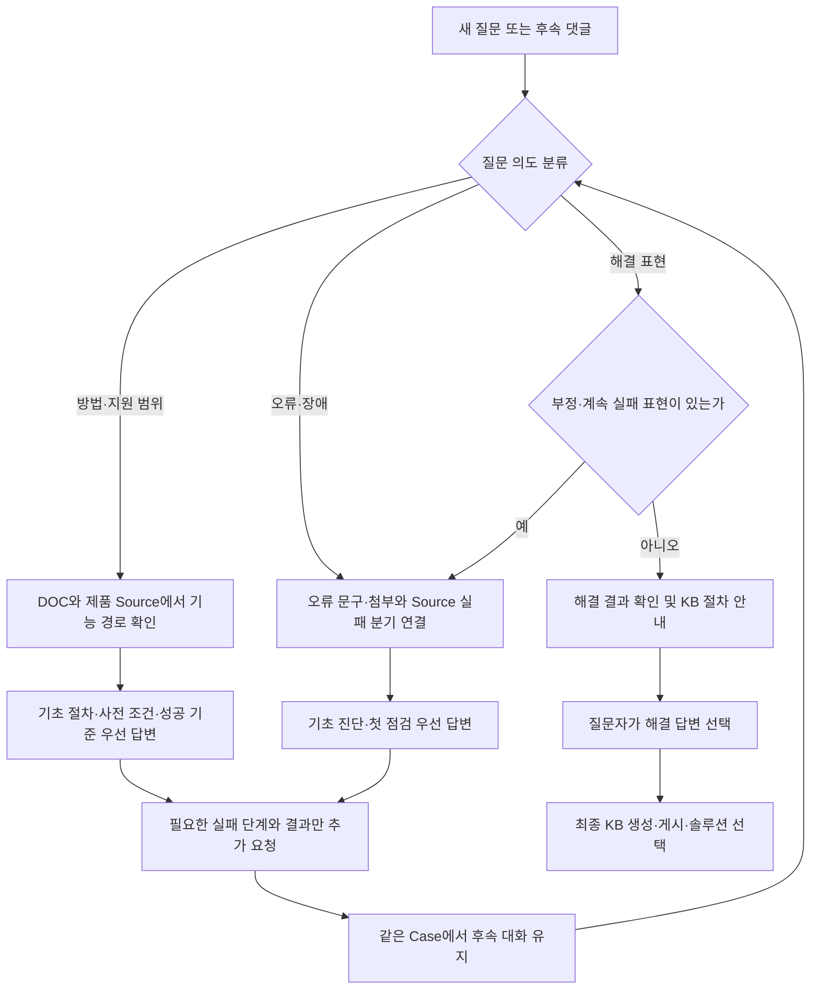

# Community 기능·방법 질문 답변 절차

## 목적

Community 질문을 무조건 장애 접수로 처리하지 않고, 사용자가 묻는 의도에 맞는 기초 답변을 먼저 제공한다. 질문자가 해결됐다고 명시할 때까지 맥락을 유지하며, 부정문이나 진행 중인 실패를 해결 확인으로 오인하지 않는다.

## 답변 방향

| 질문 유형 | 첫 답변 | 뒤에 요청할 정보 |
|---|---|---|
| 사용 방법·지원 범위 | 제품 기능, 지원 경로, 사전 조건, 실행 순서, 성공 기준 | 버전과 선택한 기능, 실제 실패 단계 |
| 오류·장애 | Source에서 확인한 실패 분기와 가장 안전한 점검 | 정확한 오류 전문, 특정 명령 결과, 한정된 로그 |
| 후속 실패 | 이전 답변을 반복하지 않고 다음 분기 진행 | 아직 받지 않은 자료만 요청 |
| 구체적인 구성 후속 질문 | 최신 질문의 대상과 작업만 설명하고 초기 절차는 반복하지 않음 | 해당 작업의 실행 결과와 실패 시 필요한 최소 자료 |
| 해결 확인 | 해결 결과를 정리하고 해결 답변 선택 안내 | 없음 |
| 관리자·지원 답변 | 대화 맥락에 기록하고 AI 자동 답변 억제 | 명시 호출 시에만 AI 답변 |

## 처리 흐름

## 후속 질문 우선순위

1. 최신 사용자 댓글에서 직접 묻는 대상·명령·포트·설정 항목을 먼저 찾는다.
2. 이전 대화는 대상 제품과 전제 조건을 보충하는 용도로만 사용한다.
3. 초기 기능 안내용 결정적 답변은 Assistant 답변이 아직 없는 첫 질문에만 적용한다.
4. 최신 질문에 검증된 전용 답변이 있으면 전체 대화 키워드로 선택되는 넓은 기본 답변보다 먼저 적용한다.
5. 포트·서비스·설정 질문에는 접속 위치, 관리자 권한, 정확한 파일 경로, 적용 명령, 정상 기준, 보안 제한과 원복 방법을 함께 제공한다.
6. 공개 답변 정리 단계에서도 `/etc`, `/var/log`, `/dev` 아래의 검증된 운영 경로는 사용자가 실행할 수 있도록 유지한다.

## Discussion #183 고정 기준

- `ABLESTACK Standalone → ABLESTACK HCI V2V`는 원본이 KVM/libvirt인지 먼저 구분한다.
- Standalone KVM이면 VMware vCenter 전용 `ablestack_v2k`가 아니라 Mold의 **원격 ABLESTACK 호스트에서 인스턴스 가져오기** 경로를 우선 안내한다.
- 원본 VM 전원 종료, 원격 libvirt TCP 16509, SSH 22, `qemu-img`, 임시 공간, 스토리지·네트워크·오퍼링 매핑을 설명한다.
- 실패한 경우에만 Diplo 버전, 마법사 이름, 실패 단계, 오류 전문, 연결 결과와 관련 로그를 요청한다.
- `정상적으로 동작하지 않습니다`는 해결이 아니라 현재 실패로 판정한다.
- 모델이 구조화 답변을 반환하지 못해도 이 검증된 기초 답변은 결정적 대체 경로로 제공한다.
- 다만 `16509 포트를 여는 방법`처럼 범위가 좁혀진 후속 질문에는 초기 V2V 절차를 다시 제시하지 않고 libvirt TCP 구성만 답한다.
- libvirt TCP 16509는 암호화되지 않은 연결이므로 인터넷이나 일반 서비스망에 열지 않는다. 이관 시간 동안 승인된 HCI 관리 IP만 허용하고 작업 후 socket을 닫는다.
- monolithic `libvirtd`와 modular `virtproxyd`를 구분하고 각각 `/etc/libvirt/libvirtd.conf`, `/etc/libvirt/virtproxyd.conf`와 대응 socket을 안내한다.

## 완료 기준

- 기초 답변이 버전·로그 요청보다 먼저 표시됨
- VMware용 v2k와 외부 KVM 가져오기 경로가 구분됨
- 부정문이 해결 확인으로 분류되지 않음
- 명령은 실행 대상·권한·정상 기준과 함께 복사 가능한 코드 블록으로 표시됨
- 후속 요청은 사용자가 아직 제공하지 않은 항목으로 제한됨
- 최신 후속 질문이 초기 질문보다 우선하며 초기 절차를 반복하지 않음
- 설정 파일 경로와 명령이 공개 답변에서 임의로 가려지지 않음
- 최종 해결 답변 선택 전까지 같은 Case와 첨부 맥락 유지
