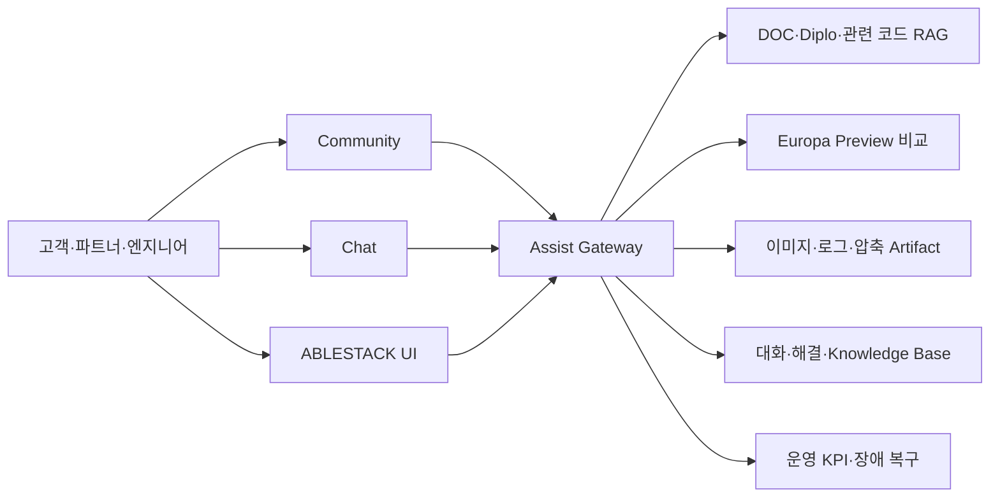

# Epic #5 ABLESTACK Assist MVP 제품화 계획

## 1. 목표

Epic #4의 사내 실증을 고객이 사용할 수 있는 ABLESTACK Assist MVP로 전환한다. 범위는 ABLESTACK 제품 지원에 한정하며, 자동 인프라 변경은 포함하지 않는다. 고객 질문을 Community·Chat·제품 UI에서 접수하고 문서·현재 코드·관련 코드·차기 Preview·첨부 자료를 종합해 해결까지 이어지는 지원 경험을 제품화한다.

## 2. 제품 경계

Assist는 진단·가이드·자료 요청·Knowledge Base 생성을 담당한다. 실제 자원 변경과 AIOps 실행은 Epic #6 이후 별도 승인 경계로 둔다.

## 3. 단계별 작업

### 3.1 멀티테넌시와 고객 경계

목표는 고객·프로젝트·지원 계약별 데이터 격리다. Tenant ID, 역할, Source 접근 범위, Conversation·Artifact 보존 정책을 API와 DB에 강제한다. 완료 기준은 교차 Tenant 검색·첨부·대화 노출 0건과 삭제 검증 100%다.

### 3.2 제품 인증과 채널 통합

ABLESTACK SSO/OIDC, Community 계정, 고객 Chat Connector와 제품 UI Assist 진입점을 통합한다. 사용자에게 동일 Case 번호와 해결 상태를 제공한다. 완료 기준은 세 채널에서 같은 권한·대화 상태·감사 정책이 재현되는 것이다.

### 3.3 지식 릴리스 운영

Diplo 현재판과 출시된 패치 버전을 고객 계약에 맞춰 고정하고 Europa는 Preview로 분리한다. Source Mirror·Parser·Embedding 갱신을 Release Train과 연결한다. 완료 기준은 답변마다 적용 버전이 확정되고, 미출시 기능의 출시 확정 표현이 0건인 것이다.

### 3.4 고객 지원 UX

쉬운 답변, 단계별 점검, 안전한 CLI, 추가 자료 요청, 해결 확인과 KB 검색을 제품 UI로 제공한다. 일반 사용자에게 내부 Source 상세는 숨기고 지원 권한자가 명시적으로 요청할 때만 근거를 제공한다.

### 3.5 운영 신뢰성

Gateway·Poller·Provider·Artifact·채널별 SLO와 Error Budget을 정의하고, HA·백업·복구·용량·비용 한도를 적용한다. 장애·복구 알림과 Dead Letter 운영을 고객 영향도 기준으로 확장한다.

### 3.6 Pilot과 Beta 판정

내부 지원팀, 지정 파트너, 제한 고객 순으로 Pilot을 수행한다. Golden Set과 실제 Case를 함께 평가하고 고객 데이터는 비식별 집계한다. 보안·품질·성능·운영·지원 문서 Gate가 모두 통과하면 Epic #8 Beta/GA로 넘긴다.

## 4. 권장 하위 Issue

1. Tenant·RBAC·보존·삭제 경계
2. ABLESTACK SSO와 채널 Identity Federation
3. Release별 Source/Index Lifecycle
4. 제품 UI Assist Case·Artifact·Conversation UX
5. 고객용 안전 CLI와 변경 위험도 가이드
6. HA·SLO·Error Budget·비용 관측
7. Security/Privacy Test와 위협 모델 갱신
8. Pilot Golden Set·고객 수용성 평가
9. 설치·업그레이드·롤백·지원 Runbook
10. Beta Readiness Review와 Go/No-Go

## 5. MVP 완료 기준

- Tenant 교차 노출과 내부 Source 상세 기본 노출 0건
- DOC·현재판·관련 코드·Preview 검토 판정률 100%
- 수용 가능 답변율 90% 이상, 올바른 보류율 95% 이상
- Chat·Community·제품 UI Case 상태 일치율 100%
- 핵심 API 가용성 99.9% 목표와 복구 훈련 통과
- 이미지·일반 로그·최대 정책 범위 압축파일 처리 검증
- 해결된 Case의 KB 전환과 재검색 성공률 95% 이상
- 설치·운영·장애·보안·고객 가이드 및 PDF/PPTX 자산 완료

## 6. 착수 Gate

Epic #4의 실제 Chat·Community E2E, 장애·복구·KPI, 보호 서비스 무변경 검증을 완료한 뒤 착수한다. 최초 작업은 Tenant·RBAC 경계와 제품 UX 계약을 함께 정의하는 Architecture Baseline이다.
