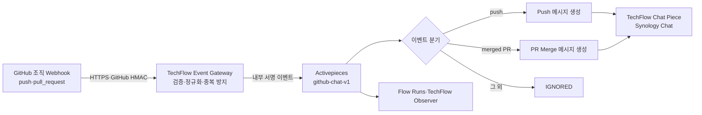

# Issue #19 GitHub 조직 Webhook·Synology Chat 자동화 설계

> 상태: **구현 전 설계 완료, 승인 대기**
>
> 기준일: 2026-07-31
>
> 관련 이슈: [#19 GitHub PR Merge Webhook 자동화](https://github.com/ablecloud-team/ablestack-techflow/issues/19)
>
> 구조화된 계약: [github-chat-webhook-contract.json](../decisions/github-chat-webhook-contract.json)

## 1. 결론

Issue #19의 최초 구현은 `ablecloud-team` 조직의 기존 Webhook 중 `chat.ablecloud.io`로 직접 전송하던 대상만 TechFlow로 전환한다. 정상 동작 중인 다른 조직 Webhook은 변경하지 않는다.

전환 후 하나의 Activepieces Flow가 다음 두 이벤트를 처리한다.

- GitHub `push`: 저장소, 브랜치, 행위자, 변경 수와 비교 URL을 Chat 메시지로 게시
- GitHub `pull_request`: `closed`이면서 `merged=true`인 이벤트만 PR Merge 메시지로 게시

GitHub의 HTTP 전송 성공과 메신저 게시 성공을 분리한다. 최종 업무 성공은 Activepieces 실행이 완료되고 Synology Chat 응답 본문의 `success`가 `true`일 때만 성립한다.

## 2. 승인된 범위

| 항목 | 결정 |
|---|---|
| 대상 조직 | `ablecloud-team` |
| 변경 대상 | `chat.ablecloud.io`로 직접 전송하는 기존 조직 Webhook |
| 비대상 | 정상 동작 중인 다른 조직 Webhook |
| 이벤트 | `push`, `pull_request` |
| PR 조건 | `action=closed`이고 `pull_request.merged=true` |
| 실행 엔진 | Activepieces |
| 메시지 대상 | 기존 Synology Chat Incoming Webhook이 지정한 채널 |
| 실패 확인 | Activepieces Flow Runs와 TechFlow Observer |
| 실패 담당자 | 미정, 외부 통보 채널은 보류 |
| 검증 | 테스트용 Branch·PR 생성과 Merge 허용 |
| 고객 공개 여부 | 구현 범위와 무관하며 제품 책임자가 별도 결정 |

PR Merge는 대상 브랜치에 `push`도 발생시키므로 한 번의 Merge에서 `PR Merge` 메시지와 `push` 메시지가 각각 한 건 발생하는 것을 정상으로 정의한다. 두 메시지는 서로 다른 GitHub Delivery ID와 이벤트 유형을 가져 중복으로 취급하지 않는다.

## 3. 현행 장애와 원인

2026-07-31에 두 조직 Webhook의 최근 Delivery를 각 30건씩 응답 본문까지 재검증했다.

| 대상 | HTTP 2xx | 업무 성공 | 업무 실패 |
|---|---:|---:|---:|
| 정상 조직 Webhook | 30 | 30 | 0 |
| `chat.ablecloud.io` 조직 Webhook | 30 | 0 | 30 |

실패 대상은 HTTP `200`을 반환하지만 응답 본문은 `success=false`, 오류 코드 `407`과 `payload`의 `url`·`text`가 비어 있다는 사유를 반환했다. GitHub `push` 원본 JSON을 Synology Chat 입력 계약으로 변환하지 않고 직접 전송한 것이 원인이다.

GitHub Delivery 화면의 성공은 HTTP 상태만 나타내므로 업무 성공의 권위 상태로 사용하지 않는다.

## 4. 목표 구조



책임은 다음과 같이 나눈다.

| 계층 | 책임 |
|---|---|
| GitHub | 조직 이벤트 발행과 `X-Hub-Signature-256` 생성 |
| Event Gateway | 원문 서명 검증, 이벤트 allowlist, 최소 필드 정규화, Delivery ID 중복 방지, Activepieces 접수 확인 |
| Activepieces | 이벤트 분기, 메시지 조립, Chat Piece 실행, 실행 이력과 실패 상태 |
| TechFlow Chat Piece | Webhook URL을 Connection Secret으로 사용, Synology 요청 인코딩, 응답 본문 성공 판정 |
| Synology Chat | 채널 게시 결과의 권위 응답 제공 |
| TechFlow Observer | 최근 Flow 실패 건수와 Gateway 거부 건수 집계 |

## 5. GitHub 수신 계약

### 5.1 Endpoint

```text
POST https://techflow.ablecloud.io/techflow/hooks/github/chat
Content-Type: application/json
```

운영 GitHub Webhook에는 Payload URL에 Secret이나 Token을 포함하지 않는다. SSL 검증은 활성화한다.

### 5.2 필수 헤더

| 헤더 | 규칙 |
|---|---|
| `X-GitHub-Delivery` | GitHub가 부여한 고유 ID, 최대 128자 |
| `X-GitHub-Event` | `ping`, `push`, `pull_request`만 허용 |
| `X-Hub-Signature-256` | `sha256=<64 hex>`, 원문 Body의 HMAC-SHA256 |
| `Content-Type` | `application/json` |

`X-GitHub-Delivery`를 7일 동안 중복 방지 키로 유지한다. GitHub 재전송은 원본과 같은 Delivery ID를 사용하므로 이미 처리된 이벤트는 부작용 없이 `200 duplicate`로 응답한다. 기존 TechFlow 전용 Webhook의 `409 duplicate` 계약은 변경하지 않는다.

### 5.3 Gateway 판정 순서

1. 경로, 메서드, Content-Type과 1 MiB Body 제한을 검사한다.
2. 필수 GitHub 헤더와 이벤트 allowlist를 검사한다.
3. 전용 GitHub Webhook Secret으로 원문 Body의 `X-Hub-Signature-256`을 상수 시간 비교한다.
4. `X-GitHub-Delivery`로 Redis 중복 상태를 확인한다. Redis 장애 시 Fail Closed한다.
5. 원문 JSON을 파싱하고 허용된 필드만 내부 이벤트로 정규화한다.
6. 정규화 Body를 TechFlow 내부 HMAC으로 서명해 Activepieces Catch Webhook으로 전달한다.
7. Activepieces가 접수한 경우 GitHub에 `202 accepted`를 반환한다.

GitHub는 Timestamp 헤더를 제공하지 않으므로 기존 `X-TechFlow-Timestamp` 외부 계약을 그대로 적용하지 않는다. HTTPS, GitHub HMAC, Delivery ID 중복 방지와 이벤트 allowlist를 함께 적용한다.

### 5.4 응답 계약

| 조건 | HTTP | 결과 |
|---|---:|---|
| `ping` 검증 성공 | 200 | `pong` |
| 신규 이벤트 접수 | 202 | `accepted` |
| 이미 접수한 Delivery ID | 200 | `duplicate` |
| 필수 헤더·JSON 오류 | 400 | `invalid_request` |
| 서명 누락·불일치 | 401 | `invalid_signature` |
| 허용하지 않은 이벤트 | 422 | `unsupported_event` |
| Body 제한 초과 | 413 | `too_large` |
| Redis 중복 저장소 장애 | 503 | `deduplication_unavailable` |
| Activepieces 접수 실패 | 502 | `upstream_failed` |

응답과 Gateway 로그에는 Token, 서명, 요청 Body, PR 제목과 사용자 식별정보를 기록하지 않는다.

## 6. 내부 정규화 이벤트 계약

Gateway는 GitHub 원문 전체를 Activepieces에 전달하지 않는다. 다음 최소 계약만 전달한다.

### 6.1 공통 Envelope

```json
{
  "contractVersion": "1.0",
  "eventId": "github-delivery-id",
  "eventType": "github.push",
  "receivedAt": "2026-07-31T00:00:00Z",
  "source": {
    "provider": "github",
    "organization": "ablecloud-team"
  },
  "repository": {
    "fullName": "ablecloud-team/example",
    "url": "https://github.com/ablecloud-team/example"
  },
  "actor": {
    "login": "github-user"
  },
  "data": {}
}
```

공통 필수 필드는 `contractVersion`, `eventId`, `eventType`, `receivedAt`, `source.organization`, `repository.fullName`, `repository.url`, `actor.login`이다. 이메일, GitHub Access Token, Commit 본문과 GitHub 원문 Payload는 전달하지 않는다.

### 6.2 Push 이벤트

```json
{
  "eventType": "github.push",
  "data": {
    "ref": "refs/heads/main",
    "before": "previous-sha",
    "after": "current-sha",
    "created": false,
    "deleted": false,
    "forced": false,
    "commitCount": 2,
    "url": "https://github.com/ablecloud-team/example/compare/..."
  }
}
```

`compare` URL이 없거나 Branch 삭제 이벤트이면 `repository.url`을 `data.url`의 fallback으로 사용한다.

### 6.3 PR Merge 이벤트

```json
{
  "eventType": "github.pull_request.merged",
  "data": {
    "number": 19,
    "title": "PR 제목",
    "url": "https://github.com/ablecloud-team/example/pull/19",
    "baseRef": "main",
    "headRef": "feature/example",
    "mergedAt": "2026-07-31T00:00:00Z",
    "mergedBy": "github-user"
  }
}
```

`pull_request` 이벤트 중 다음 조건을 모두 만족한 경우에만 이 계약을 생성한다.

```text
X-GitHub-Event == pull_request
body.action == closed
body.pull_request.merged == true
```

닫혔지만 병합되지 않은 PR은 `IGNORED`로 기록하고 Chat을 호출하지 않는다.

## 7. Activepieces Flow 상세 설계

### 7.1 Flow 식별자

| 항목 | 값 |
|---|---|
| 표시 이름 | `TechFlow - GitHub to Synology Chat v1` |
| 논리 ID | `github-chat-v1` |
| Trigger | Catch Webhook |
| 공개 상태 | Canary 검증 전 비활성, 검증 시 Publish |
| Connection | `TechFlow Synology Chat` |

초기에는 한 Flow 안에서 Push와 PR Merge를 Router로 분리한다. 향후 채널·재시도·소유자가 달라지면 두 Flow로 분리하되 내부 이벤트 계약은 유지한다.

### 7.2 Step

| 순서 | Step | 입력 | 동작 | 출력·판정 |
|---:|---|---|---|---|
| 1 | Catch Webhook | Gateway 내부 요청 | 정규화 이벤트 수신 | 접수 후 빠르게 2xx |
| 2 | Verify Internal Event | Body와 `X-TechFlow-*` | 내부 HMAC, Event ID, 계약 버전 검사 | 불일치 시 실패, Chat 미호출 |
| 3 | Validate Contract | 정규화 Body | 필수 필드, 조직, URL scheme 검사 | `ablecloud-team`, HTTPS만 허용 |
| 4 | Route Event | `eventType` | Push, PR Merge, Ignore 분기 | 미지원 이벤트는 Ignore |
| 5A | Format Push | Push 계약 | Push 텍스트와 URL 생성 | 빈 `url`·`text` 금지 |
| 5B | Format PR Merge | PR 계약 | PR Merge 텍스트와 URL 생성 | 빈 `url`·`text` 금지 |
| 6 | Post Chat Message | `url`, `text` | TechFlow Chat Piece 실행 | 응답 본문까지 판정 |
| 7 | Return Result | 실행 결과 | `SUCCEEDED`, `IGNORED`, `FAILED`, `UNKNOWN` 분류 | Flow Run에서 확인 |

### 7.3 메시지 계약

Push 메시지:

```text
[GitHub Push] {repository.fullName} · {shortRef}
{actor.login} · {commitCount} commit(s){forcedMarker}
<{data.url}|변경 내용 보기>
```

PR Merge 메시지:

```text
[GitHub PR Merge] {repository.fullName} #{data.number}
{data.title}
{data.mergedBy} · {data.headRef} → {data.baseRef}
<{data.url}|PR 보기>
```

메시지 생성기는 다음 제한을 적용한다.

- `url`은 `https://github.com/ablecloud-team/`로 시작하는 URL만 허용한다.
- `text`는 제어 문자를 제거하고 최대 4,000자로 제한한다.
- 사용자 입력인 PR 제목과 Branch 이름은 URL·Query 또는 Markdown 제어문으로 실행하지 않고 일반 문자열로 이스케이프한다.
- `url`과 `text`가 모두 비어 있는 요청은 Flow 내부에서 차단한다.

### 7.4 Synology Chat 전송 계약

Synology 공식 Incoming Webhook 계약에 따라 다음 형식을 기본으로 사용한다.

```text
POST <Connection에 저장된 Webhook URL>
Content-Type: application/x-www-form-urlencoded

payload={"text":"<rendered message>"}
```

`url`은 별도 Secret Query에 추가하지 않고 `text`의 링크로 렌더링한다. Webhook URL 전체는 Token을 포함하므로 Flow 정의의 일반 URL 필드가 아니라 `TechFlow Synology Chat` Connection의 `SecretText`로만 저장한다.

성공 조건:

```text
HTTP status is 2xx
AND response Content-Type is JSON-compatible
AND response body.success == true
```

HTTP `200`이어도 `success=false`, 응답 파싱 실패 또는 성공 필드 누락이면 실패다. 오류 응답 원문은 저장하지 않고 HTTP 상태, 허용된 오류 코드와 Flow Run ID만 남긴다.

참고: [Synology Chat Integration 공식 문서](https://kb.synology.com/en-global/DSM/help/Chat/chat_integration?version=7)

## 8. Secret과 인증 설계

| Secret | 저장 위치 | 규칙 |
|---|---|---|
| GitHub 조직 Webhook Secret | 서버 보호 Secret 저장소 | 구현 시 새 고엔트로피 값 생성, GitHub와 Gateway에만 주입 |
| TechFlow 내부 전달 Secret | 서버 보호 Secret 저장소와 Activepieces Connection | Gateway→Flow 서명 검증 전용 |
| Synology Chat Webhook URL | Activepieces `SecretText` Connection | URL 전체를 Secret으로 취급, Flow JSON·로그·문서에서 제외 |
| Activepieces 운영자 인증 | 런타임 로그인에만 사용 | 문서·명령·Issue·로그에 저장하지 않음 |

현재 `gh` 인증은 조직 Webhook 조회·생성·수정에 필요한 `admin:org_hook` 권한이 확인되어 별도 GitHub Access Token이 필요하지 않다. 다만 GitHub Webhook Secret은 GitHub 로그인 자격증명이 아니라 발신 Payload의 HMAC을 검증하는 별도 공유 Secret이므로 구현 시 반드시 새로 생성한다.

사용자가 제공한 인증정보와 URL 원문은 이 문서, 구조화 계약, GitHub Issue, PR과 로그에 기록하지 않는다.

## 9. 성공·실패·재시도 계약

### 9.1 상태

| 상태 | 의미 |
|---|---|
| `ACCEPTED` | Gateway가 GitHub 이벤트를 검증하고 Activepieces가 접수함 |
| `IGNORED` | 유효하지만 대상이 아닌 이벤트, 예: Merge되지 않은 PR Close |
| `SUCCEEDED` | Synology Chat이 `success=true`를 반환함 |
| `FAILED` | 입력·계약·인증·명시적 애플리케이션 오류로 미게시 확정 |
| `UNKNOWN` | Timeout·연결 종료처럼 게시 여부를 확정할 수 없음 |

GitHub의 2xx는 `ACCEPTED`까지만 의미하며 `SUCCEEDED`를 의미하지 않는다.

### 9.2 재시도

| 실패 | 분류 | 정책 |
|---|---|---|
| 계약 누락, 빈 메시지, 오류 코드 `407` | `NO_RETRY` | 즉시 `FAILED`, Flow 수정 후 수동 재실행 |
| 인증 실패, 4xx | `NO_RETRY` | Secret·권한 확인 후 수동 재실행 |
| 명시적 429와 `Retry-After` | `SAFE_RETRY` | 같은 Flow Run에서 최대 2회 제한 재시도 |
| Timeout, 연결 종료 | `VERIFY_BEFORE_RETRY` | `UNKNOWN`, Blind Retry 금지 |
| 5xx | `VERIFY_BEFORE_RETRY` | 게시 여부 확인 후 수동 재실행 |
| Gateway→Activepieces 접수 실패 | `SAFE_RETRY` | 예약 해제 후 GitHub Redelivery 가능 |

Synology Chat은 이벤트 멱등성 키를 받지 않으므로 결과를 확인할 수 없는 Timeout과 5xx를 자동 재시도하면 메시지가 중복될 수 있다. 이 경우 Activepieces Run에서 `UNKNOWN`으로 확인하고 운영자가 재실행 여부를 결정한다.

## 10. 관측과 진단

담당자와 외부 실패 알림 채널이 정해질 때까지 기존 관측 자산을 사용한다.

| 확인 위치 | 확인 내용 |
|---|---|
| Activepieces Flow Runs | 실행 상태, 실패 Step, 허용된 오류 코드, 재실행 |
| TechFlow Observer `status.json` | 최근 Flow 상태별 건수 |
| `current-alerts.json` | 15분 Flow 실패 Warning·Critical |
| `alerts.jsonl`·systemd journal | 경보 발생·해제 전이 |
| Event Gateway 구조화 로그 | `accepted`, `duplicate`, `rejected`, `upstream_failed` 집계 |

Observer에는 Flow 입력·출력, GitHub 원문, PR 제목, Webhook URL, Token과 서명을 복제하지 않는다. 실패 담당자와 외부 채널이 정해지면 ADR-0004의 경보 전이를 소비하는 별도 알림을 추가한다.

## 11. 테스트 계획

### 11.1 자동 계약 테스트

| ID | 시나리오 | 기대 결과 |
|---|---|---|
| C01 | 유효한 GitHub HMAC `ping` | 200, Chat 미호출 |
| C02 | 서명 누락·위조 | 401, Activepieces 미호출 |
| C03 | 동일 Delivery ID 재전송 | 두 번째 200 duplicate, Chat 1회 |
| C04 | Redis 장애 | 503 Fail Closed |
| C05 | 허용하지 않은 이벤트 | 422, Chat 미호출 |
| C06 | 유효한 Push | 정규화 계약 생성 |
| C07 | Branch 삭제 Push | 저장소 URL fallback |
| C08 | PR `closed`, `merged=false` | `IGNORED`, Chat 미호출 |
| C09 | PR `closed`, `merged=true` | PR Merge 계약 생성 |
| C10 | 빈 `url`·`text` | Flow 실패, Chat 미호출 |
| C11 | HTTP 200·`success=false` | Flow `FAILED` |
| C12 | HTTP 2xx·`success=true` | Flow `SUCCEEDED` |
| C13 | Timeout | `UNKNOWN`, 자동 중복 전송 없음 |
| C14 | Secret·Payload 로그 검사 | 노출 0건 |

### 11.2 Canary 통합 테스트

조직 Webhook을 바로 변경하지 않고 `ablestack-techflow` 저장소에 임시 Repository Webhook을 추가해 같은 Gateway·Flow를 검증한다.

1. Gateway GitHub 수신 기능과 Activepieces Flow를 배포하되 조직 Webhook은 변경하지 않는다.
2. `ablestack-techflow`에 `push`, `pull_request`만 구독하는 임시 Webhook을 등록한다.
3. GitHub `ping`의 서명 검증과 접수를 확인한다.
4. 테스트 Branch에 한 Commit을 Push하고 Chat 메시지 한 건과 `SUCCEEDED` Run을 확인한다.
5. 테스트 PR을 생성하고 Merge한다.
6. PR Merge 메시지 한 건과 Merge Commit Push 메시지 한 건을 각각 확인한다.
7. 같은 Delivery를 Redelivery하고 추가 Chat 메시지가 없는지 확인한다.
8. 서명 오류, Merge되지 않은 PR Close와 Chat `success=false` 모의 실패를 확인한다.
9. Activepieces UI와 Observer에서 실패 원인을 Payload·Secret 없이 확인할 수 있는지 검증한다.

테스트 메시지는 제목에 `[TechFlow Test]`를 포함해 운영 메시지와 구분한다.

### 11.3 조직 전환 검증

Canary 통과 후에만 다음을 수행한다.

1. 대상 조직 Webhook의 기존 설정을 Secret 포함 보호 파일로 백업하고 권한을 `0600`으로 제한한다.
2. 변경 대상 Hook만 TechFlow GitHub Endpoint로 전환한다.
3. 이벤트를 `push`, `pull_request`로 설정하고 SSL 검증과 전용 Secret을 활성화한다.
4. GitHub `ping`, 실제 Push와 실제 PR Merge를 확인한다.
5. 최근 Delivery의 HTTP 상태, Gateway 접수, Activepieces Run과 Chat 게시를 하나의 Event ID로 대조한다.
6. 임시 Repository Webhook을 제거한다.
7. 정상 동작 중인 다른 조직 Webhook의 URL, 이벤트와 최근 Delivery가 변경되지 않았는지 확인한다.

### 11.4 완료 기준

- Push와 PR Merge가 계약에 맞는 메시지로 게시된다.
- Merge되지 않은 PR Close는 게시되지 않는다.
- 동일 Delivery Redelivery가 중복 메시지를 만들지 않는다.
- HTTP 200·`success=false`가 성공으로 판정되지 않는다.
- 실패는 Activepieces와 TechFlow Observer에서 확인 가능하다.
- 정상 조직 Webhook은 변경되지 않는다.
- 저장소, Issue, PR, Flow Export와 로그의 Secret 노출이 0건이다.
- 테스트 후 서비스 Health와 기존 백업·관측성이 정상이다.

## 12. 배포 계획

```text
Phase 1  코드·Flow 구현 및 단위 테스트
Phase 2  서버 사전 백업·Secret 생성·Gateway 배포
Phase 3  Repository Webhook Canary
Phase 4  대상 조직 Webhook만 전환
Phase 5  E2E·중복·실패·관측 검증
Phase 6  임시 Hook 제거·증적과 Runbook 확정
```

각 Phase의 진행 조건은 직전 Phase의 검증 통과다. Flow Export에는 Connection 값이 없어야 하며 서버 변경 전 상태 백업과 Runtime Lock을 생성한다.

## 13. 롤백 계획

### 13.1 롤백 조건

- 잘못된 채널 또는 잘못된 내용이 게시됨
- 하나의 Delivery ID로 메시지가 두 번 이상 게시됨
- Push 또는 PR Merge의 정상 처리율이 합의된 테스트에서 100%가 아님
- 서명 우회, Secret 노출 또는 허용하지 않은 이벤트 실행이 확인됨
- Gateway·Activepieces·Observer Health가 회복되지 않음

### 13.2 롤백 순서

1. 변경한 조직 Webhook을 비활성화해 추가 게시를 즉시 중단한다.
2. Activepieces `github-chat-v1` Flow를 비활성화한다.
3. 보호된 사전 설정을 사용해 대상 Hook의 이전 URL과 `push` 이벤트 설정을 복원하거나, 기존 직접 전송이 실패 상태였으므로 원인 분석 동안 비활성 상태를 유지한다.
4. Gateway를 직전 Runtime Lock으로 롤백한다.
5. 새 GitHub 전용 수신 경로가 404이고 기존 TechFlow Webhook·App Health가 정상인지 확인한다.
6. PostgreSQL·Redis Volume과 Flow 실행 이력은 삭제하지 않는다.
7. 롤백 원인과 Event ID, Flow Run ID만 기록하고 Payload·Secret은 기록하지 않는다.
8. 전환을 폐기하면 신규 GitHub Webhook Secret과 Chat Connection을 폐기한다.

정상 동작 중인 다른 조직 Webhook은 롤백 대상에 포함하지 않는다.

## 14. 실행 전 승인 체크포인트

이 문서로 다음 사항은 확정한다.

- 대상: `chat.ablecloud.io` 기존 조직 Webhook만 전환
- 이벤트: Push와 PR Merge 모두 처리
- Merge 시 두 종류 메시지 발생을 정상으로 취급
- 메시지: 정규화 `url`을 Synology `text` 링크에 포함
- 성공: HTTP 2xx와 `success=true` 모두 필요
- 실패 확인: Activepieces와 TechFlow Observer
- 테스트: `ablestack-techflow` Repository Hook Canary와 테스트 PR Merge
- Secret: 런타임 저장·Connection 참조만 사용

실제 Webhook, Flow와 서버 설정 변경은 이 설계 승인 이후 별도 구현 단계에서 수행한다.

## 15. 참고자료

- [GitHub 조직 Webhook REST API](https://docs.github.com/en/rest/orgs/webhooks)
- [GitHub Webhook Delivery 서명 검증](https://docs.github.com/en/webhooks/using-webhooks/validating-webhook-deliveries)
- [GitHub Webhook 운영 권장사항](https://docs.github.com/en/webhooks/using-webhooks/best-practices-for-using-webhooks)
- [GitHub Webhook 이벤트와 Payload](https://docs.github.com/en/webhooks/webhook-events-and-payloads)
- [Activepieces Webhook](https://www.activepieces.com/pieces/webhook)
- [Activepieces Piece 인증](https://www.activepieces.com/docs/build-pieces/building-pieces/piece-authentication)
- [Synology Chat Integration](https://kb.synology.com/en-global/DSM/help/Chat/chat_integration?version=7)
- [ADR-0001: TechFlow와 Activepieces 책임 경계](../adr/0001-techflow-activepieces-responsibility-boundary.md)
- [ADR-0002: TechFlow 비밀정보 수명주기](../adr/0002-techflow-secret-lifecycle.md)
- [ADR-0004: TechFlow 관측성과 최소 경보](../adr/0004-techflow-observability.md)
