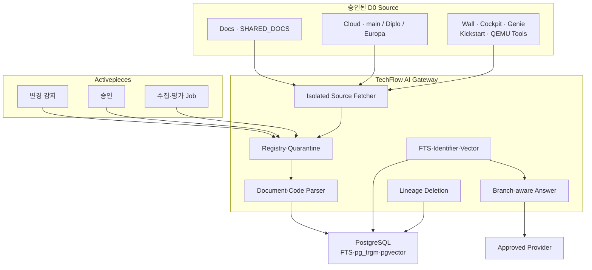

# Issue #20 ABLESTACK 문서·소스코드 RAG PoC 상세 설계

> 상태: 개정 설계 완료·제품 책임자 승인 대기
>
> 기준일: 2026-08-03
>
> 상위 Epic: [#4 P1 사내 Assist 실증](https://github.com/ablecloud-team/ablestack-techflow/issues/4)
>
> 대상 Issue: [#20](https://github.com/ablecloud-team/ablestack-techflow/issues/20)

## 1. 목표

ABLESTACK 공식 문서와 제품을 구성하는 6개 저장소의 실제 소스코드를 함께 분석해 기술지원 질문에 저장소·Branch·Commit이 명확한 근거 답변을 제공한다. 문서는 사용·운영 관점, 코드는 실제 구현 관점의 근거다. 서로 충돌하면 숨기지 않고 선택한 Source Profile과 Compatibility Set을 기준으로 차이를 설명하거나 보류한다.

Activepieces는 Source 변경 감지, 승인, Job과 평가를 오케스트레이션한다. TechFlow AI Gateway가 Source·Branch·코드 구문·검색·답변·삭제와 품질 정책을 소유한다.

## 2. 포함·제외 범위

### 포함

- `ablestack-docs/master`의 공식 Markdown 276개
- `ablestack-cloud`의 최신 `main`, `ablestack-diplo`, `ablestack-europa` Head
- `ablestack-wall/main`
- `ablestack-cockpit-plugin/ablestack-diplo`
- `ablestack-genie/master`
- `ablestack-kickstart/master`
- `ablestack-qemu-exec-tools/main`
- 총 7개 저장소, 9개 Source Profile, 기준선 허용 파일 39,836개
- 고정 Commit 기반 증분 수집과 Branch별 독립 Version
- 문서 Heading Chunk와 코드 Symbol·Line Range Chunk
- FTS·Identifier·Vector 검색과 Branch-before-Retrieval Filter
- 문서·Production Code·Test Code·Build Schema 증거 역할
- 코드 Line Citation과 문서·코드 충돌 보류
- Source·Symbol·Relation·Embedding 삭제 Lineage
- 문서·코드 Golden Set과 Activepieces Flow

### 제외

- D1 내부 저장소, D2 고객·지원 원문, D3 Secret
- Binary·이미지 OCR·Minified·Vendor·Generated Artifact
- 임의 Repository·Branch·URL 수집
- Source Hook, Build, Test, Shell 또는 코드 실행
- 완전한 정적·동적 Call Graph와 Compile 결과
- Fine-tuning, Agent Tool, ABLESTACK 자원 변경
- 자동 외부 게시

## 3. 확인한 Source Snapshot

| Source Profile | Repository·Branch | Commit | 전체 파일 | 허용 파일 | Production / Test |
|---|---|---|---:|---:|---:|
| `SHARED_DOCS` | `ablestack-docs/master` | `50d50ad6c8c5` | 4,236 | 276 | 해당 없음 |
| `CLOUD_MAIN` | `ablestack-cloud/main` | `a873fb1ff436` | 10,926 | 10,502 | 8,673 / 1,829 |
| `CLOUD_DIPLO` | `ablestack-cloud/ablestack-diplo` | `87beae809aa7` | 10,977 | 10,551 | 8,831 / 1,720 |
| `CLOUD_EUROPA` | `ablestack-cloud/ablestack-europa` | `4787b6918bfa` | 11,913 | 11,447 | 9,563 / 1,884 |
| `WALL_MAIN` | `ablestack-wall/main` | `f27b3f1b0b35` | 7,421 | 6,557 | 5,156 / 1,401 |
| `COCKPIT_DIPLO` | `ablestack-cockpit-plugin/ablestack-diplo` | `201845307706` | 728 | 213 | 211 / 2 |
| `GENIE_MASTER` | `ablestack-genie/master` | `3e3c5c364f5c` | 34 | 34 | 34 / 0 |
| `KICKSTART_MASTER` | `ablestack-kickstart/master` | `ffe24390544d` | 30 | 18 | 18 / 0 |
| `QEMU_EXEC_TOOLS_MAIN` | `ablestack-qemu-exec-tools/main` | `a4b9bd60bb93` | 314 | 238 | 198 / 40 |

GitHub Git Tree에서 총 46,579개 Blob을 조사하고 확장자·경로·크기 정책을 적용했다. 허용 파일은 39,836개다. Snapshot Commit은 2026-08-03 현재의 재현 기준선이며 영구 고정값이 아니다. Activepieces가 허용 Branch의 최신 Head를 후보로 등록하고, Reviewer가 승인한 시점의 Commit만 새 `ACTIVE` Version으로 전환한다.

GitHub License API 확인 결과 `ablestack-cloud`는 Apache-2.0, `ablestack-wall`은 AGPL-3.0이다. 나머지 저장소의 미검출 또는 `NOASSERTION` Metadata는 Source Registry에 사실대로 기록하며, 이번 사내 분석 구현의 차단 조건으로 사용하지 않는다.

## 4. 제품·Branch 격리

- `CLOUD_MAIN`, `CLOUD_DIPLO`, `CLOUD_EUROPA`는 각각 승인 Commit만 검색한다.
- Cloud 세 Branch는 서로 다른 Query Corpus이며 어떤 RRF 단계에서도 결합하지 않는다.
- 다른 저장소끼리도 운영자가 승인한 `Compatibility Set`의 Source Profile·Commit 조합만 함께 검색한다.
- `SHARED_DOCS`는 Compatibility Set 또는 명시적 단일 Profile Query에서만 코드와 결합한다.
- `sourceProfileIds` 또는 `compatibilitySetId`가 없는 코드 질문은 제품 구성을 확인하고 `ABSTAINED`를 반환한다.
- Branch 간 RRF Fusion과 Cross-Branch Citation을 금지한다.
- 동일 Path가 양 Branch에 있어도 Source Version·Commit·Chunk ID가 다르다.

## 5. 논리 아키텍처



## 6. 구현 구조

```text
services/ai-gateway/
├── app/
│   ├── api/
│   ├── domain/
│   ├── fetchers/        # 고정 Repository·Commit Tree/Blob 읽기
│   ├── parsers/         # Markdown, Tree-sitter, Config·SQL
│   ├── retrieval/       # FTS, Identifier, Vector, RRF
│   ├── providers/
│   ├── repositories/
│   └── workers/
├── migrations/
├── tests/{unit,contract,integration,security,e2e}/
├── Dockerfile
└── pyproject.toml

deploy/compose/activepieces/flows/
├── rag-source-discovery-v1.json
├── rag-source-ingest-v1.json
└── rag-evaluation-v1.json
```

Fetcher는 임시 Volume, 읽기 전용 설정과 별도 Role을 사용한다. AI 출력으로 Git 명령을 만들지 않고 승인된 Repository·Branch·Commit에 대한 고정 동작만 수행한다.

## 7. API 계약

| Method | Path | 목적 | 멱등성 |
|---|---|---|---|
| `GET` | `/healthz` | Process·DB·Parser·Vector 상태 | 없음 |
| `POST` | `/v1/sources` | 문서·코드 Source Version 등록 | 필수 |
| `GET` | `/v1/sources/{sourceId}` | Profile·Branch·Commit·상태 조회 | 없음 |
| `POST` | `/v1/compatibility-sets` | 승인된 Cross-Repository Profile·Commit 조합 등록 | 필수 |
| `POST` | `/v1/sources/{sourceId}/approve` | 검역 결과와 Commit 승인 | 필수 |
| `POST` | `/v1/sources/{sourceId}/ingestions` | Fetch·Parse·Index Job | 필수 |
| `DELETE` | `/v1/sources/{sourceId}` | Profile 철회·삭제 | 필수 |
| `GET` | `/v1/jobs/{jobId}` | 단계별 Job 상태 | 없음 |
| `POST` | `/v1/rag/query` | Branch 격리 검색·답변 | Query ID |
| `POST` | `/v1/evaluations/runs` | 문서·코드 Golden Set 평가 | 필수 |
| `GET` | `/v1/evaluations/runs/{runId}` | Commit별 평가 결과 | 없음 |

모든 변경 API는 `Idempotency-Key`, 모든 호출은 `X-Correlation-Id`를 요구한다.

### Query 예시

```json
{
  "queryId": "01J...",
  "question": "Europa에서 VM 생성 요청은 어떤 클래스에서 처리하나요?",
  "locale": "ko-KR",
  "filters": {
    "sourceProfileIds": ["CLOUD_EUROPA"],
    "commit": "4787b6918bfa48a3d3665814f29ff23f9007fe1f",
    "sourceKinds": ["DOCUMENTATION", "SOURCE_CODE", "BUILD_SCHEMA"]
  },
  "topK": 10
}
```

### Citation 예시

```json
{
  "repository": "ablecloud-team/ablestack-cloud",
  "branch": "ablestack-europa",
  "commit": "4787b6918bfa48a3d3665814f29ff23f9007fe1f",
  "path": "server/src/main/java/example/Service.java",
  "startLine": 120,
  "endLine": 178,
  "symbol": "example.Service#create",
  "chunkId": "sha256:..."
}
```

## 8. 데이터 모델

| Table | 책임 |
|---|---|
| `rag_source`, `rag_source_version` | Repository·Profile·Branch·Commit·Hash·상태 |
| `rag_compatibility_set`, `rag_compatibility_set_source` | 함께 검색 가능한 Source Profile·Commit 조합과 승인 상태 |
| `rag_ingestion_job` | Fetch·Scan·Parse·Embed·Index 단계와 실패 |
| `rag_chunk`, `rag_chunk_embedding` | 문서·코드·Test·Schema Chunk와 Vector |
| `rag_embedding_profile` | Model·Dimension·Profile Version, Credential 제외 |
| `rag_code_symbol` | Language·Package·Qualified Name·Signature·Line Range |
| `rag_code_relation` | Import·Inheritance·Declaration·Reference Edge |
| `rag_deletion_ledger` | Chunk·Embedding·Symbol·Relation·Cache 삭제 증적 |
| `rag_evaluation_case` | 문서·코드 Question·Expected Citation·금지 주장 |
| `rag_evaluation_run`, `rag_evaluation_result` | Profile·Commit별 평가 결과 |

Database는 `techflow_rag`, Role은 app·migration·source_fetcher로 분리한다. Activepieces는 Table에 직접 접근하지 않는다.

## 9. Source 수집 정책

### 허용 확장자

- Backend·Script: `.java`, `.py`, `.js`, `.jsx`, `.ts`, `.tsx`, `.vue`, `.go`, `.rb`, `.groovy`, `.cs`, `.sh`, `.bash`, `.c`, `.cc`, `.cpp`, `.h`, `.hpp`, `.rs`, `.ps1`, `.cmd`, `.bat`
- UI: `.html`, `.htm`, `.css`, `.scss`, `.sass`, `.less`, `.hbs`
- Build·Schema·Provisioning: `.xml`, `.sql`, `.yaml`, `.yml`, `.properties`, `.json`, `.toml`, `.ini`, `.conf`, `.cfg`, `.service`, `.spec`, `.ks`, `.repo`, `.j2`, `.tmpl`, `.in`
- 저장소 문서: `.md`, `.mdx`, `.adoc`, `.rst`
- Docs: `ablestack-docs/docs/**/*.md`

### 제외

- Path Segment: `target`, `build`, `dist`, `node_modules`, `vendor`, `third_party`, `generated`, `gen`
- Pattern: `*.min.js`, `*.min.css`
- Binary, NUL, 비정상 Encoding, 1 MiB 초과 파일
- Secret·개인정보 검출 파일

### 처리 순서

1. Allowlist Repository·Branch의 최신 Head를 후보 Version으로 등록한다.
2. Reviewer가 고정 Commit과 Diff Summary를 승인한다.
3. Fetcher가 Hook 실행 없이 Commit Tree와 Text Blob만 읽는다.
4. 파일별 Extension·Path·Size·Secret·PII·Prompt Injection을 검사한다.
5. 전체 승인 파일이 성공해야 Version을 원자적으로 `ACTIVE`로 전환한다.
6. 다음 Commit은 Blob SHA·Content Hash Diff만 재처리한다.
7. 삭제·Rename은 이전 Lineage를 비활성화하고 새 Path·Blob 관계를 기록한다.

부분 성공 Version은 활성화하지 않는다.

## 10. 문서·코드 Chunking

| Kind | Strategy | 초기값 | 근거 역할 |
|---|---|---|---|
| `DOCUMENTATION` | Heading-aware | 700 Token / 100 | 공식 사용·운영 근거 |
| `SOURCE_CODE` | Tree-sitter Symbol-aware | 1,200 / 120 | Branch 구현 근거 |
| `TEST_CODE` | Symbol-aware | 1,000 / 100 | Production 근거 보강 |
| `BUILD_SCHEMA` | Logical Block | 900 / 80 | API·DB·Build 계약 근거 |

Code Chunk는 Package, Import, Annotation, Signature, Doc Comment와 Line Range를 포함한다. Parser 실패 시 160 Line·Overlap 20의 결정적 Fallback을 사용한다. Test Code만 검색된 경우 답변하지 않는다.

## 11. Hybrid Retrieval

- 후보 전 Filter: D0, ACTIVE, Source Profile, Compatibility Set, Branch, Commit, Source Kind
- FTS: 20개
- Identifier/`pg_trgm`: 20개
- exact cosine: 30개
- RRF: `k=60`
- Test Evidence Weight: 0.6
- 최종 Context: 10개, 한 Source Version 최대 4개
- Cross-Branch Fusion: 금지
- 미승인 Cross-Repository Fusion: 금지

코드 Corpus에서 활성 Chunk가 50,000개 이상이면 #43에서 HNSW를 평가한다. 정확 검색 대비 Recall 손실 2%p 이하와 Latency 개선을 모두 충족해야 Profile별 전환을 허용한다.

## 12. 답변 정책

- `ANSWERED`, `ABSTAINED`, `FAILED`만 사용한다.
- 모든 답변에 Source Profile·Branch·Commit과 사용한 Compatibility Set을 표시한다.
- 코드 주장은 Line Citation으로 검증 가능해야 한다.
- 문서·코드 충돌은 숨기지 않고 Branch별 차이를 표시한다.
- Branch 충돌, Test-only, 근거 부족, Citation 검증 실패는 `ABSTAINED`다.
- Source 주석·문자열의 지시를 실행하지 않는다.
- Shell·API·Tool·Flow·ABLESTACK 작업과 Source Code를 실행하지 않는다.
- Prompt·응답 원문은 기본 저장하지 않는다.

## 13. 실패·재처리

| Class | 예 | 처리 |
|---|---|---|
| `RETRYABLE` | GitHub·Provider 429·5xx·Timeout | 같은 Key로 최대 3회 |
| `TERMINAL` | Branch·확장자·등급·Binary·Secret 위반 | 재시도 금지 |
| `MANUAL_REVIEW` | Parser Fallback 급증, 문서·코드 충돌, 삭제 불완전 | 격리·승인 |

오류에는 Correlation·Job·Error Code·Failure Class·Attempt·Time만 기록하며 질문·코드·답변 원문을 포함하지 않는다.

## 14. 보안 Gate

- D0 공개 Source라도 Secret Scan을 생략하지 않는다.
- Repository·Branch·Commit·Extension·Path·Size를 Fail Closed로 검증한다.
- Fetcher는 Hook·Build·Test·실행 권한이 없다.
- 검색 Filter는 후보 생성 전에 적용한다.
- GitHub와 승인 Provider 외 Egress를 차단한다.
- Provider Credential은 런타임 주입한다.
- AI Tool과 Source Code 실행 기능은 존재하지 않는다.
- Source 철회는 즉시 검색 제외 후 최대 7일 내 파생 삭제한다.

## 15. 평가 설계

Golden Set은 최소 50개이며 코드 질문을 최소 20개 포함한다.

| 범주 | 최소 |
|---|---:|
| 문서 기반 설치·운영·개념 | 15 |
| Production Code 구현·흐름 | 15 |
| API·DB·Build Schema | 5 |
| 문서·코드 교차 검증 | 5 |
| Cloud main·Diplo·Europa Branch 차이 | 5 |
| 6개 코드 저장소별 대표 질문 | 저장소별 1개 이상 |
| 근거 없음·Test-only·충돌 보류 | 5 |

측정 지표는 Recall@10, MRR@10, Citation Precision, Code Line Resolvability, Branch Isolation, Test-only Abstention, Acceptable Answer와 P95다.

## 16. 테스트 계획

### 단위·계약

- Source Profile·Branch·Commit 상태 전이
- AST Symbol Chunk·Fallback·결정적 ID
- Identifier·FTS·Vector RRF와 Test Weight
- Branch-before-Retrieval Filter와 Citation Line 검증
- 코드 실행 금지·Binary·Generated·Secret 차단

### 통합

- 고정 Commit Tree·Blob Mock과 증분 Diff
- PostgreSQL FTS·`pg_trgm`·pgvector
- Tree-sitter Parser 지원 언어와 Fallback
- Provider 정상·429·5xx·Timeout
- 삭제 Lineage와 복구 후 Ledger 재적용

### E2E

1. 7개 저장소·9개 Profile의 후보 Commit 등록·승인·독립 색인
2. 동일 질문을 Cloud main·Diplo·Europa에 실행해 근거가 섞이지 않음을 확인
3. 문서+코드 답변의 Commit·Line Citation 확인
4. 미승인 Cross-Repository, Test-only와 Branch 미지정 질문의 보류 확인
5. 동일 Commit 재실행의 중복 0건
6. Branch Profile 철회 후 Chunk·Vector·Symbol·Relation 0건
7. Activepieces Run·Job·Evaluation Correlation 확인

## 17. 배포·롤백

### 배포

1. 기존 Runtime·Database·Secret Store 백업
2. 전용 DB·Role·`vector`·`pg_trgm` Migration 검증
3. Gateway·Fetcher Image와 Parser Dependency 잠금
4. 외부 공개 없이 내부 Network에 추가
5. Mock Provider와 저장소별 소형 Canary Source 검증
6. `SHARED_DOCS`와 8개 코드 Source Profile 순차 색인
7. 50개 Golden Set, Branch Isolation과 Compatibility Set Gate 통과
8. Activepieces Flow Publish

### 롤백

- RAG Flow와 신규 Source Version 비활성화
- 문제 Profile만 검색에서 제외
- 직전 승인 Commit 또는 빈 Index로 전환
- Gateway·Fetcher 직전 Digest 복귀
- 삭제 Ledger 재적용과 잔여 Symbol·Relation 확인

## 18. 작업 분해

| Issue | 개정 핵심 산출물 | 선행 |
|---|---|---|
| [#41](https://github.com/ablecloud-team/ablestack-techflow/issues/41) | Source Profile·Compatibility Set·Symbol·Relation 포함 API·DB | 설계 승인 |
| [#42](https://github.com/ablecloud-team/ablestack-techflow/issues/42) | 7개 저장소·9개 Profile 최신 Head 후보·고정 Commit Fetch·Registry·검역·승인 | #41 |
| [#43](https://github.com/ablecloud-team/ablestack-techflow/issues/43) | 문서·코드 Parser·Chunk·Identifier·FTS·Vector·삭제 | #42 |
| [#44](https://github.com/ablecloud-team/ablestack-techflow/issues/44) | Branch-aware Citation·문서/코드 답변·보류 | #43 |
| [#45](https://github.com/ablecloud-team/ablestack-techflow/issues/45) | 문서·코드 수집·재색인·평가 Flow | #42~#44 |
| [#46](https://github.com/ablecloud-team/ablestack-techflow/issues/46) | 50개 Golden Set·보안·품질·E2E·운영 자산 | #44·#45 |

## 19. 완료 기준

- 9개 Source Profile이 승인 Commit으로 독립 색인된다.
- `ANSWERED` Citation과 Code Line 해석 가능률이 100%다.
- Cross-Branch Evidence와 Test-only `ANSWERED`가 0건이다.
- 미승인 Cross-Repository Evidence가 0건이다.
- 수용 가능 답변 80% 이상, 올바른 보류 90% 이상이다.
- 정상 Provider 구간 P95가 12초 이하다.
- D1~D3, Binary, Secret, Raw Prompt·응답 저장이 0건이다.
- 철회 Profile의 Chunk·Embedding·Symbol·Relation·Cache 잔존이 0건이다.
- Activepieces와 AI Gateway가 Correlation ID로 추적된다.
- 배포·롤백·복구·삭제와 PDF/PPTX 증적이 저장소에 포함된다.

## 20. 구현 전 런타임 입력

- 승인 Provider Endpoint
- Chat·Embedding Model과 Dimension
- Provider·RAG DB Credential
- GitHub API 인증 방식
- 평가 Reviewer와 Source 승인자

Credential 값은 저장소·Issue·PR·보고서에 기록하지 않는다.

## 21. 참고 자료

- [ABLESTACK Docs](https://github.com/ablecloud-team/ablestack-docs)
- [ABLESTACK Cloud Source](https://github.com/ablecloud-team/ablestack-cloud)
- [ABLESTACK Wall](https://github.com/ablecloud-team/ablestack-wall)
- [ABLESTACK Cockpit Plugin](https://github.com/ablecloud-team/ablestack-cockpit-plugin)
- [ABLESTACK Genie](https://github.com/ablecloud-team/ablestack-genie)
- [ABLESTACK Kickstart](https://github.com/ablecloud-team/ablestack-kickstart)
- [ABLESTACK QEMU Exec Tools](https://github.com/ablecloud-team/ablestack-qemu-exec-tools)
- [pgvector](https://github.com/pgvector/pgvector)
- [GitHub Git Trees API](https://docs.github.com/en/rest/git/trees)
- [GitHub REST API Best Practices](https://docs.github.com/en/rest/using-the-rest-api/best-practices-for-using-the-rest-api)
