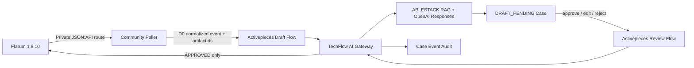
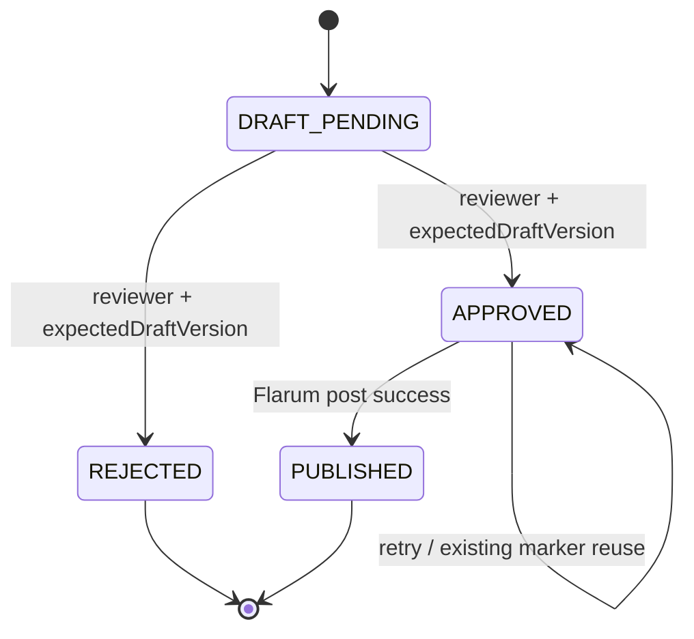

# Issue #21 Community 질문 답변·승인 플로우 설계

## 1. 목표와 범위

`community.ablecloud.io`의 새 ABLESTACK 질문을 수집하고, 문서·소스코드·이미지·로그 근거를 사용한 AI 답변 초안을 만든다. 답변은 담당자가 현재 초안 버전을 명시적으로 승인한 경우에만 Flarum에 게시한다. Activepieces는 순서를 실행하고 TechFlow AI Gateway가 상태·정책·승인·감사·게시 멱등성을 소유한다.



시험 서버에서는 `http://172.16.0.234`를 서버 간 Flarum API 전송에만 사용하고, 사용자에게 표시되는 토론·첨부·게시 URL은 `https://community.ablecloud.io`로 고정한다. 공인 주소 NAT hairpin에 의존하지 않으며 허용된 내부 API 주소와 공개 HTTPS Origin 외의 경로는 설정 검증에서 거부한다.

## 2. 실제 환경 기준선

| 항목 | 확인값 |
|---|---|
| Flarum | 1.8.10 |
| PHP | 8.3.6 |
| DB | MariaDB 10.11.13 |
| 승인 확장 | `flarum/approval` 1.8.2 |
| 연동 확장 | `fof/webhooks` 1.3.3, `fof/upload` 1.8.5 |
| AI 계정 | `AI-Assistant`, 관리자·기술지원 멤버 |
| 연동 방식 | 새 플러그인 없이 Flarum JSON:API와 사용자 귀속 API Key |

## 3. 이벤트 계약

Poller는 `commentCount=1`인 새 토의를 미답변 질문으로 판정한다. 최초 기동에서는 기존 미답변 토의를 상태에 기록만 하고 이후 생성된 질문부터 전달한다.

```json
{
  "eventId": "flarum-discussion-141",
  "correlationId": "community-141-...",
  "discussionId": "141",
  "discussionUrl": "https://community.ablecloud.io/d/141",
  "title": "질문 제목",
  "question": "HTML을 제거한 질문 본문",
  "authorId": "사용자 ID",
  "tagSlugs": ["mold"],
  "artifactIds": []
}
```

- 원본 HTML, Flarum API Key와 첨부 바이트는 Activepieces Run에 넣지 않는다.
- 첨부는 Community 동일 Origin의 HTTPS URL만 허용하며 10 MiB 이하의 기존 IMAGE/LOG 경계로 업로드한다.
- Poller 상태는 전용 Volume에 최근 1,000개 Discussion ID만 저장한다.
- 동일 Discussion은 DB Unique Key와 Activepieces `eventId` Idempotency Key로 중복 초안을 만들지 않는다.

## 4. Case 상태와 승인



- `DRAFT_PENDING` 외 상태에서는 승인·반려가 거부된다.
- `expectedDraftVersion`이 현재 버전과 다르면 `409 INVALID_STATE`다.
- 편집 답변을 승인하면 승인 당시 답변으로 고정한다.
- 승인 후 초안이 변경되는 구현은 승인 무효화와 `draftVersion` 증가 없이는 허용하지 않는다.
- 게시 본문에는 보이지 않는 `techflow-case:{caseId}:approval:{approvalVersion}` Marker를 넣는다. 재시도 시 기존 Post를 찾아 재사용해 중복 게시를 막는다.

## 5. 보안과 데이터

- Flarum 관리자·SSH 비밀번호, API Key와 Activepieces Webhook URL은 GitHub Actions Secret 및 서버 보호 파일로만 관리한다.
- Flarum API Key는 `AI-Assistant` 사용자 ID에 귀속한다. 임의 `userId` 대행 Key를 만들지 않는다.
- 질문은 공개 Community의 D0 데이터만 처리한다. D1~D3 분류 입력은 기존 AI Gateway 정책으로 차단한다.
- Community 질문과 첨부의 문구는 비신뢰 사용자 입력이며 시스템 지시로 실행하지 않는다.
- 외부 게시 권한은 Gateway만 가지며 Poller와 Activepieces에는 Flarum 게시 Key를 노출하지 않는다.
- GitHub→Chat `github-chat-v1`은 FROZEN 상태를 유지하고 Flow·Ingress·SSRF 계약을 변경하지 않는다.

## 6. 완료 기준

- 새 질문이 Poller와 Activepieces를 거쳐 `DRAFT_PENDING`으로 한 번만 생성된다.
- 승인 전, 반려 후, 오래된 Draft Version으로 게시할 수 없다.
- 담당자 편집·승인 후 `AI-Assistant` 답변이 한 번만 게시된다.
- 동일 승인 재처리가 기존 게시물을 재사용한다.
- 이미지·로그 첨부가 Artifact ID 경계로 전달된다.
- 단위·계약·시험 서버 E2E, 백업·배포·롤백, PDF/PPTX 증적을 저장소에 보관한다.
