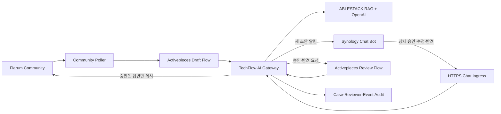

# Issue #22 Chat 기반 Community 승인 설계

## 1. 목표와 범위

Issue #21에서 생성하는 Community AI 답변 초안을 담당자가 `chat.ablecloud.io` 안에서 확인하고, 승인·수정 승인·반려할 수 있게 한다. 새 초안 알림, 질문·요약·Citation·Case 링크, 담당자 연결, 대기 목록과 처리 이력을 Chat에 일원화한다.

이 구현은 Issue #22의 사내 메신저 기술지원 Bot을 위한 첫 번째 제품 경로다. PR #61의 후속 보완으로 일반 Chat 기술 질문도 공개 문서·Diplo 현재판·연관 제품 코드·Europa 프리뷰 비교 경로를 통해 직접 응답한다. 승인 명령은 등록 Reviewer에게만 허용하고 일반 질의 응답은 유효한 Chat Bot 이벤트 사용자에게 제공한다. 상세 설계는 [Issue #62·#63 설계](issues-62-63-versioned-safe-answer-design.md)를 따른다.

## 2. 책임 경계

| 구성요소 | 책임 |
|---|---|
| Synology Chat | 사람과 Bot의 대화 UI, 버튼·명령 전송 |
| HTTPS Ingress | `POST /techflow/chat/assist`만 AI Gateway로 전달, 그 외 Method 405 |
| Activepieces | 승인·반려 Flow의 호출 순서와 재시도 실행 |
| TechFlow AI Gateway | Bot Token 검증, 사용자 허용목록, Case 상태·버전·멱등성·감사·게시 정책 |
| Flarum | 질문과 승인 게시물의 원본 시스템 |

기존 GitHub→Chat `github-chat-v1`은 `FROZEN`이다. 새 Chat 경로는 별도 URL과 Gateway 서비스만 사용하며 기존 Flow ID, 게시 버전, Event Gateway, `/techflow/hooks/*` 계약을 변경하지 않는다.

## 3. Chat 이벤트·명령 계약

Synology Chat outgoing 요청의 `token`, `user_id`, `username`, `post_id`, `text`와 interactive callback의 `actions`를 허용한다. 요청 본문은 64 KiB 이하이며 Bot Token은 상수 시간 비교로 검증한다.

| 명령 | 결과 |
|---|---|
| `연결` | 현재 Chat 사용자 ID와 이름을 승인 담당자로 등록하고 대기 목록 표시 |
| `대기` | `DRAFT_PENDING`, `APPROVED` Case 최대 10건 표시 |
| `상세 <Discussion ID 또는 Case 앞 8자>` | 질문 URL, 상태, AI 판정, 초안, Citation과 버튼 표시 |
| `승인 <Case> <Version>` | 현재 초안을 승인하고 Activepieces를 거쳐 게시 |
| `수정 <Case> <Version> <최종 답변>` | 담당자 답변으로 교체해 승인·게시 |
| `반려 <Case> <Version> <사유>` | 게시 없이 반려 |
| `이력 [Case]` | 최근 Case 또는 지정 Case의 감사 이력 표시 |

새 Case 생성 시 이미 `연결`한 활성 Reviewer에게 질문·상태·Citation 요약·Community 링크·검토 버튼이 포함된 메시지를 보낸다. Chat의 버튼은 상세·승인·반려의 단축 입력이며, 수정 승인은 텍스트 명령으로 최종 답변을 명시한다.

## 4. 식별·권한·승인 정책

- Bot Token이 일치하고 `TECHFLOW_CHAT_REVIEWER_USERNAMES`에 포함된 사용자만 요청할 수 있다.
- 첫 정상 명령에서 Chat `user_id`와 `username`을 `chat_reviewer_identity`에 연결한다.
- 감사 Reviewer는 `chat:<username>`으로 기록한다.
- 승인·반려에는 현재 `draftVersion`이 필요하다. 오래된 버전은 `409 INVALID_STATE`다.
- Activepieces가 비어 있는 선택적 `editedAnswer`를 빈 문자열로 렌더링해도 미편집 승인으로 정규화한다.
- 같은 목표 상태와 같은 Version의 재요청은 기존 결과를 반환하며, 다른 편집 내용으로 재승인할 수 없다.
- `PUBLISHED`·`REJECTED` Case에 같은 Chat 조작이 반복되면 기존 최종 상태를 반환한다.

## 5. 장애·삭제·보상

| 상황 | 처리 |
|---|---|
| Chat 알림 실패 | Case 생성은 유지하고 구조화 로그에 실패 유형 기록; `대기`로 복구 |
| Activepieces 지연 | 최대 15초 최종 상태를 확인하고 미완료 시 `이력` 확인 안내 |
| 승인 후 Flarum 실패 | Case는 `APPROVED`에 남고 기존 게시 Marker로 재시도 |
| 원본 Discussion 영구 삭제 | 게시 재시도를 중단하고 `REJECTED`, Reviewer `techflow:source-deletion-reconcile`로 정리 |
| 위조·미허용 사용자 | 세부정보 없이 403 |

Discussion #143은 영구 삭제된 원본이므로 정상 E2E 성공 사례로 사용하지 않는다. 남아 있던 Case는 삭제 사실을 근거로 반려 상태로 정리했으며, 유효한 신규 Discussion #145~#147로 승인·수정·반려를 다시 검증했다.

## 6. 완료 기준

- 담당자 연결 후 새 초안 알림을 받을 수 있다.
- 질문·초안·Citation·Case 링크를 Chat에서 확인한다.
- 승인, 수정 승인, 반려가 Activepieces 경유로 동작한다.
- Reviewer·대기·이력과 멱등성이 DB에 남는다.
- 삭제된 원본을 게시 성공으로 오판하지 않는다.
- 외부 위조 요청, 미허용 사용자와 오래된 Version을 차단한다.
- 배포·백업·롤백, 실제 Chat·Flarum E2E, PDF/PPTX 증적을 저장소에 보관한다.
