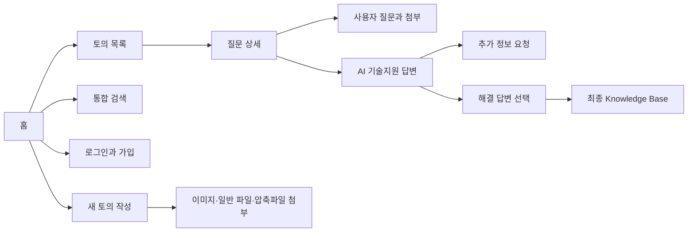
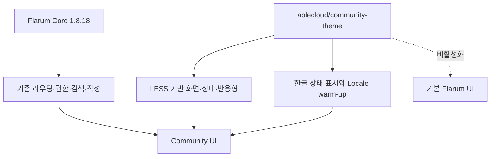

# Issue #73 Community 인터페이스 현대화 설계

## 1. 목표

ABLESTACK Community를 제품 기술지원 포털로 읽히게 만들되 Flarum Core, Vendor, DB Schema를 수정하지 않는다. 사용자는 질문을 찾고, 질문을 작성하고, AI 기술지원과 최종 해결 가이드를 구분해 읽을 수 있어야 한다. 운영자는 테마 확장 하나만 비활성화해 즉시 기본 화면으로 돌아갈 수 있어야 한다.

## 2. 기준선과 해결할 문제

2026-08-18 운영 Community를 데스크톱 1440x900과 모바일 390x844에서 확인했다.

| 영역 | 기준선 문제 | 목표 상태 |
|---|---|---|
| 홈 | 환영 영역과 목록의 계층이 약함 | 제품 포털의 시작점과 토의 목록을 명확히 분리 |
| Hero | 타이틀 글자와 위·아래 여백이 커서 콘텐츠 공간을 과도하게 사용 | 28px 타이틀, 약 128px 높이의 압축된 환영 영역 |
| 카테고리 | 왼쪽 메뉴가 190px로 좁고 태그 페이지 버튼이 컨테이너를 넘음 | 240px 메뉴, 태그 도구 모음 버튼 넘침 0px |
| 목록 | 행 간격이 좁고 상태·태그·제목이 경쟁함 | 카드 단위, 2줄 제목, 해결 상태 우선 |
| 상세 | 질문, AI 답변, 해결 답변이 비슷하게 보임 | 일반 질문·AI 지원·추가 확인·최종 가이드 구분 |
| 모바일 | 메뉴와 콘텐츠가 겹치고 긴 한글 제목이 좁아짐 | 390px에서 제목 2줄, 44px 조작 영역 |
| 한글 | `Answered`, `Best Answer` 등 영문 상태 노출 | 해결됨, 해결 답변 선택, 최종 해결 가이드 |
| 검색·로그인 | 기본 컨트롤의 경계와 포커스가 약함 | 명확한 입력 경계, 포커스 링, 16px 입력 글자 |

기준선 화면은 `docs/evidence/issue-73/screenshots/before`, 개선 화면은 `docs/evidence/issue-73/screenshots/after`에 보관한다.

## 3. 정보 구조

### 3.1 홈과 목록

- 헤더에는 로고, 검색, 언어, 가입·로그인 또는 사용자 메뉴만 유지한다.
- 환영 영역은 포럼의 목적을 한 문장으로 설명하고 목록과 배경을 분리한다.
- 환영 타이틀은 34px 로고 높이보다 작은 28px로 표시하고 Hero 전체 높이는 약 128px로 제한한다.
- 좌측 탐색은 240px 폭에서 모든 토의, 태그, 제품 영역 순으로 유지하되 선택 상태를 명확히 한다.
- 태그 페이지의 `토의 시작` 버튼은 내부 패딩을 포함한 도구 모음 경계 안에 유지한다.
- 각 토의는 제목, 태그, 마지막 응답자·시간, 답변 수, 해결 상태 순으로 읽힌다.

### 3.2 상세

- 질문은 흰색 기본 면으로 표시한다.
- TechFlow-Assistant의 진행 답변은 파란색 계열의 `AI 기술지원` 상태다.
- 추가 자료가 필요한 답변은 `data-techflow-kind="needs-information"` 또는 `TechFlowPost--needs-information` 훅으로 노란색 `추가 확인 필요` 상태를 사용한다.
- 질문자가 해결 답변을 선택하면 녹색 `최종 해결 가이드` 상태로 표시한다.
- 사용자는 답변 본문만 보며 내부 근거 ID, 소스 경로, 검토 단계는 노출하지 않는다.

### 3.3 글쓰기와 첨부

- 제목은 짧은 증상 중심 문장, 본문은 현재 상황과 이미 시도한 내용을 안내한다.
- 작성 영역은 최소 180px, 입력 글자는 16px로 유지한다.
- 이미지, 일반 로그, 일반 파일, ZIP·GZIP·TAR.GZ 첨부 기능은 Issue #72 정책을 그대로 사용한다.
- 일반 파일은 1 GiB 이하, 지원 압축 파일은 10 GiB 이하라는 기존 서버 정책을 테마가 변경하지 않는다.

### 3.4 검색과 로그인

- 검색은 헤더에서 바로 시작하고 검색어가 입력되면 기존 Flarum 검색 결과를 사용한다.
- 로그인 대화상자는 사용자명 또는 이메일, 비밀번호, 로그인 기억하기, 로그인 순으로 읽힌다.
- 키보드 포커스는 3px 링으로 표시하고 주요 입력·버튼의 모바일 높이는 44px 이상이다.

## 4. 시각 시스템

| 토큰 | 값 | 용도 |
|---|---|---|
| Primary | `#155EEF` | 주요 버튼·포커스·브랜드 강조 |
| Ink | `#15253E` | 제목·본문 핵심 글자 |
| Canvas | `#F3F7FC` | 전체 배경과 블루 계열 공간감 |
| Border | `#D5E1F1` | 카드·입력 경계 |
| Assistant | `#EAF2FF` | AI 진행 답변 |
| Solution | `#EAFAF2` | 최종 해결 가이드 |
| Needs information | `#FFF6DF` | 추가 확인 요청 |

본문은 Pretendard, Noto Sans KR, Apple SD Gothic Neo, 맑은 고딕 순으로 사용한다. 한글은 `word-break: keep-all`과 문맥 단위 줄바꿈을 적용하고 긴 기술 문자열은 안전하게 줄바꿈한다.

카드와 입력 영역은 14~16px Radius, 블루 계열의 옅은 경계와 낮은 그림자를 사용한다. 게시물 본문은 데스크톱에서 `21px 25px 23px`, 모바일에서 `18px 16px 20px`의 내부 여백을 확보해 글자가 보더에 붙지 않도록 한다.

## 5. 구현 경계

- 변경: 별도 Flarum Theme Extension, WSL 검증 스크립트, 운영 Runbook.
- 미변경: Flarum Core, `vendor` 원본, DB Schema, 질문·답변 데이터, 업로드 정책, TechFlow Poller·Gateway.
- 운영 이상 시 `php flarum extension:disable ablecloud-community-theme`로 화면만 원복한다.

## 6. 완료 기준

- 데스크톱 1440x900, 모바일 390x844에서 홈·목록·상세의 읽기 흐름이 유지된다.
- 검색과 로그인 대화상자가 한글로 표시되고 원문 번역 키 노출이 0건이다.
- AI 기술지원, 추가 확인 필요, 최종 해결 가이드가 색·레이블로 구분된다.
- 포커스 링, 44px 모바일 조작 영역, 모션 축소, 주요 명도 대비가 자동 검사에 통과한다.
- 테마 활성화·비활성화·재활성화 후 HTTP 200과 콘텐츠·첨부 해시가 동일하다.
- 운영 적용은 보고서와 발표자료 검토 후 별도 승인을 받는다.
