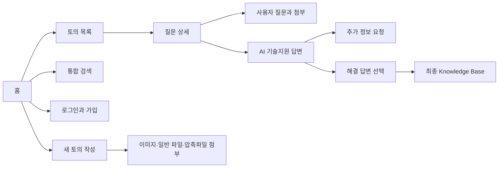
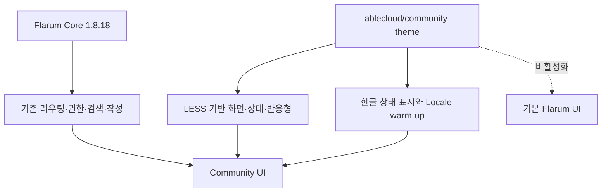

# Issue #73 Community 인터페이스 현대화 설계

## 1. 목표

ABLESTACK Community를 제품 기술지원 포털로 읽히게 만들되 Flarum Core, Vendor, DB Schema를 수정하지 않는다. 사용자는 질문을 찾고, 질문을 작성하고, AI 기술지원과 최종 해결 가이드를 구분해 읽을 수 있어야 한다. 운영자는 테마 확장 하나만 비활성화해 즉시 기본 화면으로 돌아갈 수 있어야 한다.

## 2. 기준선과 해결할 문제

2026-08-18 운영 Community를 데스크톱 1440x900과 모바일 390x844에서 확인했다.

| 영역 | 기준선 문제 | 목표 상태 |
|---|---|---|
| 홈 | 환영 영역과 목록의 계층이 약함 | 제품 포털의 시작점과 토의 목록을 명확히 분리 |
| Hero | 타이틀 글자와 위·아래 여백이 커서 콘텐츠 공간을 과도하게 사용 | 28px 타이틀, 약 128px 높이, 데스크톱 19px·모바일 17px 대칭 여백 |
| 카테고리 | 왼쪽 메뉴가 190px로 좁고 태그 페이지 버튼이 컨테이너를 넘음 | 240px 메뉴, 태그 도구 모음 버튼 넘침 0px |
| 태그 목록 | 태그가 색상 표처럼 서로 붙어 있고 최근 토론·보조 태그 정보가 구분되지 않음 | 주요 태그 독립 카드, 최근 토론 패널, 설명을 포함한 별도 보조 태그 구역 |
| 아이콘 | Font Awesome 웹폰트가 로드되지 않으면 전용 코드가 깨진 사각형으로 표시 | 의미 Class를 유지한 시스템 단색 기호로 웹폰트 의존 제거 |
| 목록 | 제목·태그·댓글 수가 여러 줄에 흩어지고 아바타가 제목보다 아래에 있음 | 데스크톱 62px 단일 행, 아바타·제목 중심 일치, 모바일 2줄 제목 |
| 목록 작업 | 더보기 버튼이 Hover 상태에서만 보이고 열린 메뉴가 다음 행 뒤로 들어감 | 버튼 상시 표시·세로 중앙 정렬, 열린 행과 메뉴의 명확한 최상위 계층 |
| 상세 | 선택 답변 미리보기와 본문이 중복 카드처럼 보이고 배지가 과도함 | 선택 미리보기·실제 해결 답변을 간결한 녹색 상태로 구분 |
| 모바일 | 메뉴와 콘텐츠가 겹치고 긴 한글 제목이 좁아짐 | 390px에서 제목 2줄, 44px 조작 영역 |
| 한글 | `Answered`, `Best Answer` 등 영문 상태 노출 | 해결됨, 해결 답변 선택, 최종 해결 가이드 |
| 대화상자 | 작성·태그·로그인 등 창마다 포커스와 버튼 모양이 다르고 일부 영문이 노출됨 | 모든 대화상자에 공통 헤더·입력·포커스·닫기·확인 규칙과 한글 우선 표시 |
| 프로필 | 기본 회색 Hero, 좁은 메뉴, `Likes`·`My media`·`Security` 영문 노출 | 블루 Hero·240px 메뉴·카드형 빈 상태와 프로필 메뉴 한글화 |
| 설정·보안 | 알림 표·계정·세션·토큰이 기본 회색 면에 흩어지고 확장 기능 문구가 영문으로 노출 | 공통 카드·버튼·표 규칙, 직접 노출 영문 0건, 모바일 가로 넘침 0px |

기준선 화면은 `docs/evidence/issue-73/screenshots/before`, 개선 화면은 `docs/evidence/issue-73/screenshots/after`에 보관한다.

## 3. 정보 구조

### 3.1 홈과 목록

- 헤더에는 로고, 검색, 언어, 가입·로그인 또는 사용자 메뉴만 유지한다.
- 환영 영역은 포럼의 목적을 한 문장으로 설명하고 목록과 배경을 분리한다.
- 환영 타이틀은 34px 로고 높이보다 작은 28px로 표시하고 Hero 전체 높이는 약 128px로 제한한다.
- 좌측 탐색은 240px 폭에서 모든 토의, 태그, 제품 영역 순으로 유지하되 선택 상태를 명확히 한다.
- 태그 페이지의 `토의 시작` 버튼은 내부 패딩을 포함한 도구 모음 경계 안에 유지한다.
- 태그 목록은 데스크톱 3열·18px 간격의 흰색 카드 Grid로 표시하고 태그 고유 색상은 카드 상단 강조선으로만 사용한다.
- 태그 설명은 Ink·Muted 텍스트 계층으로 표시하며 최근 토론은 카드 하단의 옅은 블루 패널과 `최근 토론` 레이블로 분리한다.
- 보조 태그는 주요 태그 아래의 옅은 블루 구역에 데스크톱 4열·12px 간격으로 배치하고, 태그 이름뿐 아니라 실제 설명 7건을 함께 표시한다.
- 최근 토론의 절대 날짜는 `00년 0월 0일`로 표시하고 `0일 전`, `7일 전` 같은 상대 날짜는 그대로 유지한다.
- 모바일에서는 336px 한 열 카드와 14px 간격으로 전환하고 페이지 가로 넘침을 만들지 않는다.
- 데스크톱 각 토의는 62px 카드 안에서 제목, 카테고리 태그, 댓글 수를 한 줄로 읽는다. 긴 제목과 태그는 행을 늘리지 않고 말줄임 처리한다.
- 작성자 아바타의 세로 중심을 제목과 일치시켜 행 내부의 시각 기준선을 통일한다.
- 모바일은 제목 2줄과 마지막 응답 정보를 유지해 좁은 화면에서 의미가 사라지지 않도록 한다.
- 각 행의 더보기 버튼은 마우스를 올리지 않아도 보이게 하고 행 높이의 세로 중앙에 배치한다. 열린 행, 버튼, 메뉴의 `z-index`를 단계적으로 높여 뒤쪽 행이 메뉴를 가리지 않게 한다.

### 3.2 상세

- 질문은 흰색 기본 면으로 표시한다.
- TechFlow-Assistant의 진행 답변은 파란색 계열의 `AI 기술지원` 상태다.
- 추가 자료가 필요한 답변은 `data-techflow-kind="needs-information"` 또는 `TechFlowPost--needs-information` 훅으로 노란색 `추가 확인 필요` 상태를 사용한다.
- 질문자가 해결 답변을 선택하면 연한 녹색 카드, 좌측 녹색 강조선, 작은 `해결된 답변` 배지로 표시한다.
- 원 질문의 선택 답변 미리보기는 작성자·날짜·중복 배지를 숨기고 `선택된 해결 답변`과 본문만 표시한다.
- 사용자는 답변 본문만 보며 내부 근거 ID, 소스 경로, 검토 단계는 노출하지 않는다.

### 3.3 글쓰기와 첨부

- 제목은 짧은 증상 중심 문장, 본문은 현재 상황과 이미 시도한 내용을 안내한다.
- 작성 영역은 최소 180px, 입력 글자는 16px로 유지한다.
- 이미지, 일반 로그, 일반 파일, ZIP·GZIP·TAR.GZ 첨부 기능은 Issue #72 정책을 그대로 사용한다.
- 일반 파일은 1 GiB 이하, 지원 압축 파일은 10 GiB 이하라는 기존 서버 정책을 테마가 변경하지 않는다.

### 3.4 검색과 로그인

- 검색은 헤더에서 바로 시작하고 검색어가 입력되면 기존 Flarum 검색 결과를 사용한다.
- 로그인 대화상자는 사용자명 또는 이메일, 비밀번호, 로그인 기억하기, 로그인 순으로 읽힌다.
- 작성·태그·검색·로그인 및 확장 기능 대화상자는 공통 헤더, 58px 최소 높이, 원형 닫기 버튼, 블루 계열 입력 경계와 확인 버튼을 사용한다.
- 키보드 포커스는 기본 고대비 외곽선을 제거하고 2px의 부드러운 블루 링으로 표시하며 주요 입력·버튼의 모바일 높이는 44px 이상이다.
- Flarum과 확장 기능에 한글 번역 키가 있는 문구는 한글을 우선하며 태그 선택창의 `Choose`, `OK`, `Bypass tag requirements`는 각각 `주 태그를 선택하세요`, `확인`, `태그 필수 조건 무시`로 표시한다.

### 3.5 게시물 작업 버튼

- 답장·좋아요·해결 선택·더 보기는 모두 아이콘과 한글 텍스트를 함께 표시해 기능을 추측하지 않아도 되게 한다.
- 작업 버튼은 게시물 높이와 무관하게 카드 하단을 기준으로 고정해 카드 아래 8px의 독립 작업 영역에 두고 카드 오른쪽 선에 맞춘다. 카드 보더와 중복되는 기본 게시물 구분선은 제거한다.
- 답장·좋아요·더 보기와 권한별 추가 작업은 Flex 그룹으로 배치하고 데스크톱 8px, 모바일 6px 간격을 둔다. 버튼은 내용에 맞춰 넓어지고 모바일 390px에서도 한 줄 안에 유지한다.
- 로그인 또는 권한이 없어 현재 사용할 수 없는 답장 버튼은 회색·낮은 투명도·금지 커서로 표시하고 포인터 실행을 막는다.
- 활성 상태는 블루 계열 배경과 포커스 링을 사용하며 마우스 오버 없이도 버튼 위치를 알 수 있어야 한다.

### 3.6 홈 탐색 버튼

- Flarum의 `Navigation-drawer`는 모바일 탐색 서랍용이다. 데스크톱 홈에서는 별도 좌측 탐색이 이미 보이므로 중복 버튼을 노출하지 않는다.
- 데스크톱에서 모바일 버튼을 강제로 표시해 클릭 상태만 바뀌고 메뉴가 열리지 않는 테마 규칙을 제거한다.
- 모바일에서는 40px 이상 탐색 버튼과 270px 서랍의 기존 작동을 그대로 유지한다.

### 3.7 프로필

- 사용자 Hero는 공통 블루 Gradient, 96px 아바타, 명확한 이름·활동 정보 계층을 사용한다.
- 데스크톱 프로필 메뉴는 홈 카테고리와 같은 240px 폭, 카드 경계와 블루 활성 상태를 사용한다.
- 게시물이 없는 화면은 콘텐츠 영역 안의 독립 카드로 표시하고 모바일에서는 한 열로 전환한다.
- `Likes`, `My media`, `Security`, `best answers`는 각각 `좋아요`, `내 미디어`, `보안`, `해결 답변`으로 한글화한다.

### 3.8 Footer

- ABLECLOUD Home, Blog, Online Docs 링크는 텍스트 대신 38px 원형 아이콘으로 표시한다.
- 기존 링크 문구는 DOM에 남겨 접근 가능한 이름으로 사용하고, 깨지는 `fal` Home 아이콘은 숨긴다.
- Footer 높이만큼 콘텐츠 하단 여백을 확보해 마지막 내용과 고정 Footer가 겹치지 않게 한다.

### 3.9 설정과 보안

- 설정과 보안 본문은 프로필의 240px 탐색 옆에 같은 폭과 간격으로 배치하고, 각 설정 묶음은 16px Radius의 흰색 카드로 구분한다.
- 계정 버튼, 알림 표, 개발자 토큰, 활성 세션과 전역 로그아웃은 동일한 버튼·경계·그림자 토큰을 사용한다.
- 알림 표는 옅은 블루 헤더와 명확한 행 구분을 사용하고 데스크톱의 웹·이메일 열은 88px로 고정한다.
- 390px 모바일에서는 본문과 카드가 한 열로 전환되고 알림 표는 302px 안에 맞춰 페이지 가로 스크롤이 생기지 않아야 한다.
- `New Token`과 확장 기능 알림 문구는 각각 `새 토큰`과 자연스러운 한국어로 표시한다.

## 4. 시각 시스템

| 토큰 | 값 | 용도 |
|---|---|---|
| Primary | `#155EEF` | 주요 버튼·포커스·브랜드 강조 |
| Ink | `#15253E` | 제목·본문 핵심 글자 |
| Canvas | `#F3F7FC` | 전체 배경과 블루 계열 공간감 |
| Border | `#D5E1F1` | 카드·입력 경계 |
| Assistant | `#EAF2FF` | AI 진행 답변 |
| Solution | `#EAFAF2` | 최종 해결 가이드 |
| Needs information | `#FFF6DF` | 추가 확인 요청 |

본문은 Pretendard, Noto Sans KR, Apple SD Gothic Neo, 맑은 고딕 순으로 사용한다. 한글은 `word-break: keep-all`과 문맥 단위 줄바꿈을 적용하고 긴 기술 문자열은 안전하게 줄바꿈한다.

아이콘은 Flarum의 `fa-*` 의미 Class를 유지하되 `Segoe UI Symbol`, `Apple Symbols`, `Noto Sans Symbols 2` 순의 시스템 단색 기호로 표시한다. 이 방식은 외부·로컬 웹폰트의 로딩 실패와 Cache 재생성 순서에 영향을 받지 않는다.

카드와 입력 영역은 14~16px Radius, 블루 계열의 옅은 경계와 낮은 그림자를 사용한다. 게시물 본문은 데스크톱에서 `21px 25px 23px`, 모바일에서 `18px 16px 20px`의 내부 여백을 확보해 글자가 보더에 붙지 않도록 한다.

## 5. 구현 경계

- 변경: 별도 Flarum Theme Extension, WSL 검증 스크립트, 운영 Runbook.
- 미변경: Flarum Core, `vendor` 원본, DB Schema, 질문·답변 데이터, 업로드 정책, TechFlow Poller·Gateway.
- 운영 이상 시 `php flarum extension:disable ablecloud-community-theme`로 화면만 원복한다.

## 6. 완료 기준

- 데스크톱 1440x900, 모바일 390x844에서 홈·목록·상세의 읽기 흐름이 유지된다.
- 데스크톱 목록 행은 62px이며 제목·카테고리·댓글 수가 같은 기준선에 배치된다.
- 태그 카드는 데스크톱 3열·18px, 모바일 1열·14px 간격이며 최근 토론이 별도 패널로 구분되고 가로 넘침이 0px이다.
- 보조 태그는 실제 설명과 함께 데스크톱 4열·12px, 모바일 1열·10px로 구분되고 총 7건이 표시된다.
- 절대 날짜는 `00년 0월 0일`, 상대 날짜는 기존 표현으로 표시되며 화면의 웹폰트 전용 깨진 문자는 0건이다.
- 토론 목록의 더보기 버튼은 항상 보이고 세로 중심 오차가 0px이며 열린 메뉴는 이후 목록 행보다 위에 표시된다.
- Hero 위·아래 패딩이 대칭이고 아바타·제목 중심 오차가 0px이다.
- 답장·좋아요·해결 선택·더 보기가 아이콘과 한글 텍스트로 카드 바깥 작업 영역에 항상 보이며 사용할 수 없는 상태가 비활성 스타일로 구분된다.
- 짧은 본문과 긴 본문에서 카드 하단과 작업 버튼 사이의 실측 간격 편차가 0px이다.
- Footer 링크가 원형 아이콘으로 구분되고 마지막 콘텐츠를 가리지 않는다.
- 해결 답변의 실제 본문과 원 질문의 선택 미리보기가 중복 정보 없이 구분된다.
- 모든 대화상자에 공통 디자인 규칙이 적용되고 작성·태그·검색·로그인 대화상자가 한글로 표시되며 원문 번역 키와 직접 노출 영문이 0건이다.
- 데스크톱 홈의 작동하지 않는 모바일 탐색 버튼은 보이지 않고, 모바일 탐색 서랍은 정상적으로 열린다.
- 프로필 Hero·240px 메뉴·빈 상태 카드가 전체 테마와 일치하며 프로필 메뉴 직접 노출 영문이 0건이다.
- 설정·보안 화면의 카드·버튼·알림 표·세션·토큰 디자인이 일치하고 직접 노출 영문과 모바일 가로 넘침이 0건이다.
- AI 기술지원, 추가 확인 필요, 최종 해결 가이드가 색·레이블로 구분된다.
- 포커스 링, 44px 모바일 조작 영역, 모션 축소, 주요 명도 대비가 자동 검사에 통과한다.
- 테마 활성화·비활성화·재활성화 후 HTTP 200과 콘텐츠·첨부 해시가 동일하다.
- 운영 적용은 보고서와 발표자료 검토 후 별도 승인을 받는다.
