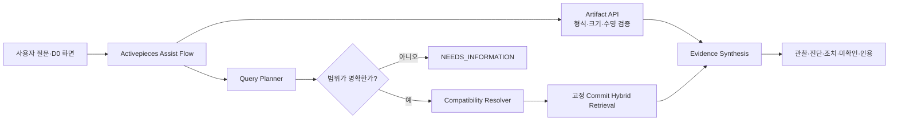

# Issues #56~#58 ABLESTACK Assist 종합·멀티모달 설계

> 권장 작업의 원래 표기 #47~#49는 GitHub 전역 번호가 이미 사용 중이어서 실제 Issue #56~#58로 등록했다.

## 목표

단일 영역 RAG를 ABLESTACK Assist MVP로 과대평가하지 않고, 여러 저장소의 근거와 사용자가 첨부한 화면을 하나의 기술지원 보고서로 합성한다. Activepieces는 수신·호출 순서를 실행하고, TechFlow AI Gateway가 계획·호환성·검색·증거 검증·보류를 소유한다.

## 책임 경계

| 구성요소 | 책임 |
|---|---|
| Activepieces | 내부 Webhook, Correlation ID, 순차 HTTP 실행, 재시도 관찰 |
| Query Planner | 질문을 ABLESTACK 영역과 하위 질문으로 분해, Cloud 브랜치 불명확 시 중단 |
| Compatibility Resolver | 명시 ID 또는 제품 버전으로 승인 상태의 세트만 선택 |
| Retrieval | 승인된 활성 Source Version의 문서·소스코드를 Commit 단위로 검색 |
| Responses Adapter | 검색 문맥과 이미지를 하나의 strict JSON Schema 응답으로 합성 |
| Artifact Store | PNG/JPEG/WebP D0만 단기 보관, 무결성 확인, 삭제·만료 |

## API

- `POST /v1/artifacts`: multipart 없이 원시 바이트를 받는다. `Content-Type`, `X-Artifact-Filename`, `X-Artifact-Classification: D0`가 필요하다.
- `GET /v1/artifacts/{id}`: 바이트가 아닌 안전한 메타데이터만 반환한다.
- `DELETE /v1/artifacts/{id}`: 바이트와 메타데이터를 함께 삭제한다.
- `POST /v1/assist/query`: 질문, Actor, 범위, 최대 5개 Artifact ID를 받아 종합 보고서를 반환한다.

## 계획·호환성 규칙

1. 명시 Source Profile이 있으면 그대로 사용한다.
2. 질문으로 범위를 추론할 때 Cloud는 `main`, `ablestack-diplo`, `ablestack-europa` 중 하나가 명시되어야 한다.
3. 복수 Source Profile은 승인된 Compatibility Set 없이는 검색·생성을 시작하지 않는다.
4. 검색 결과가 없거나 근거가 충돌하면 `ABSTAINED`한다.
5. 답변은 관찰 사실, 진단과 가능성, 권장 조치, 미확인 사항, 소스 인용, 이미지 관찰을 분리한다.

## 이미지·OpenAI 계약

OpenAI Responses API에는 `input_image`로 URL, Base64 data URL, File ID를 전달할 수 있다. TechFlow는 외부 파일 저장을 만들지 않고 단기 보관 바이트를 Base64 data URL로 전달하며, UI의 작은 글자 판독을 위해 `detail: original`을 사용한다. 출력은 strict JSON Schema이고 `tools=[]`, `store=false`, `background=false`를 강제한다.

- [OpenAI 이미지 입력 가이드](https://developers.openai.com/api/docs/guides/images-vision)
- [OpenAI Structured Outputs 가이드](https://developers.openai.com/api/docs/guides/structured-outputs)

## Artifact 보안·보존

| 정책 | 구현 |
|---|---|
| 분류 | D0만 허용 |
| 형식 | PNG, JPEG, WebP; 매직 바이트와 선언 형식 일치 |
| 크기 | 파일당 10 MiB, 5개/질문 |
| 해상도 | 변 12,000 px 이하, 총 40M px 이하 |
| 보존 | 기본 24시간, 최대 168시간 구성 가능 |
| 저장 권한 | 디렉터리 0700, 파일 0600, 전용 Docker Volume |
| 로그 | 바이트·질문·모델 원문 미기록 |
| 삭제 | 명시 삭제 또는 만료 정리, 삭제 후 404 |

## 완료 판정

- 27개 OpenAPI 작업과 118개 단위·계약 시험 통과
- 종합 Golden 15개와 멀티모달 Golden 12개가 질문·응답 기준·판정을 포함
- 시험 서버 OpenAI 모드에서 범위 보류, 복수 저장소, 판독 가능/불가능 이미지가 모두 정책대로 동작
- Activepieces Assist Flow 2개가 ENABLED이고 내부 E2E Run이 SUCCEEDED
- 동결된 `github-chat-v1` 보호 가드가 배포 전후 모두 통과
