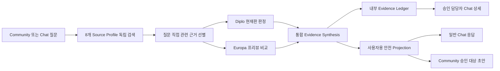

# Issue #62·#63 Diplo 현재판·Europa 프리뷰 비교와 안전 답변 설계

## 목적

ABLESTACK 기술지원 질문마다 공개 문서, Diplo 현재 출시 Cloud, Wall, Cockpit, Genie, Kickstart, QEMU 실행 도구를 검토하고 Europa 미출시 코드는 향후 개선 여부를 판단하는 프리뷰 근거로만 사용한다. 내부 담당자는 근거 계보 전체를 확인하지만 Community와 일반 Chat 사용자는 문제 해결에 필요한 내용만 받는다.

## 제품 버전 역할

| 역할 | Source Profile | 사용 원칙 |
|---|---|---|
| 현재 문서 | `SHARED_DOCS` | 현재 사용·운영 절차의 1차 근거 |
| 현재 출시 Cloud | `CLOUD_DIPLO` | 현재 동작·설정·결함 판정의 권위 근거 |
| 현재 연관 제품 | `WALL_MAIN`, `COCKPIT_DIPLO`, `GENIE_MASTER`, `KICKSTART_MASTER`, `QEMU_EXEC_TOOLS_MAIN` | 질문과 직접 연관될 때 통합 진단 근거 |
| 미출시 프리뷰 | `CLOUD_EUROPA` | 같은 원인의 개선 여부 비교에만 사용 |
| 내부 참고 전용 | `CLOUD_MAIN` | 일반 사용자 답변 경로에서 제외 |

## 처리 흐름

각 Profile 검색은 독립 실행한다. 전체 검색 수행 자체와 최종 생성 컨텍스트 포함 여부를 구분한다. 벡터 검색 상위 결과를 무조건 결합하지 않고 질문의 식별자·핵심 용어와 직접 일치하는 근거만 생성 컨텍스트에 넣는다. `NO_RELEVANT_EVIDENCE`도 검토 완료 결과로 Ledger에 남긴다.

## 판정 계약

현재판 판정은 다음 중 하나다.

- `CURRENT_NORMAL`: 현재 문서와 Diplo 구현이 일치하고 정상 동작이다.
- `CURRENT_CONFIG_ERROR`: 설정·환경·운영 입력 문제 가능성이 높다.
- `CURRENT_DEFECT`: Diplo 현재 구현의 결함 가능성이 근거로 확인된다.
- `INSUFFICIENT_EVIDENCE`: 현재 상태를 확정할 근거가 부족하다.

Europa 프리뷰 비교는 다음 중 하나다.

- `PREVIEW_IMPROVED`: 동일 원인을 직접 해결하는 개선 근거가 있다.
- `PREVIEW_PARTIAL`: 일부 연관 개선은 있으나 완전한 해결은 확인되지 않는다.
- `PREVIEW_NOT_FOUND`: 직접 대응하는 개선을 확인하지 못했다.
- `PREVIEW_INSUFFICIENT`: 비교 근거가 부족하다.
- `NOT_APPLICABLE`: 현재 질문에 프리뷰 비교가 필요하지 않다.

`PREVIEW_IMPROVED`도 출시 확정, 출시 시점, 고객 제공 완료를 뜻하지 않는다. 명시적 Release Metadata가 없는 경우 “개선이 진행 중인 정황”으로만 안내한다.

## 내부 Ledger와 외부 Projection

내부 Ledger에는 정책 ID, 8개 Profile별 검토 상태·근거 수, 현재판·프리뷰 판정, Citation의 저장소·브랜치·커밋·파일·라인을 저장한다. 승인 담당자는 Chat `상세` 명령에서 이를 확인한다.

외부 Projection은 다음 정보를 제거한다.

- GitHub URL과 저장소 소유자·이름
- Source Profile ID와 브랜치 이름
- Commit SHA, 파일 경로, 라인 번호, 내부 Evidence ID
- 답변에 불필요한 내부 토폴로지·스택 정보

Community는 안전 Projection만 Draft로 저장·게시하고 일반 Chat 질의도 같은 Projection을 사용한다. Reviewer 권한은 `상세`, `승인`, `수정`, `반려`, `대기`, `이력` 명령에만 적용하며 일반 기술 질문은 유효한 Chat Bot 이벤트 사용자에게 제공한다.

### 사용자용 트러블슈팅 문서 계약

외부 Projection은 항상 다음 순서를 유지한다.

1. **증상**: 질문 요약과 실제로 관찰된 현상
2. **원인**: 근거로 확인하거나 가능성을 판정한 원인
3. **해결 방법**: 현재 출시판에 적용할 확인·조치 절차
4. **추가 고려사항**: 아직 필요한 정보, 위험, Europa 개선 참고사항
5. **적용 버전**: Diplo 현재 출시판 판정과 Europa 미출시 Preview 판정을 명확히 분리

자료에 없는 정확한 제품 버전 번호나 출시 시점은 생성하지 않는다. 원인 또는 추가 고려사항이 비어 있어도 제목을 생략하지 않고 확인 상태를 명시해 문서 형식을 안정적으로 유지한다.

## Golden Set

`versioned-assist-golden-v1.json`은 다음 7개 판정 조합을 고정한다.

1. 현재 결함·프리뷰 개선
2. 현재 결함·프리뷰 일부 개선
3. 현재 결함·프리뷰 개선 미확인
4. 현재 설정 오류
5. 현재 정상
6. 현재·프리뷰 근거 부족
7. Mold 콘솔 `연결중`: 정확한 원인은 미확정으로 유지하면서 Console Proxy·WebSocket·VNC 점검 절차 제공

각 Case는 외부 금지 주장도 함께 정의한다. Golden Set은 코드 단위 계약 검증에 사용하고 실서버 E2E는 실제 색인·OpenAI·Community·Chat 경로를 검증한다.

## 완료 기준

- 8개 Profile의 독립 검색과 검토 상태가 Ledger에 남는다.
- Diplo와 Europa 근거가 현재 동작 주장으로 혼합되지 않는다.
- Community와 일반 Chat 외부 답변의 내부 계보 노출이 0건이다.
- Reviewer Chat 상세에서 전체 Coverage와 Citation을 확인할 수 있다.
- 현재 오류·개선·미개선 Golden Case가 자동 시험에 포함된다.
- 시험 서버 E2E와 기존 `github-chat-v1` 동결 가드가 통과한다.
