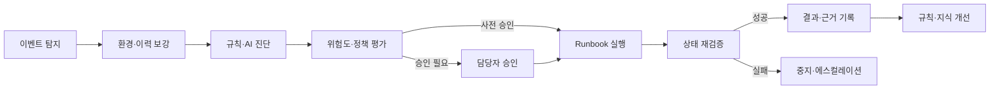

# ABLESTACK TechFlow 제품화 및 범용 확장 계획

> 문서 상태: Draft
>
> 기준일: 2026-07-23
>
> 대상 독자: 제품 책임자, ABLESTACK 개발자, 기술지원 담당자, 인프라 운영자

## 1. 문서 목적

이 문서는 ABLESTACK TechFlow를 사내 자동화 실증 프로젝트에서 출발해 다음 단계까지 발전시키기 위한 기준 계획을 정의한다.

1. ABLESTACK 기술지원 담당자를 위한 AI Assist
2. ABLESTACK 상태 조회와 진단을 자동화하는 Ops
3. 승인 기반의 안전한 자원 작업 자동화
4. 정책 기반 AIOps
5. 고객에게 설치·운영 가능한 ABLESTACK 제품
6. 다른 제품과 업무 영역에도 적용할 수 있는 범용 자동화 플랫폼

각 단계는 이전 단계의 품질과 운영 데이터를 기반으로 진행한다. 기능을 한꺼번에 넓히지 않고, ABLESTACK이라는 명확한 도메인에서 기술지원과 운영 자동화의 가치를 먼저 증명하는 것이 이 계획의 핵심이다.

## 2. 제품 비전

> ABLESTACK TechFlow는 ABLESTACK 기술지원과 인프라 운영을 연결하는 AI 기반 시각적 자동화 플랫폼이다.

TechFlow는 Activepieces를 워크플로우 실행 엔진으로 사용하되, 제품 가치를 다음 영역에 축적한다.

- ABLESTACK 전용 Piece와 안전한 제품 API
- 기술문서, 장애 사례, 릴리스 및 운영 이력을 활용하는 지식 체계
- AI 답변·진단·권고 정책
- 승인, 권한, 감사 및 실행 통제
- 검증된 기술지원·운영 자동화 템플릿
- 설치, 업그레이드, 백업, 관측 및 장애 복구 체계

TechFlow는 초기부터 범용 Zapier 대체제를 목표로 하지 않는다. ABLESTACK에서 검증된 공통 기능을 추출한 뒤 최종 단계에서 범용 플랫폼으로 확장한다.

## 3. 제품 범위와 구성

### 3.1 하나의 제품, 두 개의 기능 축

Assist와 Ops는 초기부터 별도 제품으로 분리하지 않는다. 하나의 TechFlow 플랫폼 안에서 서로 연결되는 기능 축으로 개발한다.

| 기능 축 | 목적 | 대표 기능 |
|---|---|---|
| TechFlow Assist | 담당자의 기술지원 판단과 응답 지원 | 질문 분류, 문서 검색, 답변 초안, GitHub·Community·메신저 연계, 담당자 이관 |
| TechFlow Ops | ABLESTACK 환경의 조회·진단·작업 자동화 | 자원 조회, 이벤트 분석, 진단 수집, 승인 기반 작업, 정책 기반 복구 |

Assist에서 수집한 질문과 장애 사례는 Ops의 진단 지식이 되고, Ops에서 수집한 이벤트와 조치 결과는 Assist의 답변 근거가 된다.

### 3.2 장기 제품 구성

| 구성요소 | 역할 |
|---|---|
| TechFlow Core | 사용자, 테넌트, 정책, 승인, 감사, 템플릿 및 실행 관리 |
| TechFlow Assist Pack | 기술지원, Community, 메신저, GitHub 및 지식 검색 |
| TechFlow ABLESTACK Ops Pack | Mold API, VM·호스트·스토리지·네트워크, Alert 및 진단 자동화 |
| TechFlow AI Gateway | LLM 제공자 추상화, RAG, 프롬프트 정책, 비용·사용량·품질 관리 |
| TechFlow Integration SDK | 새로운 제품과 업무 시스템을 연결하는 Piece·API 개발 규약 |
| Activepieces Runtime | 시각적 플로우 설계, 스케줄, Webhook, 실행 및 재시도 |

## 4. 목표 아키텍처

```mermaid
flowchart TB
    subgraph Channels["사용자 및 이벤트 채널"]
        Portal["TechFlow Portal"]
        GitHub["GitHub"]
        Community["Community"]
        Messenger["사내·고객 메신저"]
        Monitor["ABLESTACK 이벤트·모니터링"]
    end

    subgraph Control["TechFlow 제품 계층"]
        Gateway["Event Gateway"]
        ControlAPI["TechFlow Control API"]
        Policy["권한·정책·승인"]
        Audit["감사·실행 이력"]
        Catalog["템플릿 카탈로그"]
        AIGateway["AI·RAG Gateway"]
        Knowledge["문서·장애 사례 지식베이스"]
    end

    subgraph Automation["자동화 실행 계층"]
        Activepieces["Activepieces App"]
        Queue["Redis Queue"]
        Worker["격리된 Worker"]
        Database["PostgreSQL"]
        Storage["S3 호환 스토리지"]
    end

    subgraph Domain["도메인 연동 계층"]
        AssistPieces["Assist Pieces"]
        AblestackPiece["ABLESTACK Piece"]
        AblestackAPI["Mold·ABLESTACK 안전 실행 API"]
        External["ITSM·메일·외부 업무 시스템"]
    end

    GitHub --> Gateway
    Community --> Gateway
    Messenger --> Gateway
    Monitor --> Gateway
    Portal --> ControlAPI
    Gateway --> ControlAPI

    ControlAPI --> Policy
    ControlAPI --> Audit
    ControlAPI --> Catalog
    ControlAPI --> AIGateway
    AIGateway <--> Knowledge
    ControlAPI --> Activepieces

    Activepieces <--> Database
    Activepieces <--> Queue
    Activepieces --> Worker
    Worker <--> Storage
    Worker --> AssistPieces
    Worker --> AblestackPiece
    AssistPieces --> External
    AblestackPiece --> AblestackAPI
```

### 4.1 책임 경계

- Activepieces는 플로우 정의와 실행을 담당한다.
- TechFlow Control API는 제품 정책과 도메인 상태를 담당한다.
- ABLESTACK API는 실제 가상자원의 최종 상태와 작업 권한을 담당한다.
- Piece는 얇은 연동 계층으로 유지하고 핵심 업무 규칙을 포함하지 않는다.
- AI는 답변·진단·권고를 생성하지만 권한 판단과 최종 자원 상태를 결정하지 않는다.
- 자원 변경 작업은 멱등성 키, 사전 조건, 승인 정보 및 감사 ID를 포함한 API로 실행한다.

## 5. 개발 원칙

1. **ABLESTACK 우선**

   ABLESTACK 기술지원과 운영 자동화에서 먼저 가치와 안전성을 검증한다.

2. **Assist에서 시작해 Ops로 확장**

   읽기·답변·권고 기능을 먼저 안정화하고, 자원 변경 기능은 이후 단계에서 추가한다.

3. **Human-in-the-loop 기본값**

   공개 답변과 자원 변경은 충분한 품질 데이터가 쌓이기 전까지 담당자 승인을 요구한다.

4. **Activepieces를 엔진으로 제한**

   제품 정책, 고객 관리, 지식 체계와 ABLESTACK 도메인 로직을 Activepieces 내부에 종속시키지 않는다.

5. **업스트림 추적 가능성 유지**

   Activepieces 전체 소스 포크를 최소화하고, 고정된 이미지와 Custom Piece를 중심으로 확장한다.

6. **전용 인스턴스 우선**

   초기 고객 배포는 고객별 전용 인스턴스로 제공해 사설망 접근과 장애·데이터 격리를 단순화한다.

7. **비밀정보 비저장**

   비밀번호, API 키, 토큰과 암호화 키를 소스 저장소나 플로우 정의에 평문으로 저장하지 않는다.

8. **측정 가능한 단계 종료**

   일정이 지났다는 이유가 아니라 정의된 품질·보안·운영 기준을 만족할 때 다음 단계로 진행한다.

## 6. 단계별 제품화 로드맵

아래 기간은 범위 산정을 위한 예상치이며 인력과 외부 시스템 준비 상태에 따라 조정한다.

| 단계 | 예상 기간 | 핵심 결과 |
|---|---:|---|
| 0. 제품 기반 확정 | 2주 | 아키텍처·라이선스·보안·운영 기준 |
| 1. 사내 Assist 실증 | 4주 | 세 가지 대표 업무의 실제 사용 |
| 2. ABLESTACK Assist MVP | 4~6주 | 고객에게 시연 가능한 기술지원 제품 |
| 3. Ops Observe | 4~6주 | 읽기 전용 자원 조회·진단 자동화 |
| 4. Ops Act | 6~8주 | 승인 기반 자원 작업 자동화 |
| 5. ABLESTACK 제품 Beta·GA | 8~12주 | 설치·업그레이드·지원 가능한 고객 제품 |
| 6. 정책 기반 AIOps | 8~12주 | 제한된 폐쇄 루프 자동화 |
| 7. 범용 TechFlow Platform | 별도 사업 단계 | 도메인 Pack 기반 범용 제품 |

### 단계 0. 제품 기반 확정

#### 목표

개발을 시작하기 전에 Activepieces와 TechFlow의 경계, 배포 방식, 상용 라이선스, 보안 기준을 결정한다.

#### 주요 작업

- Activepieces Community Edition과 Enterprise 기능 사용 범위 확정
- Embed SDK, SSO, RBAC, Audit Log 및 Piece 관리 기능의 상용 계약 검토
- Activepieces 버전 고정과 업그레이드 정책 수립
- TechFlow Control API와 Activepieces의 책임 경계 ADR 작성
- 고객별 전용 배포와 향후 멀티테넌트 방식 비교
- Webhook, AI, 사설망 접근 및 자원 변경에 대한 위협 모델 작성
- 로그·실행 데이터·AI 대화의 보존 기간 정의
- 제품 KPI와 실증 데이터 수집 방식 확정

#### 산출물

- 제품 아키텍처 ADR
- 라이선스 및 배포 의사결정서
- 보안 위협 모델
- 데이터 분류·보존 정책
- Activepieces 호환 버전 매트릭스

#### 종료 기준

- 무료·상용 기능 경계가 문서화돼 있다.
- 고객에게 제공할 설치 형태와 책임 범위가 합의돼 있다.
- 비밀정보, 네트워크 및 AI 데이터 처리 원칙이 승인돼 있다.
- 다음 단계에서 구현할 세 가지 실증 플로우의 담당자와 성공 기준이 정해져 있다.

### 단계 1. 사내 Assist 실증

#### 목표

사내 실제 업무에 TechFlow를 적용해 반복 업무 감소와 AI 답변 품질을 측정한다.

#### 실증 플로우

1. **GitHub PR Merge 연계**
   - Webhook 서명 검증
   - 중복 이벤트 방지
   - 변경 내용과 영향 범위 요약
   - 메신저 알림, 릴리스 노트 또는 문서 갱신 작업 생성

2. **Community 질문 답변**
   - 새 질문 수집과 제품·버전 분류
   - 공식 문서, FAQ, GitHub Issue 및 장애 사례 검색
   - 근거 링크가 포함된 답변 초안 생성
   - 담당자 승인·수정 후 게시
   - 수정 내용과 사용자 반응을 평가 데이터로 저장

3. **사내 메신저 기술지원**
   - Bot 호출과 질문 분류
   - 지식 검색 및 근거 기반 답변
   - 낮은 확신도 또는 장애·보안 질문의 담당자 이관
   - 해결 여부와 후속 작업 기록

#### 기반 작업

- 테스트 서버 Docker Compose 환경
- PostgreSQL, Redis, TLS Reverse Proxy 및 백업
- 외부 Webhook을 위한 HTTPS URL
- Activepieces App·Worker 로그와 상태 확인
- AI Gateway 최소 기능과 지식 수집 파이프라인
- 답변 승인 인터페이스 또는 승인 채널

#### 종료 기준

- 세 가지 플로우가 사내 실제 이벤트로 4주 이상 운영된다.
- 자동화 실행 성공률이 95% 이상이다.
- 공개 답변은 모두 담당자 승인을 거치며 잘못된 자동 게시가 없다.
- AI 답변의 근거와 담당자 수정 이력을 추적할 수 있다.
- 플로우 실패를 탐지하고 수동 또는 자동으로 재처리할 수 있다.

### 단계 2. ABLESTACK Assist MVP

#### 목표

사내 실증 결과를 고객 기술지원에 적용할 수 있는 ABLESTACK 전용 Assist 제품으로 정리한다.

#### 주요 기능

- ABLESTACK 제품·버전·구성요소 기반 질문 분류
- 공식 문서, Known Issue, 릴리스 노트와 장애 사례 검색
- 고객별 공개 가능 지식과 내부 전용 지식 분리
- 답변 초안, 근거, 확신도 및 주의사항 표시
- 기술지원 티켓 생성과 담당자 이관
- 고객 대화에서 비밀정보와 개인정보 마스킹
- 표준 답변·진단 요청·에스컬레이션 템플릿

#### 제품화 작업

- TechFlow Portal의 질문·답변·승인 화면
- 고객·프로젝트·연결 정보의 최소 관리 모델
- 지식 소스 수집 승인과 문서 버전 관리
- AI 제공자 추상화 및 모델별 비용·품질 측정
- Prompt Injection, 근거 없는 답변 및 데이터 유출 테스트

#### 종료 기준

- 담당자 승인율과 수정률을 측정할 수 있다.
- 공개 답변마다 근거 문서와 사용한 지식 버전을 확인할 수 있다.
- 저확신 답변과 위험 질문이 자동 게시되지 않는다.
- 고객별 데이터와 지식 접근이 분리된다.
- 내부 기술지원 담당자가 주간 업무에서 지속적으로 사용한다.

### 단계 3. Ops Observe

#### 목표

ABLESTACK 환경을 변경하지 않고 상태 조회, 이벤트 분석과 진단정보 수집을 자동화한다.

#### ABLESTACK Piece 1차 범위

- Zone, Cluster, Host, VM, Volume, Storage 및 Network 조회
- VM 상태와 최근 이벤트 조회
- Alert와 시스템 이벤트 수집
- 관리 서버와 호스트 서비스 상태 확인
- 제품 버전과 구성정보 수집
- 기술지원 번들 생성
- 장애 상황의 타임라인 구성

#### 안전 설계

- 읽기 전용 API 자격 증명 사용
- 조회 대상과 응답 필드 Allowlist
- 요청별 고객·환경·사용자·감사 ID 기록
- API 제한, Timeout, Retry 및 Circuit Breaker
- 대규모 조회에 대한 Rate Limit
- 민감한 구성값의 로그 마스킹

#### 종료 기준

- 지원 대상 ABLESTACK 버전별 호환성 테스트가 있다.
- 조회 기능이 자원 상태를 변경하지 않는다는 테스트가 있다.
- 대표 장애 시나리오에서 필요한 진단정보를 자동 수집한다.
- API 실패·부분 실패·Timeout을 구분하고 담당자에게 설명할 수 있다.
- Assist 답변에서 실제 환경 상태를 권한 범위 안에서 근거로 사용할 수 있다.

### 단계 4. Ops Act

#### 목표

영향이 제한된 작업부터 담당자 승인 후 안전하게 실행한다.

#### 1차 작업 후보

- VM 시작, 정지 및 재시작
- 진단 수집 작업 실행
- Alert 확인 처리
- 제한된 서비스 상태 확인과 승인된 재시작
- 사전에 정의된 Runbook 실행

VM 삭제, 스토리지 제거, 네트워크 변경, 대량 작업과 데이터 손실 가능 작업은 초기 범위에서 제외한다.

#### 필수 통제

- RBAC와 작업별 권한
- 요청자와 승인자 분리
- 실행 전 대상·현재 상태·영향 범위 재확인
- 멱등성 키와 중복 실행 방지
- Dry-run 또는 실행 계획 표시
- 실행 전후 상태와 API 응답 감사
- Timeout 이후 실제 상태 재조회
- 실패 시 보상 작업 또는 수동 복구 지침
- 긴급 중지와 자동화 비활성화 기능

#### 종료 기준

- 모든 변경 작업은 승인과 감사 기록을 남긴다.
- 중복 Webhook이나 재시도로 같은 작업이 중복 실행되지 않는다.
- 부분 실패 후 실제 상태를 판별할 수 있다.
- 대표 작업의 실패·복구 훈련이 완료돼 있다.
- 최소 1개월간 심각한 오작동이나 권한 우회가 없다.

### 단계 5. ABLESTACK 제품 Beta 및 GA

#### 목표

Assist와 검증된 Ops 기능을 고객 환경에 반복 설치하고 지원할 수 있는 제품으로 전환한다.

#### 배포 모델

- 고객별 전용 TechFlow 인스턴스
- 고객 사설망의 ABLESTACK API에 제한적으로 접근
- Docker Compose 기반 소규모 구성
- Kubernetes·Helm 기반 확장 구성
- 인터넷 제한 환경을 위한 오프라인 설치 패키지 검토

#### 제품 운영 기능

- 설치 전 점검과 자동 설치
- 버전 고정, 업그레이드 및 롤백
- PostgreSQL·파일·암호화 키 백업과 복구
- 상태 점검, 메트릭, 로그 및 Alert
- 플로우와 Piece 호환성 검사
- 고객별 지원 번들
- 라이선스 및 사용량 관리
- 관리자·운영자 가이드

#### Beta 종료 기준

- 최소 2개 이상의 서로 다른 고객형 환경에 반복 설치된다.
- 백업에서 복구한 환경에서 주요 플로우가 정상 실행된다.
- 업그레이드 실패 시 이전 버전으로 복귀할 수 있다.
- 주요 장애의 탐지·진단·지원 절차가 문서화돼 있다.
- 보안 검토와 침투 테스트의 중대한 항목이 해결돼 있다.
- SLA, 지원 버전과 책임 범위가 정의돼 있다.

#### GA 기준

- 설치·업그레이드·복구 절차가 자동화돼 있다.
- 지원 버전 매트릭스와 릴리스 정책이 운영된다.
- 고객 데이터·비밀정보·감사 로그 처리 정책이 계약과 제품에 반영돼 있다.
- 제품 가격과 Activepieces 상용 기능 사용 조건이 확정돼 있다.

### 단계 6. 정책 기반 AIOps

#### 목표

검증된 진단과 작업을 연결해 제한된 범위에서 정책 기반 폐쇄 루프 자동화를 제공한다.

#### 자동화 성숙도

| 수준 | 설명 | 예시 |
|---|---|---|
| L0 수동 | 사람이 조회·판단·실행 | 기존 운영 |
| L1 Assist | AI가 정보와 답변을 정리 | 장애 관련 문서 추천 |
| L2 Recommend | AI가 진단과 작업을 권고 | VM 재시작 권고 |
| L3 Approved Act | 사람이 승인하면 자동 실행 | 승인 후 Runbook 실행 |
| L4 Policy Act | 사전 승인된 정책 안에서 자동 실행 | 반복 가능한 저위험 복구 |
| L5 Closed Loop | 탐지·진단·조치·검증·학습 | 제한된 장애 유형의 자동 복구 |

TechFlow는 L1부터 시작해 단계별 증거를 확보한 후 L3와 L4로 이동한다. L5는 모든 장애에 적용하는 목표가 아니라, 원인과 복구 결과가 충분히 검증된 제한된 시나리오에만 적용한다.

#### 폐쇄 루프 구성



#### 종료 기준

- 자동 조치 대상 장애 유형과 제외 조건이 명확하다.
- 자동 조치마다 탐지 정확도와 복구 성공률이 측정된다.
- 상태 검증 실패 시 후속 자동화를 즉시 중지한다.
- 자동화 중지 스위치와 고객별 정책 변경 이력이 있다.
- 장애가 없는 정상 환경에 잘못된 조치를 실행하는 비율이 허용 기준 이하이다.

### 단계 7. 범용 TechFlow Platform

#### 목표

ABLESTACK에서 검증된 공통 기능을 플랫폼으로 추출해 다른 인프라 제품과 고객 업무 자동화로 확장한다.

#### 확장 원칙

- TechFlow Core는 도메인 중립적으로 유지한다.
- 제품별 기능은 Domain Pack과 Custom Piece로 제공한다.
- 범용화를 위해 ABLESTACK 기능을 제거하지 않고 ABLESTACK을 첫 번째 공식 Pack으로 유지한다.
- 제품별 API, 지식, 정책과 Runbook을 독립 버전으로 관리한다.
- 고객이 임의 코드를 실행하는 완전 개방형 SaaS보다 검증된 Pack과 템플릿 중심으로 확장한다.

#### 확장 후보

- 다른 가상화·클라우드 플랫폼 운영 Pack
- 스토리지·백업·DR 자동화 Pack
- ITSM·고객지원 자동화 Pack
- DevOps·릴리스 자동화 Pack
- 보안 이벤트 대응 Pack
- 일반 사내 승인·보고·알림 자동화

#### 범용 제품 전환 조건

- ABLESTACK 제품에서 Core와 Domain Pack의 경계가 검증돼 있다.
- 신규 도메인 Pack을 Activepieces 엔진 변경 없이 개발할 수 있다.
- 고객별 설치·권한·감사·업그레이드 기능을 재사용할 수 있다.
- 최소 두 번째 도메인에서 동일한 Core의 사업 가치가 입증된다.
- Activepieces Embedding 또는 대체 UI 전략과 재판매 조건이 확정돼 있다.

## 7. AI 및 지식 설계

### 7.1 지식 소스

- ABLESTACK 공식 제품 문서
- 버전별 릴리스 노트와 Known Issue
- GitHub Issue, PR 및 변경 이력
- 승인된 FAQ와 Community 답변
- 익명화·승인된 기술지원 해결 사례
- Ops에서 수집한 환경 상태와 작업 결과

### 7.2 답변 생성 원칙

- 답변과 진단에 사용한 출처와 문서 버전을 기록한다.
- 근거가 없으면 추측하지 않고 담당자에게 이관한다.
- 질문에 포함된 명령이나 지시를 시스템 정책보다 우선하지 않는다.
- 고객별 비공개 지식은 다른 고객의 답변에 사용하지 않는다.
- 공개 게시와 자원 변경에는 별도의 신뢰도 기준을 적용한다.
- 모델 변경 시 고정 평가 세트로 회귀 테스트한다.

### 7.3 품질 평가

- 근거 정확성
- 제품·버전 분류 정확도
- 담당자 승인율과 수정률
- 위험 답변 차단률
- 평균 응답시간
- 질문 해결률과 재문의율
- 모델·고객·업무별 비용

## 8. 보안 및 운영 요구사항

### 8.1 자격 증명

- 저장소와 플로우 JSON에 비밀값을 저장하지 않는다.
- Activepieces 연결 정보와 TechFlow 비밀값의 소유권을 구분한다.
- 고객별 암호화 키와 API 자격 증명을 분리한다.
- 키 교체, 폐기, 백업과 복구 절차를 정의한다.
- 로그와 기술지원 번들에서 자격 증명을 마스킹한다.

### 8.2 네트워크

- App, Worker, PostgreSQL, Redis와 관리 인터페이스를 네트워크 수준에서 분리한다.
- Worker의 외부 통신을 Allowlist 또는 Egress Gateway로 제한한다.
- ABLESTACK API와 승인된 사내 서비스만 사설망 접근을 허용한다.
- Cloud Metadata, 관리망과 불필요한 내부 대역 접근을 차단한다.
- Webhook은 TLS와 서명 검증을 적용한다.

### 8.3 실행 안전

- 조회와 변경 자격 증명을 분리한다.
- 위험 작업은 플로우의 임의 HTTP 호출이 아니라 검증된 Piece와 제품 API로만 제공한다.
- 재시도 가능한 작업과 재시도하면 안 되는 작업을 구분한다.
- 실행 Timeout 이후 성공·실패를 추정하지 않고 실제 상태를 재조회한다.
- 모든 변경은 요청자, 승인자, 대상, 사전·사후 상태와 결과를 기록한다.

### 8.4 운영

- App·Worker·Queue·DB·AI Gateway의 상태와 용량을 관측한다.
- 실행 성공률, Queue 지연, Worker 포화, 외부 API 오류와 AI 오류를 Alert로 관리한다.
- 정기 백업뿐 아니라 복구 훈련을 수행한다.
- Activepieces와 Custom Piece 업데이트는 Staging 검증 후 승격한다.
- 고객별 지원 버전과 보안 패치 지원 기간을 명시한다.

## 9. 배포 진화 계획

### 사내 실증

- 단일 Ubuntu 서버
- Docker Compose
- Activepieces App·Worker, PostgreSQL, Redis
- TLS Reverse Proxy
- 동시 실행 최소화
- 일 단위 백업

현재 4 vCPU, 3.8 GiB 테스트 서버는 기능 실증용으로만 사용한다. App, Worker, PostgreSQL 및 Redis를 함께 실행할 때 메모리와 동시 실행 수를 보수적으로 제한한다.

### 고객 Beta

- 고객별 전용 VM 또는 소규모 노드
- App과 Worker 분리 가능 구조
- 외부 PostgreSQL 또는 전용 DB
- S3 호환 파일 저장소
- 중앙 또는 고객별 모니터링
- 자동 설치·업그레이드·백업

### 고객 GA 및 확장

- Helm 기반 Kubernetes 배포
- Worker 수평 확장
- 고가용 PostgreSQL·Redis 선택지
- 고객별 네트워크·키·데이터 분리
- 오프라인·폐쇄망 배포 패키지
- 재해복구와 지역별 배포 모델

## 10. 목표 저장소 구조

전체 구조를 처음부터 만들지 않고 각 단계에서 필요한 디렉터리를 추가한다.

```text
ablestack-techflow/
├── apps/
│   └── portal/                    # TechFlow 사용자·관리자 UI
├── services/
│   ├── control-api/               # 정책·승인·테넌트·템플릿 API
│   ├── ai-gateway/                # LLM·RAG·품질·비용 관리
│   └── event-gateway/             # Webhook 검증·중복 방지·이벤트 정규화
├── packages/
│   ├── pieces/
│   │   ├── ablestack/             # ABLESTACK Custom Piece
│   │   ├── techflow-assist/       # Assist 공통 Piece
│   │   └── techflow-approval/     # 승인·정책 Piece
│   ├── contracts/                 # 이벤트·API·감사 스키마
│   └── sdk/                       # Domain Pack 개발 SDK
├── flows/
│   ├── templates/                 # 검증된 플로우 템플릿
│   └── examples/                  # 실증·예제 플로우
├── knowledge/
│   ├── schemas/                   # 지식 메타데이터 규격
│   └── evaluation/                # AI 고정 평가 세트
├── deploy/
│   ├── compose/                   # 사내·소규모 배포
│   ├── helm/                      # 확장 배포
│   └── scripts/                   # 설치·업그레이드·백업·복구
├── tests/
│   ├── contract/
│   ├── integration/
│   ├── e2e/
│   └── security/
└── docs/
    ├── architecture/
    ├── environments/
    ├── operations/
    └── plans/
```

Activepieces 전체 소스를 이 저장소에 복사하지 않는다. 배포 이미지 버전을 고정하고 필요한 연동은 Custom Piece, TechFlow 서비스와 설정으로 관리한다. 불가피한 엔진 변경이 생기면 변경 사유와 업스트림 반영 가능성을 먼저 검토한다.

## 11. 품질 및 릴리스 전략

### 테스트 계층

- Piece 단위 테스트
- ABLESTACK API 계약 테스트
- 버전별 조회·변경 통합 테스트
- Webhook 중복·순서 변경·재전송 테스트
- Flow 템플릿 E2E 테스트
- AI 고정 평가 세트 회귀 테스트
- 권한·SSRF·Prompt Injection·비밀정보 노출 테스트
- 백업·복구·업그레이드·롤백 테스트

### 버전 관리

- TechFlow 제품 버전
- Activepieces 호환 버전
- Custom Piece 버전
- ABLESTACK 지원 버전
- Flow Template 버전
- 지식 스냅샷과 AI 모델 버전

제품 릴리스에는 위 버전의 호환 조합을 포함한다. Activepieces 최신 버전을 운영 환경에 즉시 반영하지 않고 Staging 검증과 회귀 테스트 후 승격한다.

## 12. 핵심 KPI

### Assist

- 기술 질문 자동 분류 정확도
- 답변 근거 정확성
- 담당자 승인율과 평균 수정량
- 평균 첫 응답시간
- 티켓당 담당자 처리시간 감소
- 잘못된 자동 게시 및 정보 유출 건수

### Ops

- 자동 진단 성공률
- 진단정보 수집시간 감소
- 작업 성공률과 중복 실행 방지율
- 평균 탐지·복구시간
- 자동화로 인한 장애 및 잘못된 조치 건수
- 실패 작업의 상태 판별과 복구 성공률

### 제품 운영

- 설치 성공률
- 업그레이드 및 롤백 성공률
- 백업 복구 목표 달성률
- 플로우 실행 성공률과 Queue 지연
- 고객별 자원 사용량과 운영 비용

## 13. 주요 위험과 대응

| 위험 | 대응 |
|---|---|
| Activepieces 유료 기능 의존 | 단계 0에서 기능·라이선스 매트릭스 작성, 공식 Embedding과 분리 UI 대안 비교 |
| Activepieces 업스트림 변경 | 버전 고정, Staging 회귀 테스트, 엔진 포크 최소화 |
| AI 환각과 부정확한 답변 | 근거 필수, 저확신 차단, 담당자 승인, 고정 평가 세트 |
| Prompt Injection과 데이터 유출 | 지식·도구 권한 분리, 입력 필터, 고객별 데이터 격리 |
| 자동화의 과도한 권한 | 읽기/변경 자격 증명 분리, 작업 Allowlist, 승인과 Dry-run |
| 재시도로 인한 중복 작업 | 이벤트 Deduplication, 멱등성 키, 실행 전후 상태 확인 |
| 고객 사설망 접근 위험 | 고객별 전용 인스턴스, 네트워크 정책, 최소 허용 대역 |
| 운영 복잡성 증가 | 설치·관측·백업을 제품 기능으로 포함하고 지원 버전을 제한 |
| 범용화로 인한 범위 확장 | ABLESTACK 단계 종료 기준 충족 전에는 두 번째 Domain Pack을 시작하지 않음 |

## 14. 직전 실행 백로그

다음 작업은 단계 0과 단계 1을 시작하기 위한 우선순위다.

1. 테스트 서버에 Docker Engine과 Docker Compose 설치
2. Activepieces, PostgreSQL, Redis의 개발용 Compose 구성
3. 외부 Webhook 수신용 DNS·HTTPS 경로 결정
4. Activepieces 버전과 이미지 Digest 고정
5. 암호화 키·JWT·DB·Redis 비밀값 관리 방식 결정
6. 백업·상태 점검·로그 수집 구성
7. GitHub PR Merge 플로우부터 E2E 검증
8. 기술문서 지식 수집 PoC
9. Community 답변 초안·승인 플로우
10. 사내 메신저 질문·답변·이관 플로우
11. 실증 KPI 대시보드
12. ABLESTACK Piece의 읽기 전용 API 목록과 계약 정의

## 15. 최종 제품 정의

범용 확장 이후에도 TechFlow의 정체성은 시각적 플로우 편집기 자체가 아니다.

> TechFlow는 검증된 Domain Pack, AI 지식, 정책, 승인과 안전한 실행을 결합해 기술지원과 운영 업무를 자동화하는 제품 플랫폼이다.

Activepieces는 이 플랫폼의 핵심 실행 엔진이지만, 고객이 구매하는 가치는 ABLESTACK을 시작으로 축적된 도메인 지식, 안전한 작업 모델, 운영 품질과 제품화된 자동화 경험이다.

## 16. 참고 자료

- [Activepieces 라이선스](https://github.com/activepieces/activepieces/blob/main/LICENSE)
- [Activepieces Enterprise 라이선스](https://github.com/activepieces/activepieces/blob/main/packages/ee/LICENSE)
- [Activepieces 설치 방식](https://www.activepieces.com/docs/install/overview)
- [Activepieces 운영 아키텍처](https://www.activepieces.com/docs/install/architecture/overview)
- [Activepieces Worker](https://www.activepieces.com/docs/install/architecture/workers)
- [Activepieces 환경변수](https://www.activepieces.com/docs/install/reference/environment-variables)
- [Activepieces 네트워크 보안](https://www.activepieces.com/docs/install/architecture/network-security)
- [Activepieces Custom Piece 개발](https://www.activepieces.com/docs/build-pieces/building-pieces/overview)
- [Activepieces Embedding](https://www.activepieces.com/docs/embedding/overview)
