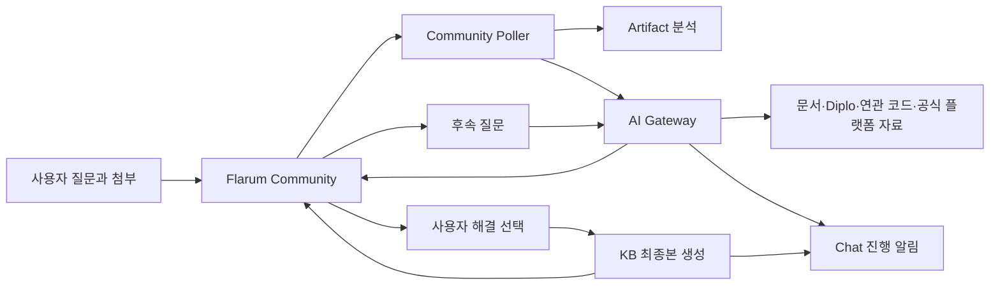

# Epic #70 Flarum Community 플랫폼 현대화 완료 보고서

## 1. 결론

Epic #70의 네 작업 축인 Flarum 1.8.18 업데이트, 대용량 첨부, Community UI 현대화, 백업·모니터링·보안 운영 강화를 운영 환경에 반영하고 통합 E2E까지 완료했다. 최종 판정은 **GO**다.

- Issue #71~#74 완료
- AI Gateway 153개, Community Theme·Operations 22개 테스트 통과
- 운영 Discussion [#174](https://community.ablecloud.io/d/174)에서 이미지·로그 ZIP·AI 자동 답변·Chat 알림·후속 대화·해결 선택·KB 최종본을 실증
- GitHub→Chat 보호 서비스는 컨테이너 ID·이미지·시작 시각이 작업 전후 동일하며 Guard가 두 번 모두 통과

## 2. 통합 구조

## 3. 운영 E2E 결과

| 단계 | 운영 증적 | 결과 |
|---|---|---|
| 인증된 토론 생성 | 관리자 API Actor `userId=1`, Discussion #174, Post #404 | PASS |
| 이미지 첨부 | Upload #152, PNG | PASS |
| 로그 압축 첨부 | Upload #153, ZIP | PASS |
| 첫 AI 답변 | Post #405, 자동 게시 | PASS |
| 첫 Chat 알림 | 1회 전송, 오류 0 | PASS |
| 맥락 유지 후속 질문 | Post #406, 같은 Case ID 유지 | PASS |
| 후속 AI 답변 | Post #407, `draftVersion=2` | PASS |
| 후속 Chat 알림 | 1회 전송, 오류 0 | PASS |
| 사용자의 해결 선택 | Post #407 선택, `conversationState=RESOLVED` | PASS |
| KB 최종본 | Post #408 생성 | PASS |
| 최종 솔루션 지정 | Best Answer가 Post #408로 자동 전환 | PASS |
| KB Chat 알림 | 1회 전송, 오류 0 | PASS |

Case ID는 `328f88e4-a7dd-45e5-9a57-2fe664016f9f`이며 첫 질문부터 KB 생성까지 `contextVersion=5`로 이어졌다.

## 4. 답변 품질 확인

첫 답변은 첨부 이미지와 합성 로그를 함께 분석해 QEMU의 잔존 VNC 세션 가능성을 우선 원인으로 제시했다. 후속 질문에서는 기존 맥락을 유지한 채 서비스 중단을 줄이는 라이브 마이그레이션을 우선 안내하고, 실행 전·중·후에 필요한 `virsh`·QMP·로그 확인 명령을 구체화했다.

내부 분석은 다음 자료를 모두 조회했다.

1. ABLESTACK 문서
2. 현재 출시 코드인 Cloud Diplo
3. Wall, Cockpit Plugin, Genie, Kickstart, QEMU Exec Tools
4. 미출시 개선 참고용 Cloud Europa Preview
5. libvirt/QEMU 공식 문서와 승인된 운영 지식

사용자에게는 내부 경로·Commit·Citation을 노출하지 않았고, 최종 KB는 `증상 / 원인 / 해결 방법 / 추가 고려사항 / 적용 버전` 구조와 `ABLESTACK Diplo` 표기를 사용했다.

## 5. 브라우저 검증

Codex 내장 브라우저에서 공개 Discussion #174를 직접 열어 다음 항목을 확인했다.

- 제목과 해결 상태 표시
- 이미지와 로그 ZIP 표시
- 첫 답변과 후속 질문·답변 표시
- 적용 버전을 포함한 KB Post #408 표시
- 최종 Best Answer가 KB Post #408을 가리킴

화면 증적은 `docs/evidence/epic-70/community-discussion-174.jpg`에 보관한다.

## 6. 운영 기반 확인

Issue #74 결과를 최신 UI와 함께 다시 검증했다.

- Nginx·PHP-FPM·MariaDB 3/3 active
- Community Local/Public·AI HTTP 200/200/200
- Backup·Monitor Timer active, Backup integrity true
- WSL 격리 복원 32 Table, 11,336 File, RTO 11초
- 보안 Header 5개, world-writable file 0개
- 정상 상태 주기 알림 0건, 장애와 복구 전이에만 Chat 알림

## 7. 보호 서비스 불변성

GitHub→Chat Webhook 서비스는 E2E 범위에서 제외했고 읽기 전용 Guard만 수행했다.

| 항목 | 작업 전후 값 |
|---|---|
| Container ID | `bf5c76824dbf...804b4c` |
| Image ID | `sha256:ae33662e...63670e` |
| Started At | `2026-08-10T07:05:05.417216322Z` |
| Health | healthy |
| Guard | passed / passed |

## 8. 완료 판정

Epic #70의 완료 기준을 모두 충족했다. 운영 데이터 흐름과 UI가 함께 검증됐고, 장애 복구·보안·롤백 자산도 재현 가능한 상태다. 남은 별도 검토 대상은 Draft PR #65의 변경분을 최신 `main` 기준으로 정리하고 품질·통합 결과를 최종 리뷰하는 작업이다.

## 9. 자산 목록

- 구조화 증적: `docs/evidence/epic-70/community-modernization-e2e.json`
- 화면 증적: `docs/evidence/epic-70/community-discussion-174.jpg`
- 운영 Runbook: `docs/runbooks/community-platform-integrated-e2e.md`
- 보고서: `output/pdf/techflow-community-modernization-report.pdf`
- 발표자료: `output/presentation/techflow-community-modernization.pptx`
- 발표자료 PDF: `output/pdf/techflow-community-modernization-presentation.pdf`
