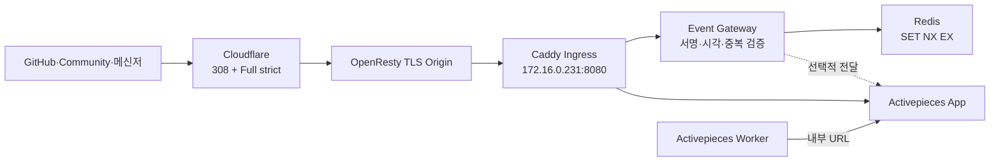

# Issue #14 HTTPS·Webhook 접속 경로 완료 보고서

## 1. 결론

`techflow.ablecloud.io`의 HTTP 요청은 경로와 쿼리를 보존하는 HTTPS `308` 응답으로 전환되며, 외부 HTTPS UI와 Health는 유효한 TLS로 `200`을 반환한다. Webhook Gateway는 HMAC 서명, 300초 Timestamp, Redis 기반 Event ID 중복 방지를 모두 통과한 요청만 `202`로 수락한다.

테스트 서버에는 App, Worker, PostgreSQL, Redis, Event Gateway와 Caddy Ingress의 6개 서비스가 배포되었다. 서비스 재시작과 서버 재부팅 이후에도 Health, Worker Polling, HTTP→HTTPS 전환과 서명 Webhook 검증이 모두 복구되었다.

## 2. 완료 범위

| 범위 | 결과 |
|---|---|
| TLS | Cloudflare에서 Origin까지 호스트 한정 `Full (strict)` 적용 |
| HTTP 전환 | `308`, 경로·쿼리 보존 |
| DNS·Proxy | Cloudflare Proxy와 공개 Origin 경로 확인 |
| Ingress | Caddy가 UI와 Webhook Gateway 경로 분리 |
| Webhook 보안 | HMAC-SHA256, Timestamp, Event ID 중복 방지 |
| 접근 제한 | DB·Redis·외부 8080 비공개 |
| 복구 | Ingress 재시작·서버 재부팅 후 재검증 통과 |
| 자산화 | Compose, Gateway, 스크립트, Runbook, JSON, PDF, PPTX |

## 3. 최종 아키텍처

Cloudflare의 Zone 전체 SSL 설정은 변경하지 않았다. `techflow.ablecloud.io`만 대상으로 Origin TLS 규칙과 Redirect 규칙을 추가해 영향 범위를 제한했다.

## 4. 구현 자산

| 자산 | 역할 |
|---|---|
| `compose.yml` | 6개 서비스와 내부·외부 Network 구성 |
| `ingress/Caddyfile` | Webhook 경로와 App 경로 분기, 보안 헤더 |
| `event-gateway/gateway.py` | 서명·Timestamp·중복 검증과 선택적 전달 |
| `event-gateway/test_gateway.py` | Gateway 단위 검증 |
| `configure-ingress.sh` | 공개 URL·Gateway 설정과 Secret 안전 생성 |
| `verify-webhook.sh` | 서명 및 거부 시나리오 자동 검증 |
| `verify-ingress.sh` | Redirect, HTTPS Health와 Webhook 통합 검증 |
| `healthcheck.sh` | 6개 서비스, 내부 Health와 Worker Polling 검증 |

배포 자산과 서버 파일의 SHA-256 일치를 확인했다. Secret은 서버 `.env`에만 권한 `0600`으로 저장되며 저장소에는 값이 없는 계약만 유지한다.

## 5. 검증 결과

| ID | 검증 | 기대값 | 결과 |
|---|---|---|---|
| V1 | 외부 HTTP 전환 | `308`, HTTPS Location | PASS |
| V2 | 외부 HTTPS UI·TLS | `200`, 인증서 검증 | PASS |
| V3 | 외부·내부 Health | `200` | PASS |
| V4 | 유효 서명 Webhook | `202` | PASS |
| V5 | 중복 Event ID | `409` | PASS |
| V6 | 잘못된 서명 | `401` | PASS |
| V7 | 오래된 Timestamp | `401` | PASS |
| V8 | 필수 헤더 누락 | `400` | PASS |
| V9 | Gateway 단위 테스트 | 4개 성공 | PASS |
| V10 | Ingress·Gateway 재시작 | 자동 복구·재검증 | PASS |
| V11 | 서버 재부팅 | 6개 서비스·Webhook 복구 | PASS |
| V12 | Secret 로그 노출 검사 | 0건 | PASS |

HTTP 전환은 임의 경로와 쿼리를 사용해 Location 보존도 확인했다. 공개 `211.115.222.251:80`과 `:443`은 응답하지만 `:8080`은 공개되지 않으며, PostgreSQL과 Redis도 호스트 포트를 열지 않는다.

## 6. 발견 사항과 조치

### 6.1 호스트별 Origin TLS 고정

기존 Cloudflare Zone 설정은 자동 모드였고 TechFlow Origin 경로에 엄격한 TLS 적용이 보장되지 않았다. 다른 서비스에 영향을 주지 않도록 Zone 전체 모드는 유지하고 `techflow.ablecloud.io` 호스트만 `Full (strict)`로 고정했다.

### 6.2 HTTP 전환의 메서드 보존

Webhook POST를 `301` 또는 `302`로 전환하면 클라이언트 구현에 따라 메서드가 바뀔 수 있다. 호스트 전용 `308` 규칙으로 경로, 쿼리, 메서드 의미를 보존했다.

### 6.3 Worker 내부 연결 분리

App의 공개 기준 URL을 HTTPS로 변경하면 Worker도 공개 경로를 통해 Socket.IO에 연결하려 했다. Worker에만 `http://app:80`을 Override해 내부 실행 경로를 고정하고 외부 Edge 의존성을 제거했다.

## 7. 보안 판정

- HMAC Secret이 없는 요청과 검증 실패 요청은 Activepieces에 도달하지 않는다.
- Timestamp 허용차는 300초, Event ID 중복 방지 TTL은 86,400초다.
- 중복 상태 저장소인 Redis가 실패하면 Gateway는 Fail Closed 한다.
- Gateway는 비루트·읽기 전용·`no-new-privileges`로 실행한다.
- Body, 서명과 Secret은 로그에 기록하지 않는다.
- Cloudflare 규칙은 TechFlow 호스트에만 적용했다.
- 고객 공개 여부는 제품 책임자의 별도 의사결정이며 구현 완료 판정에 영향을 주지 않는다.

## 8. 복구 검증

Ingress와 Event Gateway만 재시작한 뒤 전체 Health와 외부 Webhook 검증을 다시 수행했다. 이어 서버를 재부팅하고 Boot Time `2026-07-31 03:33:24`를 확인한 후 6개 서비스 `healthy`, Worker Polling 준비, 외부 HTTP `308`, HTTPS `200`, Webhook `202/409/401/401/400`을 다시 확인했다.

## 9. 완료 판정

Issue #14의 완료 기준인 “HTTPS를 통한 서명된 테스트 Webhook 수신”과 “테스트·운영 절차 및 보안 영향 문서화”를 모두 충족했다. 다음 실행 순서는 Issue #15의 Secret 수명주기 확정 후 Issue #19의 GitHub PR Merge Webhook Flow 실증이다.

## 10. 참조

- [GitHub Issue #14](https://github.com/ablecloud-team/ablestack-techflow/issues/14)
- [HTTPS·Webhook Ingress 운영 Runbook](../runbooks/https-webhook-ingress.md)
- [구조화 검증 기록](../decisions/https-webhook-ingress.json)
- [ADR-0001](../adr/0001-techflow-activepieces-responsibility-boundary.md)
