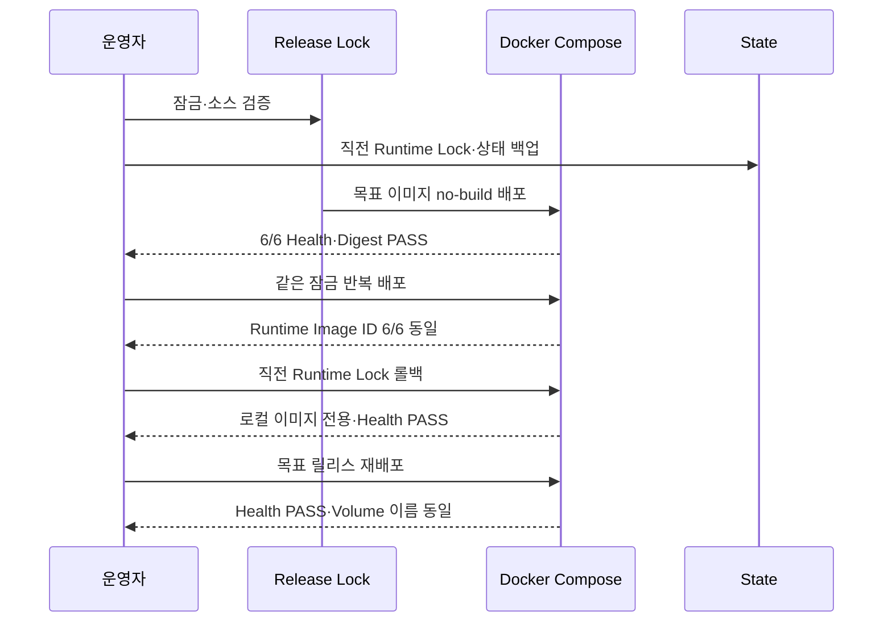

# Issue #18 Activepieces 버전·이미지 Digest 고정 완료 보고서

## 1. 결론

TechFlow 테스트 서버의 여섯 Compose 서비스를 검토된 불변 이미지 조합으로 고정하고, 동일 설정 반복 배포와 직전 버전 무빌드 롤백을 실제 서버에서 검증했다.

2026-07-31 UTC 기준 외부 이미지는 Tag+Registry Digest, 자체 Event Gateway는 사전 빌드 로컬 Image ID로 고정했다. 목표 릴리스 `techflow-m0-2026.07.31` 배포 후 6/6 서비스가 Healthy였고, 외부 HTTPS는 200, Observer 경보는 0건이었다. 반복 배포와 최종 재배포의 여섯 Runtime Image ID는 모두 동일했고 세 영속 Volume 이름도 유지됐다.

## 2. 구현 결과

| 영역 | 결과 |
|---|---|
| 릴리스 기준 | `image-lock.json`, `linux/amd64`, 6개 서비스 |
| Activepieces | App·Worker `0.86.3` 동일 Digest |
| 외부 이미지 | PostgreSQL, Redis, Activepieces, Caddy Tag+Digest 고정 |
| 자체 Gateway | 버전 `0.1.0`, Base Digest, 승인 로컬 Image ID 고정 |
| 배포 | 사전 백업 후 Pull·`up --no-build`·Health·Digest 검증 |
| 롤백 | 직전 Runtime Lock, 로컬 이미지 전용, 무빌드 |
| 이력 | 이전·현재 잠금과 최근 10개 릴리스 잠금 보존 |
| 보안 | 임시 환경 파일, 제한 권한, 릴리스 자산 Secret Scan |
| 자동 검증 | 7개 단위 테스트와 전체 드릴 스크립트 |

## 3. 고정된 이미지

| 서비스 | 버전 | 불변 기준 |
|---|---|---|
| PostgreSQL/pgvector | `0.8.0-pg14` | `sha256:c55d7e7d…995aa767` |
| Redis | `7.0.7` | `sha256:bb474c35…2b97b498` |
| Activepieces App·Worker | `0.86.3` | `sha256:208517c4…e638c6c` |
| Event Gateway | `0.1.0` | Image ID `sha256:1b24e1a2…00613bc` |
| Gateway Base Python | `3.12.11-alpine3.22` | `sha256:efcdfa6a…67d85757` |
| Caddy | `2.8.4-alpine` | `sha256:af32e973…c262c17` |

전체 값은 저장소의 `deploy/compose/activepieces/image-lock.json`을 단일 기준으로 사용한다.

## 4. 실제 서버 검증

- 검증 완료 시각: `2026-07-31T11:38:49Z`
- 환경: Ubuntu 24.04, Docker 29.6.2, Docker Compose 5.3.1
- 배포 경로: `/opt/ablestack-techflow/activepieces`
- 공개 경로: `https://techflow.ablecloud.io/`

| ID | 검증 | 결과 |
|---|---|---|
| V1 | 잠금 형식·Compose·Dockerfile 일치 | PASS |
| V2 | 릴리스 잠금 단위 테스트 7건 | PASS |
| V3 | 외부 Registry Digest 독립 확인 | PASS |
| V4 | 목표 릴리스 6개 이미지 일치 | PASS |
| V5 | 6/6 서비스 Health | PASS |
| V6 | 동일 잠금 반복 배포 Runtime Image ID 6/6 동일 | PASS |
| V7 | 직전 Runtime Lock 무빌드·로컬 전용 롤백 | PASS |
| V8 | 롤백 후 목표 릴리스 복귀 | PASS |
| V9 | 영속 Volume 3개 이름 보존 | PASS |
| V10 | 배포 전 상태 백업 Manifest 존재 | PASS |
| V11 | 외부 HTTPS HTTP 200 | PASS |
| V12 | Observer 6/6, Critical 0, Warning 0 | PASS |
| V13 | 릴리스 자산 Secret 6종, 객체 15개, 유출 0 | PASS |

## 5. 업그레이드·롤백 드릴

드릴 ID는 `issue-18-image-lock`이다. 기록에는 시나리오, 성공 여부와 완료 시각만 저장했으며 비밀번호, Token, Payload와 원문 로그는 저장하지 않았다.

## 6. 자체 Gateway 재현성 판단

고정 Python Base Digest, `SOURCE_DATE_EPOCH=0`, BuildKit provenance 비활성화를 적용하고 no-cache 빌드를 두 번 수행했다. 그러나 COPY 계층과 최종 Image ID가 달라 소스로부터 바이트 단위로 같은 이미지를 재생성한다는 기준은 충족하지 못했다.

이 결과를 숨기지 않고 M0 정책을 다음과 같이 정정했다.

1. 릴리스 Gateway 이미지는 한 번 빌드하고 Image ID를 승인한다.
2. 배포·반복 배포·롤백에서는 빌드를 금지한다.
3. 기대 Image ID가 다르면 배포 전에 중단한다.
4. 제품화 전 승인 Registry에 게시하고 Digest·SBOM·서명·provenance·취약점 검사를 Gate로 추가한다.

따라서 현재 완료 범위는 “같은 승인 이미지를 재현 가능하게 배포·복구”하는 것이며 “임의 환경에서 동일 바이너리를 재빌드”하는 것까지는 아니다.

## 7. 배포 과정 자산화

1. 소스 잠금과 7개 단위 테스트를 검증했다.
2. 외부 이미지 Manifest Digest와 Gateway Base Digest를 확인했다.
3. 기존 서비스의 Runtime Image ID와 Volume 목록을 Baseline으로 캡처했다.
4. 목표 Gateway 이미지를 한 번 빌드하고 Image ID를 잠갔다.
5. 배포 스크립트가 직전 Runtime Lock과 상태 백업을 생성했다.
6. 외부 이미지를 Digest로 Pull하고 목표 릴리스를 `--no-build`로 배포했다.
7. 같은 잠금을 재배포해 여섯 Image ID가 동일함을 비교했다.
8. Baseline Runtime Lock으로 로컬 전용 롤백하고 Health를 확인했다.
9. 목표 릴리스로 복귀해 Image ID와 Volume을 다시 비교했다.
10. 최종 Health, HTTPS, Observer와 Secret Scan을 재검증했다.

구체 명령과 장애 처리 기준은 [이미지 버전 업그레이드·롤백 Runbook](../runbooks/image-version-upgrade-rollback.md)에 자산화했다.

## 8. 보안 영향

- 외부 Tag 변조나 재게시 위험을 Digest 고정으로 차단했다.
- Gateway는 기대 Image ID 불일치 시 Fail Closed 한다.
- 배포 전 상태 백업으로 업그레이드의 데이터 위험을 낮췄다.
- 런타임 잠금과 드릴 증적은 `root:root 0640`으로 제한한다.
- 잠금·이력에는 Secret이나 업무 Payload를 기록하지 않는다.
- 검증 대상 Secret 6종과 릴리스 객체 15개에서 유출은 0건이었다.

현재는 이미지 서명, SBOM, 취약점 차단 정책과 외부 Registry의 장기 가용성을 자동 검증하지 않는다. 이 항목은 고객 배포 전 공급망 Gate로 구현한다.

## 9. 제한과 다음 단계

- M0 Event Gateway는 테스트 서버 로컬 이미지로만 배포 가능하다.
- Source-to-image byte reproducibility는 확보되지 않았다.
- Activepieces나 DB의 Schema downgrade 호환성은 버전별 별도 검토가 필요하다.
- 이미지 취약점과 서명 검사는 아직 배포 차단 Gate가 아니다.
- 단일 호스트이므로 호스트 자체 장애 시 Registry 또는 외부 Artifact 보관소가 필요하다.

다음 단계는 첫 사내 업무 Flow를 대상으로 Webhook 수신부터 AI 보조, 담당자 승인과 업무 시스템 반영까지 End-to-End 경로를 구현하는 것이다. 동시에 제품화 Track에서는 Gateway Registry 게시, SBOM·서명·취약점 검사를 준비한다.

고객 공개 여부는 제품 책임자의 별도 결정이며 본 구현 범위와 완료 판정을 제한하지 않는다.
