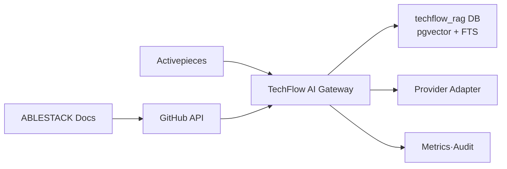

# Issue #20 ABLESTACK 지식 수집 및 RAG PoC 설계 완료 보고서

> 상태: 설계 완료·제품 책임자 검토 대기
>
> 기준일: 2026-08-03
>
> 대상 Issue: [#20](https://github.com/ablecloud-team/ablestack-techflow/issues/20)
>
> 상위 Epic: [#4 P1 사내 Assist 실증](https://github.com/ablecloud-team/ablestack-techflow/issues/4)

## 1. 완료 결론

Epic #3와 M0 Foundation의 최종 승인을 반영해 모두 종료했다. 다음 단계인 Issue #20은 실제 구현에 착수할 수 있도록 아키텍처, Source 범위, API, 데이터 모델, 검색·답변, 보안, 삭제, 평가, 배포·롤백과 작업 의존성을 설계했다.

| 항목 | 설계 결과 |
|---|---|
| RAG 소유권 | 별도 TechFlow AI Gateway |
| Activepieces | 승인·Job·평가·알림 오케스트레이션 |
| 최초 Source | `ablecloud-team/ablestack-docs/docs/**/*.md` |
| 데이터 등급 | P1은 D0만 허용 |
| 저장소 | 기존 PostgreSQL 14/pgvector 0.8.0의 전용 DB·Role |
| 검색 | PostgreSQL FTS + pgvector 정확 검색 + RRF |
| 답변 | Citation 필수, 근거 부족·충돌 시 보류 |
| AI 실행 | Shell·API·Flow·ABLESTACK 작업 금지 |
| 삭제 | 즉시 검색 제외, 파생 데이터 최대 7일 안에 삭제 |
| 작업 분해 | #41~#46 6개 하위 Issue |
| 자동 검증 | 구조화 계약 Validator와 완화 방지 테스트 12건 |

## 2. P0 최종 종료

- [Epic #3](https://github.com/ablecloud-team/ablestack-techflow/issues/3): CLOSED
- `M0 Foundation`: CLOSED
- 최종 상태: 하위 Issue 10건과 Epic을 포함해 `closed 11 / open 0`

승인된 P0 책임·배포·Secret·백업·관측·이미지·보안·데이터 정책을 Issue #20의 상위 Gate로 적용한다.

## 3. Source 조사 결과

GitHub에서 공개 ABLESTACK 저장소를 확인한 결과 최초 지식 Source는 `ablecloud-team/ablestack-docs`가 가장 적합하다.

| 항목 | 값 |
|---|---|
| 저장소 | `ablecloud-team/ablestack-docs` |
| 설명 | ABLESTACK 웹 기반 제품 설명서 |
| 공식 사이트 | `https://docs.ablecloud.io` |
| Branch | `master` |
| 기준 Commit | `50d50ad6c8c548dc58db866ca28b4cbb43cc74d0` |
| `docs/**/*.md` | 276개 |
| 빌드 | MkDocs Material·mike Version |

공개 저장소라는 이유만으로 자동 수집하지 않는다. Repository·Path Allowlist, Commit·Hash, D0 등급, 검역과 운영자 승인을 모두 통과한 Version만 활성화한다.

## 4. 아키텍처 결정



Activepieces가 RAG 정책과 지식 상태를 소유하지 않도록 별도 AI Gateway를 둔다. Community·메신저 Flow는 같은 Query API를 재사용한다. Provider와 Embedding Model은 Adapter·Profile로 격리하며 Credential은 보호 저장소에서 런타임 주입한다.

## 5. API와 상태 계약

설계한 API는 10개다.

- Health 1개
- Source 등록·조회·승인·수집·삭제 5개
- Job 조회 1개
- RAG Query 1개
- Evaluation 실행·조회 2개

변경 API는 Idempotency Key를 요구한다. Query 결과는 `ANSWERED`, `ABSTAINED`, `FAILED`만 사용하며, Citation이 없으면 `ANSWERED`가 될 수 없다.

Source 수명주기:

```text
REGISTERED -> QUARANTINED -> APPROVED -> INDEXING -> ACTIVE
ACTIVE -> WITHDRAWN -> DELETION_REQUESTED -> DELETED
```

부분 수집은 활성화하지 않는다. 새로운 Commit 색인이 실패하면 직전 활성 Version을 유지한다.

## 6. 데이터와 검색 설계

10개 논리 Table을 정의했다.

- Source·Source Version
- Ingestion Job
- Chunk·Embedding Profile·Chunk Embedding
- Deletion Ledger
- Evaluation Case·Run·Result

P1 Corpus는 작으므로 pgvector 정확 검색을 기본으로 사용한다. 제품 용어와 한·영 혼합 질문을 보완하기 위해 PostgreSQL FTS와 결합하고 RRF로 순위를 병합한다. HNSW는 활성 Chunk 50,000개 이상, Recall 저하 2%p 이하와 성능 개선 Benchmark를 통과한 경우에만 별도 변경으로 도입한다.

## 7. 보안·데이터 Gate

- D0만 수집·Embedding·Provider 전송 허용
- D1~D3 등록·색인·Prompt 전송 금지
- 원문 Prompt·응답·Credential 영속 저장 금지
- 검역 전 Source 색인 금지
- 검색 Filter를 Vector Retrieval 전에 적용
- 검색 문서를 명령이 아닌 데이터로 취급
- Provider Tool·Function Calling과 AI 직접 실행 금지
- GitHub와 승인 Provider 외 Egress 금지
- Source 철회 즉시 검색 제외
- Chunk·Embedding·Cache·평가 연결 삭제 전파

## 8. 품질 기준

| 지표 | 기준 |
|---|---:|
| Golden Question | 30건 이상 |
| `ANSWERED` Citation | 100% |
| 수용 가능 답변 | 80% 이상 |
| 올바른 보류 | 90% 이상 |
| 정상 Provider P95 | 10초 이하 |
| D1~D3 색인·전송 | 0건 |
| 철회 후 파생 데이터 | 0건 |
| Raw Prompt·응답 저장 | 0건 |

## 9. 작업 분해

| 순서 | Issue | 내용 | 선행 |
|---:|---|---|---|
| 1 | [#41](https://github.com/ablecloud-team/ablestack-techflow/issues/41) | AI Gateway·API·DB | 설계 승인 |
| 2 | [#42](https://github.com/ablecloud-team/ablestack-techflow/issues/42) | D0 Registry·Quarantine·승인 | #41 |
| 3 | [#43](https://github.com/ablecloud-team/ablestack-techflow/issues/43) | Chunk·Embedding·Retrieval·삭제 | #42 |
| 4 | [#44](https://github.com/ablecloud-team/ablestack-techflow/issues/44) | 답변·Provider·보류 | #43 |
| 5 | [#45](https://github.com/ablecloud-team/ablestack-techflow/issues/45) | Activepieces Flow | #42~#44 |
| 6 | [#46](https://github.com/ablecloud-team/ablestack-techflow/issues/46) | Golden Set·보안·품질·E2E | #44·#45 |

6개 Issue를 #20의 하위 Issue로 연결했다. 구현 순서는 선행 Issue 병합 후 다음 Issue를 시작하는 방식이다.

## 10. #23·#24 선반영

나중에 Flow를 다시 설계하지 않도록 #20 단계에서 다음 계약을 먼저 포함했다.

- #23 KPI 입력: Ingestion, Retrieval, Answer, Provider, Quality, Deletion Metric
- #24 실패 입력: `RETRYABLE`, `TERMINAL`, `MANUAL_REVIEW`
- 모든 Job·Query·Flow의 Correlation ID
- 원문이 없는 Allowlist 오류 코드와 감사 Event

정식 Dashboard와 DLQ·담당자 알림은 각각 #23·#24에서 구현한다.

## 11. 자동 검증

구조화 계약은 다음을 검사한다.

- Source Repository·Path·Commit·D0 등급
- D1~D3와 원문 Prompt·응답·Credential 차단
- AI Tool·직접 실행 차단
- Query 상태와 Citation 필드
- 변경 API 멱등성
- Filter 선적용과 HNSW 기본 비활성
- 삭제 파생 저장소와 7일 SLO
- Golden Set·Citation·답변·보류 기준
- #41~#46 작업과 선행 의존성

검증 명령:

```bash
python3 tools/rag/validate_rag_poc_contract.py \
  docs/decisions/techflow-rag-poc-contract.json

python3 -m unittest -v tools.rag.test_validate_rag_poc_contract
```

결과: `contract=valid`, 단위 테스트 12건 PASS.

## 12. 구현 전 필요한 결정

Issue #41 착수 전에 제품 책임자 또는 운영자가 다음을 제공해야 한다.

1. 본 설계와 품질 기준 승인
2. 최초 Source로 `ablecloud-team/ablestack-docs/docs/**/*.md` 사용 승인
3. Provider Endpoint와 Chat·Embedding Model 이름
4. Embedding Dimension
5. Provider Credential의 런타임 제공
6. RAG Database App·Migration Credential의 런타임 제공
7. Golden Set 평가 Reviewer 지정

Credential 값은 문서·Issue·PR·보고서에 기록하지 않는다.

## 13. 다음 작업

설계 승인 후 [Issue #41](https://github.com/ablecloud-team/ablestack-techflow/issues/41)부터 구현한다. Provider 정보가 아직 준비되지 않았다면 Mock Provider로 API·DB·상태·보안 계약 구현을 먼저 진행하고 실제 Provider E2E만 보류할 수 있다.
