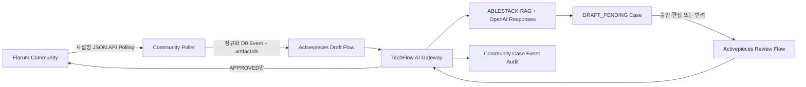

# Issue #21 Community 질문 답변 Flow 구현·검증 보고서

- 기준 일시: 2026-08-12 KST
- 대상 Issue: [#21 Community 질문 답변 Flow](https://github.com/ablecloud-team/ablestack-techflow/issues/21)
- 구현 Branch: `agent/issue-21-community-assist`
- 결론: 구현 및 시험 서버 E2E 완료

## 1. 완료 요약

Flarum Community의 새 ABLESTACK 질문을 수집해 Activepieces에서 TechFlow AI Gateway를 호출하고, 문서·소스코드 RAG와 OpenAI Responses로 검토 가능한 답변 초안을 만드는 경로를 구현했다. 답변은 `DRAFT_PENDING` 상태에서 담당자가 현재 Draft Version을 명시적으로 승인한 경우에만 `AI-Assistant` 계정으로 게시된다.

실제 시험에서는 답변 가능한 질문을 `ANSWERED`로 판정해 3개 Citation과 1,513자 초안을 생성하고, 승인 후 Flarum Post #311로 한 번만 게시했다. 같은 승인 이벤트를 재전송해도 Post 수는 증가하지 않았다. 근거가 부족한 질문은 `ABSTAINED`로 보류하고 반려했으며 Community 댓글 수가 1로 유지됐다.

| 완료 Gate | 결과 |
|---|---:|
| 새 질문 Polling·Activepieces 전달 | PASS |
| RAG/OpenAI 초안 생성 | PASS |
| 현재 Draft Version 승인 | PASS |
| 승인 전·반려 후 게시 차단 | PASS |
| 승인 후 AI-Assistant 게시 | PASS |
| 승인 이벤트 재처리 멱등성 | PASS |
| 문서·소스 Citation | PASS |
| 이미지·로그 Artifact ID 경계 | PASS |
| GitHub→Chat 보호 가드 | PASS |
| AI Gateway 전체 회귀 테스트 | 129/129 PASS |

## 2. 실제 환경 기준선

### 2.1 Flarum

| 항목 | 확인값 |
|---|---|
| 서버 | Ubuntu 24.04, `172.16.0.234` |
| SSH 사용자 | `ablecloud`, 관리 명령은 `sudo` 사용 |
| Flarum | 1.8.10 |
| PHP | 8.3.6 |
| DB | MariaDB 10.11.13 |
| 공개 주소 | `https://community.ablecloud.io` |
| AI 계정 | `AI-Assistant`, 사용자 ID 32 |
| 주요 확장 | Approval 1.8.2, FoF Webhooks 1.3.3, FoF Upload 1.8.5 |

비밀번호·API Key·세션·인증 응답은 문서와 저장소에 기록하지 않았다. SSH·관리자·Flarum API·Activepieces Webhook 값은 GitHub Secrets와 시험 서버의 보호된 런타임 Secret 파일로만 사용했다.

### 2.2 TechFlow 시험 서버

| 항목 | 확인값 |
|---|---|
| 서버 | Ubuntu 24.04, `172.16.0.231` |
| AI Gateway | 0.9.0 |
| Provider | OpenAI Responses, `store=false` 기존 정책 유지 |
| DB·Vector | `ready` / `ready` |
| 배포 이미지 | `sha256:6ee58b0a906341576a1b5ffec8c31872ec49ef9a8db2d5003b607bfbf9ca5bf9` |
| Activepieces | 0.86.3 |

## 3. 구현 아키텍처와 책임 경계



- Activepieces는 Webhook 수신과 호출 순서만 실행한다.
- TechFlow AI Gateway가 질문 상태, Source Profile 선택, RAG, 승인 Version, 게시 권한, 감사와 멱등성을 소유한다.
- Flarum API Key는 `AI-Assistant` 사용자 ID에 귀속되며 Gateway와 Poller의 런타임 Secret으로만 제공한다.
- Poller는 원문 HTML을 실행하지 않고 텍스트·same-origin 첨부 URL만 정규화한다.
- 이미지·로그·로그 압축 파일은 기존 Artifact API의 10 MiB 업로드, 압축 해제 한도, 항목 수, 압축률, D0 정책을 그대로 거친다. Activepieces Run에는 첨부 바이트가 아니라 Artifact ID만 전달된다.
- 자동 승인은 금지한다. `security.automaticApproval=false`와 현재 `draftVersion` 일치가 필수다.

## 4. 내부 API와 공개 URL 분리

시험망에서 `community.ablecloud.io`는 공인 IP로 해석되지만 TechFlow 서버에서 공인 443으로 NAT hairpin 연결이 되지 않았다. 운영을 외부 NAT 동작에 의존시키지 않도록 두 주소를 분리했다.

| 목적 | 설정 | 값 |
|---|---|---|
| 서버 간 JSON:API 전송 | `TECHFLOW_FLARUM_BASE_URL` | `http://172.16.0.234` |
| 사용자 공개 링크 | `TECHFLOW_FLARUM_PUBLIC_URL` | `https://community.ablecloud.io` |

코드는 위 두 승인 주소만 허용한다. 첨부는 먼저 공개 HTTPS same-origin인지 검증하고, 검증된 path·query만 내부 API 주소로 변환해 가져온다. Case와 게시 결과 URL은 항상 공개 HTTPS 주소로 기록한다.

## 5. 구현 자산

### 5.1 AI Gateway

- Community Case 생성·조회·Discussion ID 조회 API
- 승인·반려 API와 `expectedDraftVersion` 동시성 검사
- 승인 전용 Flarum 게시 API
- Post 본문의 `techflow-case:{caseId}:approval:{approvalVersion}` Marker 기반 게시 복구
- 이미 `PUBLISHED`인 Case 재호출 시 기존 결과 반환
- `community_case`, `community_case_event` PostgreSQL Migration
- 태그 기반 Source Profile 선택과 RAG 답변 Markdown 포맷

정적 OpenAPI 계약은 32개 Operation으로 갱신했다.

### 5.2 Activepieces

| Logical ID | Runtime Flow ID | 역할 |
|---|---|---|
| `community-question-draft-v1` | `6Yzrh1hYs2rEGB1vfl812` | 새 질문을 Case 초안으로 생성 |
| `community-approve-publish-v1` | `lJvUt75qnaKcQiiMemYSI` | 현재 Version 승인 후 게시 |
| `community-reject-v1` | `p3QEUidMoC5H83pScGDuo` | 초안 반려·게시 차단 |

세 Flow는 모두 Enabled이며 Webhook URL은 Secret으로 관리한다. 외부 Caddy가 일반 Activepieces Webhook을 차단하는 기존 정책은 유지하고, Poller만 Docker 내부 `app:80` 주소를 사용한다.

### 5.3 Poller

- `commentCount=1`인 토론만 미답변으로 판단
- 최초 기동은 기존 미답변을 Seen 처리하고 전달하지 않음
- 최근 1,000개 Discussion ID를 전용 Volume에 저장
- Flarum HTML을 텍스트로 정규화하고 최대 5개 same-origin 첨부 처리
- 새 질문마다 결정적 `eventId=flarum-discussion-{id}` 사용
- 전용 Init Container가 Poller 상태 Volume을 UID 10001, mode 0700으로 고정

## 6. Secret과 백업

### 6.1 GitHub Secret 이름

- `TECHFLOW_FLARUM_SSH_HOST`, `TECHFLOW_FLARUM_SSH_PORT`, `TECHFLOW_FLARUM_SSH_USER`, `TECHFLOW_FLARUM_SSH_PASSWORD`
- `TECHFLOW_FLARUM_BASE_URL`, `TECHFLOW_FLARUM_ADMIN_USER`, `TECHFLOW_FLARUM_ADMIN_PASSWORD`
- `TECHFLOW_FLARUM_API_KEY`
- `TECHFLOW_COMMUNITY_INGEST_WEBHOOK_URL`, `TECHFLOW_COMMUNITY_APPROVE_WEBHOOK_URL`, `TECHFLOW_COMMUNITY_REJECT_WEBHOOK_URL`

값은 본 문서, Git Diff, Flow Bundle, OpenAPI, PDF와 PPTX에 포함하지 않는다.

### 6.2 Flarum 사전 백업

경로: `/var/backups/ablestack-techflow/flarum-issue21-20260812T052847Z`

- `flarum.sql`
- `flarum-config.tar.gz`
- `nginx-flarum.conf`
- `SHA256SUMS`

디렉터리는 `root:root 0700`, 파일은 `0600`이며 SHA-256 검증을 완료했다.

### 6.3 AI Gateway 사전 백업

경로: `/home/ablecloud/techflow-ai-gateway/backups/issue21-predeploy-20260812T053625Z`

- PostgreSQL Custom Dump
- Compose·OpenAI Override
- 배포 Source Archive
- 직전 Image 정보
- `SHA256SUMS`

모든 항목의 Checksum 검증을 완료했다.

## 7. 배포 절차 자산화

1. Flarum DB·구성·Nginx를 백업하고 Checksum을 확인한다.
2. AI Gateway DB·Source·Compose·Image를 백업한다.
3. Flarum API Key와 Community Webhook을 보호된 Secret 파일로 배치한다.
4. Compose 병합 계약을 `docker compose config -q`로 검증한다.
5. `techflow/ai-gateway:issue-21-community-assist` 이미지를 빌드한다.
6. `0008_community_assist_up.sql`을 실행해 Schema를 21 Tables 상태로 검증한다.
7. Gateway만 재생성하고 Health의 process·database·vector를 확인한다.
8. Poller Init Container 실행 후 Poller를 기동한다.
9. 최초 로그가 `observed=2, delivered=0, seen=2`인지 확인한다.
10. 시험 질문으로 Draft·Reject·Approve·Publish·Replay를 검증한다.
11. 배포 전후 `github-chat-v1 state=frozen guard=passed`를 확인한다.

상세 명령과 롤백은 [Community Assist Runbook](../runbooks/community-assist.md)에 유지한다.

## 8. E2E 시험 결과

### 8.1 최초 기동 안전성

```text
community_poll_completed observed=2 delivered=0 seen=2
```

기존 미답변 2건은 기준선에만 기록했고 AI 답변을 소급 생성하지 않았다.

### 8.2 시험 A - 근거 부족 보류·반려

| 항목 | 결과 |
|---|---|
| Discussion | #141 |
| 질문 | After host maintenance, an ABLESTACK VM does not start. Which logs and configuration should be checked first? |
| AI 판정 | `ABSTAINED` |
| Citation | 3개 검색 결과가 있었으나 답변 생성 기준 미충족 |
| Draft Answer | 없음 |
| Reviewer 조치 | `dhslove` 반려 |
| 최종 Case 상태 | `REJECTED` |
| Community 댓글 수 | 1 - AI 답변 미게시 |

판정: 근거가 충분하지 않은 일반 장애 질문을 임의 추론으로 게시하지 않았다. 승인 Flow가 아닌 Reject Flow로 종료됐고 게시 API를 호출하지 않았다. PASS.

### 8.3 시험 B - 근거 기반 생성·승인·게시

| 항목 | 결과 |
|---|---|
| Discussion | #142 |
| 질문 | Cube 네트워크 본딩의 목적은 무엇인가? |
| AI 판정 | `ANSWERED` |
| Citation | 3개 |
| Draft | 1,513자, Version 1 |
| Reviewer | `dhslove` |
| 최종 Case 상태 | `PUBLISHED` |
| Flarum Post | #311 |
| 공개 결과 URL | `https://community.ablecloud.io/d/142/311` |

실제 승인 답변:

> Cube 네트워크 본딩의 목적은 여러 물리 네트워크 인터페이스를 하나의 논리 인터페이스로 통합해 네트워크 처리량을 높이고, 링크 장애에 대비한 중복성을 제공하는 것입니다. 구성 모드에 따라 활성-백업 장애 조치 또는 트래픽 로드밸런싱을 구현할 수 있습니다.
>
> 확인된 내용:
> - 네트워크 본딩은 인터페이스를 결합해 더 높은 처리량 또는 중복성을 가진 논리 인터페이스를 제공합니다.
> - Cube 호스트의 본드 포트는 물리 인터페이스를 통합하며 다양한 트래픽 로드밸런싱을 제공합니다.
> - Cube 웹 콘솔에서는 둘 이상의 인터페이스로 활성-백업 본드를 구성할 수 있습니다.
>
> 권장 확인 사항:
> - 장애 대응이 목적이면 활성-백업 모드를, 처리량과 트래픽 분산이 목적이면 요구사항에 맞는 로드밸런싱 모드를 선택합니다.
> - 본딩 모드에 따라 스위치 측 링크 집계 설정이 필요할 수 있으므로 스위치 구성을 함께 확인합니다.
> - 장애 조치 기능이 필요하면 네트워크 카드를 스위치에 연결합니다. 직접 케이블 연결에서는 일부 장애 조치 기능이 지원되지 않습니다.

Citation:

1. `ablecloud-team/ablestack-docs`, `docs/admin-guide/cube/cube-admin-guide-networking.md:5-13`, Commit `50d50ad6c8c548dc58db866ca28b4cbb43cc74d0`
2. `ablecloud-team/ablestack-docs`, `docs/architecture/book-of-cell.md:149-152`, 같은 Commit
3. `ablecloud-team/ablestack-docs`, `docs/admin-guide/cube/cube-admin-guide-networking.md:40-71`, 같은 Commit

판정: 기대 개념인 처리량과 중복성을 모두 포함했고, 승인된 Commit의 구체적 Line Citation을 제시했다. 운영 선택 시 스위치 구성을 함께 확인하도록 범위를 제한했다. ACCEPTED.

### 8.4 게시 멱등성

동일 승인 이벤트 `community-142-approve-e2e`를 재전송했다.

| 검증 | 최초 | 재처리 |
|---|---:|---:|
| Case 상태 | `PUBLISHED` | `PUBLISHED` |
| 게시 Post ID | 311 | 311 |
| Discussion 댓글 수 | 2 | 2 |
| Marker Post 수 | 1 | 1 |

원문 Post #310과 AI 답변 Post #311만 존재했다. 답변 본문 Marker가 확인됐고 중복 Post는 생성되지 않았다. PASS.

## 9. 발견 문제와 개선

| 발견 | 원인 | 개선 | 회귀 기준 |
|---|---|---|---|
| Poller `URLError` | 공인 주소 NAT hairpin 443 Timeout | 내부 API와 공개 URL 분리 | 컨테이너 내부 API HTTP 200 |
| Poller `PermissionError` | 신규 Named Volume root 소유 | Init Container로 UID 10001·0700 | 최초 상태 파일 생성 성공 |
| 게시 재처리 시 상태 충돌 가능 | 이미 `PUBLISHED`인 Case를 승인 상태로만 검사 | 기존 게시 결과 즉시 반환 | 동일 Event 재처리 Post 수 불변 |
| 비동기 Flow 직후 Case 404 | Draft 생성에 Provider 시간이 필요 | Case 조회 API와 상태 Polling 기준 추가 | Flow 완료 후 `DRAFT_PENDING` 확인 |

## 10. 회귀·보안 검증

| 검증 | 결과 |
|---|---|
| AI Gateway Unit·API·Migration·Container 계약 | 129 tests, PASS |
| OpenAPI Operation ID Unique | 32/32 |
| Compose 병합 계약 | PASS |
| Migration Schema | 21 Tables, Issue #21 Tables 2 |
| Gateway Health | process·database·vector `ready` |
| Provider | OpenAI |
| Community Flow | 3 Enabled |
| 자동 승인 | Disabled |
| `github-chat-v1` 보호 가드 | `state=frozen guard=passed` |
| Flarum Secret 저장소 노출 | 0 |

GitHub→Chat Webhook, Event Gateway, Ingress, SSRF Allowlist와 기존 Flow ID·Published Version은 변경하지 않았다.

## 11. 롤백

1. Community Flow 3개를 Disabled 처리하고 Poller만 중지한다.
2. Gateway 이미지를 백업에 기록된 직전 Digest로 되돌린다.
3. 백업 Compose와 Source Archive를 복구한다.
4. Gateway Health와 기존 RAG Query를 확인한다.
5. `0008_community_assist_down.sql`은 Community Case·감사 기록을 삭제하므로 제품 책임자의 명시적 승인과 DB Dump 검증 후에만 실행한다.
6. 이미 게시된 Community 답변은 자동 삭제하지 않고 Post ID를 근거로 담당자가 판단한다.
7. GitHub→Chat 보호 서비스는 롤백 대상에 포함하지 않는다.

## 12. 최종 판정과 후속 운영

Issue #21의 구현 완료 기준은 충족했다. 시험 질문 2건은 제품 경로의 답변 가능·보류 양쪽을 검증했으며 승인 없는 게시와 중복 게시가 없었다.

다음 운영 단계에서는 다음 지표를 4주간 관측한다.

- 새 질문 감지 수, Draft 생성 수, 승인·반려·보류 수
- 질문 생성부터 Draft 완료까지의 P50/P95
- 승인 후 게시 성공률과 재시도 수
- `ABSTAINED` 사유와 추가 Source Profile 요구
- 첨부 Artifact 유형·차단 사유·보존 만료
- 담당자 편집률과 Citation 수정률

자동 승인 기능은 이번 범위에 포함하지 않는다. 제품화 판단은 실제 담당자 검토 데이터가 누적된 후 별도 Issue에서 수행한다.
