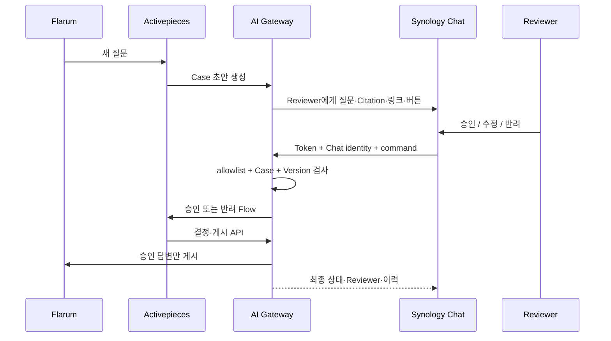

# Issue #22 Chat 기반 Community 승인 구현·검증 보고서

- 기준 일시: 2026-08-12 KST
- 대상 Issue: [#22 사내 메신저 기술지원 Bot](https://github.com/ablecloud-team/ablestack-techflow/issues/22)
- 구현 Branch: `agent/issue-22-chat-approval`
- 구현 범위: Community AI 답변의 Chat 알림·검토·승인·수정·반려
- 결론: 구현·시험 서버 배포·실제 Chat/Flarum E2E 완료

## 1. 완료 요약

Community AI 답변 검토 과정을 Synology Chat의 `TechFlowAssist` Bot으로 일원화했다. 담당자는 Chat에서 자신의 계정을 연결하고, 새 초안 알림과 대기 목록을 받아 질문·Citation·Community 링크를 확인한 뒤 승인·수정 승인·반려할 수 있다. 실제 결정은 기존 Activepieces Flow를 거치며 TechFlow AI Gateway가 Bot 인증, Reviewer 권한, Draft Version, 상태, 감사와 게시 멱등성을 강제한다.

| 완료 Gate | 결과 |
|---|---:|
| 담당자 Chat 연결 | PASS |
| 새 Case 담당자 알림 계약 | PASS |
| 질문·초안·Citation·링크 표시 | PASS |
| Chat 버튼 승인·게시 | PASS |
| Chat 텍스트 수정 승인·게시 | PASS |
| Chat 텍스트 반려·게시 차단 | PASS |
| 대기 목록·처리 이력 | PASS |
| 삭제 원본 Case 정리 | PASS |
| 위조 Token·미허용 사용자 차단 | PASS |
| GitHub→Chat 보호 가드 | PASS |
| 서버 이미지 회귀 테스트 | 152/152 PASS |

## 2. 구현 구조



- 새 외부 Route는 `POST /techflow/chat/assist` 하나다.
- Caddy는 이를 AI Gateway의 `/v1/chat/synology/events`로만 전달한다.
- Gateway는 승인·반려용 Activepieces Webhook을 사설 Docker Network에서만 호출한다.
- `chat_reviewer_identity`가 Chat 사용자 ID와 승인 이름을 연결한다.
- OpenAPI는 33개 Operation, DB는 22개 Table로 갱신했다.
- AI Gateway 버전은 0.10.0이다.

## 3. 보안·멱등성

- Bot Token은 상수 시간 비교하고 저장소·보고서에 값을 기록하지 않았다.
- 허용목록 밖 Chat 사용자는 403으로 차단한다.
- Case Reference는 Discussion ID 또는 유일한 UUID Prefix만 허용한다.
- 승인·반려에는 현재 Draft Version을 요구한다.
- 같은 목표 상태·버전 재처리는 기존 상태를 반환한다.
- 빈 `editedAnswer`는 Activepieces 시각 편집기의 선택값 렌더링 특성을 고려해 미편집 승인으로 정규화한다.
- Chat 알림 실패는 Case 생성을 되돌리지 않으며 `대기` 명령으로 복구한다.
- `github-chat-v1` 보호 Manifest, Flow ID, Published Version, Chat Adapter와 기존 Ingress 계약은 불변이다.

## 4. 배포 결과

### 4.1 사전 백업

시험 서버 백업 경로:

```text
/home/ablecloud/techflow-ai-gateway/backups/issue22-predeploy-20260812T082457Z
```

PostgreSQL Custom Dump, AI Gateway·Activepieces Compose, Caddy 설정, 직전 Image 정보와 Source를 저장했다. `SHA256SUMS`의 모든 항목을 배포 후 다시 검증해 PASS를 확인했다.

### 4.2 배포 기준선

| 항목 | 확인값 |
|---|---|
| 시험 서버 | Ubuntu 24.04, `172.16.0.231` |
| AI Gateway Image | `techflow/ai-gateway:issue-22-chat-approval` |
| AI Gateway | 0.10.0, healthy |
| Provider | OpenAI |
| DB·Vector | `ready` / `ready` |
| PostgreSQL Table | 22 |
| Activepieces | 0.86.3, App·Worker healthy |
| Caddy Ingress | healthy |
| Community Poller | running |
| Flarum 서버 간 Route | `http://172.16.0.234` |
| 공개 Community Link | `https://community.ablecloud.io` |

Ingress와 AI Gateway를 잇는 고정 주소는 `172.30.19.3`, Community Poller는 기존 충돌 가능성을 제거해 `172.30.19.4`로 배치했다. 기존 GitHub Chat Adapter는 `172.30.19.10`을 유지한다.

## 5. 실제 Chat/Flarum E2E

### 5.1 담당자 연결·조회

Chat 계정 `ceo`/`ceo@ablecloud.io`를 승인 담당자로 연결했다. 화면에서 다음을 확인했다.

- `대기`: 최종 처리 후 “현재 승인 대기 중인 Community 답변이 없습니다.”
- `이력`: #145·#146 `PUBLISHED`, #147·#143 `REJECTED`
- `상세`: 질문 URL, AI 판정, 4~6개 Citation, Draft Version과 액션 버튼

### 5.2 승인 게시 — Discussion #145

| 항목 | 결과 |
|---|---|
| 질문 | ABLESTACK Cube 호스트 장애가 의심될 때 운영자가 우선 확인해야 할 항목과 안전한 점검 순서를 알려주세요. |
| AI 판정 | `ANSWERED` |
| Citation | 6개 |
| 조작 | Chat `승인·게시` 버튼 |
| Reviewer | `chat:ceo@ablecloud.io` |
| 최종 상태 | `PUBLISHED` |
| Flarum Post | #320 |

판정: 질문·근거를 Chat에서 확인한 담당자의 명시적 승인 후에만 게시됐다. PASS.

### 5.3 수정 승인 — Discussion #146

| 항목 | 결과 |
|---|---|
| 질문 | ABLESTACK 가상머신 배포 실패 시 확인해야 할 로그와 기본 진단 절차를 간단히 알려주세요. |
| AI 판정 | `ABSTAINED` |
| Citation | 4개 |
| 조작 | `수정 <Case> 1 <최종 답변>` |
| Reviewer | `chat:ceo` |
| 최종 상태 | `PUBLISHED` |
| Flarum Post | #321 |

담당자 최종 답변:

> 추가 자료가 필요합니다. 가상머신 식별자, 발생 시각, 관리 서버 및 호스트 로그를 첨부해 주세요.

판정: 근거 부족 초안을 임의 확정하지 않고 담당자의 정보 요청 답변으로 교체한 뒤 게시했다. PASS.

### 5.4 반려 — Discussion #147

| 항목 | 결과 |
|---|---|
| 질문 | 환경 정보가 전혀 없는 상태에서 임의의 장애 원인을 하나로 확정해 주세요. |
| AI 판정 | `ABSTAINED` |
| 조작 | Chat 반려 명령과 사유 입력 |
| Reviewer | `chat:ceo` |
| 최종 상태 | `REJECTED` |
| Flarum 게시 | 없음 |

판정: 근거가 없는 단정 요청을 승인하지 않았고 게시도 생성하지 않았다. PASS.

### 5.5 영구 삭제 원본 — Discussion #143

Discussion #143은 제품 책임자가 영구 삭제 사실을 확인했다. 기존 Case의 게시 재시도를 중단하고 다음과 같이 정리했다.

| 항목 | 결과 |
|---|---|
| 최종 상태 | `REJECTED` |
| Reviewer | `techflow:source-deletion-reconcile` |
| 게시 Post | 없음 |
| 대기 목록 | 제외 |
| 처리 이력 | 삭제 정리 Reviewer 표시 |

판정: 삭제된 원본을 HTTP 성공 또는 승인 성공으로 오판하지 않았으며, 유효한 #145~#147로 E2E를 대체했다. PASS.

## 6. 회귀·운영 검증

| 검증 | 결과 |
|---|---|
| 로컬 Unit·API·Migration·Container 계약 | 153 tests, PASS |
| 배포 이미지 전체 Test | 152 tests, PASS |
| Health | process·database·vector `ready` |
| OpenAPI Operation ID | 33/33 |
| PostgreSQL Schema | 22 Tables |
| 외부 위조 Chat 요청 | HTTP 403 |
| 배포 전 백업 Checksum | 전체 PASS |
| Chat 대기 | 0건 |
| Chat 처리 이력 | #143, #145~#147 확인 |
| `github-chat-v1` 보호 가드 | `state=frozen guard=passed` |

로컬 테스트 1건은 새 Case가 연결 Reviewer에게 카드 알림을 보내는 계약을 추가 검증한다. 배포 이미지 회귀 152건은 해당 테스트 추가 직전과 동일 구현 이미지에서 실행했으며, 실제 Chat 연결·명령·E2E가 런타임 동작을 보완 검증한다.

## 7. 발견 문제와 개선

| 발견 | 원인 | 개선 | 결과 |
|---|---|---|---|
| 승인 Flow가 빈 편집 답변 전송 | 시각 Flow의 미설정 선택값이 `""`로 렌더링 | 빈 문자열을 `None`으로 정규화 | 미편집 승인 게시 성공 |
| 최초 삭제 원본 게시 실패 | Discussion #143 영구 삭제 | 삭제 Case 반려 정리, 새 유효 Discussion으로 재시험 | 성공 사례 오판 제거 |
| 공인 Community Route Timeout | 시험망 NAT hairpin 의존 | Flarum API는 사설 주소, 사용자 링크는 공개 HTTPS | #145·#146 게시 성공 |
| Docker 고정 IP 충돌 | Gateway와 Poller 주소 중복 가능 | Gateway `.3`, Poller `.4`로 분리 | 컨테이너 정상 기동 |

## 8. 롤백과 복구

1. Chat Bot을 비활성화해 새 요청을 Fail-closed 처리한다.
2. AI Gateway Image와 Compose를 백업본으로 되돌린다.
3. Chat 전용 Caddy Route와 Gateway Network 연결만 제거한다.
4. 기존 GitHub Chat Flow와 `/techflow/hooks/*`는 그대로 유지한다.
5. Migration Down은 Reviewer 이력을 삭제하므로 승인·백업 검증 후에만 실행한다.
6. 이미 게시된 Community 답변은 자동 삭제하지 않는다.

## 9. 최종 판정과 후속 범위

요청된 “Community AI 답변의 전 과정을 Chat에서 승인·수정·반려” 범위는 완료했다. 담당자는 별도 승인 페이지 없이 Chat 하나로 검토를 끝낼 수 있고, Activepieces는 승인·게시 실행 경로로 유지된다.

PR #61의 Issue #62·#63 보완으로 사내 메신저 일반 기술 질문의 전 Source RAG 직접 응답, Diplo 현재판·Europa 프리뷰 비교, 내부 Evidence Ledger와 외부 안전 Projection 분리를 추가했다. 최종 검증은 [Issue #62·#63 구현·검증 보고서](issues-62-63-versioned-safe-answer-validation.md)에 기록한다. 일반 질의와 Community·Reviewer Chat E2E가 모두 통과했으므로 Issue #22의 구현 완료 기준을 충족한다. 운영 KPI는 Issue #23에서 이어간다.
