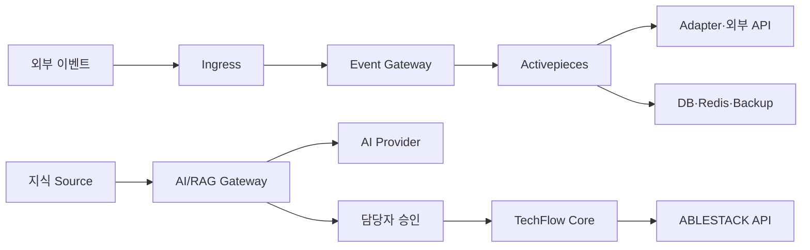

# Issue #39 보안 위협 모델·데이터 분류 및 보존 정책 완료 보고서

> 상태: **완료**
>
> 검증일: 2026-08-01
>
> 관련 이슈: [#39](https://github.com/ablecloud-team/ablestack-techflow/issues/39)
>
> 상위 Epic: [#3 P0 제품 기반 확정](https://github.com/ablecloud-team/ablestack-techflow/issues/3)

## 1. 완료 결론

Epic #3의 P0 산출물 중 독립 문서로 남아 있지 않았던 보안 위협 모델과 데이터 분류·보존 정책을 구현 기준으로 확정했다.

| 영역 | 결과 |
|---|---|
| 위협 모델 | 자산 9개, 신뢰 경계 11개, 위협 18개, 통제 28개 |
| 데이터 정책 | D0~D3 등급 4개, 데이터 유형별 보존 정책 18개 |
| AI/RAG Gate | D0 기본 허용, D1 조건부, D2·D3 P1 차단 |
| 삭제 | 원본·Chunk·Embedding·Cache 최대 7일 SLO |
| Legal Hold | 제품 책임자·보안 책임자 이중 승인, 90일 이내 재검토 |
| 자동 검증 | 정책 Validator와 부정 테스트 12건 통과 |

실제 비밀번호, Token, API Key, 내부 로그 원문, 고객 데이터와 AI 대화 원문은 저장소·Issue·PR·보고서에 포함하지 않았다.

## 2. 보완 배경

Epic #3의 기존 하위 이슈 #2, #11~#18은 모두 완료됐다. 그러나 제품 로드맵의 P0 산출물에는 다음 두 항목이 별도로 요구됐다.

- Webhook, AI, 사설망 접근과 자원 변경 경계의 보안 위협 모델
- 로그, 실행 데이터, AI 대화와 지식 데이터의 분류·보존 정책

Issue #39를 M0 Milestone과 Epic #3의 하위 이슈로 추가해 이 차이를 추적했다. 기존 ADR-0001~0005의 책임, Secret, 백업, 관측성, 이미지 잠금 결정을 변경하지 않고 상위 보안·데이터 수명주기 정책으로 연결했다.

## 3. 위협 모델 결과

### 3.1 주요 신뢰 경계



각 경계에서 TLS·서명, Allowlist, 최소 이벤트, Strict Egress, 접근 제어, Source 검역, Provider 계약, 사람 승인, 멱등성과 권위 상태 재조회를 적용한다.

### 3.2 최고 위험 시나리오

| 위협 | 고유 위험 | 핵심 통제 | 잔여 위험 |
|---|---:|---|---:|
| 등급·테넌트 간 검색 유출 | 25 | 검색 전 ACL, D2·D3 차단, 격리 테스트 | 6 |
| AI의 과도한 자율 실행 | 25 | Tool 실행 금지, 사람 승인, API 권한 재검증 | 5 |
| Prompt Injection | 20 | 문서를 데이터로 처리, 출처·보류, Tool 차단 | 6 |
| Secret·세션 노출 | 20 | 보호 저장소, 런타임 주입, 검사·폐기 | 5 |
| Provider의 입력 보존·학습 | 20 | 처리 계약, 민감등급 차단, Provider 추상화 | 5 |

잔여 위험은 모두 Medium 이하로 제한했다. High 이상이면 기능·데이터 범위를 축소하거나 추가 통제 전 배포를 금지한다.

## 4. 데이터 등급과 기본 처리

| 등급 | 범위 | P1 RAG | 핵심 규칙 |
|---|---|---|---|
| D0 Public | 공식 공개 문서·릴리스·공개 Issue | 기본 허용 | 출처·버전·Hash 필수 |
| D1 Internal | 정규화 이벤트·운영 메타데이터·승인 내부 문서 | 조건부 | 소유자·ACL·만료·삭제 자동화 |
| D2 Confidential | 고객·개인정보·원문 AI 대화 | 금지 | 별도 R2 승인 전 수집 금지 |
| D3 Restricted | 비밀번호·Token·개인키·인증 Header | 금지 | 일반 DB·로그·RAG·Prompt 저장 0일 |

분류가 불명확하거나 여러 등급이 섞이면 높은 등급을 적용한다. Embedding은 원문과 같은 등급이며 익명 데이터로 간주하지 않는다.

## 5. 보존·삭제 기준

### 5.1 기존 운영 기준 유지

- 원문 Webhook Body·인증 Header: 영속 저장 0일
- PostgreSQL·Redis 정기 백업: 7일
- 명시적 복구 훈련 백업: 30일
- 서비스 구조화 로그: 최대 30일과 서비스별 `10MB × 3` 회전 한도
- Observer 상태·경보 이력: 90일

### 5.2 AI/RAG 신규 기준

- 공개 지식 현재 Version: Source 사용 기간
- 공개 지식 이전 Version: 최대 365일, 현재 검색 제외
- 승인 내부 지식: 최대 365일, 분기 재승인
- 원문 AI Prompt·응답: 기본 미수집, 승인 시 최대 30일
- 익명화·승인 평가 세트: 최대 365일
- Source 철회: Chunk·Embedding·Cache·평가 연결을 최대 7일 이내 삭제

자동 만료·삭제가 구현되지 않은 데이터 유형은 실제 원문을 수집할 수 없다. 따라서 Issue #20 초기 PoC는 D0만 사용한다.

## 6. AI/RAG 구현 Gate

Issue #20은 다음 조건을 구현해야 한다.

1. Source Registry에 소유자·등급·제품·버전·Hash·보존 정책을 저장한다.
2. 신규 문서는 Quarantine에서 Secret·개인정보·악성 지시를 검사한다.
3. 접근 범위는 Vector 검색 이전에 적용한다.
4. 문서의 지시는 System Policy나 Tool 명령이 될 수 없다.
5. 답변에는 Source와 Version이 필수이며 근거가 없거나 충돌하면 보류한다.
6. AI 출력은 Activepieces, Shell, API와 ABLESTACK 작업을 직접 실행하지 않는다.
7. Raw Prompt·응답 수집은 기본 비활성이다.
8. Source 삭제가 모든 파생 저장소에 전파된다.

## 7. 구현 자산

| 자산 | 역할 |
|---|---|
| `ADR-0006` | 위협 자산·경계·위험·통제·RAG 보안 Gate |
| `ADR-0007` | 데이터 등급·보존·삭제·Legal Hold·책임 |
| 구조화 JSON | 위협·통제·보존 정책의 기계 검증 원본 |
| 정책 Validator | ID·참조·위험·등급·보존·RAG Gate 검사 |
| 단위 테스트 | 정책 완화·오류를 의도적으로 거부하는 12개 시나리오 |
| 운영 Runbook | 신규 데이터·Provider·삭제·사고·롤백 절차 |
| README·로드맵 | P0 완료 근거와 Issue #20 선행 조건 |

## 8. 검증 결과

| ID | 검증 | 결과 |
|---|---|---|
| V01 | JSON 파싱 | PASS |
| V02 | 자산·경계·통제·위협 ID 고유성 | PASS |
| V03 | 모든 위협의 자산·경계·통제 참조 | PASS |
| V04 | 잔여 위험 Medium 이하 | PASS |
| V05 | D0~D3 등급과 순서 | PASS |
| V06 | D3 기본 수집 금지 | PASS |
| V07 | 원문 Webhook·Secret 일반 저장 0일 | PASS |
| V08 | Raw AI 데이터 Opt-in·최대 30일 | PASS |
| V09 | D2·D3 P1 RAG 차단 | PASS |
| V10 | 파생 데이터 삭제 SLO 최대 7일 | PASS |
| V11 | Legal Hold 이중 승인·90일 재검토 | PASS |
| V12 | 자동 단위 테스트 | 12건 PASS |

검증 명령:

```bash
python3 tools/policy/validate_security_data_policy.py \
  docs/decisions/techflow-security-data-policy.json

python3 -m unittest -v \
  tools.policy.test_validate_security_data_policy
```

## 9. 운영 영향과 롤백

이 변경은 테스트 서버의 Container·Volume·Secret·Hook과 기존 Flow를 변경하지 않는다. 신규 데이터 수집을 허용하는 변경이 아니라, 허용 전 통제와 금지 범위를 정의한다.

정책을 완화하려면 제품 책임자·보안 책임자 승인이 필요하다. 신규 경로가 정책 검증에 실패하면 Source 수집·Provider 전송·Flow를 비활성화하고, 신규 Index·Cache를 격리한 뒤 직전 승인 정책으로 되돌린다.

## 10. Epic #3 종료 준비 판정

Epic #3의 연결 하위 이슈는 #2, #11~#18과 #39다. Issue #39 병합·종료 후 모든 하위 이슈가 완료 상태가 된다.

P0 종료 산출물은 다음과 같이 연결된다.

- 라이선스·Community 경계: Issue #11
- TechFlow·Activepieces 책임: Issue #12, ADR-0001
- 배포·HTTPS: Issue #13·#14
- Secret·백업·관측성·이미지 잠금: Issue #15~#18, ADR-0002~0005
- 보안 위협 모델: Issue #39, ADR-0006
- 데이터 분류·보존·삭제: Issue #39, ADR-0007

따라서 Issue #39가 병합·종료되면 Epic #3는 제품 책임자의 단계 종료 승인만 남는다. Epic #3와 M0 Milestone 자체는 이 작업에서 자동 종료하지 않고 최종 보고 후 별도 승인으로 처리한다.

## 11. 후속 작업

- Issue #20: D0 Source Registry·Quarantine·Lineage·삭제 Job을 갖춘 RAG PoC
- Issue #23: 보존 위반·삭제 지연·비허용 등급 수집 KPI
- Issue #24: 삭제 Job·수명주기 실패 재처리와 담당자 알림
