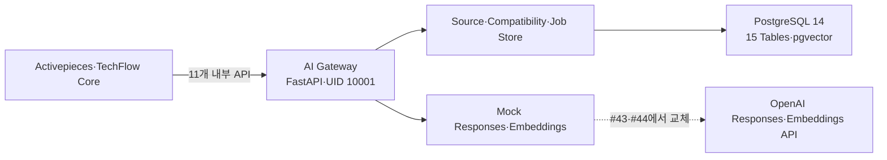

# Issue #41 AI Gateway API·DB·Mock Provider 기반 구현 완료 보고서

> 검증일: 2026-08-04
>
> 대상: `techflow-ai-gateway 0.1.0`
>
> 판정: **완료 — #42 Source 승인·수집 구현을 시작할 수 있는 기반 확보**

## 1. 완료 범위

Issue #41에서 TechFlow RAG PoC의 실행 경계를 코드와 데이터베이스로 고정했다. FastAPI 기반 11개 API, PostgreSQL 14·pgvector 기반 15개 논리 테이블, 세 개의 Provider Profile, 결정론적 Mock Responses·Embeddings Adapter, 최소권한 Role Migration, 컨테이너 배포·검증·롤백 절차를 구현했다.

실제 OpenAI API와 GitHub Source Fetch는 호출하지 않았다. #41의 질의 API는 항상 `ABSTAINED`와 `providerCalled=false`를 반환하여 미구현 Retrieval이나 Provider 호출이 성공으로 오인되지 않게 한다.

## 2. 구현 구조

책임 경계는 다음과 같다.

| 구성요소 | #41 책임 |
|---|---|
| Activepieces | 향후 변경 감지·승인·재색인 Flow 오케스트레이션 |
| AI Gateway | API 계약, Source 상태, Compatibility, 멱등성, 검증, Provider 요청 정책 |
| PostgreSQL | 승인 Commit·작업·Chunk·Embedding·Symbol·평가·Provider 감사 메타데이터 |
| Mock Provider | 구조화 출력과 3,072차원 Vector 계약을 외부 호출 없이 검증 |

## 3. API 계약

OpenAPI 계약은 [정적 계약 파일](../../services/ai-gateway/openapi/techflow-ai-gateway-v1.json)로 생성한다.

| 분류 | Operation |
|---|---|
| 상태 | `GET /healthz` |
| Source | 생성·조회·승인·철회 4개 |
| Compatibility | 승인 집합 생성 1개 |
| Ingestion·Job | 수집 요청·Job 조회 2개 |
| RAG | 근거 질의 1개 |
| Evaluation | 실행 생성·조회 2개 |

모든 `/v1` 요청은 `X-Correlation-Id`를 요구한다. 상태를 변경하는 요청은 `Idempotency-Key`를 추가로 요구하며, 같은 작업과 Key는 같은 결과를 반환한다. 입력 검증 오류와 예외 응답은 질문·Chunk·Secret을 다시 출력하지 않는다.

## 4. Provider Profile과 안전 기본값

| Profile | 계약 | #41 동작 |
|---|---|---|
| `OPENAI_RAG_DEFAULT_V1` | `gpt-5.6-terra`, medium | Mock 구조화 답변 |
| `OPENAI_RAG_ESCALATION_V1` | `gpt-5.6-sol`, high | Mock 구조화 답변 |
| `OPENAI_EMBEDDING_V1` | `text-embedding-3-large`, 3,072차원 | 결정론적 Mock Vector |

Provider 요청은 `store=false`, `background=false`, Tool 미사용, 구조화 출력, 최대 D0 Chunk 10개, 요청 크기 1 MiB 이하로 검증한다. D1~D3 Chunk, 등록되지 않은 Profile, Tool·Store 요청은 실행 전에 거부한다. Provider 감사 테이블은 Profile·Model·Token·Latency·상태 같은 안전 메타데이터만 보관하고 원문 Prompt·Response·인증정보를 보관하지 않는다.

## 5. 데이터베이스와 권한

Migration은 `vector`, `pg_trgm` 확장과 정확히 15개 `rag_*` 테이블을 생성한다. Source·Version·Compatibility·Ingestion·Chunk·Embedding·Symbol·Relation·Deletion·Evaluation·Provider Call 수명주기를 분리했다.

세 개의 NOLOGIN Group Role을 사용한다.

- `techflow_rag_migrator`: Schema 변경
- `techflow_rag_app`: API Runtime 읽기·쓰기와 Provider 감사 조회
- `techflow_rag_source_fetcher`: 승인 Source 수집에 필요한 최소 범위

실서버 검증에서 App Role의 Schema Create는 `false`, Provider 감사 조회는 `true`, Fetcher Role의 Provider 감사 조회는 `false`였다. Activepieces DB와 계정은 공유하지 않는다.

## 6. 컨테이너·네트워크·Secret

Gateway는 UID/GID `10001:10001`, Read-only Root FS, `cap_drop: ALL`, `no-new-privileges`로 실행한다. Python과 PostgreSQL 이미지는 Digest로 고정하고 Python Runtime 의존성은 전체 버전을 잠갔다.

DB는 외부 Port를 공개하지 않는 `rag_internal`에만 연결한다. Gateway만 `rag_internal`과 `rag_edge`를 사용하며 Host에는 `127.0.0.1:18090`으로 제한한다. Secret 값은 Repository·Issue·PR·문서에 저장하지 않고 운영자가 준비한 보호 파일을 Compose Secret으로 읽는다.

## 7. 자동 검증 결과

| 검증 | 결과 |
|---|---:|
| AI Gateway 단위·계약 테스트 | 58/58 통과 |
| 저장소 #41 Validator 테스트 | 3/3 통과 |
| OpenAPI Operation | 11개 일치 |
| 논리 테이블 | 15개 일치 |
| Provider Profile | 3개 일치 |
| 정적 Secret 탐지 | 0건 |
| SQL Parse | 4개 Migration 통과 |
| Container 계약 | Digest·Non-root·Read-only·Network 통과 |

## 8. 테스트 서버 배포 증적

Compose Project `techflow-ai-gateway`를 기존 Activepieces Stack과 분리해 배포했다. Gateway와 Database는 모두 `healthy`였고 Host Bind는 `127.0.0.1:18090->8090`으로 확인했다.

최종 Gateway Image ID는 `sha256:99ef2675b928a8d391eac6de918915da39f82e6b683c169f424ef39cb2fe3bfb`다. Runtime Canary는 Source 생성→승인→Ingestion→Compatibility Set→질의→평가→철회 전 과정을 통과했다. 최종 Source 상태는 `WITHDRAWN`, 질의 상태는 `ABSTAINED`, `providerCalled=false`였다. Schema Verify는 Table 15개와 Extension 2개를 확인했다.

## 9. 배포 중 발견·개선한 항목

1. Archive 권한이 너무 제한되면 PostgreSQL Init SQL을 읽지 못하는 문제를 확인해 Migration은 644, 실행 Script는 755로 표준화했다.
2. Compose File Secret이 PostgreSQL Init 사용자와 Gateway UID에서 읽혀야 하므로 상위 Secret 디렉터리 700·파일 644 구조를 문서화했다.
3. Internal Network만 사용할 때 Host Port가 Publish되지 않는 환경을 확인해 DB는 Internal 전용, Gateway는 별도 Edge Network를 함께 사용하도록 분리했다.
4. PostgreSQL `RETURNING *`의 `job_id` 매핑 오류를 수정하고 회귀 테스트 두 건을 추가했다.

기존 Activepieces Container·Volume·Database에는 변경을 가하지 않았다.

## 10. 롤백과 다음 단계

롤백은 새 Ingress 유입 차단→상태 Backup→직전 Gateway Image 복귀→필요 시 Down Migration→Schema·DB 권한·API Canary 재검증 순서다. Source 원문·Provider Secret은 백업 대상에 포함하지 않는다. 상세 절차는 [AI Gateway 배포 Runbook](../runbooks/ai-gateway-foundation.md)을 따른다.

다음 실행 단위는 Issue #42다. 9개 Source Profile의 최신 Candidate Commit을 발견하고 D0·권리·Secret 검역과 사람 승인을 거쳐 Source Registry에 등록한다. #42 승인 전에는 실제 Source Fetch나 OpenAI 호출을 시작하지 않는다.

## 11. 자산 목록

- [AI Gateway Service](../../services/ai-gateway/README.md)
- [Compose 배포 자산](../../deploy/compose/ai-gateway/compose.yml)
- [AI Gateway 배포 Runbook](../runbooks/ai-gateway-foundation.md)
- [구조화 완료 결정](../decisions/techflow-ai-gateway-foundation.json)
- [OpenAPI 계약](../../services/ai-gateway/openapi/techflow-ai-gateway-v1.json)
- [완료 보고서 PDF](../../output/pdf/techflow-ai-gateway-foundation-report.pdf)
- [발표자료 PDF](../../output/pdf/techflow-ai-gateway-foundation-presentation.pdf)
- [발표자료 PPTX](../../output/presentation/techflow-ai-gateway-foundation.pptx)
- [Artifact Manifest](../../output/issue-41-artifact-manifest.json)
