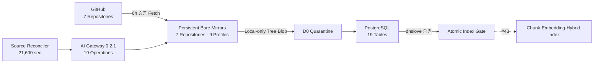

# Issue #42 Source Registry·영속 미러·검역·승인 구현 완료 보고서

> 검증일: 2026-08-05
>
> 대상: `techflow-ai-gateway 0.2.1`
>
> 초기 Source Reviewer: `dhslove`
>
> 판정: **보완 구현·1TB 확장·배포·검증 완료 — 실제 Source 승인 없이 #43 착수 가능**

## 1. 결론

Repository 자료를 질의 때 온라인 참조하는 구조가 아니라, 시험 서버의 영속 로컬 Bare Mirror로 가져와 검역·색인하는 구조로 보완했다. 7개 Repository Mirror와 Cloud 3개 Branch를 포함한 9개 Source Profile이 모두 실제 동기화됐으며, GitHub 네트워크가 없는 Container에서도 고정 `GENIE_MASTER` Commit의 34개 파일을 검역했다.

실제 갱신은 전용 `source-reconciler`가 6시간마다 수행한다. Push Webhook 즉시 갱신은 #45에서 Activepieces 인증 Flow와 연결하며, 현재의 운영 사실로 주장하지 않는다. GitHub 장애 중에는 신규 Head 발견만 지연되고 기존 Mirror·PostgreSQL Blob·향후 승인 Index는 유지된다.

## 2. 구현 구조

| 구성요소 | 구현 책임 |
|---|---|
| Source Registry | 7개 Repository·9개 Branch Profile·보존·Reviewer Allowlist |
| Persistent Fetcher | 저장소당 Bare Mirror, 보호 Ref, File Lock, 증분 Fetch, `fsck`, `gc --auto` |
| Local Scanner | 보호 Commit의 `ls-tree`·`cat-file`, 네트워크·Checkout·실행 없음 |
| Mirror State API | 7개 상태, 최근 성공·Head·실패 수·지연·24시간 Stale 판정 |
| Source Reconciler | 시작 시 및 6시간마다 9개 Profile 발견, Window Idempotency |
| PostgreSQL | Version·Blob·File·Finding·Approval·Job·Mirror 상태 |

## 3. 데이터 위치와 갱신 정책

| 단계 | 저장 위치 | 네트워크 의존성 |
|---|---|---|
| Branch 발견 | GitHub HTTPS → Bare Mirror | 발견 시에만 필요 |
| Commit 보존 | Docker Volume `techflow_source_mirrors` | 없음 |
| 검역 스캔 | 로컬 Bare Mirror | 없음 |
| 적격 원문 | PostgreSQL `rag_source_blob` | 없음 |
| 승인 검색 Index | #43 PostgreSQL Chunk·Embedding·FTS | 질의 시 GitHub 불필요 |

현재 정책은 `SCHEDULE_6H_RECONCILIATION`, Stale 기준은 86,400초다. 실패 시 Mirror 상태는 `DEGRADED`, 24시간 초과 시 `STALE`이며 기존 데이터는 삭제하지 않는다. Cloud 세 Branch는 한 개 Repository Mirror 안에서 Profile별 Head·Candidate Ref로 분리한다.

## 4. Source 기준선

| Profile | Branch | 관찰 Head | 상태 |
|---|---|---|---|
| `SHARED_DOCS` | `master` | `50d50ad6c8c548dc58db866ca28b4cbb43cc74d0` | Mirror Healthy |
| `CLOUD_MAIN` | `main` | `a873fb1ff436990fd523e2fe56682ff7aa31d1ec` | Mirror Healthy |
| `CLOUD_DIPLO` | `ablestack-diplo` | `19550c70d8d8a878eef40e1e1062b2fe0d40f71e` | Mirror Healthy |
| `CLOUD_EUROPA` | `ablestack-europa` | `9bded7bccd43b335221367520276d641730290dd` | Mirror Healthy |
| `WALL_MAIN` | `main` | `f27b3f1b0b35489e05c64924b5cff7dc64dd2f6d` | Mirror Healthy |
| `COCKPIT_DIPLO` | `ablestack-diplo` | `c8b37dd6a4c35a8ba18169189a553595b24e54ab` | Mirror Healthy |
| `GENIE_MASTER` | `master` | `3e3c5c364f5c7261b07d49fcbcd4f3605b91f3b1` | `QUARANTINED` |
| `KICKSTART_MASTER` | `master` | `ffe24390544dd58e3441ac7362fe46b93472d0e1` | Mirror Healthy |
| `QEMU_EXEC_TOOLS_MAIN` | `main` | `a4b9bd60bb93800612d96aaad84e73ddfd768b68` | Mirror Healthy |

Branch Head는 시점 정보이며 승인 Commit이 아니다. Head 변경은 새 Source Version을 만들고 이전 승인을 승계하지 않는다.

## 5. 안전·승인 정책

- Repository·Branch·Remote URL·40자 Commit·Candidate Ref를 검증한다.
- Checkout, Hook, Submodule, LFS Smudge, File/Ext Protocol, Build, Test, Source 실행을 금지한다.
- Binary, NUL, 비 UTF-8, 1 MiB 초과, 생성물, Secret, PII, Prompt Injection을 제외·차단한다.
- 제외·차단 원문은 저장하지 않고 API에도 반환하지 않는다.
- 승인자는 `dhslove`, `expectedCommit` 일치가 필수다.
- `APPROVED`만 색인을 시작하며 Eligible 전 파일 성공 전에는 `ACTIVE`가 될 수 없다.
- 실제 승인·활성화·OpenAI Provider 호출은 이번 작업에서 0건이다.

## 6. 자동 검증 결과

| 검증 | 결과 |
|---|---:|
| AI Gateway Unit·Contract·Store Test | 73/73 통과 |
| Issue #41·#42 Validator | 모두 통과 |
| OpenAPI Operation | 19개 |
| PostgreSQL 논리 Table | 19개 |
| Source Profile / Mirror | 9 / 7 |
| Reconciler 최초 주기 | 9/9 성공 |
| Mirror 상태 | 7/7 `HEALTHY` |
| 정적 Secret 검출 | 0건 |
| 실제 Source 승인·활성화 | 0 / 0 |
| OpenAI Provider Call | 0건 |

## 7. 오프라인 지속성 실증

Gateway 재시작 후 Named Volume의 7개 Mirror와 906 MiB 데이터가 유지됐다. 이어 `--network none` Container에서 `GENIE_MASTER`의 보호 Commit을 스캔해 Candidate 34, Eligible 34, Excluded 0, Blocking 0을 재현했다. 이 경로는 `open_snapshot`에 Remote 호출이 없음을 실제로 입증한다.

GitHub 장애 시 현재 가능한 동작은 기존 후보 재검역과 로컬 자료 이용이다. 신규 Head 발견은 다음 성공 동기화까지 보류되며, 운영자는 `/v1/source-mirrors`의 `DEGRADED`·`STALE`을 확인한다.

## 8. 시험 서버 1TB Root 확장

확장 전 `/dev/sda`는 1,024 GiB였으나 `/dev/sda3`·PV·Root LV는 46.9 GiB였고 뒤쪽 974 GiB가 미할당이었다. Partition Table과 VG Metadata를 백업하고 `growpart` → `pvresize` → `lvextend -r` 순으로 온라인 확장했다.

| 항목 | 확장 전 | 확장 후 |
|---|---:|---:|
| `/dev/sda` | 1,024 GiB | 1,024 GiB |
| `/dev/sda3` | 46.9 GiB | 1,020.9 GiB |
| `ubuntu-lv` | 46.9 GiB | 1,020.9 GiB |
| Root ext4 표시 용량 | 45.9 GiB | 1,005 GiB |
| Root 가용 용량 | 약 30 GiB | 950 GiB |
| Root 사용률 | 30% | 2% |

`sgdisk -v`는 GPT 오류 없음과 약 1 MiB 정렬 여유만 보고했다. 확장 중 Gateway·Activepieces 데이터 손실은 없었다.

## 9. 배포 증적

| 항목 | 검증 결과 |
|---|---|
| OS | Ubuntu 24.04 |
| 배포 경로 | `/home/ablecloud/techflow-ai-gateway` |
| Gateway | `0.2.1`, Healthy |
| Image ID | `sha256:36ee3cbf77c59b6313d44682b017aad5565465033153c705bf9b1c4bcd0b1b1c` |
| Database | 19 Table, 9 Profile, 7 Mirror State, Extension 2 |
| Mirror Volume | 7 Bare Repository, 906 MiB |
| Reconciler | Running, 21,600초, 최초 9/9 성공 |
| Runtime | UID/GID `10001:10001`, Read-only, `cap_drop: ALL` |
| Host Bind | `127.0.0.1:18090 → 8090` |
| 기존 Activepieces | 6개 Container 모두 Healthy |
| Root Volume | ext4 1,005 GiB, 가용 950 GiB |

배포 전 DB Dump·Code·Image ID는 `/home/ablecloud/techflow-ai-gateway-backups/issue42-mirror-20260805T0327KST`, Root Partition·VG Metadata는 `/home/ablecloud/techflow-ai-gateway-backups/root-volume-expand-20260805T0332KST`에 보관했다. 비밀정보는 저장하지 않았다.

## 10. 운영 제한과 후속 범위

Activepieces의 Discovery·Review/Index Template은 `published:false`를 유지한다. 현재 6시간 갱신은 AI Gateway Compose의 Reconciler가 실제 수행한다. Push 즉시 갱신과 승인 UI는 #45, Parser·Chunk·Embedding·Hybrid Retrieval·삭제 전파는 #43에서 구현한다.

Mirror Volume은 재구축 가능한 Cache지만 GitHub 장애 시 로컬 지속성 자산이므로 임의 삭제하지 않는다. Withdrawn Commit Ref 정리와 7일 삭제 SLA는 #43 삭제 전파에서 구현한다.

## 11. 검토·승인 대상

1. Repository 자료는 서버 로컬 Mirror에 유지하고 질의 시 GitHub에 의존하지 않는다는 운영 원칙
2. 실제 갱신 주기 6시간과 Stale 기준 24시간
3. 7개 Mirror·9개 Profile 및 `dhslove` 승인 경계
4. 시험 서버 Root 1,005 GiB·가용 950 GiB 기준선
5. #43에서 최초 Parser·Indexer Dry-run을 적용할 Profile과 Commit

Issue #42 PR 병합은 구현 승인이지 Source Version 승인과 동일하지 않다. 최초 실제 Source 승인은 #43 Indexer 준비 후 별도로 수행한다.

## 12. 자산 목록

- [Source Registry 구조화 결정](../decisions/techflow-source-registry.json)
- [Source Registry·영속 미러·검역 운영 Runbook](../runbooks/source-registry-quarantine.md)
- [AI Gateway Service](../../services/ai-gateway/README.md)
- [OpenAPI 계약](../../services/ai-gateway/openapi/techflow-ai-gateway-v1.json)
- [완료 보고서 PDF](../../output/pdf/techflow-source-registry-report.pdf)
- [발표자료 PDF](../../output/pdf/techflow-source-registry-presentation.pdf)
- [발표자료 PPTX](../../output/presentation/techflow-source-registry.pptx)
- [Artifact Manifest](../../output/issue-42-artifact-manifest.json)
