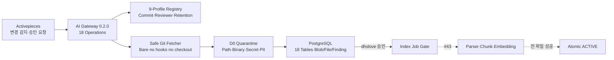

# Issue #42 Source Registry·검역·승인 파이프라인 구현 완료 보고서

> 검증일: 2026-08-05
>
> 대상: `techflow-ai-gateway 0.2.0`
>
> 초기 Source Reviewer: `dhslove`
>
> 판정: **구현·배포·검증 완료 — 실제 Source 승인 없이 #43 Parser·Index 구현 착수 가능**

## 1. 완료 범위

Issue #42에서 7개 ABLESTACK 저장소를 9개 불변 Source Profile로 등록하고, 최신 Branch Head 발견, 고정 Commit Fetch, D0 검역, 사람 승인 Gate, 색인 Job의 원자 활성화 계약을 구현했다. AI Gateway는 18개 API Operation과 18개 RAG Table로 확장됐고, 실제 시험 서버에 Migration·Gateway를 배포했다.

실제 승인 권한은 `dhslove`로 고정했지만 이번 검증에서는 후보를 승인하지 않았다. 9개 후보를 등록하고 소규모 `GENIE_MASTER`만 검역해 안전 경로를 입증했으며, 미승인 Ingestion과 Provider 호출은 차단했다.

## 2. 구현 구조

| 구성요소 | 구현 책임 |
|---|---|
| Source Registry | Repository·Branch·분류·License Metadata·보존·검토자 Allowlist |
| Safe Fetcher | Remote Head 발견, Commit Pin, Tree·Blob Read, 실행 금지 |
| Quarantine Policy | 경로·확장자·크기·Encoding·Binary·Secret·PII·Prompt Injection 판정 |
| AI Gateway API | 발견·검역·파일 판정·승인·Job 완료·멱등성·오류 계약 |
| PostgreSQL | Version·Blob·File·Finding·Approval·Job·상태·권한 감사 |
| Activepieces Template | Discovery, Review/Index 오케스트레이션 정의; 현재 미게시 |

## 3. Source 기준선

| Profile | Branch | 2026-08-05 관찰 Head | 시험 서버 상태 |
|---|---|---|---|
| `SHARED_DOCS` | `master` | `50d50ad6c8c548dc58db866ca28b4cbb43cc74d0` | `REGISTERED` |
| `CLOUD_MAIN` | `main` | `a873fb1ff436990fd523e2fe56682ff7aa31d1ec` | `REGISTERED` |
| `CLOUD_DIPLO` | `ablestack-diplo` | `19550c70d8d8a878eef40e1e1062b2fe0d40f71e` | `REGISTERED` |
| `CLOUD_EUROPA` | `ablestack-europa` | `4787b6918bfa48a3d3665814f29ff23f9007fe1f` | `REGISTERED` |
| `WALL_MAIN` | `main` | `f27b3f1b0b35489e05c64924b5cff7dc64dd2f6d` | `REGISTERED` |
| `COCKPIT_DIPLO` | `ablestack-diplo` | `c8b37dd6a4c35a8ba18169189a553595b24e54ab` | `REGISTERED` |
| `GENIE_MASTER` | `master` | `3e3c5c364f5c7261b07d49fcbcd4f3605b91f3b1` | `QUARANTINED` |
| `KICKSTART_MASTER` | `master` | `ffe24390544dd58e3441ac7362fe46b93472d0e1` | `REGISTERED` |
| `QEMU_EXEC_TOOLS_MAIN` | `main` | `a4b9bd60bb93800612d96aaad84e73ddfd768b68` | `REGISTERED` |

Branch Head는 시점 정보이며 승인 Commit이 아니다. 다음 발견에서 Head가 바뀌면 새 Version을 만들고 기존 검역·승인을 재사용하지 않는다.

## 4. 승인·멱등성·실패 정책

- 승인 대상은 `QUARANTINED` Version뿐이며 `approvedBy=dhslove`와 `expectedCommit` 일치를 요구한다.
- Blocking 제외가 있으면 명시적 수용과 10자 이상 Decision Note 없이는 승인할 수 없다.
- 발견·검역·승인·Job 완료는 Operation별 `Idempotency-Key`를 적용한다.
- `APPROVED`만 색인을 시작할 수 있고, 성공 File 수가 Eligible 수와 다르면 활성화하지 않는다.
- 색인 실패는 `APPROVED`로 복귀한다. 기존 `ACTIVE`는 새 Version 전체 성공 후에만 철회한다.
- `WITHDRAWN` Source는 최대 7일 내 삭제 전파 대상이며 원문 Provider 전송을 허용하지 않는다.

## 5. 자동 검증 결과

| 검증 | 결과 |
|---|---:|
| AI Gateway Unit·Contract·Store Test | 70/70 통과 |
| Issue #42 Validator Test | 4/4 통과 |
| OpenAPI Operation | 18개 일치 |
| PostgreSQL 논리 Table | 18개 일치 |
| Source Profile | 9개 일치 |
| 고정 Reviewer | `dhslove` 일치 |
| 정적 Secret 검출 | 0건 |
| 실제 Source 승인·활성화 | 0건 |
| OpenAI Provider Call | 0건 |

Regression 과정에서 기존 DB의 수동 Source 행까지 Profile 조회 결과에 섞이는 문제를 발견했다. PostgreSQL 조회를 9개 Registry ID Allowlist로 제한하고 회귀 Test를 추가했다.

## 6. 실제 Git·검역 Canary

`GENIE_MASTER`의 Public Git Repository를 대상으로 다음 결과를 확인했다.

| 항목 | 결과 |
|---|---|
| Commit | `3e3c5c364f5c7261b07d49fcbcd4f3605b91f3b1` |
| Tree | `05ff8e42226d7ae26773852c3ac55ce348de418a` |
| Candidate | 34 |
| Eligible | 34 |
| Excluded | 0 |
| Blocking | 0 |
| Snapshot Hash | `ccc6a907c596459175d04959f70212a703f232e71215dcfe06adf97e4e1f2d8f` |

파일 목록 API의 34개 항목에는 원문 Content Field가 없었다. Blob은 허용 Text만 Repository+Blob SHA 기준으로 중복 저장하며, 검역 제외 원문은 저장하지 않는다.

## 7. 시험 서버 배포 증적

| 항목 | 검증 결과 |
|---|---|
| OS | Ubuntu 24.04 |
| 배포 경로 | `/home/ablecloud/techflow-ai-gateway` |
| Compose Project | `techflow-ai-gateway` |
| Gateway | Version `0.2.0`, Healthy |
| Image ID | `sha256:b0c3fd97962e185b8648bf889981cae407ca89cb25cf290cb141d8468757dd4b` |
| Database | 18 Table, 9 Profile, Extension 2 |
| Runtime | UID/GID `10001:10001`, Read-only, `cap_drop: ALL` |
| Network | `rag_internal`, `rag_edge`, 기존 Automation Egress |
| Host Bind | `127.0.0.1:18090->8090` |
| Source 상태 | 8 `REGISTERED`, 1 `QUARANTINED`, 0 `APPROVED`·`ACTIVE` |
| 미승인 Ingestion | HTTP 409 `INVALID_STATE` |
| RAG Query | `ABSTAINED`, `providerCalled=false` |
| 기존 Activepieces | 6개 Container 모두 Healthy |

배포 전 DB Custom Dump와 Code·Compose·Image ID를 `/home/ablecloud/techflow-ai-gateway-backups/issue42-20260805T1105KST`에 보관했다. 비밀정보는 Backup Archive와 Repository 산출물에서 제외했다.

## 8. Activepieces 자산 상태

`rag-source-discovery-v1.json`과 `rag-source-review-index-v1.json` 두 Flow Template을 추가했다. 두 Template 모두 `published:false`이며, AI Gateway API 호출 순서와 실패 처리의 논리 계약만 자산화했다. #43 Parser·Indexer와 #45 인증된 승인 UI가 준비되기 전에 실행 Flow로 게시하지 않는다.

## 9. 롤백 판정

Gateway 오류는 직전 Image로 Application만 롤백하고 DB Volume과 기존 Activepieces Stack을 보존한다. Schema 오류는 Flow 중지, Backup 확인, 제품 책임자 승인 후 `0002_source_registry_down.sql`을 적용한다. 복구 뒤에는 Migration Verify, DB 권한, Runtime Canary, Activepieces Health 순으로 재검증한다.

## 10. 검토·승인 대상

초기 Source Reviewer `dhslove`가 다음을 검토하면 된다.

1. 9개 Profile의 Repository·Branch·초기 Reviewer가 의도와 일치하는지
2. `GENIE_MASTER` Canary의 34개 Eligible 판정과 제외 0건이 적절한지
3. 승인 시 `expectedCommit`, Exclusion 수용, Decision Note 계약이 충분한지
4. #43에서 최초로 Parser·Chunk·Embedding을 적용할 Profile과 Commit

Issue #42 PR 병합은 구현 승인이지 Source Version 승인과 동일하지 않다. 최초 실제 Source 승인은 #43 Indexer 준비 후 `dhslove`가 별도로 수행한다.

## 11. 다음 단계

다음 실행 단위는 Issue #43이다. 승인된 Source의 문서·코드를 Parser·Chunk로 변환하고, OpenAI Embeddings, PostgreSQL FTS·Identifier·pgvector exact cosine, RRF 결합, Lineage와 삭제 전파를 구현한다. 최초 Source를 승인하기 전 Indexer의 Dry-run·부분 실패·원자 활성화 회귀 Test를 먼저 통과시킨다.

## 12. 자산 목록

- [Source Registry 구조화 결정](../decisions/techflow-source-registry.json)
- [Source Registry·검역·승인 Runbook](../runbooks/source-registry-quarantine.md)
- [AI Gateway Service](../../services/ai-gateway/README.md)
- [OpenAPI 계약](../../services/ai-gateway/openapi/techflow-ai-gateway-v1.json)
- [Activepieces Discovery Flow](../../deploy/compose/activepieces/flows/rag-source-discovery-v1.json)
- [Activepieces Review/Index Flow](../../deploy/compose/activepieces/flows/rag-source-review-index-v1.json)
- [완료 보고서 PDF](../../output/pdf/techflow-source-registry-report.pdf)
- [발표자료 PDF](../../output/pdf/techflow-source-registry-presentation.pdf)
- [발표자료 PPTX](../../output/presentation/techflow-source-registry.pptx)
- [Artifact Manifest](../../output/issue-42-artifact-manifest.json)
