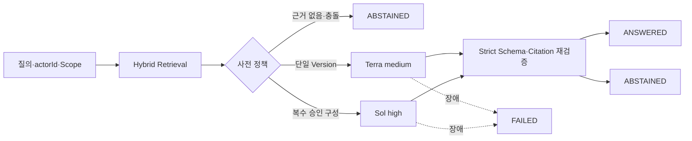

# Issue #44 OpenAI Responses·근거 답변 구현 완료 보고서

## 1. 결론

Issue #44 범위를 구현하고 시험 서버에 TechFlow AI Gateway 0.4.0을 배포했다. 실 OpenAI Responses 호출은 `ANSWERED`와 Commit 고정 Citation 5개를 반환했고, 검색 근거가 없는 질의는 `ABSTAINED`와 `generationProviderCalled=false`로 종료됐다. 로컬·서버 격리 테스트 각 96개, Secret Scan 0건, `0.4.0 → 0.3.0 → 0.4.0` 롤백·복귀를 통과했다.

## 2. 구현 결과

| 항목 | 구현 |
|---|---|
| Responses Adapter | 공식 OpenAI Python SDK, Runtime Secret File, Project 격리 |
| 최소 전송 | 로컬 검색 최종 D0 Chunk 최대 10개 |
| 요청 통제 | `store=false`, `background=false`, `stream=false`, Tool 0개 |
| 출력 계약 | strict JSON Schema: State·Answer·Citation IDs·Abstain Reason |
| 기본 라우팅 | 단일 Repository·Commit은 `gpt-5.6-terra/medium` |
| 상향 라우팅 | 승인 Compatibility 범위의 복수 Repository·Commit은 `gpt-5.6-sol/high` |
| 사전 보류 | 근거 없음, Test-only, Branch 충돌, 미승인 Cross-repository |
| 사후 검증 | Citation 부분집합, 답변당 Citation 필수, Test-only·Branch 재검증 |
| 상태 | `ANSWERED`, `ABSTAINED`, `FAILED` |
| 장애 | 3초 Connect·12초 응답, 최대 3회, Circuit Breaker |
| 감사 | 원문 없는 Profile·Model·ID·Token·Latency·Status·Error |

## 3. 동작 구조

모델은 라우팅을 스스로 선택하지 않는다. Gateway가 검색 Metadata만으로 한 번 판정하고, 기본 호출 실패나 낮은 확신을 이유로 자동 이중 호출하지 않는다.

## 4. 실증 증거

| 검증 | 결과 |
|---|---|
| 로컬 Unit·Contract | 96 passed |
| 서버 Network-none Container | 96 passed |
| 저장소 계약 Validator | 21 Operations, Context 10, Responses Profile 2 |
| 실 Responses 답변 | `ANSWERED`, 기본 Profile, Citation 5, Provider 호출 성공 |
| 실 사전 보류 | `ABSTAINED`, Citation 0, Generation Provider 미호출 |
| Provider 성공 감사 | Input 6,002 Token, Output 620 Token, 6,184 ms, Request·Response ID 존재 |
| 활성 색인 | 34 File, 64 Chunk, 64 Embedding, 15 Symbol, 45 Relation |
| Secret Scan | 배포 파일 0, Gateway Log 0 |
| Root Disk | 1,005 GiB, 가용 950 GiB, 사용률 2% |
| Activepieces | 6개 Container 모두 Healthy 유지 |

초기 Canary에서 두 가지 운영 결함을 발견하고 수정했다.

1. HMAC 가명 식별자가 67자로 OpenAI의 64자 제한을 초과했다. Digest를 잘라 최대 64자로 고정했다.
2. 동일 Source Version의 문서·코드 혼합을 복합 분석으로 과대 판정해 Sol/high를 선택했고 12초 정책 내 응답하지 못했다. 혼합 Source Kind 자체는 충돌이 아니므로 단일 Repository·Commit은 Terra로 유지했다.

두 실패는 각각 `PROVIDER_REJECTED/TERMINAL`, `PROVIDER_TIMEOUT/RETRYABLE`로 원문 없이 감사됐다. 수정 후 실 답변이 성공했다.

## 5. Secret과 데이터 보호

사용자가 제공한 OpenAI Key·Project 식별자는 GitHub Repository Secrets와 서버 런타임 Secret File로만 배치했다. 저장소에는 Secret 이름과 파일 경로만 존재하며 실제 값은 없다. `actorId`는 서버 전용 Salt와 HMAC-SHA256으로 가명화하고 OpenAI 제한에 맞춰 64자로 제한한다.

`rag_provider_call`은 질문·Context·답변을 저장하지 않는다. Canary도 답변 원문 대신 상태, Profile, Citation 수, Answer 문자 수와 호출 여부만 출력한다.

## 6. 배포·복구

배포 전 PostgreSQL Dump, 기존 Image ID, Compose·Override·환경 참조, Runtime Source와 Checksum을 `/home/ablecloud/techflow-ai-gateway/backups/issue44-predeploy-20260810T0230KST`에 보관했다. 별도 Stage에서 이미지를 빌드하고 96개 격리 테스트를 통과한 뒤 운영 Compose를 재생성했다.

롤백 시험은 기존 v0.3.0으로 전환해 Provider `openai`와 Health를 확인하고, 다시 v0.4.0 Image로 복귀해 Database·Vector `ready`를 확인했다. 데이터 Schema 변경이 없어 활성 색인은 유지됐다.

## 7. 조사 결과와 운영 확인 항목

OpenAI 공식 지침상 현재 모델 선택은 기본 `gpt-5.6-terra`, 고난도 작업은 `gpt-5.6-sol` 경로와 일치한다. Structured Output은 Responses API의 strict `text.format` JSON Schema를 사용했다. `store=false`만으로 ZDR이 성립하지 않으며, ZDR·Modified Abuse Monitoring은 Organization Dashboard에서 별도 승인·적용 상태를 확인해야 한다.

현재 API Key로 모델 접근과 실제 Responses·Embeddings 호출은 확인했지만 Project의 ZDR/MAM Dashboard 상태는 API로 확인할 수 없었다. 따라서 상태는 `UNVERIFIED_IN_DASHBOARD`로 기록한다. 이는 D0 PoC 구현 제한이 아니며 D1 이상 데이터 확장 전 운영 Gate다.

- [OpenAI 최신 모델 선택 지침](https://developers.openai.com/api/docs/guides/latest-model)
- [OpenAI Structured Outputs](https://developers.openai.com/api/docs/guides/structured-outputs)
- [OpenAI API 데이터 제어](https://developers.openai.com/api/docs/guides/your-data)

## 8. 완료 판정과 다음 단계

Issue #44의 구현·실 Provider·보류·오류·감사·Secret·배포·롤백 조건을 모두 충족했다. PR 검토·병합 전까지 Issue는 열어 두며, 다음 구현 단위는 Issue #45의 Activepieces Push·승인·재색인 연동이다.

운영자가 별도로 확인할 항목은 두 가지다.

1. OpenAI Dashboard에서 Project의 ZDR 또는 MAM 적용 상태 확인
2. 대화에 직접 입력된 현 API Key를 회전한 뒤 GitHub Secret과 서버 Runtime Secret을 함께 갱신

고객 공개 여부는 제품 책임자의 결정이며 본 구현 범위나 향후 자체 기능 구현을 제한하지 않는다.
