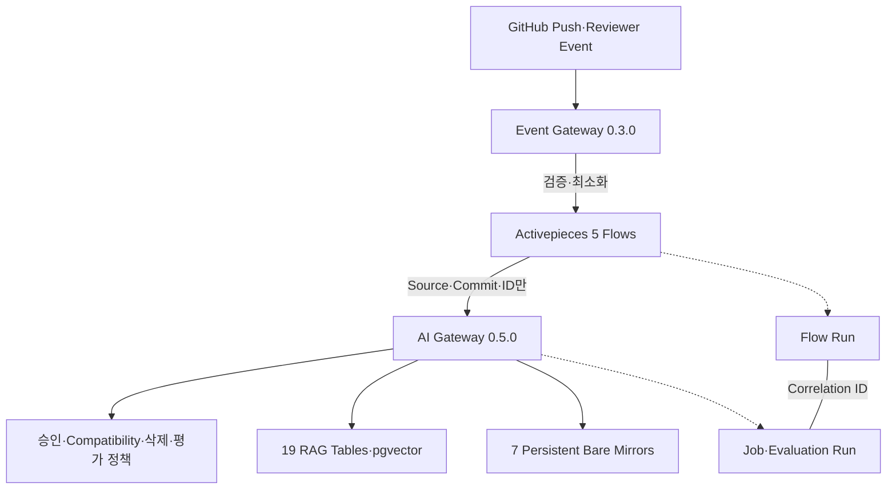

# Issue #45 Activepieces 수집·재색인·평가 연동 완료 보고서

## 1. 결론

Issue #45 범위를 구현하고 시험 서버에 TechFlow AI Gateway 0.5.0, Event Gateway 0.3.0과 Activepieces 5개 Flow를 배포했다. 9개 Source Profile의 GitHub Push 감지부터 Reviewer 승인, 고정 Commit 색인, Compatibility, 철회·삭제, Golden Set 평가가 시각적 Flow로 연결됐다. 정책 판정과 데이터 변경은 AI Gateway에 유지했고 Activepieces는 Orchestration만 담당한다.

로컬 AI Gateway 97개, Event Gateway·Flow 계약 26개 테스트가 통과했다. 5개 Flow는 모두 Enabled이며 6개 Activepieces Container와 AI Gateway Database·Vector가 Healthy다. 중복 Event 409, 승인 상태 충돌 `MANUAL_REVIEW`, 원문 Marker 비저장, 양 Gateway 버전 롤백·복귀를 실증했다.

## 2. 구현 범위

| 항목 | 결과 |
|---|---|
| Source 감지 | GitHub Push를 7개 Repository·9개 Branch/Profile로 결정론적 매핑 |
| Event 계약 | HMAC·Timestamp·Event ID, 최소 Payload, Correlation·Idempotency 필수 |
| Discovery Flow | 후보 Source 등록과 검역 Scan |
| Approval Flow | Reviewer `dhslove`, 고정 Commit 승인 후 Ingestion Job |
| Compatibility Flow | 승인 Version만 Compatibility Set에 반영 |
| Withdrawal Flow | 즉시 검색 제외와 Lineage 삭제 Job 추적 |
| Evaluation Flow | Profile·Commit별 Golden Set Run과 상태 확인 |
| 오류 분류 | `RETRYABLE`, `TERMINAL`, `MANUAL_REVIEW` |
| DB 연계 | Ingestion Job·Evaluation Run에 `correlation_id` 추가 |
| 보안 | SSRF Strict, 내부 IP 2개만 허용, Public Flow Webhook 차단 |

## 3. 동작 구조와 책임

Activepieces가 승인 결과나 데이터 등급을 생성하지 않는다. 202 접수 응답도 최종 성공으로 간주하지 않고 Flow Run과 AI Gateway 상태를 함께 확인한다.

## 4. 시험 서버 배포 결과

| 구성 | 배포 상태 |
|---|---|
| Activepieces | 0.86.3, App·Worker Healthy |
| Event Gateway | 0.3.0, Image ID `sha256:090af03967168a15830988aab65591a629ff028821cb6fae6992972accc962bb` |
| AI Gateway | 0.5.0, Image ID `sha256:2d525f31c0d9decdae4d7382f00f9a3d3007865c148972e6f9dd64df0cb8cc44` |
| AI Provider | OpenAI, Runtime Secret File 사용 |
| Database·Vector | `ready` |
| Activepieces Runtime | 6개 Container Healthy |
| Root Disk | 1,005 GiB, 사용 15 GiB, 가용 949 GiB, 사용률 2% |

배포 전 상태는 `/home/ablecloud/techflow-ai-gateway-backups/issue45-20260810T042137Z`에 보관했다. Activepieces Dump 86,097,054 Byte, AI Gateway Dump 1,013,497 Byte, Compose와 이전 Image ID를 포함하며 Secret은 포함하지 않는다.

## 5. 활성 Flow와 실증

| Flow | Runtime ID | 상태·증거 |
|---|---|---|
| Discovery + Scan | `mmXBGOVE0cwz2JmkzKoZl` | Enabled, Canary Succeeded |
| Review + Ingestion | `FinN9dvxtiGl10t8Br8kt` | Enabled, 오류 Canary 409 Manual Review |
| Compatibility | `zGckwpMDh3ImsHs0yig4L` | Enabled |
| Withdrawal + Deletion | `rpsiIRfh8wo6XpdvaxSMa` | Enabled |
| Evaluation + Status | `JV7tPXmC2cR75HGm4Oft4` | Enabled, Canary Succeeded |

최종 Discovery Run `92L6pubY1TSuYiPg04eeb`, Evaluation Run `RkVFo65P9eIMLmkE1SR11`은 `SUCCEEDED`였다. 동일 Event를 재전송하면 첫 요청은 202, 두 번째는 409가 됐다. 승인되지 않은 Source 상태에 Review Event를 보낸 시험은 `INVALID_STATE`, `MANUAL_REVIEW`로 Fail-closed 됐다.

`DROP-ME` 원문 Marker를 포함한 Canary 후 Activepieces DB Dump 전체에서 Marker가 발견되지 않았다. Flow에는 Source ID·Profile·Branch·Commit·Job·상태와 허용 오류만 남는다.

## 6. 테스트와 보안 증거

| 검증 | 결과 |
|---|---|
| AI Gateway Unit·Contract | 97 passed |
| Event Gateway | 23 passed |
| Flow Bundle | 3 passed |
| OpenAPI | 21 Operations |
| Migration | 19 Tables, Issue #45 Column 2, Manifest 14 Files |
| Image Lock | 6 Services 동일 Image·Digest 확인 |
| Runtime Secret Scan | 8개 Secret 기준, 17 Object, Leak 0 |
| Flow 상태 | 5 Enabled, 중복·고아 Flow 제거 |
| 기존 자동화 | GitHub Chat Flow 변경 없음 |

Event Gateway는 GitHub Payload 전체를 Activepieces로 전달하지 않는다. Repository·Branch를 Allowlist에 매핑하고 알려지지 않은 필드, Source 원문, Prompt, Token과 Header를 제거한다. Activepieces SSRF 정책은 `STRICT`이고 AI Gateway와 Control Plane의 고정 내부 IP만 허용한다.

## 7. 롤백 실증

데이터를 복원하지 않고 Application Image만 전환하는 최소 롤백을 수행했다.

- AI Gateway: `0.5.0 → 0.4.0 → 0.5.0`
- Event Gateway: `0.3.0 → 0.2.0 → 0.3.0`
- 양 방향 Health 통과
- Migration 0006의 Nullable Correlation Column 유지
- DB 손상 시에만 배포 전 Dump 복원

## 8. OpenAI ZDR·MAM 확인 결과

OpenAI Dashboard Data Controls를 확인했으나 현재 로그인 계정의 Organization에는 `Default project`만 표시되고 `ABLESTACK TechFlow` Project가 표시되지 않았다. 따라서 대상 Project의 ZDR·Modified Abuse Monitoring 적용 상태는 `UNVERIFIED_ACCOUNT_ACCESS_MISMATCH`로 판정한다.

이 결과는 D0 PoC 운영을 막지 않는다. 다만 D1 이상 데이터를 사용하기 전에는 대상 Project 권한이 있는 계정으로 Dashboard에서 적용 상태를 확인해야 한다. `store=false`만으로 ZDR이 성립하지 않는다.

- [OpenAI API 데이터 제어](https://developers.openai.com/api/docs/guides/your-data)

사용자가 요청한 대로 API Key 교체는 이번 작업에서 수행하지 않았으며, 향후 명시적 요청이 있을 때 GitHub Secret과 서버 Runtime Secret을 함께 갱신한다.

## 9. 완료 판정과 다음 단계

Issue #45의 Flow, 최소 Event, Idempotency, Correlation, 오류 분류, 보안, 시험 서버 배포, Canary, 롤백과 문서화 조건을 충족했다. PR 검토·병합 전까지 Issue는 열어 둔다.

다음 실행 단위는 Issue #46 품질·보안·E2E 검증이다. 진행 전에 사용자가 확인할 항목은 다음 두 가지다.

1. 5개 Flow의 책임 경계와 `dhslove` Reviewer 정책 승인
2. ABLESTACK TechFlow Project 권한이 있는 OpenAI Dashboard 계정으로 ZDR·MAM 상태 확인

고객 공개 여부는 제품 책임자의 결정이며 본 구현이나 향후 자체 기능 범위를 제한하지 않는다.
