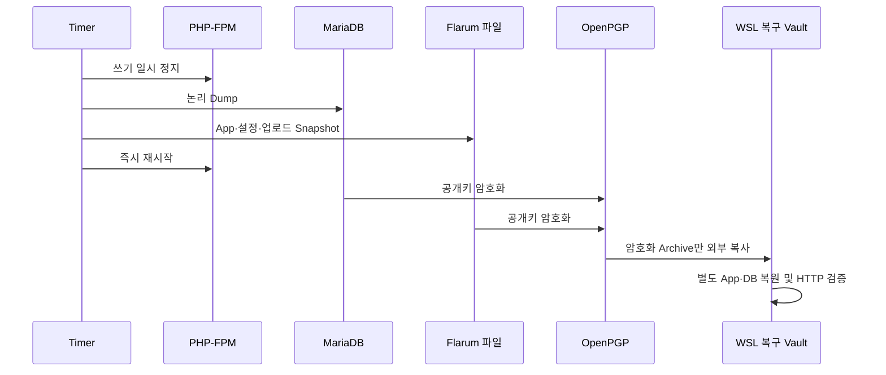

# Issue #74 Community 백업·모니터링·보안 운영 강화 완료 보고서

## 결론

ABLESTACK Community 운영 서버에 일관성 있는 암호화 백업, 5분 주기 상태·Metric 수집, Chat 경보, 보안 헤더, 인증 Rate Limit과 권한 강화를 적용했다. 운영 백업을 WSL 복구 Vault로 외부 복사한 뒤 별도 App Root와 별도 DB에 9초 만에 복원했고 사용자 41명, 토론 121건, 게시물 325건, 첨부 115건이 원본과 모두 일치했다. 복원본 Flarum 1.8.18과 HTTP 200도 확인했다.

운영 서비스는 Nginx·PHP-FPM·MariaDB 3/3 Active, Community·AI 연동 HTTP 200, 디스크 2%·inode 1%, 최신 백업 무결성 정상, smtp 강제 정책 정상, 활성 경보 0건이다. 운영 판정은 **GO**다.

후속 승인에 따라 Issue #73/PR #80의 `ablecloud/community-theme`도 운영에 활성화했다. 홈·태그·상세 외부 HTTPS 200, 데스크톱·390x844 모바일 가로 넘침 0px, 태그 절대 날짜 형식, 상세 첫 화면 `scrollY=0`, 글쓰기·태그 선택 대화상자를 확인했다. 운영 환경에서 추가로 발견한 Best Answer와 OAuth 보안 화면 영문은 테마 Locale에 포함해 직접 노출 0건으로 보완했다. 연결 계정의 Google·GitHub 브랜드 아이콘도 내장 SVG Mask와 28px 중앙 정렬 규칙으로 보완해 WSL CSS와 운영 실제 화면에서 깨진 사각형 0건을 확인했다.

## 구현 결과

| 완료 조건 | 결과 |
|---|---|
| 자동 백업·무결성 | 매일 03:20 KST Timer Active, 실제 암호화 백업 PASS |
| 일관성 | PHP-FPM 정지 구간에서 DB·App·업로드 Snapshot |
| 암호화·보존 | OpenPGP 공개키, 운영 30일, 개인키 운영 미보관 |
| 외부 복사 | 179,701,760 Byte 암호화 Archive를 WSL Vault로 Pull |
| 격리 전체 복원 | 별도 App·DB, 32 Table·11,336 File, RTO 9초 |
| 데이터 정합성 | 사용자·토론·게시물·첨부 차이 0건 |
| 관측 | 5분 Timer, JSON과 Prometheus Text Format |
| Chat | 실제 시험 전송 HTTP 200, 상태 전이·1시간 억제 시험 PASS |
| 보안 | 5개 Header, TLS 1.0 차단, TLS 1.2 허용, Auth 429 |
| 권한·로그 | World-writable File 0, Secret Scan 0, Logrotate PASS |

## 기준선과 적용값

운영 서버는 Ubuntu 24.04, Flarum 1.8.18, PHP 8.3.6, MariaDB 10.11.13, Nginx 1.24.0이다. 8 vCPU·15 GiB RAM, 1006 GiB Root 중 955 GiB가 남아 있었고 inode 사용률은 1%였다.

기준선에는 Issue #71/#72 수동 Backup 555 MiB가 있었지만 정기 Timer, 최신 Backup 무결성 감시, 격리 복원 자동화와 Chat 운영 경보가 없었다. `config.php`는 0644였고 전용 Rate Limit·HSTS·Permissions-Policy도 없었다.

## 백업·복원 검증

| 검증 | 결과 |
|---|---:|
| 운영 Backup | `community-20260819T095245Z` |
| 암호화 파일 | DB·Application 2개 |
| 운영 Archive 권한 | Root 전용 0600 |
| WSL 외부 복사 | 171.4 MiB |
| 복원 Table·File | 32 / 11,336 |
| 복원 RTO | 9초 |
| 복원 HTTP | 200, 0.947초 |
| 사용자 | 41 = 41 |
| 토론 | 121 = 121 |
| 게시물 | 325 = 325 |
| 첨부 | 115 = 115 |

정기 백업 정책상 최대 RPO는 24시간+10분이다. 이번 운영 Snapshot은 생성 135초 후 WSL에서 검증했으며 핵심 데이터 차이는 0건이었다.

검증 후 WSL의 두 격리 App Root와 두 임시 DB를 삭제해 평문 복원 데이터 잔존은 0건이다. 179,701,760 Byte의 암호화 외부 Backup과 복구 키만 Root 전용 Vault에 유지했다. 원본 스테이징 HTTP 200을 다시 확인했다.

## 관측·경보 검증

Monitor는 Nginx, PHP-FPM, MariaDB, Community Local/Public Route, TechFlow AI Orchestration Health, Disk, inode, Upload Bytes, Backup Age·Integrity, 최근 Critical Log 수와 Mail Driver를 수집한다.

WSL Mock Chat에서 AI Health 장애→동일 장애→복구 순서로 실행했을 때 전송은 장애 1회와 복구 1회뿐이었다. Payload는 `text`, `url`만 포함했다. 운영 Chat 시험 전송은 HTTP 200이었다. 첫 운영 Monitor가 첫 Backup과 겹쳐 일시 경보를 만든 사실을 확인하고 Backup·Monitor 공통 Lock을 추가했다. 이후 Backup 중 Monitor는 `monitor=skipped reason=backup-in-progress`로 종료하고 정상 상태를 유지한다.

2026-08-19 후속 보완에서 정상 상태의 주기 알림을 완전히 제거했다. 최초 정상과
정상 유지에는 메시지를 보내지 않고, 장애가 새로 발생하거나 장애 내용이 바뀔 때
경보한다. 같은 장애가 지속되면 쿨다운 전에는 억제하고 쿨다운 후에만 다시 알리며,
장애 상태에서 정상으로 바뀐 경우에만 복구 메시지를 한 번 보낸다. 이후 정상
유지에는 다시 알리지 않는다. 정책 단위시험 7건과 WSL·운영 실제 정상 Monitor를
검증했으며 두 환경 모두 상태 파일 시각이 실행 전후 동일해 정상 메시지 미전송을
확인했다. 운영 적용 전 파일은
`/var/backups/techflow-flarum/alert-policy-20260819T1128Z`에 보존했다.

## 보안 검증

| 항목 | 결과 |
|---|---|
| `config.php` | `root:www-data 0640` |
| Ops·Chat 설정 | `root:root 0600` |
| 일반 File World-writable | 0건 |
| 관리 그룹 소속 | 8명, 신원은 보고서에 기록하지 않음 |
| Auth Rate Limit | 40회 중 27회 HTTP 429 |
| 외부 HTTPS | HTTP/2 200, 인증서 검증 0 |
| 보안 Header | nosniff, SAMEORIGIN, Referrer, Permissions, HSTS |
| TLS | 1.0 차단, 1.2 허용 |
| 자동 보안 갱신 Timer | enabled/active |
| Logrotate | Dry-run PASS |
| 관리 Backup·상태·로그 Secret Scan | 0건 |

Composer Audit에는 Symfony Mailer CVE-2026-45068 1건이 남아 있다. 공식 권고에 따르면 취약 경로는 SendmailTransport의 명령행 인자 처리다. 현재 Community는 smtp Driver이며 Monitor가 5분마다 smtp를 강제한다. Flarum 1.x 의존성 범위에서 Symfony Mailer 안전 버전으로 독립 승격할 수 없어 이 보상 통제를 유지하고, 호환되는 상위 Flarum 전환 시 교체한다.

## 운영 변경과 보호 범위

- 변경: Community 서버의 전용 Script·Timer·Nginx 정책·파일 권한, 승인된 Community Theme
- 미변경: 질문·답변·첨부 원문, Flarum Schema, Activepieces, AI Gateway·Poller
- 보호 유지: GitHub→Chat Webhook 서비스는 조회·배포·재시작·설정 변경을 하지 않음
- 업로드 정책: 일반 1 GiB, 압축 10 GiB 기준 불변

## 롤백과 남은 운영 의무

Nginx 적용 전 설정은 `/var/backups/techflow-flarum/security-20260819T091120Z`에 있다. 관측 Timer는 독립적으로 중지할 수 있고, Nginx 설정은 백업 파일 복원 후 `nginx -t`와 HTTP 200으로 검증한다. 운영 데이터에 자동 복원하지 않는다.

WSL 복구 Vault는 현재 운영 서버와 다른 장애 영역이지만 사용자 Workstation의 가용성에 의존한다. 제품화 단계에서는 같은 공개키 암호화 Archive를 회사 승인 Object Storage 또는 Backup Vault에도 복제하고, 분기마다 전체 복원을 반복해야 한다.

## 완료 판정

Issue #74의 자동 백업·암호화·보존·무결성, 격리 전체 복원, RPO/RTO 측정, 서비스·용량·AI 관측, Chat 경보, 권한·Header·Rate Limit·로그 마스킹, Runbook과 결과 자산 조건을 모두 충족했다.
