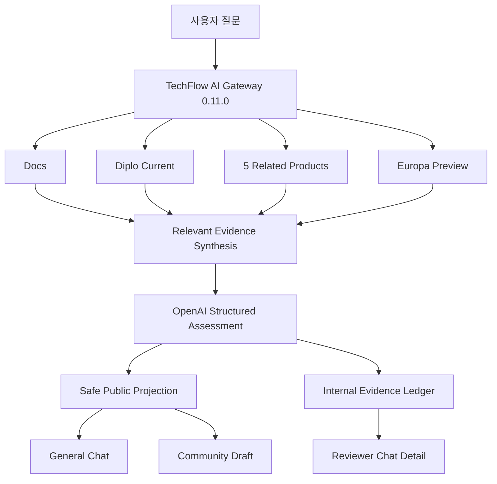

# Issue #62·#63 구현·검증 보고서

## 결과 요약

Diplo 현재 출시판과 Europa 미출시 프리뷰의 역할을 분리한 전 Source 기술지원 경로와 내부·외부 답변 분리를 구현했다. 일반 Chat 질문과 Community Draft는 사용자용 안전 Projection만 제공하고 승인 담당자의 Chat 상세에는 8개 Source Coverage와 코드 Citation을 제공한다.

AI Gateway `0.11.0`을 Ubuntu 24.04 시험 서버에 배포했다. 최종 Community E2E Discussion #150은 `ANSWERED`, `DRAFT_PENDING`, 안전 Draft 1,810자, 내부 Citation 4개, Coverage 8개를 기록했다. Reviewer Chat 상세에서는 Diplo 2건과 Europa 2건을 확인했고 나머지 6개 Profile은 직접 관련 근거 없음으로 명시됐다.

## 구현 자산

- `app/versioned_assist.py`: Source 역할, 전체 검토, 관련 근거 선별, Ledger, 안전 Projection
- `app/responses.py`: 현재판·프리뷰 구조화 Schema와 엄격한 프리뷰 정책
- `app/main.py`: 전 Source Assist, Community Draft, 일반 Chat Q&A
- `app/data/versioned-assist-golden-v1.json`: 6개 판정 Golden Case
- `tests/test_versioned_assist.py`: 역할·Coverage·Projection·Golden 계약 시험

## 최종 아키텍처

## 자동 시험

| 항목 | 결과 |
|---|---:|
| Python Unit/Contract Test | 158 PASS |
| OpenAPI Operation | 33 |
| Versioned Golden Case | 6 |
| 현재 오류·프리뷰 개선 Case | 포함 |
| 현재 오류·프리뷰 미확인 Case | 포함 |
| 외부 Projection 내부 계보 검사 | PASS |
| `github-chat-v1` 동결 가드 | PASS |

## 시험 서버 배포

| 항목 | 최종 값 |
|---|---|
| OS | Ubuntu 24.04 |
| Root Volume | 1007 GiB, 사용 65 GiB, 여유 892 GiB |
| AI Gateway Image | `techflow/ai-gateway:issue-62-versioned` |
| Gateway Version | `0.11.0` |
| Database / Vector | ready / ready |
| Provider | OpenAI |
| Gateway / Community Poller | healthy / running |
| 최종 백업 | `/home/ablecloud/techflow-ai-gateway-backups/issue62-predeploy-20260812T095938Z` |

Secret 파일과 값은 복사·출력·문서화하지 않았다. Database Migration은 없으며 기존 `source_metadata` JSON에 Evidence Ledger를 저장한다.

## E2E 결과

### E2E 1: 범용 질문 보류

- 질문: Diplo 환경의 일반적인 VM 배포 실패 원인과 Europa 개선 여부
- 전체 Coverage: 8개 Profile 검색 수행
- 결과: `ABSTAINED`
- 현재판: `INSUFFICIENT_EVIDENCE`
- 프리뷰: `PREVIEW_INSUFFICIENT`
- 판정: 환경·로그 없이 원인을 확정하지 않아 PASS

### E2E 2: 일반 Chat 답변

- 질문: Diplo `StorageServiceHostCommand` 주요 필드와 Europa 관련 변경
- 결과: `ANSWERED`, 안전 Projection 1,612자
- 내부 경로·Profile·GitHub URL 노출: 0건
- Reviewer 권한이 없는 유효 Chat 사용자 기술 질문: 허용
- 판정: PASS

### E2E 3: Community 최종 Case

- Discussion: [#150](https://community.ablecloud.io/d/150)
- Case: `c6729fa1...`
- 상태: `DRAFT_PENDING / ANSWERED`
- Draft: 1,810자
- 내부 Citation: 4개
- Coverage: 8개
- 공개 Draft 금지 패턴: 0건
- 자동 게시: 수행하지 않음. 담당자 승인 대기
- 판정: PASS

### E2E 4: Reviewer Chat 상세

| Profile | 역할 | 최종 관련 근거 |
|---|---|---:|
| SHARED_DOCS | 현재 문서 | 0 |
| CLOUD_DIPLO | 현재 출시 Cloud | 2 |
| WALL_MAIN | 현재 연관 제품 | 0 |
| COCKPIT_DIPLO | 현재 연관 제품 | 0 |
| GENIE_MASTER | 현재 연관 제품 | 0 |
| KICKSTART_MASTER | 현재 연관 제품 | 0 |
| QEMU_EXEC_TOOLS_MAIN | 현재 연관 제품 | 0 |
| CLOUD_EUROPA | 미출시 프리뷰 | 2 |

Reviewer 상세에는 Commit·파일·라인 Citation 4개와 `CURRENT_NORMAL / PREVIEW_NOT_FOUND`가 표시됐다. 일반 사용자 답변에는 같은 계보가 표시되지 않았다.

## 구현 중 발견과 개선

첫 구현은 8개 Profile의 벡터 상위 결과를 모두 생성 컨텍스트에 넣어 직접 관련 없는 근거 때문에 정확한 코드 질문도 보류됐다. 검색 수행과 생성 근거 사용을 분리하고, 질문에 명시적 코드 식별자가 있으면 해당 식별자와 직접 일치하는 결과만 채택하도록 수정했다. 이후 Diplo·Europa 각각 2개 근거만 사용해 Chat과 Community 답변이 정상 생성됐다.

## 기존 서비스 보호

`protected_service=github-chat-v1 state=frozen guard=passed`를 확인했다. 실제 `techflow-activepieces-event-gateway-1`은 기존 `ablestack-techflow/event-gateway:0.4.0` Image로 2일 이상 재시작 없이 `healthy`였으며 이번 Gateway 배포 대상에 포함하지 않았다.

## 완료 판정

Issue #62의 전 Source 검토·Diplo/Europa 비교와 Issue #63의 내부 Ledger·외부 Projection 분리 완료 기준을 충족했다. PR #61은 자동 시험, 실서버 배포, Community·Chat E2E, 동결 서비스 보호, 문서·보고 자산이 모두 갖춰졌으므로 Draft 해제 가능한 상태다.
