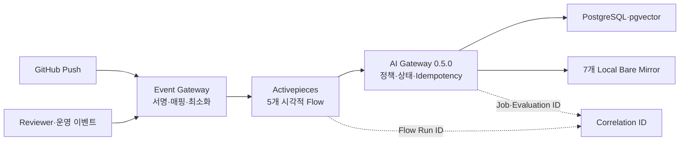

# Activepieces RAG 수집·재색인·평가 운영 Runbook

## 1. 목적과 책임 경계

이 Runbook은 Issue #45에서 구현한 9개 Source Profile의 최신 Head 감지, 승인, 수집, 재색인, 철회와 Golden Set 평가 Flow를 배포·검증·복구하는 절차다. Activepieces는 실행 순서를 시각화하고 호출하지만 Source 등급, 승인 유효성, Compatibility, 삭제 완료와 평가 합격을 판정하지 않는다. 판정과 데이터 변경은 TechFlow AI Gateway가 소유한다.



## 2. Flow 목록

| Flow | 역할 | 정책 판정 위치 |
|---|---|---|
| Source Discovery + Scan | 후보 Commit 등록과 검역 요청 | AI Gateway |
| Reviewer Approval + Ingestion | `dhslove` 승인 전달과 고정 Commit 색인 | AI Gateway |
| Compatibility Approval | 승인된 Version 조합 등록 | AI Gateway |
| Withdrawal + Deletion | 즉시 검색 제외와 Lineage 삭제 Job | AI Gateway |
| Evaluation + Status | Profile·Commit별 Golden Set 실행과 상태 확인 | AI Gateway |

Flow 정의는 `deploy/compose/activepieces/flows/rag-orchestration-v1.json`, 멱등 배포 도구는 `deploy/compose/activepieces/scripts/manage-rag-flows.py`다. 환경별 Flow ID는 결정 기록과 완료 보고서에서 관리하며, 이름과 논리 ID를 배포 기준으로 사용한다.

## 3. 배포 전 확인

1. `main`과 작업 Branch가 승인된 Commit인지 확인한다.
2. Activepieces·AI Gateway PostgreSQL Dump와 현재 Image ID를 별도 백업 경로에 기록한다.
3. 실제 Secret은 서버의 보호된 Runtime File과 `.env`에만 존재하는지 확인한다.
4. `TECHFLOW_RAG_*_URL`은 Activepieces가 접근할 수 있는 내부 URL만 사용한다.
5. SSRF 제한은 `STRICT`를 유지한다. AI Gateway `172.30.19.3/32`, Control Plane `172.30.19.9/32`와 동결된 GitHub→Chat Adapter `172.30.19.10/32`만 허용한다. RAG 배포는 `172.30.19.10/32`를 제거하거나 GitHub Chat Flow를 변경할 수 없다.

시험 서버의 Issue #45 배포 전 백업은 `/home/ablecloud/techflow-ai-gateway-backups/issue45-20260810T042137Z`에 있으며 DB Dump, Compose와 이전 Image ID만 포함한다. Secret File은 복제하지 않았다.

## 4. 정적 검증

```bash
cd services/ai-gateway
python -m unittest discover -s tests -v
python scripts/migrate.py verify

cd ../../deploy/compose/activepieces
python -m unittest event-gateway/test_gateway.py -v
python -m unittest scripts/test_manage_rag_flows.py -v
python scripts/manage-rag-flows.py --validate-only --bundle flows/rag-orchestration-v1.json
```

검증기는 Flow에 자동 승인, Source 원문, Prompt, Provider Key, GitHub Token, Authorization Header가 들어가면 실패해야 한다.

## 5. 배포

### 5.1 AI Gateway

1. `0006_orchestration_correlation_up.sql`을 적용한다.
2. `python scripts/migrate.py verify`로 19개 Table과 `correlation_id` 2개 Column을 확인한다.
3. 새 Image를 별도 Tag로 빌드하고 Network-none Test를 통과시킨다.
4. Compose에서 Gateway와 Reconciler만 재생성한다.
5. `/healthz`가 Process·Database·Vector `ready`, Version `0.5.0`을 반환하는지 확인한다.

### 5.2 Activepieces와 Event Gateway

```bash
cd /opt/ablestack-techflow/activepieces
docker compose build event-gateway
docker compose up -d event-gateway
python3 scripts/manage-rag-flows.py \
  --bundle flows/rag-orchestration-v1.json \
  --base-url "$AP_INTERNAL_URL"
./scripts/verify-image-lock.sh
```

배포 전에 `TECHFLOW_ACTIVEPIECES_EMAIL`과 `TECHFLOW_ACTIVEPIECES_PASSWORD`를 운영 Secret Store에서 현재 Process 환경에만 주입한다. `manage-rag-flows.py`는 논리 이름 기준으로 생성·갱신하고 반복 실행해도 중복 Flow를 만들지 않는다. 로그인 값이나 인증 응답은 명령행, 로그, 문서에 남기지 않으며 완료 즉시 환경 변수를 해제한다.

## 6. Canary와 성공 판정

1. 새 `eventId`, `correlationId`, `idempotencyKey`를 만든다.
2. Event Gateway 내부 서명 경로로 D0 Metadata만 전송한다.
3. HTTP 202는 접수 성공일 뿐 업무 성공이 아니다.
4. Activepieces Flow Run이 `SUCCEEDED`인지 확인한다.
5. AI Gateway의 Source·Job·Evaluation 상태와 같은 Correlation ID를 확인한다.
6. 동일 Event를 다시 보내 두 번째 요청이 409로 거절되는지 확인한다.
7. 승인 Flow는 승인되지 않은 상태를 입력해 `MANUAL_REVIEW`로 Fail-closed 되는지도 확인한다.

시험 서버 최종 Canary는 Discovery Run `92L6pubY1TSuYiPg04eeb`, Evaluation Run `RkVFo65P9eIMLmkE1SR11`이 `SUCCEEDED`였다. 승인 오류 Canary는 409 `INVALID_STATE`와 `MANUAL_REVIEW`로 종료됐다.

## 7. 실패 처리

| 분류 | 예 | 운영 조치 |
|---|---|---|
| `RETRYABLE` | Timeout, 연결 오류, AI Gateway 5xx | 동일 Idempotency Key로 제한 재시도 |
| `TERMINAL` | Schema 오류, 미허용 Repository, 서명 오류 | 재시도 금지, 입력·계약 수정 |
| `MANUAL_REVIEW` | 상태 충돌, 승인 무효, Compatibility 정책 거절 | Reviewer 확인 후 새 Event 발행 |

Flow 이력에는 허용된 Error Code와 Correlation ID만 남긴다. 실패 원문이나 외부 응답 Body 전체를 저장하지 않는다.

## 8. 롤백과 복구

1. 새 Event 유입을 중지한다.
2. 직전 Event Gateway Image `0.2.0`과 AI Gateway Image `0.4.0`으로 Compose를 재생성한다.
3. 각 Health와 기존 GitHub Chat Flow를 확인한다.
4. 문제 원인이 해결되면 `0.3.0`과 `0.5.0`으로 복귀한다.
5. Migration 0006은 Nullable Column 추가이므로 애플리케이션 롤백 중 유지한다.
6. DB 자체가 손상된 경우에만 서비스를 정지하고 배포 전 Dump를 복원한다.

시험에서는 `AI 0.5.0 → 0.4.0 → 0.5.0`, `Event 0.3.0 → 0.2.0 → 0.3.0`을 수행했고 양방향 Health를 통과했다.

## 9. OpenAI 데이터 최소화 제품 정책

`store=false`는 애플리케이션 수준 데이터 최소화 통제로 사용한다. 2026-08-10 제품 책임자가 제공한 시크릿 브라우저 세션에서 OpenAI Dashboard를 읽기 전용으로 확인했다.

- Organization: `ABLECLOUD`
- Project: `ABLESTACK-TechFlow`
- Organization Projects 목록의 Project Data Retention: `None`
- Organization Data controls의 API call logging: `Enabled per call`
- Dashboard 안내: Responses API 요청은 기본 로깅되며 요청별 저장을 끄려면 `store=false`를 사용
- 판정: `PROJECT_RETENTION_NONE_INTENTIONAL`

제품 책임자의 2026-08-10 결정에 따라 Zero Data Retention은 사용하지 않으며 적격성 조사, 승인 신청, Dashboard 확인 및 적용 상태를 현재 또는 향후 구현 Gate로 사용하지 않는다. Project Data Retention `None`은 의도된 운영 상태다. 모든 OpenAI Responses 요청에는 애플리케이션 수준 데이터 최소화 통제로 `store=false`를 유지한다.

현재 구현의 D0 제한은 그대로 유지한다. D1 이상 확대는 Zero Data Retention과 연결하지 않고 Source 승인, 비식별화·최소화, 접근권한, 감사, 보존·삭제 및 사고 대응을 포함한 TechFlow 제품 보안심사로 결정한다. Modified Abuse Monitoring이나 Data Residency는 제품 책임자가 별도로 요청할 때만 신규 의사결정으로 검토한다.

API Key 교체는 제품 책임자가 명시적으로 요청할 때까지 수행하지 않는다.
