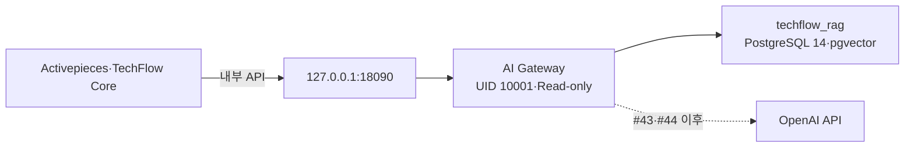

# TechFlow AI Gateway 기반 배포·검증·롤백 Runbook

> 대상: Issue #41 기반, Issue #42 확장 기준선
>
> 적용 버전: `techflow-ai-gateway 0.2.0`
>
> Provider Mode: `mock`

## 1. 목적과 경계

이 Runbook은 AI Gateway API·PostgreSQL·Provider 계약 기반을 단일 Ubuntu Docker Compose 서버에 배포하고 검증하는 절차다. Issue #42에서 실제 Source 후보 Fetch·검역은 허용하지만, OpenAI Embeddings와 Responses 호출은 수행하지 않는다. Source 상세 절차는 [Source Registry·검역·승인 운영 Runbook](source-registry-quarantine.md)을 따른다.



DB는 `rag_internal`에만 연결한다. Gateway는 DB용 `rag_internal`과 로컬 포트·향후 Provider Egress용 `rag_edge`에 연결한다. 외부 인터페이스에는 Port를 공개하지 않는다.

## 2. 배포 자산

```text
services/ai-gateway/
deploy/compose/ai-gateway/
```

- Python 3.12.11 Base Image와 PostgreSQL/pgvector Image는 Digest로 고정한다.
- Runtime Dependency는 `requirements.lock`에 전체 Version을 고정한다.
- Gateway는 UID·GID 10001, Read-only Root FS, `cap_drop: ALL`로 실행한다.
- 실제 Secret 값은 Repository, `.env`, Issue, PR, Log에 기록하지 않는다.

## 3. Secret 파일 준비

네 개의 암호 파일을 보호된 디렉터리에 준비한다.

```bash
install -d -m 700 /protected/techflow-ai-gateway
openssl rand -base64 36 > /protected/techflow-ai-gateway/bootstrap.password
openssl rand -base64 36 > /protected/techflow-ai-gateway/app.password
openssl rand -base64 36 > /protected/techflow-ai-gateway/migration.password
openssl rand -base64 36 > /protected/techflow-ai-gateway/fetcher.password
chmod 644 /protected/techflow-ai-gateway/*.password
```

Compose File Secret은 Host File을 Bind Mount한다. 공식 PostgreSQL Image의 초기화 Script는 `postgres` 사용자로, Gateway는 UID 10001로 읽으므로 파일은 644가 필요하다. 대신 상위 디렉터리를 반드시 700으로 제한한다. 일반 사용자는 디렉터리를 통과할 수 없고 Secret은 Container에 Read-only로 Mount된다.

`.env.example`을 `.env`로 복사해 Secret 값이 아닌 절대 파일 경로만 기록하고 600으로 제한한다.

## 4. 신규 배포

```bash
cd deploy/compose/ai-gateway
cp .env.example .env
chmod 600 .env
docker compose --env-file .env config --quiet
scripts/deploy.sh
```

`deploy.sh`는 다음 순서로 실행한다.

1. Compose Rendering 검증
2. Digest 고정 Base Image로 Gateway Build
3. PostgreSQL·Extension·Group/Login Role 초기화
4. 18개 Table Up Migration과 9개 Source Profile 검증
5. Gateway 기동
6. Container 상태 출력

## 5. 필수 검증

```bash
curl -fsS http://127.0.0.1:18090/healthz
python3 scripts/verify_runtime.py
scripts/verify_database.sh
docker compose --env-file .env run --rm migrate python scripts/migrate.py verify
docker compose --env-file .env ps
```

성공 조건은 다음과 같다.

- Gateway·Database `healthy`
- Host Bind `127.0.0.1:18090->8090`
- Schema 18개, Source Profile 9개, Extension 2개
- App Group Role Schema Create `false`
- App Group Role Provider Audit Select `true`
- Fetcher Group Role Provider Audit Select `false`
- Canary Source 등록·승인·Ingestion·Compatibility·Evaluation·철회 성공
- Query `ABSTAINED`, `providerCalled=false`
- Image User `10001:10001`

## 6. 장애 진단

### Init SQL Permission Denied

배포 Archive를 지나치게 제한된 Umask로 풀면 Mount된 SQL이 `postgres` 사용자에게 보이지 않는다.

```bash
chmod 644 services/ai-gateway/migrations/*.sql
chmod 755 deploy/compose/ai-gateway/scripts/*.sh
```

신규 DB 초기화가 중단된 경우에만 대상 Compose Project와 Volume을 정확히 확인한 뒤 재생성한다. 기존 Activepieces Volume은 대상이 아니다.

### Login Password Authentication Failed

Secret 파일이 600이면 PostgreSQL Init 사용자와 Gateway UID가 읽지 못한다. 상위 디렉터리 700·파일 644를 확인한 뒤, 잘못 초기화된 신규 빈 DB만 재생성한다. 운영 데이터가 있는 DB에는 이 절차를 적용하지 않는다.

### Host Port가 Publish되지 않음

Gateway가 `rag_internal`에만 연결되면 내부 전용 Network 정책으로 Host Port가 Publish되지 않을 수 있다. DB는 `rag_internal`만, Gateway는 `rag_internal`과 `rag_edge`를 모두 사용해야 한다.

### API 500

```bash
docker compose --env-file .env logs --no-color --tail=100 gateway
```

Log에는 Body·Prompt·응답·Secret이 없고 `errorType`만 남는다. Correlation ID로 요청을 찾고 동일 요청은 같은 Idempotency Key로 재시도한다.

## 7. 애플리케이션 롤백

Schema가 호환되는 경우 직전 검증 Image로 Gateway만 되돌린다.

```bash
export TECHFLOW_RAG_PREVIOUS_RELEASE=previous-verified-release
scripts/rollback.sh
curl -fsS http://127.0.0.1:18090/healthz
```

## 8. Schema 롤백

Issue #42만 되돌릴 때는 `0002_source_registry_down.sql`을 사용한다. `0001_schema_down.sql`은 기반 15개 Table까지 삭제하므로 전체 AI Gateway 폐기 시에만 사용한다. 다음 조건을 모두 충족한 경우에만 수행한다.

1. Activepieces·Gateway 쓰기 중지
2. Database Volume·Logical Backup 완료
3. Source 철회·Deletion Ledger 상태 확인
4. 제품 책임자 승인
5. 대상 Database·Compose Project 재확인

```bash
docker compose --env-file .env run --rm migrate \
  python scripts/migrate.py down --allow-destructive-rollback
```

복구는 Backup Restore 후 `migrate.py verify`, `verify_database.sh`, `verify_runtime.py` 순서로 확인한다.

## 9. 테스트 서버 검증 기준선

2026-08-04 기준 다음 경로에서 검증했다.

- 서버: Ubuntu 24.04 테스트 서버
- 배포 경로: `/home/ablecloud/techflow-ai-gateway`
- Compose Project: `techflow-ai-gateway`
- 내부 Health: `http://127.0.0.1:18090/healthz`
- Gateway Image ID: `sha256:99ef2675b928a8d391eac6de918915da39f82e6b683c169f424ef39cb2fe3bfb`
- Runtime: `10001:10001`, Read-only Root FS, `cap_drop: ALL`
- Database: 18개 Table, 9개 Source Profile, `vector`·`pg_trgm`, 최소권한 검증 통과
- API Canary: Source 생성부터 철회까지 통과, Query `ABSTAINED`, `providerCalled=false`
- Provider: Mock only
- 실제 OpenAI Credential: 없음

Secret 값, SSH 암호와 Session 정보는 문서화하지 않는다.
