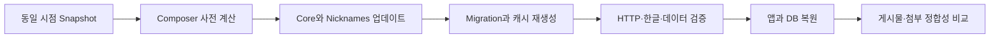

# Flarum 1.8.18 업데이트 및 롤백 Runbook

## 목적과 적용 범위

이 Runbook은 ABLESTACK Community의 Flarum 1.8.10을 1.8.18로 업데이트하고, 이상이 있으면 같은 점검 창 안에서 1.8.10으로 복원하는 절차를 정의한다. WSL Ubuntu 24.04 스테이징에서 검증한 명령만 포함한다.

2026-08-14 승인에 따라 운영 반영을 완료했다. 비밀번호, 토큰, 쿠키, DB Dump, 원본 첨부파일은 GitHub에 저장하지 않는다.

## 검증된 변경 집합

| 구성요소 | 변경 전 | 변경 후 | 판정 |
|---|---:|---:|---|
| Flarum Core | 1.8.10 | 1.8.18 | 업데이트 |
| Flarum Nicknames | 1.8.2 | 1.8.3 | 보안 권고 제거 |
| Symfony Mailer | 6.1.11 | 6.1.11 | 호환성 고정 |
| PHP | 8.3.6 | 8.3.6 | 유지 |
| MariaDB | 10.11.13 | 10.11.13 | 유지 |

Symfony Mailer 6.1.11에는 Sendmail 전송 방식에 영향을 주는 CVE-2026-45068이 남아 있다. Flarum 1.8의 Illuminate/Symfony MIME 의존성 때문에 Mailer 6.4를 함께 설치할 수 없었다. 현재 운영 설정은 SMTP이므로 다음 조건을 운영 관문으로 둔다.

- 메일 드라이버를 `smtp`로 유지한다.
- `sendmail`로 바꾸지 않는다.
- 호환 가능한 상위 의존성 집합이 나오면 Issue #74에서 갱신한다.

## 역할

| 역할 | 책임 |
|---|---|
| 변경 승인자 | 작업 창, Go/No-Go, 롤백 여부 승인 |
| 실행자 | 백업, 업데이트, 점검, 증적 기록 |
| 서비스 검증자 | Community 및 TechFlow 핵심 시나리오 확인 |

## 사전 조건

1. 최근 백업과 복원 가능 여부를 확인한다.
2. DB, 애플리케이션, 업로드, 설정을 같은 시점의 복원점으로 묶는다.
3. 운영 메일 드라이버가 `smtp`인지 확인한다.
4. 사용 가능한 디스크 공간과 PHP, MariaDB, Composer 상태를 확인한다.
5. 사용자에게 점검 시간을 공지하고 새 글 등록을 잠시 중단한다.
6. GitHub→Chat 보호 웹훅은 변경 대상에서 제외한다.

## WSL 반복 리허설

저장소 루트에서 다음 스크립트를 실행한다. 스크립트는 `/srv/techflow-flarum-staging/app`과 `flarum_staging`만 허용하므로 다른 경로에 잘못 적용되지 않는다.

```bash
sudo deploy/flarum/rehearse-1.8.18.sh cycle validated-cycle-01
sudo deploy/flarum/rehearse-1.8.18.sh cycle validated-cycle-02
```

각 사이클은 다음을 자동 수행한다.



## 운영 업데이트 절차

아래 예시는 운영 경로와 DB명을 환경변수로 명시한다. 실제 값은 작업 직전에 확인하고 셸 세션에서만 설정한다.

```bash
export FLARUM_APP_ROOT=/var/www/html
export FLARUM_STAGE_ROOT=/var/backups/techflow-flarum
export FLARUM_DB_NAME=flarum
```

1. 유지보수 모드를 시작하고 Nginx 유입을 차단한다.
2. 애플리케이션, `config.php`, 업로드 디렉터리와 DB를 같은 변경 ID로 백업한다.
3. 백업 파일의 크기와 해시를 기록하고 DB Dump를 시험 읽기한다.
4. Composer 사전 계산 결과가 WSL 결과와 같은지 확인한다.
5. 다음 패키지만 업데이트한다.

```bash
composer require flarum/core:1.8.18 flarum/nicknames:1.8.3 --no-update --no-interaction
composer update flarum/core flarum/nicknames --with-all-dependencies --no-dev --prefer-dist --no-interaction
php flarum migrate --no-interaction
rm -f storage/locale/* public/assets/forum-ko.js public/assets/forum-ko.js.map
php flarum cache:clear
```

6. PHP-FPM과 Nginx를 재시작한다.
7. 자동 점검과 사용자 시나리오 점검이 모두 통과한 뒤 유지보수 모드를 종료한다.

운영 서버는 자신의 공개 URL에 대한 NAT loopback을 지원하지 않는다. 서버 내부 배포 점검에서 공개 URL을 직접 사용하면 서비스가 정상이어도 요청이 시간 초과될 수 있다. 다음처럼 로컬 Nginx에 실제 가상 호스트와 HTTPS 전달 헤더를 지정한다.

```bash
curl --fail --silent --show-error \
  -H 'Host: community.ablecloud.io' \
  -H 'X-Forwarded-Proto: https' \
  http://127.0.0.1/
```

외부 상태 확인은 별도의 외부 실행 지점에서 `https://community.ablecloud.io`를 확인한다.

## 배포 후 검증

### 자동 점검

- `composer show flarum/core`가 1.8.18이다.
- `composer show flarum/nicknames`가 1.8.3이다.
- Nginx, PHP-FPM, MariaDB가 active이다.
- Community 첫 화면과 토론 상세 화면이 HTTP 200이다.
- `forum-ko.js`가 비어 있지 않고 `core.forum.header.search_placeholder`를 포함한다.
- 내부 번역 키가 화면에 노출되지 않는다.
- 사용자, 토론, 게시물, 첨부파일 수와 첨부 해시가 기준선과 일치한다.
- Composer audit에는 승인되지 않은 새 보안 권고가 없다.

Admin 경로가 기존 외부 접근 정책으로 HTTP 403인 경우, 이를 Flarum 장애로 판정하지 않는다. Flarum CLI의 버전·확장 로딩, 공개 사용자 경로와 정책 내부의 관리자 접근 경로를 각각 확인한다.

### 사용자 시나리오

1. AI-Assistant 계정 로그인
2. 토론 생성, 답글 등록, 검색
3. 이미지 첨부 표시
4. Best Answer 지정
5. TechFlow Community poller와 후속 대화 자동 테스트
6. Chat 알림 계약 테스트와 KB 최종 솔루션 테스트

대용량 로그와 압축파일 업로드는 Issue #72에서 정책과 제한값을 확장한 뒤 별도로 검증한다.

## Go/No-Go 기준

### Go

- 백업 네 종류가 같은 변경 ID로 생성되고 복원 시험이 완료됨
- Core 1.8.18, Nicknames 1.8.3 확인
- 서비스와 HTTP 정상
- DB 업무 데이터, 게시물, 첨부 정합성 유지
- 한글 내부 번역 키 노출 0건
- Community 핵심 시나리오 및 TechFlow 자동 테스트 통과
- 운영 메일 드라이버가 SMTP임

### No-Go 및 즉시 롤백

- 로그인, 글/답글, 검색, 첨부, 관리자 화면 중 하나라도 실패
- Migration 오류 또는 승인되지 않은 Composer 의존성 변경
- 게시물/첨부 수 또는 해시 불일치
- 한글 번역 키 노출
- 메일 드라이버가 Sendmail이거나 확인 불가
- TechFlow Community/Chat/KB 회귀 테스트 실패

## 롤백 절차

1. Nginx와 PHP-FPM을 중지한다.
2. 업데이트 후 앱을 별도 보존한 뒤, 기준선 애플리케이션과 설정을 복원한다.
3. DB를 새로 만들고 기준선 Dump를 복원한다.
4. 업로드 디렉터리를 기준선으로 복원한다.
5. 소유권과 권한을 복구하고 Flarum 캐시를 지운다.
6. PHP-FPM과 Nginx를 시작한다.
7. Core 1.8.10과 데이터 정합성을 다시 확인한다.

`access_tokens`는 Flarum 시작 과정에서 만료 토큰이 자동 제거될 수 있으므로 전체 DB 해시의 감사 자료로만 사용한다. 롤백 성공 판정은 이 휘발성 테이블을 제외한 업무 DB 해시와 사용자·토론·게시물·첨부 정합성으로 한다.

## 증적과 후속 작업

- 구조화 증적: `docs/evidence/issue-71/flarum-1.8.18-validation.json`
- 운영 실행 증적: `docs/evidence/issue-71/flarum-1.8.18-production-rollout.json`
- 검증 보고서: `docs/reports/issue-71-flarum-1.8.18-validation.md`
- 대용량 업로드: Issue #72
- UI 현대화: Issue #73
- 백업·모니터링·보안: Issue #74

## 2026-08-14 운영 실행 기록

| 실행 | 변경 ID | 결과 | 비고 |
|---|---|---|---|
| 1차 | `issue-71-20260814T132041Z` | 자동 롤백 PASS | 공개 URL 자체 점검이 NAT loopback 제약으로 시간 초과 |
| 2차 | `issue-71-20260814T132424Z` | 업데이트 PASS | 로컬 Nginx와 Host/HTTPS 전달 헤더로 점검 |

최종 운영 상태는 Core 1.8.18, Nicknames 1.8.3, SMTP, Debug Off다. 두 실행의 백업은 `/var/backups/techflow-flarum/` 아래에 보존한다.
