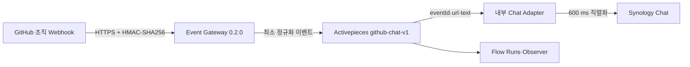

# GitHub 조직 Webhook·Synology Chat 자동화 운영 Runbook

> 적용 대상: Issue #19 `github-chat-v1`
>
> 기준일: 2026-07-31
>
> 관련 계약: [GitHub Chat Webhook 계약](../plans/issue-19-github-chat-webhook-design.md)

## 1. 운영 기준

`ablecloud-team` 조직의 Push와 PR Merge 이벤트는 다음 경로로 처리한다.



GitHub의 HTTP 2xx는 Gateway 접수 성공만 의미한다. 업무 성공은 Activepieces Run이 `SUCCEEDED`이고 Chat 응답이 `success=true`일 때만 성립한다.

## 2. 고정 식별자와 경로

| 항목 | 값 |
|---|---|
| GitHub 조직 | `ablecloud-team` |
| 조직 Hook ID | `650151350` |
| 공개 Endpoint | `https://techflow.ablecloud.io/techflow/hooks/github/chat` |
| Activepieces Flow | `TechFlow - GitHub to Synology Chat v1` |
| Flow ID | `BjLSSjbSp3tyNLjnxWUS8` |
| 서버 배포 경로 | `/opt/ablestack-techflow/activepieces` |
| 보호 Secret 파일 | `/etc/ablestack-techflow/secrets/activepieces.env` |
| Runtime Lock | `/var/lib/ablestack-techflow/releases/runtime-lock.current.json` |
| 관측 상태 | `/var/lib/ablestack-techflow/observability/status.json` |
| 현재 경보 | `/var/lib/ablestack-techflow/observability/current-alerts.json` |
| 보호 계약 | `deploy/compose/activepieces/protected-services.json` |

비밀번호, GitHub HMAC Secret과 Chat Webhook URL은 이 Runbook의 명령 인자에 넣지 않는다. 보호 파일 또는 런타임 표준입력만 사용한다.

`github-chat-v1`은 제품 책임자의 명시적 승인 없이는 Flow ID·Published Version·내부 Adapter 주소·Ingress를 변경하지 않는 `FROZEN` 서비스다. 모든 잠금 배포는 `protected_service_guard.py`를 먼저 실행하며, 보호된 Flow Manifest의 Checksum이나 `172.30.19.10/32` 허용 주소가 달라지면 컨테이너를 변경하기 전에 실패한다.

## 3. 배포 전 점검

로컬 `main`과 `upstream/main`을 동기화한 기능 Branch에서 다음을 수행한다.

```bash
python3 -m unittest -v \
  deploy/compose/activepieces/event-gateway/test_gateway.py \
  deploy/compose/activepieces/scripts/test_release_lock.py

python3 deploy/compose/activepieces/scripts/release_lock.py validate \
  --lock deploy/compose/activepieces/image-lock.json \
  --compose deploy/compose/activepieces/compose.yml \
  --dockerfile deploy/compose/activepieces/event-gateway/Dockerfile

python3 deploy/compose/activepieces/scripts/secret_scan.py \
  --env-file deploy/compose/activepieces/.env.example \
  --scan-root deploy/compose/activepieces
```

완료 조건은 테스트 전체 통과, 릴리스 잠금 유효, Secret 노출 0건이다.

## 4. 서버 배포

### 4.1 사전 백업

```bash
cd /opt/ablestack-techflow/activepieces
sudo ./scripts/backup-state.sh --label issue19-predeploy --retention-days 7
```

PostgreSQL, Redis와 Activepieces Cache Volume을 삭제하지 않는다. 현재 `image-lock.json`은 `/var/lib/ablestack-techflow/releases/history` 아래 보호 파일로 함께 보관한다.

### 4.2 배포 자산 반영

저장소의 `deploy/compose/activepieces` 디렉터리를 서버의 같은 배포 경로에 동기화하되 `.env`는 절대 복사하지 않는다. 소유권은 `root:ablecloud`, 디렉터리는 `0750`, 실행 스크립트는 `0750`을 유지한다.

### 4.3 Secret 주입

다음 키는 `scripts/secret_env.py set --value-stdin`으로만 주입한다.

- `TECHFLOW_GITHUB_WEBHOOK_SECRET`
- `TECHFLOW_GITHUB_UPSTREAM_URL`
- `TECHFLOW_CHAT_WEBHOOK_URL`
- `TECHFLOW_CHAT_MIN_INTERVAL_MILLISECONDS=600`
- `AP_SSRF_ALLOW_LIST=172.30.19.9,172.30.19.10`

GitHub Upstream은 Activepieces App의 내부 Webhook URL이다. Chat URL 원문과 HMAC Secret은 표준출력, shell history, Issue와 PR에 남기지 않는다.

### 4.4 Gateway 이미지와 릴리스 잠금

```bash
cd /opt/ablestack-techflow/activepieces
sudo ./scripts/build-gateway-release.sh image-lock.json
sudo ./scripts/deploy-locked.sh image-lock.json
sudo ./scripts/verify-image-lock.sh image-lock.json
```

새 Gateway 이미지는 서버 빌드 결과의 `sha256` Image ID를 검토한 `image-lock.json`에 고정한 뒤 배포한다. Caddy는 관리 API가 꺼져 있으므로 잠금 배포가 Ingress를 재생성해 변경된 경로 정책을 읽는다.

## 5. Activepieces Flow 구성

버전 기준 자산은 [github-chat-v1.json](../../deploy/compose/activepieces/flows/github-chat-v1.json)이다. Flow를 생성·수정할 때 다음을 지킨다.

1. `Catch Webhook` Trigger를 사용한다.
2. `HTTP / Send Request` Action 하나를 연결한다.
3. 내부 URL은 `http://chat-adapter:8081/internal/chat/github`로 고정한다.
4. Schema 22 식은 `trigger.output.body` 기준으로 `eventId`, `url`, `text`를 매핑한다.
5. 자동 재시도는 사용하지 않는다.
6. Publish 후 상태를 `ENABLED`로 확인한다.
7. Caddy의 `/api/v1/webhooks/*` 외부 요청이 `404`인지 확인한다.

Activepieces 인증정보는 런타임 로그인에만 사용하고 스크립트·문서에 저장하지 않는다.

## 6. GitHub Hook 전환

### 6.1 카나리

조직 Hook 변경 전 대상 저장소에 임시 Repository Hook을 추가해 `ping`, Push, PR Merge를 검증한다. 기존 직접 Chat Hook과 임시 Hook을 동시에 둔 상태에서는 동일 Push가 이중 전송되어 Synology `411(create post too fast)`가 발생할 수 있으므로 결과 해석에 주의한다.

### 6.2 전환 순서

1. 임시 Repository Hook을 제거한다.
2. 서버의 GitHub HMAC Secret과 조직 Hook Secret을 같은 런타임 값으로 교체한다.
3. 조직 Hook `650151350`의 URL만 TechFlow Endpoint로 변경한다.
4. 이벤트를 `push`, `pull_request`, Content-Type을 JSON, SSL 검증을 활성화한다.
5. `ping` 200을 확인한다.
6. 테스트 PR을 Merge해 PR Merge와 Merge Commit Push가 각각 202인지 확인한다.
7. Activepieces `SUCCEEDED` 2건과 Chat 성공 2건을 확인한다.
8. 다른 조직 Hook의 Host, 이벤트와 최근 Delivery가 그대로인지 확인한다.

GitHub Hook 수정은 현재 승인된 `gh` 인증을 사용한다. Secret은 JSON 파일이나 명령 인자가 아니라 표준입력 Body로 전달한다.

## 7. 검증

서버에서 보호 Secret을 환경으로 로드한 뒤 다음 검증 자산을 사용한다.

```bash
cd /opt/ablestack-techflow/activepieces
set -a
source /etc/ablestack-techflow/secrets/activepieces.env
set +a
python3 scripts/verify-github-chat.py \
  --flow-id BjLSSjbSp3tyNLjnxWUS8
```

기본 검증은 Chat 메시지를 만들지 않으며 다음을 확인한다.

| 항목 | 기대 HTTP |
|---|---:|
| 서명된 Ping | 200 |
| 위조 서명 | 401 |
| 비병합 PR Close | 200, Ignore |
| Activepieces 직접 Webhook | 404 |

실제 테스트 메시지가 허용된 경우에만 `--live-message`를 추가한다. 이때 신규 Push 202, 같은 Delivery 재전송 200을 확인하고 Activepieces Run과 Chat 게시를 별도로 확인한다.

## 8. 장애 판정

| 현상 | 판정 | 조치 |
|---|---|---|
| GitHub 401 | HMAC 불일치 | Hook·서버 Secret을 런타임으로 동시 교체 |
| GitHub 503 | Redis 중복 저장소 장애 | Redis 복구 전 Fail Closed 유지 |
| GitHub 202, Flow FAILED | 하위 업무 실패 | Flow Run의 실패 Step·허용 오류 코드 확인 |
| Chat 오류 407 | 요청 계약 오류 | `eventId/url/text` 매핑 확인 |
| Chat 오류 411 | 전송 간격 또는 이중 Hook | 중복 Hook 제거, 600 ms 슬롯 확인 |
| Timeout·연결 종료 | 게시 여부 불명 | Blind Retry 금지, Chat 확인 후 수동 판단 |
| Observer Flow Warning | 최근 15분 실패 존재 | Activepieces Run에서 원인 확인 |

같은 GitHub Delivery ID는 7일 동안 중복으로 억제된다. Activepieces 접수 후 하위 단계가 실패한 이벤트는 GitHub Redelivery가 아니라 해당 Flow Run의 확인·수동 재실행 절차를 사용한다.

## 9. 롤백

1. 조직 Hook `650151350`을 비활성화해 추가 게시를 중단한다.
2. Activepieces `github-chat-v1` Flow를 `DISABLED`로 변경한다.
3. 직접 Chat Hook 복구가 필요하면 서버 보호 Secret의 Chat URL을 사용해 이전 `push` 설정을 복원한다. 기존 직접 Hook은 업무 실패 상태였으므로 원인 분석 중 비활성 유지도 허용한다.
4. `/var/lib/ablestack-techflow/releases/runtime-lock.previous.json`으로 `rollback-release.sh`를 실행한다.
5. 신규 GitHub 경로의 차단과 기존 App Health를 확인한다.
6. PostgreSQL·Redis Volume과 Flow Run 이력은 보존한다.
7. 전환 폐기 시 GitHub HMAC Secret과 Chat URL을 교체·폐기한다.

다른 조직 Hook은 롤백 대상이 아니다.

## 10. 완료 기록

변경 후 Issue에는 다음 비밀정보 없는 근거만 남긴다.

- 조직 Hook ID와 대상 Host
- GitHub Delivery ID, 이벤트와 HTTP 상태
- Activepieces Flow ID·Run 상태
- Gateway의 허용된 이벤트명·오류 코드
- 서비스 Health와 Runtime Lock 검증 결과
- 백업 Label과 롤백 기준

Payload, 서명, Chat URL, Token, 로그인 정보는 기록하지 않는다.
