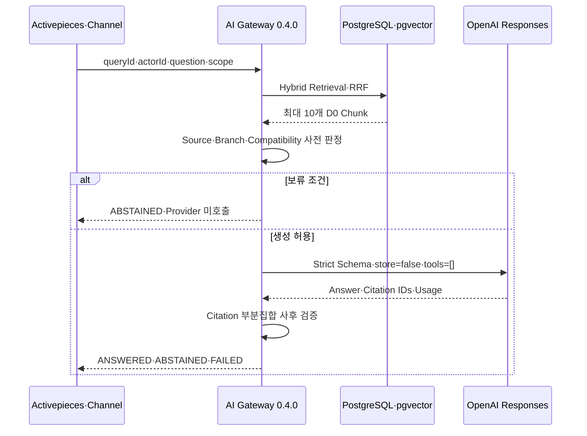

# TechFlow 근거 기반 Responses 배포·운영 Runbook

> 대상: Issue #44, TechFlow AI Gateway 0.4.0
> 범위: OpenAI Responses, 결정론적 모델 라우팅, 인용 검증, 보류·실패, 배포·롤백

## 1. 운영 경계

AI Gateway는 PostgreSQL/pgvector에서 검색한 최대 10개의 D0 Chunk만 OpenAI Responses API에 전달한다. 원본 저장소를 OpenAI File·Vector Store에 올리지 않으며 `store=false`, `background=false`, Tool 0개, strict JSON Schema를 강제한다. Activepieces는 이 API를 오케스트레이션하지만 검색 범위·모델 선택·답변 상태·인용 판정은 소유하지 않는다.



## 2. Secret 준비

GitHub Actions Secrets에는 다음 이름만 등록한다. 값은 Workflow, Issue, PR, 문서와 로그에 출력하지 않는다.

- `OPENAI_API_KEY`
- `OPENAI_PROJECT_ID`

시험 서버는 `/home/ablecloud/techflow-ai-gateway/.secrets/` 아래 파일을 사용한다.

- `openai_api_key`
- `openai_project_id`
- `safety_identifier_salt`

부모 디렉터리는 `0700`, 파일은 비루트 컨테이너 UID가 읽을 수 있도록 `0644`로 두고 Compose Secret으로 읽기 전용 마운트한다. Salt는 최소 32바이트 난수이며 사용자 식별자를 HMAC-SHA256으로 가명화한다. 결과 `safety_identifier`는 OpenAI 계약에 맞게 최대 64자로 제한한다.

## 3. 배포 전 검증

```bash
cd services/ai-gateway
python -m unittest discover -s tests -v
python ../../tools/ai_gateway/validate_issue_44.py
python scripts/export_openapi.py
git diff --check
```

필수 통과 기준은 테스트 96개, OpenAPI 21개 Operation, 승인 Responses Profile 2개, 최대 Context 10개다.

## 4. 백업과 이미지 빌드

시험 서버의 표준 경로는 `/home/ablecloud/techflow-ai-gateway`다. 배포 전 다음을 하나의 백업 디렉터리에 보관한다.

- PostgreSQL Custom Format Dump
- 현재 Gateway Image ID
- `compose.yml`, 운영자 OpenAI Override, `.env` 참조본
- 배포 전 Runtime Source Archive
- SHA-256 Checksum

Issue #44 최초 백업은 `/home/ablecloud/techflow-ai-gateway/backups/issue44-predeploy-20260810T0230KST`에 있다. 디렉터리명은 서버가 생성한 식별자이며 복구 시 실제 파일 체크섬을 기준으로 한다.

이미지는 별도 스테이징 디렉터리에서 먼저 빌드하고 네트워크가 없는 컨테이너로 테스트한다.

```bash
TECHFLOW_RAG_RELEASE=issue-44 docker compose \
  --env-file .env \
  -f compose.yml \
  -f compose.openai.override.yml build gateway

docker run --rm --network none --entrypoint python \
  techflow/ai-gateway:issue-44 \
  -m unittest discover -s tests -v
```

## 5. 배포와 Health 확인

운영 OpenAI 모드는 반드시 Base와 Override를 함께 지정한다.

```bash
cd /home/ablecloud/techflow-ai-gateway/deploy/compose/ai-gateway
docker compose --env-file .env \
  -f compose.yml \
  -f compose.openai.override.yml config --quiet

docker compose --env-file .env \
  -f compose.yml \
  -f compose.openai.override.yml \
  up -d --no-build --wait gateway source-reconciler

curl -fsS http://127.0.0.1:18090/healthz
```

정상 기준은 Version `0.4.0`, Process·Database·Vector `ready`, Provider `openai`다.

## 6. Canary

답변 원문을 콘솔에 출력하지 않는 전용 스크립트를 사용한다.

```bash
python3 services/ai-gateway/scripts/issue44_canary.py \
  --base-url http://127.0.0.1:18090
```

`ANSWERED`는 Answer 존재, Citation 1개 이상, Repository·Commit·Path Lineage 완전성을 요구한다. 검색 결과가 없는 Profile로 `--expect-state ABSTAINED`를 실행하면 `generationProviderCalled=false`여야 한다.

## 7. 감사와 장애 판정

`rag_provider_call`에는 Provider, Surface, Profile, 요청·반환 모델, Provider Request·Response ID, Token, Latency, 상태와 Sanitized Error만 기록한다. 질문·Chunk·답변 원문은 기록하지 않는다.

| 상태 | 의미 | 처리 |
|---|---|---|
| `ANSWERED` | 인용 검증을 통과한 답변 | 채널에 근거와 함께 반환 |
| `ABSTAINED` | 근거 없음·충돌·Test-only·인용 불일치 | 담당자 이관 또는 추가 범위 승인 |
| `FAILED` | Provider Timeout·Rate Limit·거절·장애 | 재시도 정책 또는 운영 점검 |

429·5xx·네트워크 Timeout은 SDK를 통해 최대 3회 시도한다. 5분간 최소 10건 중 실패율 50% 이상이면 60초 Circuit Open 후 Half-open 1건만 허용한다. 실패를 답변으로 바꾸지 않는다.

## 8. 롤백

데이터 Migration 추가가 없으므로 직전 이미지와 Compose 참조를 복원한다.

```bash
sed -i 's/^TECHFLOW_RAG_RELEASE=.*/TECHFLOW_RAG_RELEASE=issue-43/' .env
docker compose --env-file .env \
  -f compose.yml \
  -f compose.openai.override.yml \
  up -d --no-build --force-recreate --wait gateway source-reconciler
```

Health에서 `0.3.0`을 확인한 뒤 문제 해결 후 `issue-44`로 다시 전개한다. 최초 실증은 `0.4.0 → 0.3.0 → 0.4.0`과 기존 34 File·64 Chunk·64 Embedding 보존을 확인했다.

## 9. OpenAI 데이터 최소화 운영 정책

제품 책임자의 2026-08-10 결정에 따라 Zero Data Retention은 사용하지 않으며 Dashboard 적격성·승인·적용 상태를 구현·배포·데이터 등급 확대 Gate로 확인하지 않는다. `store=false`는 애플리케이션 수준 데이터 최소화 통제로 계속 유지한다. D1 이상 확대는 Source 승인, 비식별화·최소화, 접근권한, 감사, 보존·삭제 및 사고 대응을 포함한 TechFlow 제품 보안심사로 결정한다.

- [OpenAI API 데이터 제어](https://developers.openai.com/api/docs/guides/your-data)
- [Structured Outputs](https://developers.openai.com/api/docs/guides/structured-outputs)
- [최신 모델 선택 지침](https://developers.openai.com/api/docs/guides/latest-model)
