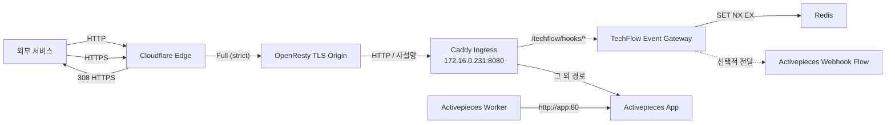

# HTTPS·Webhook Ingress 운영 Runbook

## 1. 목적

이 문서는 `techflow.ablecloud.io`의 HTTP 요청을 HTTPS로 전환하고, 외부 Webhook을 서명 검증·중복 방지 후 TechFlow 내부로 전달하는 표준 운영 절차다. 구현 기준은 [Issue #14](https://github.com/ablecloud-team/ablestack-techflow/issues/14)와 [구조화 검증 기록](../decisions/https-webhook-ingress.json)이다.

## 2. 검증된 구성



| 항목 | 검증값 |
|---|---|
| 외부 URL | `https://techflow.ablecloud.io` |
| 내부 URL | `http://172.16.0.231:8080` |
| Webhook 경로 | `/techflow/hooks/events` |
| 배포 경로 | `/opt/ablestack-techflow/activepieces` |
| HTTP 전환 | `308 Permanent Redirect`, 경로·쿼리 보존 |
| Origin TLS | 호스트 한정 `Full (strict)` |
| Worker 내부 URL | `http://app:80` |

Cloudflare 변경은 `techflow.ablecloud.io` 호스트에만 적용한다. 같은 Zone의 다른 서비스에 영향을 주는 Zone 전체 SSL 모드 변경은 하지 않는다.

## 3. Cloudflare 규칙

### 3.1 Origin TLS 규칙

| 설정 | 값 |
|---|---|
| 규칙 이름 | `TechFlow HTTPS Origin TLS` |
| 조건 | `(http.host eq "techflow.ablecloud.io")` |
| SSL | `Full (strict)` |

Origin의 인증서가 유효해야 한다. 인증서 만료 또는 호스트명 불일치 시 엄격 모드는 연결을 거부하므로, 공개 Origin의 인증서 갱신과 만료 감시는 Origin 운영 계층에서 유지한다.

### 3.2 HTTP 전환 규칙

| 설정 | 값 |
|---|---|
| 규칙 이름 | `TechFlow HTTP to HTTPS` |
| 요청 | `http://techflow.ablecloud.io/*` |
| 대상 | `https://techflow.ablecloud.io/${1}` |
| 상태 코드 | `308` |
| 쿼리 문자열 | 보존 |

Webhook POST의 메서드와 본문 의미를 유지하기 위해 `308`을 사용한다.

## 4. 서버 구성과 배포

```bash
cd /opt/ablestack-techflow/activepieces
./scripts/configure-ingress.sh https://techflow.ablecloud.io
docker compose --env-file .env config --quiet
./scripts/deploy.sh
```

`configure-ingress.sh`는 다음 항목을 구성한다.

- 공개 기준 URL과 Webhook 경로
- Gateway 수신 주소, 허용 시각차, 중복 방지 TTL, 본문 크기 제한
- Redis 중복 방지 연결
- 값이 없을 때만 Webhook HMAC Secret 생성
- `.env` 파일 권한 `0600` 유지

실제 Secret 값은 출력·문서화·커밋하지 않는다. App은 공개 기준 URL을 사용하지만 Worker는 Compose 내부 Socket.IO 연결을 위해 `http://app:80`을 사용한다.

## 5. Webhook 요청 계약

요청자는 원문 Body와 Unix Timestamp로 다음 값을 계산한다.

```text
signature_input = "<unix-timestamp>.<raw-body>"
signature = HMAC-SHA256(TECHFLOW_WEBHOOK_SECRET, signature_input)
```

필수 헤더는 다음과 같다.

| 헤더 | 값 |
|---|---|
| `X-TechFlow-Timestamp` | Unix 초 |
| `X-TechFlow-Event-Id` | 이벤트별 고유 ID |
| `X-TechFlow-Signature` | `sha256=<lowercase hex>` |

Gateway 판정 순서는 다음과 같다.

1. 메서드, 경로, 필수 헤더와 Body 크기를 검사한다.
2. 현재 시각과 Timestamp 차이가 300초 이내인지 확인한다.
3. 상수 시간 비교로 HMAC 서명을 확인한다.
4. Redis `SET NX EX`로 Event ID를 86,400초 동안 선점한다.
5. 신규 이벤트만 `202 Accepted`로 수락한다.
6. 선택적 Upstream이 구성된 경우 검증 완료 헤더와 함께 전달한다.

Redis에 접근할 수 없으면 중복 판정을 생략하지 않고 `503`으로 실패한다.

## 6. 검증

```bash
cd /opt/ablestack-techflow/activepieces
./scripts/healthcheck.sh --wait 300
./scripts/verify-ingress.sh
```

개별 Webhook 판정을 다시 확인한다.

```bash
./scripts/verify-webhook.sh http://event-gateway:8081
./scripts/verify-webhook.sh https://techflow.ablecloud.io
```

`verify-webhook.sh`의 정상 기대값은 다음과 같다.

| 시나리오 | 기대값 |
|---|---|
| 유효한 신규 이벤트 | `202` |
| 같은 Event ID 재전송 | `409` |
| 잘못된 서명 | `401` |
| 허용 시간을 지난 Timestamp | `401` |
| 필수 헤더 누락 | `400` |

외부 검증은 HTTP `308`, HTTPS·App Health·Gateway Health `200`도 함께 확인한다.

## 7. 재시작·재부팅 검증

```bash
docker compose --env-file .env restart ingress event-gateway
./scripts/healthcheck.sh --wait 300
./scripts/verify-ingress.sh
```

서버 재부팅 후에도 동일 검증을 반복한다.

```bash
sudo reboot
```

SSH 복구 후:

```bash
cd /opt/ablestack-techflow/activepieces
./scripts/healthcheck.sh --wait 300
./scripts/verify-ingress.sh
docker compose --env-file .env logs --since 10m ingress event-gateway app worker
```

## 8. 보안과 로그

- PostgreSQL과 Redis 포트는 호스트에 공개하지 않는다.
- 외부 `8080` 포트는 공개하지 않는다.
- Gateway는 비루트 사용자, 읽기 전용 파일시스템과 `no-new-privileges`로 실행한다.
- Gateway 로그에는 Request ID, Event ID, 판정 상태만 남긴다.
- 요청 Body, 서명과 Secret은 로그에 남기지 않는다.
- 검증 전 이벤트를 Activepieces에 전달하지 않는다.
- 전달 시 Webhook Secret 헤더를 제거한다.

## 9. 장애 분석

| 증상 | 확인 | 조치 |
|---|---|---|
| HTTP가 HTTPS로 바뀌지 않음 | Cloudflare Redirect Rule 활성 상태 | 호스트 조건과 대상 URL, `308` 확인 |
| Redirect Loop | Origin TLS 모드와 Origin 응답 | 호스트 한정 `Full (strict)` 확인 |
| Cloudflare `526` | Origin 인증서 | 유효기간, 체인과 호스트명 확인 |
| Worker Socket.IO 오류 | Worker `AP_FRONTEND_URL` | `http://app:80` 내부 Override 확인 |
| 서명 오류 `401` | Timestamp·원문 Body | 직렬화 후 변경 여부와 HMAC 입력 확인 |
| 중복 `409` | Event ID | 신규 이벤트에 고유 ID 사용 |
| Gateway `503` | Redis Health·인증 | Redis 복구 후 재전송 |
| 외부는 실패, 내부는 정상 | Cloudflare·Origin·DNS | 각 홉의 Health와 TLS를 순서대로 확인 |

## 10. 롤백

1. Cloudflare의 두 TechFlow 호스트 전용 규칙을 비활성화한다.
2. 배포 전 생성한 `/opt/ablestack-techflow/backups/issue14-predeploy-*.tar.gz`를 확인한다.
3. 현재 `.env`를 별도 보호하고 승인된 백업 구성으로 복원한다.
4. `docker compose --env-file .env up -d --build --remove-orphans`를 실행한다.
5. 내부 App Health, Worker Polling과 데이터 영속성을 다시 확인한다.

롤백 중에도 데이터 볼륨과 Secret을 삭제하지 않는다. Webhook Secret 교체가 필요하면 Issue #15의 수명주기 절차로 수행한다.

## 11. 후속 범위

- Issue #15: Secret 저장·교체·폐기
- Issue #16: PostgreSQL·Redis 백업과 복구 훈련
- Issue #17: 로그·메트릭·경보
- Issue #18: 버전·Digest·회귀 정책
- Issue #19: GitHub PR Merge Webhook 실증 Flow
