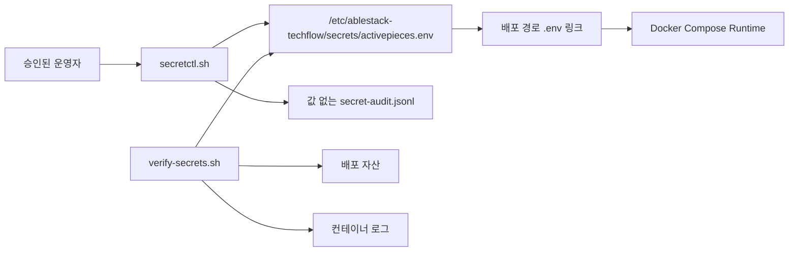

# TechFlow Secret 수명주기 Runbook

## 1. 목적

이 문서는 TechFlow 테스트 서버의 Secret을 생성·주입·교체·폐기하고 노출 여부를 검증하는 표준 절차다. 정책 기준은 [ADR-0002](../adr/0002-techflow-secret-lifecycle.md)다.

실제 Secret 값은 명령 출력, Issue, 채팅, 저장소, Flow 정의, 일반 백업과 보고서에 기록하지 않는다.

## 2. 저장 구조



| 경로 | 권한 | 내용 |
|---|---|---|
| `/etc/ablestack-techflow/secrets` | `root:ablecloud 0750` | Secret 저장소 디렉터리 |
| `activepieces.env` | `root:ablecloud 0640` | 런타임 Secret과 비민감 설정 |
| 배포 경로 `.env` | 심볼릭 링크 | 보호된 저장소 연결 |
| `/var/log/ablestack-techflow/secret-audit.jsonl` | `root:ablecloud 0640` | 값 없는 변경 감사 |

`ablecloud` 그룹은 테스트 서버 운영자 경계다. 고객 환경에서는 고객별 Secret Provider와 읽기 접근 감사를 적용한다.

## 3. 최초 마이그레이션

기존 `.env 0600`을 보호된 저장소로 이동한다.

```bash
cd /opt/ablestack-techflow/activepieces
sudo ./scripts/secretctl.sh bootstrap
./scripts/secretctl.sh status
```

성공 기준:

- 저장소 `root:ablecloud 0640`
- `.env`가 `/etc/ablestack-techflow/secrets/activepieces.env`를 가리킴
- 필수 Secret 6종 `present`
- `TECHFLOW_WEBHOOK_SECRET_PREVIOUS=empty`
- 감사 파일 `root:ablecloud 0640`

## 4. Webhook Secret 교체

### 4.1 Grace Period 시작

```bash
sudo ./scripts/secretctl.sh prepare-webhook-rotation
```

이 명령은 신규 현재 값을 생성하고 기존 현재 값을 직전 값으로 이동한 뒤 Event Gateway만 재생성한다. 직전 값이 이미 존재하면 다음 교체를 거부한다.

발신 시스템을 신규 현재 값으로 전환한다. 값 전달은 승인된 비밀 채널을 사용하며 명령행, Issue와 채팅에 붙여넣지 않는다.

### 4.2 직전 값 폐기

발신 시스템 전환과 정상 수신을 확인한 후:

```bash
sudo ./scripts/secretctl.sh revoke-previous-webhook
```

폐기 후 직전 값 요청은 `401`, 현재 값 요청은 `202`여야 한다.

### 4.3 롤백

발신 시스템 전환에 실패했고 기존 값의 유출이 의심되지 않을 때만:

```bash
sudo ./scripts/secretctl.sh rollback-webhook-rotation
```

유출이 의심되면 롤백하지 않고 신규 값 전환과 기존 값 즉시 폐기를 수행한다.

## 5. 수명주기 자동 검증

테스트 환경에서만 다음 명령을 사용한다.

```bash
sudo ./scripts/secretctl.sh test-webhook-rotation
```

검증 항목:

| 단계 | 기대값 |
|---|---|
| 신규 현재 값, Grace Period | `202` |
| 직전 값, Grace Period | `202` |
| 신규 현재 값, 폐기 후 | `202` |
| 직전 값, 폐기 후 | `401` |
| Redis 컨테이너 | 교체 전후 동일 |

이 테스트는 직전 값을 파일이나 출력에 보관하지 않고 프로세스 메모리에서만 사용한다.

## 6. Secret 유형별 교체

### AP Encryption Key

`AP_ENCRYPTION_KEY`는 Activepieces Connection 복호화의 Root다. 백업·호환성 검증 없이 교체하지 않는다. 손상·분실 시 기존 Connection을 읽지 못할 수 있으므로 Issue #16에서 검증한 Secret Escrow와 복원 훈련을 먼저 확인해야 한다.

### JWT·Platform API Key

유지보수 창을 공지하고 신규 값을 보호된 저장소에 원자적으로 반영한 뒤 App과 Worker를 순차 재생성한다. 기존 세션·Token 무효화와 관리자 로그인을 확인한다.

### PostgreSQL·Redis 자격증명

데이터 저장소 내부 자격증명을 먼저 변경하고 보호된 저장소를 갱신한 뒤 App, Worker, Gateway를 순차 재시작한다. 백업과 복구 리허설 없이 테스트 환경 외에서 수행하지 않는다.

### 외부 API Token

제공자에서 신규 Token을 발급하고 보호된 저장소에 주입한 뒤 최소 권한 동작을 확인한다. 성공 후 기존 Token을 제공자에서 폐기한다. Flow JSON에는 Token 대신 Connection 또는 Secret 참조만 둔다.

## 7. 노출 검사

```bash
cd /opt/ablestack-techflow/activepieces
./scripts/verify-secrets.sh
```

검사는 보호된 파일의 실제 Secret 값을 메모리에서 읽어 다음 객체와 완전 일치하는지 확인한다.

- `.env`를 제외한 배포 자산
- 전체 Compose 컨테이너 로그

출력에는 값이 아니라 검사한 Secret 수, 객체 수와 노출 건수만 표시한다.

## 8. 감사 확인

```bash
sudo tail -n 20 /var/log/ablestack-techflow/secret-audit.jsonl
```

기록 필드는 `time`, `actor`, `action`, `target`, `result`로 제한한다. 실제 값, 서명과 요청 Body가 발견되면 사고로 처리한다.

## 9. 백업

일반 백업에서는 다음을 제외한다.

```text
.env
/etc/ablestack-techflow/secrets
/var/log/ablestack-techflow/secret-audit.jsonl
```

Secret 복구본은 일반 데이터 백업과 분리한다. `.env`를 포함했던 구형 Issue #14 Archive는 Issue #16에서 안전 삭제했으며 신규 상태 Archive에는 `.env`가 없다. OpenPGP AES-256 Escrow와 격리 복호화 훈련은 Issue #16에서 검증했다. 암호화 Bundle과 Passphrase는 같은 위치에 저장하지 않으며 자세한 절차는 [상태 백업·복구 Runbook](state-backup-recovery.md)을 따른다.

## 10. 사고 대응

1. 영향을 받는 Secret과 서비스를 분류한다.
2. 신규 값 발급 또는 강제 교체를 시작한다.
3. 유출 값은 Grace Period 없이 즉시 폐기한다.
4. 세션·Token과 연결을 무효화한다.
5. `verify-secrets.sh`와 공급자 감사 기록으로 추가 노출을 확인한다.
6. Health, Webhook 판정과 권위 시스템 상태를 재검증한다.
7. 실제 값을 제외한 사고 기록과 후속 Issue를 남긴다.

## 11. 재시작·재부팅 확인

```bash
./scripts/healthcheck.sh --wait 300
./scripts/verify-ingress.sh
./scripts/verify-secrets.sh
```

호스트 재부팅 후 저장소 권한, `.env` 링크, 감사 파일, 6개 서비스와 Webhook 검증 결과가 그대로 유지되어야 한다.
