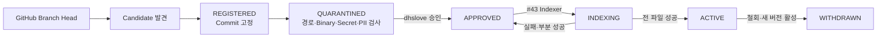

# TechFlow Source Registry·검역·승인 운영 Runbook

> 대상: Issue #42
>
> 적용 버전: `techflow-ai-gateway 0.2.0`
>
> 초기 Source Reviewer: `dhslove`

## 1. 목적과 책임 경계

이 Runbook은 ABLESTACK 문서·소스코드 7개 저장소, 9개 Source Profile의 최신 Branch Head를 후보로 발견하고 고정 Commit을 검역한 뒤 사람의 승인으로 색인 가능 상태를 만드는 절차다. Activepieces는 변경 감지·승인 요청·Job 호출을 오케스트레이션하고, AI Gateway가 Registry·상태·정책·멱등성·원자 활성화를 소유한다.



Issue #42에서는 후보 발견·검역·승인 Gate·색인 Job 원자 완료 계약까지 구현했다. Parser·Chunk·Embedding·검색은 #43에서 구현하므로, 시험 서버 후보는 승인하거나 `ACTIVE`로 전환하지 않았다.

## 2. 고정 Source Profile

| Profile | Repository | Branch | License Metadata |
|---|---|---|---|
| `SHARED_DOCS` | `ablecloud-team/ablestack-docs` | `master` | `NOASSERTION` |
| `CLOUD_MAIN` | `ablecloud-team/ablestack-cloud` | `main` | `Apache-2.0` |
| `CLOUD_DIPLO` | `ablecloud-team/ablestack-cloud` | `ablestack-diplo` | `Apache-2.0` |
| `CLOUD_EUROPA` | `ablecloud-team/ablestack-cloud` | `ablestack-europa` | `Apache-2.0` |
| `WALL_MAIN` | `ablecloud-team/ablestack-wall` | `main` | `AGPL-3.0` |
| `COCKPIT_DIPLO` | `ablecloud-team/ablestack-cockpit-plugin` | `ablestack-diplo` | `NOASSERTION` |
| `GENIE_MASTER` | `ablecloud-team/ablestack-genie` | `master` | `NOASSERTION` |
| `KICKSTART_MASTER` | `ablecloud-team/ablestack-kickstart` | `master` | `NOASSERTION` |
| `QEMU_EXEC_TOOLS_MAIN` | `ablecloud-team/ablestack-qemu-exec-tools` | `main` | `NOASSERTION` |

모든 Profile은 `D0`, `ACTIVE_PLUS_7D_DELETION_SLA`, 초기 검토자 `dhslove`로 고정한다. License Metadata는 사실 기록이며 이번 사내 분석 구현의 차단 조건이 아니다. Profile에 없는 Repository·Branch·분류 조합은 API가 거부한다.

## 3. API와 상태 전이

| Operation | 목적 | 필수 안전 조건 |
|---|---|---|
| `GET /v1/source-profiles` | 9개 Allowlist 조회 | `X-Correlation-Id` |
| `POST /v1/source-profiles/{id}/discoveries` | Remote Head 발견·후보 등록 | Correlation·Idempotency, 고정 Profile |
| `GET /v1/source-versions/{id}` | Commit·검역·승인 상태 조회 | 원문 미반환 |
| `POST /v1/source-versions/{id}/scan` | 고정 Commit 검역 | `REGISTERED` 전용, Commit 일치 |
| `GET /v1/source-versions/{id}/files` | 경로별 결정·Rule 조회 | Content 원문 미반환 |
| `POST /v1/source-versions/{id}/approve` | 사람 승인 | `QUARANTINED`, 검토자·Commit 일치 |
| `POST /v1/sources/{id}/ingestions` | 색인 Job 생성 | `APPROVED` 전용 |
| `POST /v1/jobs/{id}/complete` | 원자 활성화 | 성공 File 수가 Eligible 수와 일치 |

같은 Operation과 `Idempotency-Key`는 같은 결과를 돌려준다. Branch Head가 바뀌면 새 Source Version을 만들며 이전 승인 효력은 새 Commit에 승계되지 않는다. 색인이 실패하면 Version은 `APPROVED`로 복귀하고, 부분 색인은 `ACTIVE`가 될 수 없다. 새 Version의 전체 색인이 성공한 시점에만 기존 `ACTIVE`를 `WITHDRAWN`으로 바꾼다.

## 4. Fetch·검역 정책

Fetcher는 임시 Bare Git Repository에서 `ls-tree`와 `cat-file`만 사용한다. Checkout·Hook·Submodule·LFS Smudge·Build·Test·Shell 실행을 금지하고, Repository·Branch·40자 Commit SHA를 모두 검증한다. 임시 파일 시스템은 2 GiB `tmpfs`이며 `noexec,nosuid,nodev`를 적용한다.

다음 항목은 제외하거나 차단한다.

- 비허용 확장자와 `target`, `build`, `dist`, `node_modules`, `vendor`, 생성물 경로
- Binary·NUL·비 UTF-8·Minified·1 MiB 초과 파일
- Secret·Credential URL·개인정보 패턴
- Prompt Injection 지시문

검역 API는 File Path, Path Hash, Blob SHA, Content Hash, Size, Decision, Rule ID만 반환한다. 제외·차단된 원문은 Blob Cache에 저장하지 않는다. 승인자가 제외를 수용해야 하는 경우 `acceptQuarantineExclusions=true`, 10자 이상의 `decisionNote`, 정확한 `expectedCommit`을 함께 기록한다.

## 5. 검토자 승인 절차

초기 검토자 `dhslove`는 다음 순서로 판단한다.

1. Profile의 Repository·Branch와 후보 Commit을 확인한다.
2. `treeSha`, `snapshotHash`, Candidate·Eligible·Excluded·Blocking 수를 확인한다.
3. `/files`에서 제외 Rule과 영향 파일을 검토한다. 원문이 필요하면 GitHub의 해당 고정 Commit에서 직접 검토한다.
4. Blocking 수가 0이면 Commit을 명시해 승인한다.
5. 제외 수용이 필요한 경우 사유를 Decision Note로 남기고 명시적으로 수용한다.
6. 의심이 있거나 Head가 바뀌면 승인하지 않고 새 후보를 발견·검역한다.

API는 `approvedBy`가 `dhslove`가 아니면 거부한다. Reviewer 변경은 Profile 계약·Migration·감사 문서를 함께 변경하는 별도 PR로만 수행한다.

## 6. 배포 절차

배포 전 현재 Gateway Image ID와 DB를 백업한다. 실제 Secret과 인증 정보는 보호된 Runtime 파일로만 주입하고 Archive·문서·Issue·PR에 포함하지 않는다.

```bash
cd /home/ablecloud/techflow-ai-gateway/deploy/compose/ai-gateway
docker compose --env-file .env config --quiet
docker compose --env-file .env build gateway
docker compose --env-file .env run --rm migrate python scripts/migrate.py up
docker compose --env-file .env run --rm migrate python scripts/migrate.py verify
docker compose --env-file .env up -d --no-deps gateway
scripts/verify_database.sh
python3 scripts/verify_runtime.py
```

배포 성공 조건은 Gateway·DB Healthy, Version `0.2.0`, 18개 Table, 9개 Profile, Extension 2개, App Role Schema Create 금지, Fetcher Role Provider Audit 조회 금지다. Gateway는 UID/GID `10001:10001`, Read-only Root FS, `cap_drop: ALL`을 유지한다.

## 7. 시험 서버 검증 기준선

2026-08-05 Ubuntu 24.04 시험 서버에서 다음을 확인했다.

- 배포 경로: `/home/ablecloud/techflow-ai-gateway`
- Compose Project: `techflow-ai-gateway`
- 내부 Health: `http://127.0.0.1:18090/healthz`
- Gateway Image: `techflow/ai-gateway:issue-42`
- Image ID: `sha256:b0c3fd97962e185b8648bf889981cae407ca89cb25cf290cb141d8468757dd4b`
- Backup: `/home/ablecloud/techflow-ai-gateway-backups/issue42-20260805T1105KST`
- DB: 18개 Table, 9개 Profile, `vector`·`pg_trgm`
- 9개 최신 후보 등록: 8개 `REGISTERED`, `GENIE_MASTER` 1개 `QUARANTINED`
- GENIE Canary: Candidate 34, Eligible 34, Excluded 0, Blocking 0
- 미승인 Ingestion: HTTP 409 거부
- Query: `ABSTAINED`, `providerCalled=false`
- Provider Call: 0건
- 기존 Activepieces 6개 Container: 모두 Healthy 유지

Activepieces용 Discovery와 Review/Index Flow Template은 Repository 자산으로만 추가했으며 `published:false`다. 실제 게시와 인증 UI는 #45, Parser·Indexer는 #43에서 연결한다.

## 8. 롤백과 복구

애플리케이션 결함은 직전 Image로 Gateway만 되돌리고 DB와 Activepieces Volume을 유지한다. Schema 롤백은 승인과 Backup 확인 후에만 수행한다.

```bash
cd /home/ablecloud/techflow-ai-gateway/deploy/compose/ai-gateway
docker compose --env-file .env stop gateway
docker compose --env-file .env run --rm migrate \
  python scripts/migrate.py down --allow-destructive-rollback
# 필요 시 보호된 DB dump 복구 후
docker compose --env-file .env up -d gateway
docker compose --env-file .env run --rm migrate python scripts/migrate.py verify
scripts/verify_database.sh
python3 scripts/verify_runtime.py
```

`0002_source_registry_down.sql`은 Issue #42의 세 Table·추가 Column·상태 제약을 되돌린다. Source Blob과 Version Metadata가 삭제될 수 있으므로 Backup, Flow 중지, 제품 책임자 승인 없이 실행하지 않는다. 인증 정보·Source 원문·Provider Secret은 백업 자산에 포함하지 않는다.
