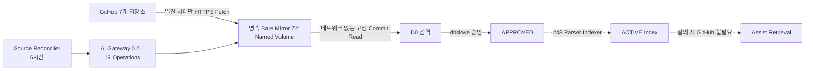

# TechFlow Source Registry·영속 미러·검역·승인 운영 Runbook

> 대상: Issue #42
>
> 적용 버전: `techflow-ai-gateway 0.2.1`
>
> 초기 Source Reviewer: `dhslove`

## 1. 목적과 책임 경계

이 Runbook은 ABLESTACK 문서·소스코드 7개 저장소, 9개 Source Profile을 시험 서버의 영속 로컬 Bare Mirror로 동기화하고, 고정 Commit을 검역한 뒤 사람 승인으로 색인 가능 상태를 만드는 절차다. Activepieces는 향후 Push Event와 승인 업무를 오케스트레이션하고, AI Gateway가 Registry·미러 상태·검역·승인·멱등성·원자 활성화를 소유한다.



Issue #42는 후보 발견·영속 미러·검역·승인 Gate·색인 Job 원자 완료 계약까지 구현한다. Parser·Chunk·Embedding·검색은 #43 범위이므로 실제 Source 승인·활성화·OpenAI 호출은 수행하지 않았다.

## 2. Source 기준선

| Profile | Repository | Branch | License Metadata |
|---|---|---|---|
| `SHARED_DOCS` | `ablecloud-team/ablestack-docs` | `master` | `NOASSERTION` |
| `CLOUD_MAIN` | `ablecloud-team/ablestack-cloud` | `main` | `Apache-2.0` |
| `CLOUD_DIPLO` | `ablecloud-team/ablestack-cloud` | `ablestack-diplo` | `Apache-2.0` |
| `CLOUD_EUROPA` | `ablecloud-team/ablestack-cloud` | `ablestack-europa` | `Apache-2.0` |
| `WALL_MAIN` | `ablecloud-team/ablestack-wall` | `main` | `AGPL-3.0` |
| `COCKPIT_DIPLO` | `ablecloud-team/ablestack-cockpit-plugin` | `ablestack-diplo` | `NOASSERTION` |
| `GENIE_MASTER` | `ablecloud-team/ablestack-genie` | `master` | `NOASSERTION` |
| `KICKSTART_MASTER` | `ablecloud-team/ablestack-kickstart` | `master` | `NOASSERTION` |
| `QEMU_EXEC_TOOLS_MAIN` | `ablecloud-team/ablestack-qemu-exec-tools` | `main` | `NOASSERTION` |

모든 Profile은 `D0`, `ACTIVE_PLUS_7D_DELETION_SLA`, 초기 검토자 `dhslove`로 고정한다. Cloud의 세 Profile은 동일한 한 개 Bare Mirror에서 Branch별 보호 Ref를 사용한다. Profile에 없는 Repository·Branch·분류 조합은 API가 거부한다.

## 3. 온라인 참조와 로컬 저장의 구분

TechFlow는 질의 때 GitHub를 실시간 탐색하지 않는다.

1. `source-reconciler`가 6시간마다 9개 Profile의 발견 API를 호출한다.
2. 발견 API만 GitHub HTTPS를 사용해 허용 Branch를 증분 Fetch한다.
3. Fetch한 Commit은 `refs/techflow/candidates/{profile}/{commit}`로 보호한다.
4. 스캔은 영속 Mirror에서 `ls-tree`와 `cat-file`만 실행하며 네트워크를 사용하지 않는다.
5. D0 적격 원문은 PostgreSQL `rag_source_blob`에 Content Hash와 함께 저장한다.
6. #43 이후 질의는 승인된 로컬 Chunk·Embedding·FTS Index만 사용한다.

Push Webhook 기반 즉시 갱신은 #45에서 Activepieces 인증·운영 Flow와 함께 연결한다. 현재 실제 운영 주기는 `SCHEDULE_6H_RECONCILIATION`이며, 24시간 동안 성공 동기화가 없으면 `STALE`로 표시한다. 동기화 실패는 `DEGRADED`와 오류 코드·연속 실패 수를 기록하지만 기존 Mirror와 승인 Index는 삭제하지 않는다.

## 4. API와 상태 전이

| Operation | 목적 | 필수 안전 조건 |
|---|---|---|
| `GET /v1/source-profiles` | 9개 Allowlist 조회 | `X-Correlation-Id` |
| `GET /v1/source-mirrors` | 7개 Mirror 상태·최근 성공 조회 | 원문·Remote URL 미반환 |
| `POST /v1/source-profiles/{id}/discoveries` | 증분 Fetch·후보 등록 | Correlation·Idempotency, 고정 Profile |
| `GET /v1/source-versions/{id}` | Commit·검역·승인 상태 조회 | 원문 미반환 |
| `POST /v1/source-versions/{id}/scan` | 로컬 고정 Commit 검역 | `REGISTERED` 전용, Commit 일치 |
| `GET /v1/source-versions/{id}/files` | 경로별 결정·Rule 조회 | Content 원문 미반환 |
| `POST /v1/source-versions/{id}/approve` | 사람 승인 | `QUARANTINED`, 검토자·Commit 일치 |
| `POST /v1/sources/{id}/ingestions` | 색인 Job 생성 | `APPROVED` 전용 |
| `POST /v1/jobs/{id}/complete` | 원자 활성화 | 성공 File 수와 Eligible 수 일치 |

Branch Head가 바뀌면 새 Source Version을 만들며 이전 승인은 새 Commit에 승계되지 않는다. 색인이 실패하면 Version은 `APPROVED`로 복귀하고 부분 색인은 `ACTIVE`가 될 수 없다.

## 5. Mirror·검역 보안 정책

Mirror Root는 Docker Named Volume `techflow_source_mirrors`를 `/var/lib/techflow-source-mirrors`에 마운트한다. 저장소별 File Lock으로 Fetch와 Scan을 직렬화하고, Bare Repository의 Remote URL·Commit Object·보호 Ref를 매번 검증한다. Checkout·Hook·Submodule·LFS Smudge·File/Ext Protocol·Build·Test·Source 실행은 금지한다.

다음 항목은 제외하거나 차단한다.

- 비허용 확장자와 `target`, `build`, `dist`, `node_modules`, `vendor`, 생성물 경로
- Binary·NUL·비 UTF-8·Minified·1 MiB 초과 파일
- Secret·Credential URL·개인정보 패턴
- Prompt Injection 지시문

제외·차단된 원문은 Blob Cache에 저장하지 않는다. 검역 API는 File Path, Path Hash, Blob SHA, Content Hash, Size, Decision, Rule ID만 반환한다.

## 6. 동기화·장애 운영

정상 기준은 Mirror 7개가 `HEALTHY`, `consecutiveFailures=0`, `lastSuccessAt`이 24시간 이내인 상태다.

```bash
cd /home/ablecloud/techflow-ai-gateway/deploy/compose/ai-gateway
docker compose --env-file .env logs --tail 100 source-reconciler
curl -fsS -H 'X-Correlation-Id: source-mirror-check-0001' \
  http://127.0.0.1:18090/v1/source-mirrors
docker compose --env-file .env exec -T gateway \
  du -sh /var/lib/techflow-source-mirrors
```

GitHub 장애 시 신규 Head 발견만 지연한다. 기존 보호 Commit 스캔, PostgreSQL Blob, 향후 승인 Index 질의는 계속 제공한다. `DEGRADED` 또는 `STALE`이면 GitHub 연결·Rate Limit·저장공간을 확인하고 Reconciler를 한 번만 재시작한다. 동일 6시간 Window의 Idempotency Key는 중복 Source Version을 만들지 않는다.

Mirror는 Fetch 후 `git fsck --connectivity-only`와 `git gc --auto`를 수행한다. 후보·승인·활성 Commit Ref는 보존하고, `WITHDRAWN` Commit 정리는 #43 삭제 전파에서 7일 SLA와 함께 구현한다.

## 7. 검토자 승인 절차

초기 검토자 `dhslove`는 Profile, 후보 Commit, `treeSha`, `snapshotHash`, Candidate·Eligible·Excluded·Blocking 수와 `/files`의 Rule을 확인한다. Blocking 제외를 수용할 때는 `acceptQuarantineExclusions=true`, 10자 이상 Decision Note, 정확한 `expectedCommit`을 기록한다. Reviewer 변경은 Profile 계약·Migration·감사 문서를 함께 변경하는 별도 PR로 수행한다.

## 8. 배포 절차

배포 전 Gateway Image ID, 코드, DB Custom Dump를 별도 경로에 백업한다. `.env`, Password, Token, Provider Secret은 백업 Archive와 저장소에 포함하지 않는다.

```bash
cd /home/ablecloud/techflow-ai-gateway/deploy/compose/ai-gateway
docker compose --env-file .env config --quiet
docker compose --env-file .env build --pull gateway migrate source-mirror-init source-reconciler
docker compose --env-file .env up -d database
docker compose --env-file .env run --rm migrate
docker compose --env-file .env up -d gateway source-reconciler
bash scripts/verify_database.sh
python3 scripts/verify_runtime.py
```

성공 조건은 Gateway·DB Healthy, Version `0.2.1`, API 19개, Table 19개, Profile 9개, Mirror 7개, Extension 2개, 6시간 Reconciler 실행이다. Gateway는 UID/GID `10001:10001`, Read-only Root FS, `cap_drop: ALL`을 유지한다.

## 9. 1TB Root Volume 확장 절차와 기준선

시험 서버는 `/dev/sda`가 1 TiB로 확장된 뒤 `/dev/sda3`·LVM PV·`ubuntu-lv`·ext4를 온라인 확장했다. 반드시 `lsblk`, `findmnt /`, `pvs`, `vgs`, `lvs`, `parted print free`로 Root 대상과 연속 Free Space를 확인한 뒤 실행한다.

```bash
sudo sfdisk -d /dev/sda > sda-partition-before.sfdisk
sudo vgcfgbackup -f ubuntu-vg-before.vgcfg ubuntu-vg
sudo growpart /dev/sda 3
sudo partprobe /dev/sda
sudo udevadm settle
sudo pvresize /dev/sda3
sudo lvextend -l +100%FREE -r /dev/ubuntu-vg/ubuntu-lv
df -hT /
```

2026-08-05 검증 결과는 Root ext4 1005 GiB, 사용 14 GiB, 가용 950 GiB, 사용률 2%다. Partition·VG 백업은 `/home/ablecloud/techflow-ai-gateway-backups/root-volume-expand-20260805T0332KST`에 보관한다.

## 10. 시험 서버 검증 기준선

- 배포 경로: `/home/ablecloud/techflow-ai-gateway`
- Gateway: `0.2.1`, Image ID `sha256:36ee3cbf77c59b6313d44682b017aad5565465033153c705bf9b1c4bcd0b1b1c`
- DB: 19개 Table, 9개 Profile, 7개 Mirror State, `vector`·`pg_trgm`
- Mirror: 7개 `HEALTHY`, 906 MiB, Gateway 재시작 후 유지
- Reconciler: 9/9 Profile 성공, 다음 실행 21,600초
- Offline 검증: `--network none`에서 `GENIE_MASTER` 34개 파일 스캔 성공
- Canary: Candidate 34, Eligible 34, Excluded 0, Blocking 0
- 미승인 Ingestion: HTTP 409, Query `ABSTAINED`, Provider Call 0건
- 기존 Activepieces: 6개 Container 모두 Healthy
- 배포 백업: `/home/ablecloud/techflow-ai-gateway-backups/issue42-mirror-20260805T0327KST`

## 11. 롤백과 복구

애플리케이션 결함은 `source-reconciler`를 중지하고 직전 Image로 Gateway만 되돌린다. DB와 `techflow_source_mirrors` Volume은 유지한다. Schema 제거는 Mirror 상태와 Blob Metadata를 삭제할 수 있으므로 제품 책임자 승인과 DB Backup 확인 전에는 수행하지 않는다.

```bash
cd /home/ablecloud/techflow-ai-gateway/deploy/compose/ai-gateway
docker compose --env-file .env stop source-reconciler
# 백업의 직전 이미지 식별자를 issue-42 Tag로 복구
docker compose --env-file .env up -d --no-deps gateway
curl -fsS http://127.0.0.1:18090/healthz
```

Rollback 후 DB 권한, Gateway Health, Activepieces 6개 Health를 확인한다. Mirror Volume은 복구 대상이 아니라 재동기화 가능한 Cache이지만, GitHub 장애 중에는 삭제하지 않는다.
